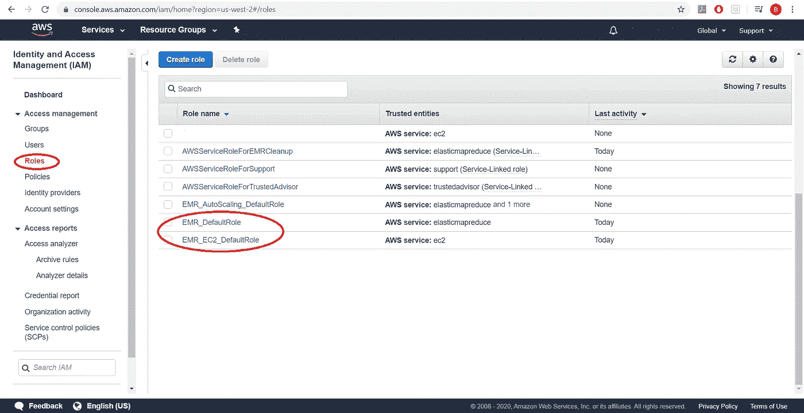
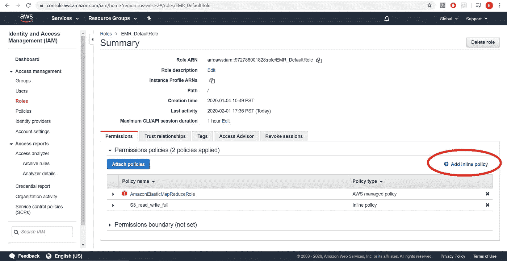
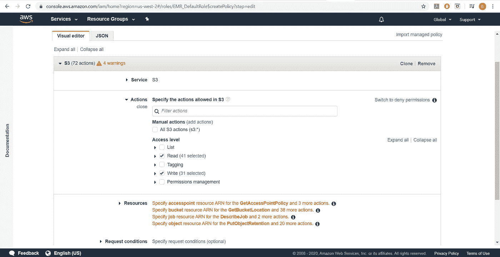
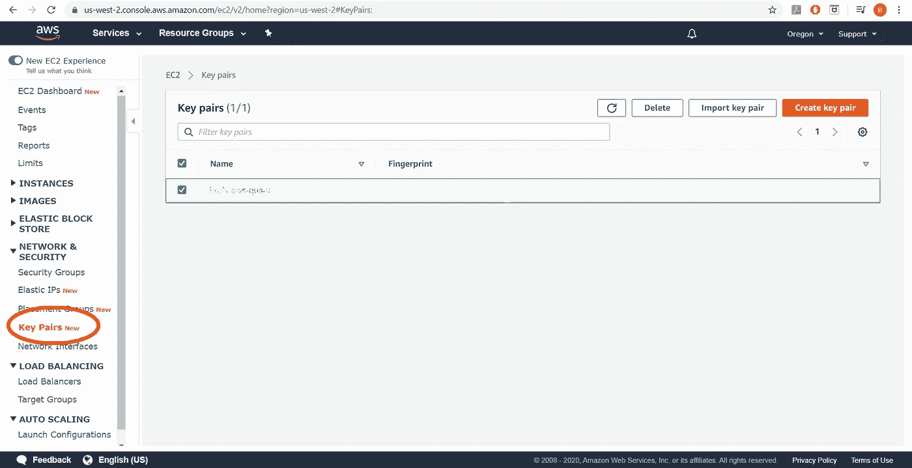

# 端到端 AWS 定量分析:使用 AWS 和 AWSCLI 自动运行脚本

> 原文：<https://towardsdatascience.com/end-to-end-quantitative-trading-automating-ml-using-awscli-83035b4f6d03?source=collection_archive---------40----------------------->


凯文·Ku 从[派克斯](https://www.pexels.com/photo/coding-computer-data-depth-of-field-577585/?utm_content=attributionCopyText&utm_medium=referral&utm_source=pexels)拍摄的照片

## [建设 AWS 管道](https://towardsdatascience.com/tagged/building-an-aws-pipeline)

## 使用 AWSCLI 旋转、运行和拆除 AWS 服务器

在[之前的一篇文章](/end-to-end-quantitative-trading-part-1-798dcfeb165a)中，我们探讨了如何使用 Python 从在线资源(在我们的例子中，是 Yahoo！金融)。
我们开发了两个 Python 脚本；一个为我们抓取数据，一个使用 sklearn 的决策树分类器处理数据。然后，我们将它们上传到 AWS 上的一个 S3 存储桶中，以便安全保管，也便于从其他 AWS 服务中访问。
在本帖中，我们将探讨如何建立一个工作流，为我们创建一个处理服务器，在该服务器上训练我们的数据模型，然后在完成后移除该服务器。

# 在亚马逊网络服务(AWS)上运行一组模型

AWS 的定价模式是“按使用付费”，这意味着我们可以创建一个服务器，在其上进行一些数据处理，然后拆除它，我们将只为服务器运行的时间付费。此外，我们将使用一个名为 AWSCLI(AWS Client)的客户端库来启动服务器(创建服务器的时髦术语)和关闭它。我从 Brent Lemieux 的一篇[帖子中开始了解我需要什么来启动服务器，我强烈建议你去看看那篇帖子。](/production-data-processing-with-apache-spark-96a58dfd3fe7)

# 配置我们的客户端应用程序

首先，我们将安装和配置 AWSCLI。我将使用 AWSCLI v2。一旦安装，我们可以测试它的工作

```
aws2 --version
>>> aws-cli/2.0.0dev2 Python/3.7.5 Windows/10 botocore/2.0.0dev1
```

然后我们配置它。在配置 AWSCLI [时，本页](https://docs.aws.amazon.com/general/latest/gr/rande.html)可能对默认区域选择有用。

我们还应该通过运行

```
aws2 emr create-default-roles
```

# 创建引导文件

配置完成后，我们可以使用 AWSCLI 并启动我们的服务器。阅读 Brent Lemieux 的文章，他描述了如何创建一个引导文件来为我们初始化服务器。你会注意到我们需要在服务器上安装像 pandas 和 matplotlib 这样的包，因为它只附带了很少的 python 包。

这将是我们的引导文件:

自举 _ 文件. sh

*   第一行设置`python`命令指向 python 3(目前是 3.6)而不是默认的 2.7(为什么默认还是 2.7？贝佐斯，这已经过去 6 年了。这样，我们漂亮的脚本将由 python 3.x 运行
*   第二个命令使用 python 来安装我们需要的库。在这里，您可以随意添加任何其他对您有用的库。
*   第三个命令将我们的`workflow-scripts` bucket 的内容复制到集群中。**你必须用你的桶名替换** `**workflow-scripts**` **。**
*   第四行运行将为我们获取数据的脚本(您可以在这里获取)，并将数据存储在适当的 S3 桶中。**你必须用你的桶名**替换 `**data-files**` **。**

这个引导脚本将是我们的服务器建立后运行的第一个项目。

# 配置对 S3 的读/写权限

我们现在有了设置脚本和基本的数据处理脚本。我们差不多准备好运行我们的代码了。我们需要确保我们的脚本可以读取和写入 S3 桶。

我们将向默认角色添加一个策略来允许这一点。
这是什么意思？嗯，当我们创建一个 EMR 集群(一组为我们执行处理的计算机)时，我们给该集群分配一个角色，这意味着我们给它一些权限，让它在集群中安装库。这就像是我们的集群能够做的动作的集合。希望我们按照指示创建了默认角色**。**但是，这些角色不包括与私有的 S3 存储桶进行交互的权限。有两种方法可以解决这个问题:

*   让我们的桶中的文件完全公开(真的真的真的真的真的真的很糟糕的主意)
*   在 AWS 配置上投入更多时间，并让一些角色能够与我们拥有的 S3 资源进行交互(好得多)

导航到 AWS 中的 IAM 控制台，我们将找到所有可用角色的列表:



EMR/EC2 访问的默认角色

然后，我们将单击每个默认角色，并选择添加一个内联策略



添加内嵌策略

然后，我们将向我们的角色添加完整的读写策略，如下所示:



S3 资源的读写策略

实际上，我们可以更具体地说明我们的政策，以及我们的角色如何与我们的 S3 团队互动。现在，我们只需为所有四个资源组(访问点、存储桶、作业和对象)选择 **Any** ，我们就可以检查并批准策略了。

如果有需要，应该选择更严格的条件。

# 纱线的配置文件

我们要为这个演示做的事情将需要我们机器上的大量 RAM，超过默认值所允许的。所以我们必须创建一个配置文件来帮助我们避开这个问题。

一般来说，大数据通常不会完全加载到 RAM 中，而是使用 HIVE 或 Spark 进行交互。然而，为了将 Spark 与我们经典的机器学习方法进行比较，我们将反叛并将大量数据加载到 RAM 中。

让我们在本地机器上创建一个名为 config.json 的配置文件。

它处理我们的资源管理器 YARN(另一个资源协商器)，并告诉我们可以为整个应用程序分配多少内存，以及告诉 YARN 不要检查内存违规(整个内存中只有一小部分会分配给我们的 Python 脚本，因此我们需要停止检查这一小部分之外的违规)。

同样，这是为了比较我们的基础`sklearn`决策树，而不是处理大数据的方式。

# 为我们的集群设置身份验证

我们必须从 EC2 仪表板创建一个密钥对，并将其下载到我们的计算机上



EC2 密钥对接口

一旦下载了密钥对，就必须通过运行命令使其可读

```
chmod 400 my-key-pair.pem
```

在文件上使用终端(Mac)或 Git-Bash (Windows)。这允许您稍后连接到启动的实例(如果它正在运行)。

# 通过 AWS CLI 启动 EMR 集群

我们期待已久的时刻终于到来了。使用 AWSCLI，我们可以在家中舒适地启动一个集群来为我们做一些工作。为此，我们将运行以下命令:

```
aws2 emr create-cluster \
--name "**Spark cluster with step**" \
--release-label emr-5.29.0 \
--applications Name=Spark \
--log-uri **s3://log-bucket/logs/** \
--ec2-attributes KeyName=**my-key-pair** \
--instance-type m5.2xlarge \
--instance-count 1 \
--bootstrap-actions Path=**s3://scripts-and-setup/bootstrap_file.sh** \
--configuration file://config.json \
--steps Name="Command Runner",Jar="command-runner.jar",Args=["spark-submit","--deploy-mode=cluster","--executor-memory","20G","**s3://workflow-script/process_data.py**, **s3://data-files/**AAPL.csv"] \
--use-default-roles \
--auto-terminate
```

这个命令有很多东西，所以让我们打开重要的部分:

*   `aws2 emr create-cluster` —希望这是不言自明的
*   `--name "**Spark cluster with step**"` —用您喜欢的任何名称替换此名称，但这将是集群的名称
*   `--release-label emr-5.29.0` —要使用的集群版本。不同版本的集群包含各种其他应用程序的不同版本，如 Hadoop、Spark、Hive 等
*   `--applications Name=Spark` —我们将推出一款 spark 应用
*   `--log-uri **s3://log-bucket/logs/**` **—** 这是我们将日志发送到的地方。您需要一个日志存储桶，以防您的集群出现故障，并且您可以查看出错原因的日志。你必须用你的桶替换它。
*   `--ec2-attributes **KeyName=my-key-pair**` **—** 这是一个密钥对，如果需要，您可以使用它来建立到集群的 ssh 连接
*   `--instance-type m5.2xlarge` —这是我们将使用的实例类型和大小。AWSCLI 不支持小于 xlarge 的
*   `--instance-count 1` —我们将只启动一个实例(实际上并不是一个集群，但是我们将在下一篇文章中讨论)
*   `--bootstrap-actions Path=**s3://scripts-and-setup/bootstrap_file.sh**` —这是命令的一部分，告诉集群使用哪个脚本来启动集群。您必须用您的脚本文件位置替换它
*   `--configuration file://config.json` —这告诉 AWSCLI 使用我们创建的 config.json 文件，前缀`file://`告诉 AWSCLI 这是一个本地文件(尽管我们也可以将它存储在 AWS S3 上)
*   这个很密集，所以让我们把它再分开一些。首先，我们将使用`command-runner.jar` Jar 文件来运行我们的 python 脚本。这是一个 Java 可执行文件，它将运行我们的 python 脚本并管理所有与 Spark 相关的工作。
    成那个样子。jar 文件我们发几个参数`Args`。它们是`spark-submit`，它说这个任务被提交给 Spark 框架，`--deploy-mode=cluster`，它说我们在集群内部启动我们的可执行文件(相对于从我们的家，非 AWS 机器)，我们要求 Spark 框架在运行我们的脚本和它的其他步骤时使用 20GB 的内存(实际上我们的脚本变得有点少，因为内存分配是如何在 Spark 和 YARN 之间工作的)用命令`"--executor-memory"`和`"20G"`， 最后是最后一个参数
    `**s3://workflow-scripts/process_data.py**, **s3://data-files/AAPL.csv**`，通过 AWS 的魔法，它被解析成
    `**s3://workflow-scripts/process_data.py** **s3://data-files/AAPL.csv**`(注意逗号被空格替换，形成一个完整的命令)。 这是 Spark 环境将运行的完整命令，这是我们的 Python 脚本([下载到这里](https://gist.github.com/bshabashFD/80fec67dfc10c19e6eff38ed3fbb13f6))及其所有参数。对于这一步，您必须用自己合适的名称替换存储桶名称。
*   `--use-default-roles` —告诉 AWS 使用我们之前设置的默认角色
*   这是一个真正美丽的论点。它告诉集群在所有处理完成后终止，因此我们不会为集群无所事事地坐在那里并收取我们的信用卡费用而付费。如果为了调试的目的，您想要保持集群运行，您可以省略它或者使用显式版本`--no-auto-terminate`。**但是，确保手动终止，然后**。

# 我们运行的结果

在我的机器上输入命令后，集群启动用了大约 2 秒钟，然后又用了 12 分钟来完成我要求的一切并终止。当检查 S3 存储桶的日志时，决策树分类器报告已经运行了 8 分钟进行拟合和预测。

到目前为止，我们已经启动了一个节点来为我们做一些处理，请注意，我们已经从使用比家用笔记本电脑更强大的机器中获益。我们使用 sklearn 进行分析的代码现在在一台功能强大的计算机上运行了大约 12 分钟。
虽然这个集群在分布式计算领域还没有做太多工作，但我们已经做好了基础工作，可以看到 Spark 在发挥作用。我在这里提到过几次 Spark，在下一篇文章中，我将最终展示这个框架在我们用决策树探索的相同数据上的实际应用。

# 迄今为止的总成本

我想在这里停下来谈一谈成本。实践和磨练 AWS 技能的最大摩擦点之一是这样一个事实，即在大多数数据科学信息和技能都是免费的(来自 Kaggle 的免费数据集，Python 和 R 等免费编程工具)的世界中，AWS 需要花钱，而且直到第二天收到账单时才完全清楚要花多少钱。
在学习和尝试正确设置的过程中，我已经旋转(设置)并拆除了 100 多个集群，到目前为止，我的总账单是注册 AWS 大约 1 美元，加上所有这些集群不到 5 美元。到目前为止，我便宜的账单很大程度上是因为我的每个“集群”中只有一个实例(`--instance-count 1`)，并且我使用类型为`m5.xlarge`的集群练习了大多数旋转和拆卸。我把数据帧的尺寸缩小到原型，最终只在`m5.2xlarge`上做了原型。