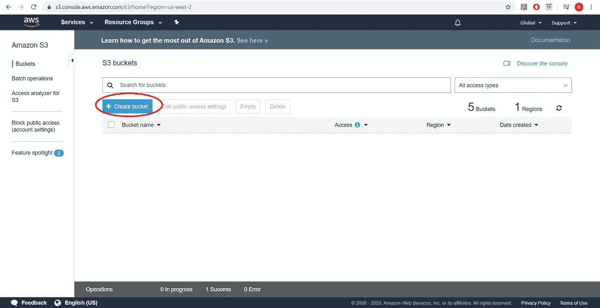
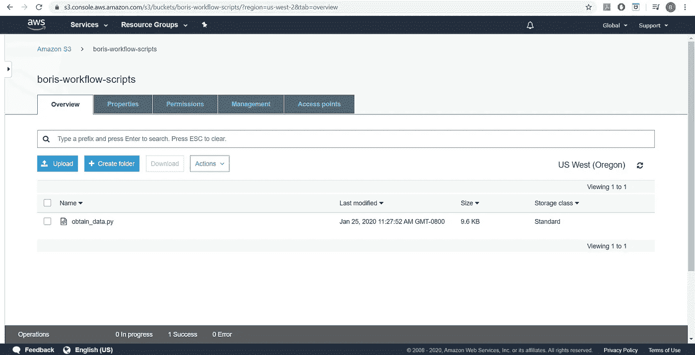
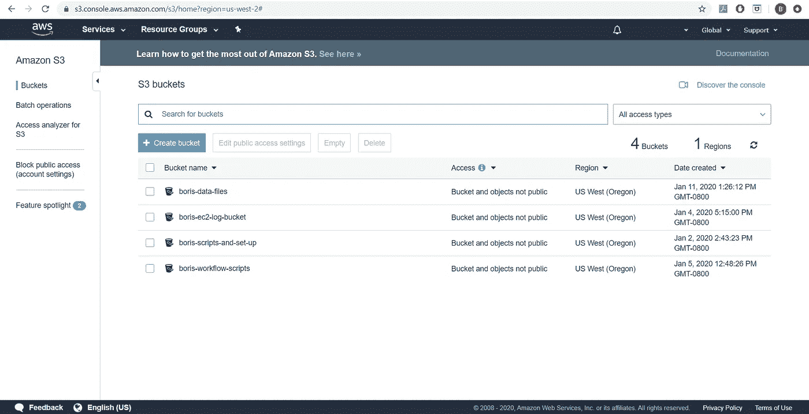

# 端到端 AWS 定量分析:设置我们的脚本和 AWS

> 原文：<https://towardsdatascience.com/end-to-end-quantitative-trading-part-1-798dcfeb165a?source=collection_archive---------24----------------------->


照片由[energepic.com](https://www.pexels.com/@energepic-com-27411?utm_content=attributionCopyText&utm_medium=referral&utm_source=pexels)从[派克斯](https://www.pexels.com/photo/blue-and-yellow-graph-on-stock-market-monitor-159888/?utm_content=attributionCopyText&utm_medium=referral&utm_source=pexels)拍摄

## [建设 AWS 管道](https://towardsdatascience.com/tagged/building-an-aws-pipeline)

机器学习关注的是如何理解大量难以处理的数据。很大一部分机器学习工作现在可以在台式机上完成，甚至可以在笔记本电脑上完成，只要配置合适。

尽管如此，仍有大量的工作需要在专业的云计算架构上完成，这些架构要在合理的时间内处理难以置信的大量数据。

在这篇文章中，我想重点介绍建立端到端管道的想法，这将利用亚马逊网络服务(AWS)进行量化交易。

这篇文章的目的不是为您提供一台印钞机，而是展示在 AWS 上部署全自动工作流所需的步骤。

这组帖子将把工作流程分为四个主要部分:

1.  编写脚本来获取数据，在数据上使用基本的 ML 模型，并将这些脚本存放在 AWS 上
2.  为我们的基本 ML 模型建立一个 AWS 框架，并自动使用它
3.  通过 Spark 利用我们的 ML 功能
4.  在我们的 ML 完成运行后，自动准备我们的分析摘要

# 获取数据

因为我们对股票的历史数据感兴趣，所以有几种选择。Quandl 是一项可以提供每日股票数据(以分钟为单位)的服务，但它需要付费。对于这篇文章，我将选择免费选项，并使用雅虎财经。

哈哈。Finance 有几个库被设计成通过它的 API 与它交互，并建立到 Python 的桥梁，所以我将使用 [yfinance](https://github.com/ranaroussi/yfinance) 。

如果我们使用 yfinance，我们可以构建以下代码

虽然这段代码完成了工作，但是到目前为止，它只针对一个独特的用例场景:

1.  它只获取 AAPL 的数据
2.  并且只在特定的日期范围内这样做

我们也许应该把它包装成一个函数，这样我们就可以使它稍微更通用一些

现在，我们需要一些方法来获取相关的日期，并使其适用于雅虎上的任何资产！金融。

# 计算开始和结束日期

让我们从简单的部分开始，开始和结束时间。我们可以很容易地得到今天的日期，然后找到五年前的日期。然后，我们可以很容易地将两者转换成适当的字符串类型。

```
>>>> 2020-02-13
>>>> 2015-02-13
```

我们可能也应该将它封装成一个函数:

# 当我们获得数据时进行处理

获得数据后，我们想对它做一点处理，为机器学习做准备。
首先，我们将在数据框中添加一个`Return`字段，记录当天的回报是否为正。

我们可以计算连续收盘价之间的差值，也可以计算同一天的开盘价和收盘价之间的差值。我选择后者，只是为了让人们意识到这也是一个可以考虑的选择。

一旦我们得到了回报，我们就可以创建一些特性，并在以后为我们的 ML 算法创建一个目标。让我们把那些也加上

# 把所有的放在一起

这部分代码的最后一部分是将我们编写的所有代码放入一个脚本，该脚本接受我们的股票 id 和一个路径作为命令行参数，并将股票数据帧保存到提供的路径中。我们将添加更多的文档来创建更易于管理的代码库。

我们将把这个脚本称为“获取数据”

获取数据

我们已经添加了相当多的 docstrings 和其他文档，以防我们以后想要更改某些内容。

现在我们可以称这个脚本为:

```
python obtain_data.py MSFT  --output_directory \ /usr/boris/destination
```

让它获取微软(MSFT)的数据，并将结果写入/usr/Boris/destination/msft . csv 中的本地 CSV 文件

# 处理数据

在我们获得数据之后，我们想要以某种方式处理它。出于本教程的目的，我们将假设我们想要使用一个决策树来使用我们之前创建的`Target`列对我们的数据进行分类。我们将从使用 sklearn 的[决策树分类器](https://scikit-learn.org/stable/modules/generated/sklearn.tree.DecisionTreeClassifier.html)开始。

```
>>> 0.0002604
```

很明显，对于这种规模的数据集，我们真的不需要 AWS。我们可以做一点小手脚，用下面的代码让数据集变大:

现在，数据集的大小最终达到 41，222，144 行，在我的笔记本电脑上处理大约需要 10 分钟。

我们将创建另一个 python 脚本，它接受一个文件位置作为命令行参数，将文件扩展为其原始大小的 2 倍⁵，然后处理它。在 AWS 上，我们将使用 sklearn 和 Spark 来比较处理时间。

流程 _ 数据. py

# 将脚本放在可访问的位置

我们希望 AWS 计算实例能够运行我们的脚本。我们可以做的一件事就是简单地使用 SSH 将文件传输到实例，但是稍后我们想让我们的实例自动设置、运行和拆除，而不需要我们做太多，所以我们将这些脚本放在 AWS 的 S3 存储桶中。这将使我们未来的计算实例可以轻松地访问该文件。

首先，我们需要创建一个 S3 桶(1)，并给它一个有用的描述性名称。创建完成后，我们可以在 S3 仪表板中看到它(2)。



创建 S3 存储桶

然后，我们将脚本上传到 bucket 中，以便我们的 AWS 实例可以访问脚本及其功能



上传我们刚刚创建的文件

此外，我们将设置另外三个存储桶；一个用于日志文件，一个用于数据文件，一个用于安装 bash 文件。我们最终的 S3 建筑应该是这样的:



我们做到了！

一个 python 脚本，可以在 AWS 上使用，为我们挖掘数据。下一步是创建一个运行脚本和处理挖掘数据的地方。下一篇文章将详细讨论这个问题！