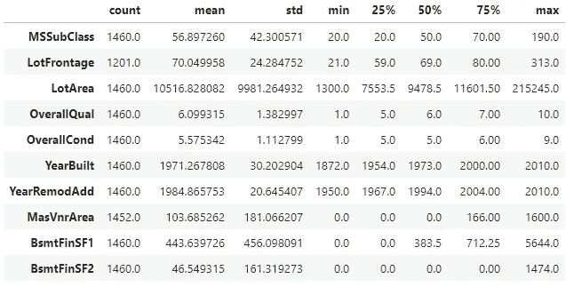

# EDA:变量关系和填充缺失值

> 原文：<https://towardsdatascience.com/end-to-end-regression-techniques-for-real-estate-predictions-be98e689fca5?source=collection_archive---------33----------------------->

## [初学者回归技巧](https://medium.com/tag/regression-for-beginners)

## 房地产预测的端到端回归技术-第 1 部分


由[贝利·安塞尔姆](https://unsplash.com/@pbanselme?utm_source=medium&utm_medium=referral)在 [Unsplash](https://unsplash.com?utm_source=medium&utm_medium=referral) 上拍摄

*作为我作为数据科学家旅程的一部分，端到端数据探索和模型开发是我学习成功的关键。这个系列将提供一个端到端的预测爱荷华州的房屋销售价格。为了便于阅读，本系列将分为四个部分:*

*   [***EDA 第一部分*** *:*](/end-to-end-regression-techniques-for-real-estate-predictions-be98e689fca5) *标绘预热和填充缺失值*
*   [***EDA 第二部分***](/eda-feature-engineering-and-encoding-categorical-data-75bed7af8692) *:特征工程和变量编码*
*   ***EDA 第三部分:*** *统计测试*
*   ***预测建模:*** *训练和调优 XGBoost*
*   ***堆叠模型*** *:结合 XGBoost 与 Enet、Ridge、Lasso*

*打开一个 Jupyter 笔记本，* [*下载数据*](https://www.kaggle.com/c/house-prices-advanced-regression-techniques/data) *，跟着自己实施以下策略。我已经包括了一些“练习”来帮助你。我隐藏了全部代码，以迫使你专注于思考过程。此外，通过自己把代码打出来，你会获得经验，最终会变得流利。不过，如果你一路上需要帮助，可以在这里* *找到我的完整笔记本* [*。*](https://github.com/wcneill/kaggle/blob/master/house%20prices/sales.ipynb)

*如果你已经读过我的文章《* [*初学者看 Kaggle*](https://medium.com/analytics-vidhya/a-beginners-look-at-kaggle-b868ceb2eccf) *》，你就知道接下来会发生什么:让我们用 EDA 来弄脏我们的手吧。这将是这个系列这一部分的唯一焦点。*

# 住房价格的探索性数据分析

第一部分将主要关注基本绘图和缺失值插补。我的目标是概述一个建立直觉的过程，即哪些变量在起作用，哪些变量对销售价格有最大的影响。我还想评估变量之间的关系，因为这将让我们了解如何智能地填充缺失的数据。

我们在 4 部分系列中的数据探索重点如下:

*   **直观地呈现数据** —对我们的数据进行图形化和绘图可以让人们洞察我们的数据在现实世界中的含义。我们有 79 个变量在发挥作用，所以这是一个很好的方式来感受正在发生的事情。然而，所有的可视化都应该持保留态度。他们没有讲述整个故事。
*   **寻找和处理缺失数据** —在这一阶段，我们将分析哪些变量有缺失值，它们为什么缺失，以及我们可能如何处理缺失数据。
*   **特征工程**——我们能否在数据中找到并定义潜在的模式，帮助我们更好地描述和解决我们的问题？
*   **实力的关联。**假设一个变量与销售价格相关，那么这种关系有多强？
*   **分类变量对销售价格的 ANOVA F-检验。**与连续变量不同，我们不一定能确定类别和连续数据之间的传统相关性度量。通过方差分析或 [ANOVA](https://en.wikipedia.org/wiki/Analysis_of_variance) 分析，我们可以了解*邻域*等分类变量对连续变量*销售价格*是否有显著影响。

*** * * * * * * * * * * * * * * * * * * * * * * * * * * * * * * * * * * * * * * * * * * * * * * * * * * * * * * * * * *
*练习 1:*** 注册一个 Kaggle 帐户，下载我们将使用的数据！我把我的数据保存在一个名为`data`的文件夹里，这个文件夹和我的笔记本在同一个目录下。

```
import pandas as pd
train_df = pd.read_csv('data/train.csv', index_col='Id')
test_df = pd.read_csv('data/test.csv', index_col='Id')
train_df.describe().T.head(10)
```



# 热身 1:目标变量的分布

为了开始了解我们的数据，我们将绘制我们的目标变量分布以及一些不同的转换。我们这样做有几个原因:

1.  我们希望理解我们的数据，直观地查看数据有助于我们建立对影响结果的潜在因素的直觉。它让我们头脑中的轮子转动起来，并有希望激发可能带来有价值见解的问题。
2.  转换变量的分布是常见的行业惯例。转型并不总是必要或有益的。数据转换有效性背后的数学理论很深入，并且经常被争论(特别是在深度学习领域)。只要说“视情况而定”，然后进行实验就够了！


在转换之前，我们的销售价格数据是右偏的，这意味着平均值比中值偏向更高的价格。通过`sklearn.preprocessing.PowerTransformer()`应用 Yeo Johnson 变换，我们得到了标准正态分布的一个非常好的近似值:

```
import sklearn.preprocessing as pre
import seaborn as sns
import matplotlib.pyplot as pltpt = pre.PowerTransformer()
ptd = pt.fit_transform(train_df.SalePrice.to_numpy().reshape(-1,1))
plt.title(f'Yeo Johnson, Skew: {stats.skew(ptd.squeeze()):.3f}')
sns.distplot(ptd, kde=True)
```


我还使用对数变换进行了检验，但我们无法接近正态分布:


这些转换改变了数据的含义(注意横轴上缺少“销售价格”标签)。转换目标变量的主要目的是希望辅助机器学习算法的训练。同样，这需要实验，直到本系列的第 3 部分才会涉及。

# 热身 2:检查基本直觉

作为我们的第二个热身练习，让我们来检验一下我们的直觉:对最终销售价格起作用的不仅仅是数量，还有质量:

```
fig, axes = plt.subplots(2,2, figsize=(12,12))
sns.scatterplot(
    x='GrLivArea', 
    y='SalePrice', 
    hue='OverallQual', 
    data=train_df, ax=axes[0,0])...plt.tight_layout()# Try reproducing the plot below using the above code as a hint.
```


在第一栏中，我们将销售价格与地上居住区(又名 **GrLivArea)** 的价格以及房屋建筑材料的整体质量进行了比较。我们所看到的是，销售价格是根据居住面积和质量来分级的。这在散点图中的强线性趋势、色调的均匀分级以及总体质量的箱线图中是明显的。

有点令人惊讶的是，我们看到描述总体状况的变量，**总体成本，**似乎对销售价格几乎没有影响。第二个散点图中数据点的色调是随机的，箱线图是无序的。这是反直觉的，我们可以稍后再去探究我们所看到的是否有意义。

另外，请注意数据中的两个异常值。在散点图中可以看到两处住宅，它们的居住面积都很大，但相对于其他同等面积的住宅，它们的售价却非常低。

*** * * * * * * * * * * * * * * * * * * * * * * * * * * * * * * * * * * * * * * * * * * * * * * * * * * * * * * * * * * * * * * * * * * * * *练习 2:*** 调查你对其他变量的直觉以及它们与销售价格的关系，并绘制出它们之间的关系。看看 Seaborn 的[绘制关系的伟大工具](https://seaborn.pydata.org/generated/seaborn.relplot.html)。**** * * * * * * * * * * * * * * * * * * * * * * * * * * * ****

# *处理缺失数据*

*我们的下一轮分析将关注我们缺失的数据。我们想知道数据丢失的原因，以及我们如何填补空白。丢失的数据是丢失了可能对我们有用的信息。为了更好的预测，尝试填补这些空白通常是值得的。*

# *训练集中缺少数据:*

*首先，我们将解决我们缺少的训练数据中的缺口。我写了一个小函数来可视化一个数据集中缺失的数据。在我的[完整笔记本](https://github.com/wcneill/kaggle/blob/master/house%20prices/sales.ipynb)中寻找一个叫做`viz_missing(df)`的方法:*

**

*柱状图显示了大量缺失的数据。如果我们想得到真正好的结果，就不应该忽视这些数据。过程的这一部分是乏味的，但却是必要的。我鼓励你关注以下思考过程:*

1.  *选择一个希望填充缺失数据的变量。*
2.  *看看是否有另一个变量，与你正在研究的变量有关。*
3.  *确定缺失的数据是否可以用相关变量来解释。*
4.  *如果使用步骤 2 和 3 无法确定缺失的信息，请考虑使用平均值、中值或众数。请注意，这对小数据集来说可能是危险的。*

# *示例 1:缺少池质量数据*

*上图中缺失数据量最大的变量是`PoolQC`，代表“池质量和条件”。*

*在查看了我们的[数据字典](https://www.kaggle.com/c/house-prices-advanced-regression-techniques/data)之后，我们应该注意到只有一个其他变量描述了一个家庭的游泳池。这个变量就是`PoolArea`。请注意，没有与该变量相关联的缺失数据。*

*我的直觉是，所有有`PoolArea = 0`的家庭可能与缺少`PoolQC`信息的家庭相关联。换句话说，这些家庭没有游泳池，这就是为什么他们遗漏了游泳池质量变量。我们可以用几行代码来检验这种直觉:*

```
*# Get number of homes with missing PoolQC that also have 0 PoolArea.
np = train_df[train_df.PoolQc.isna() & (train_df.PoolArea == 0)]
count = np.shape[0]# Get total number of missing PoolQC entries
missing = train_df.PoolQC.isna().sum()count, missing
>>> (1452, 1452)*
```

*因此我们看到，对于所有 1452 个缺少`PoolQC`条目的家庭，该家庭的`PoolArea`为 0。这证明我们的直觉是正确的。我们可以用多一行代码来填补空白:*

```
*train_df.PoolQC.fillna("NA", inplace=True)*
```

# *示例 2:缺少地段临街面*

*`LotFrontage`根据数据字典，是与物业相连的道路的英尺数。这次我们没有任何额外的变量来告诉我们为什么`LotFrontage`会丢失。这意味着我们将不得不以不同的方式填补空白。*

*我们可以合理地假设，几乎每一块地产都至少触及某条道路或小巷的一小部分。这可能不是普遍正确的，但可能是规则而不是例外。我们将利用这种直觉，用我们拥有这些数据的所有房屋的平均值或中值来填充任何缺失的`LotFrontage`:*

```
*train_df.LotFrontage.fillna(train_df.LotFrontage.median(), inplace=True)*
```

*我选择用中值来填充缺失的条目，因为它对异常值更稳健。*

**** * * * * * * * * * * * * * * * * * * * * * * * * * * * * * * * * * * * * * * * * * * * * * * * * * * * * * * * * * * *练习 3:*** 对测试集和训练集中的所有缺失数据执行相同的调查。你应该需要一段时间。很多都不见了！
*** * * * * * * * * * * * * * * * * * * * * * * * * * * * * * * * * * ****

*我将在本系列的第 2 部分结束。完成练习 1-3 需要花费你相当多的时间，我们鼓励你在继续之前先把这些练习编码好。*

**如果您有任何问题、意见或批评，请在评论区联系我！**