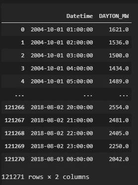
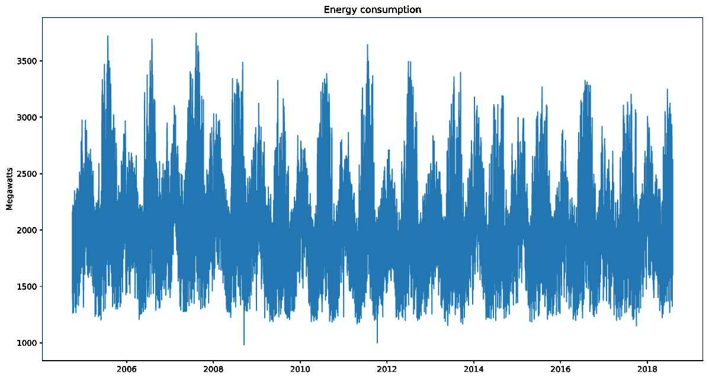
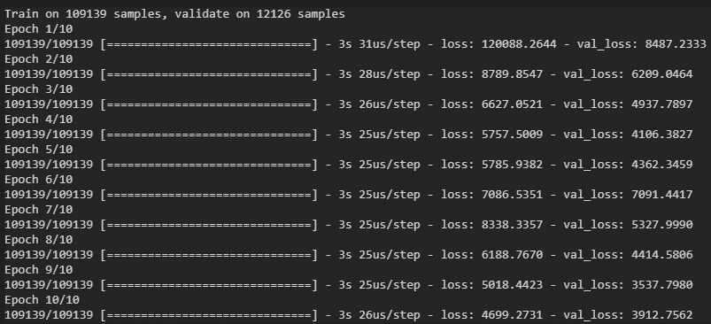
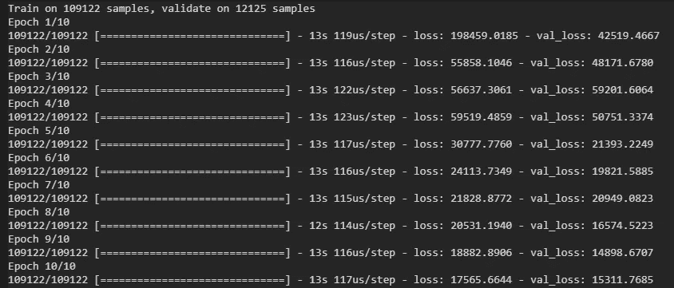
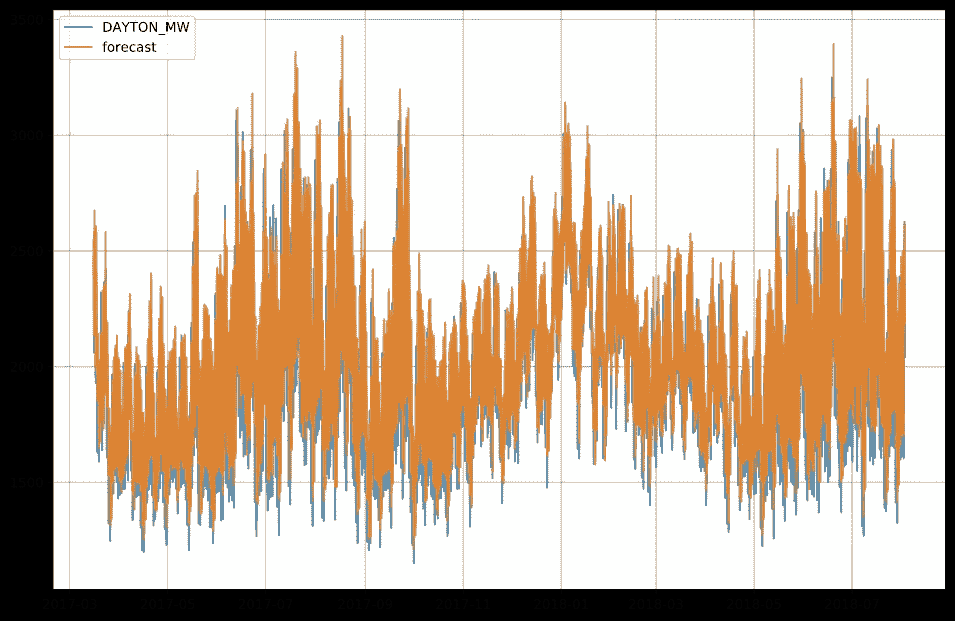
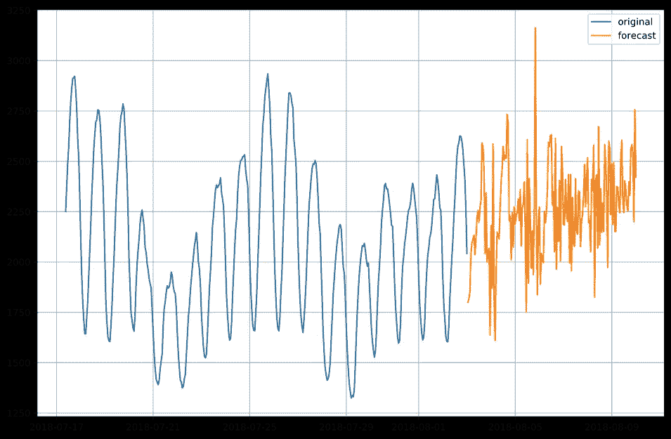

# 基于 python 和 LSTM 深度学习模型的能源消费时间序列预测

> 原文：<https://towardsdatascience.com/energy-consumption-time-series-forecasting-with-python-and-lstm-deep-learning-model-7952e2f9a796?source=collection_archive---------1----------------------->

## 如何利用时间序列进行深度学习


戴维·赫尔曼在 [Unsplash](https://unsplash.com?utm_source=medium&utm_medium=referral) 上的照片

本文的目的是向读者展示 python 中的一个类，该类具有非常直观和简单的输入，可以使用深度学习对时间序列数据进行建模和预测。理想情况下，读者应该能够复制本文或 GitHub 资源库中的代码，根据自己的需要对其进行裁剪(例如，向模型中添加更多层),并在工作中使用它。

本文中使用的所有代码都可以在这里找到:

【https://github.com/Eligijus112/deep-learning-ts 

这篇文章的数据可以在这里找到:

[https://www.kaggle.com/robikscube/hourly-energy-consumption](https://www.kaggle.com/robikscube/hourly-energy-consumption)

用于深度建模的包是 TensorFlow 和 Keras。

时间序列是按连续顺序排列的数字数据点序列。这些点通常定期测量(每月、每天、每小时等)。).本文中使用的数据频率是每小时一次，测量时间是从 2004 年 10 月 1 日到 2018 年 8 月 3 日。原始数据点的总数为 **121271** 。



Python 中的时间序列示例

时间序列的可视化:



能源消耗时间序列的折线图

对于给定的时间序列，深度学习算法的主要目标是找到函数 **f** ,使得:

**Yₜ = f(Yₜ₋₁，Yₜ₋₂，…，Yₜ₋ₚ)**

换句话说，我们希望基于相同能耗的 **p** 滞后估计一个解释能耗当前值的函数。

这篇文章不是要解释为什么长期短期记忆(LSTM)深度学习网络有利于时间序列建模或它是如何工作的。有关这方面的资源，请查看以下精彩文章:

[](https://pathmind.com/wiki/lstm) [## LSTMs 和递归神经网络初学者指南

### 数据只能反向理解；但它必须向前看。-索伦·克尔凯郭尔，期刊*

pathmind.com](https://pathmind.com/wiki/lstm) [](/illustrated-guide-to-lstms-and-gru-s-a-step-by-step-explanation-44e9eb85bf21) [## LSTM 和 GRU 的图解指南:一步一步的解释

### 嗨，欢迎来到长短期记忆(LSTM)和门控循环单位(GRU)的图解指南。我是迈克尔…

towardsdatascience.com](/illustrated-guide-to-lstms-and-gru-s-a-step-by-step-explanation-44e9eb85bf21) 

有关 Keras 中 LSTM(或任何 RNN 图层)的实现，请参见官方文档:

[](https://keras.io/layers/recurrent/) [## 重复层- Keras 文档

### 用于递归层的 keras . engine . Base _ layer . wrapped _ fn()基类。Arguments 单元格:RNN 单元格实例。一个 RNN 细胞…

keras.io](https://keras.io/layers/recurrent/) 

首先，我们需要读取数据:

读取每小时数据的代码示例

然后我们需要一个函数，将时间序列转换成 X 和 Y 矩阵，供深度学习模型开始学习。假设我们想要创建一个使用 **3** 滞后解释当前时间序列值的函数:

# **Yₜ = f(Yₜ₋₁，Yₜ₋₂，Yₜ₋₃)**

我们有这样的数据:

```
ts = [1621.0, 1536.0, 1500.0, 1434.0, 1489.0, 1620.0]
```

我们想要创建两个矩阵:

```
X = [
[1621.0, 1536.0, 1500.0], # First three lags
[1536.0, 1500.0, 1434.0], # Second three lags
[1500.0, 1434.0, 1489.0], # Third three lags
]Y = [1434.0, 1489.0, 1620.0]
```

**这是对时间序列使用深度学习时最重要的技巧。**你不仅可以将这些 X 和 Y 矩阵提供给递归神经网络系统(如 LSTM)，还可以提供给任何普通的深度学习算法。

函数从时间序列中创建 X 和 Y 矩阵

深度学习模型有一个 LSTM 层(也用作输入层)和一个输出层。

定义 LSTM 深度学习模型

在我在互联网上搜索一个易于使用的时间序列深度学习模型的过程中，我看到了各种文章，这些文章将建模的几个部分分开，如如何定义模型，如何为模型创建矩阵等。我没有找到一个包或一个类，把所有东西都打包成一个易于使用的实体。所以我决定自己来做:

建模类

开始上课:

```
# Initiating the classdeep_learner = DeepModelTS(
data = d,
Y_var = 'DAYTON_MW',
lag = 6,
LSTM_layer_depth = 50,
epochs = 10,
batch_size = 256,
train_test_split = 0.15
)
```

该类的参数是:

**数据** -用于建模的数据。

**Y_var** -我们要建模/预测的变量名。

**滞后** -用于建模的滞后数量。

**LSTM _ 层 _ 深度**-LSTM 层中神经元的数量。

**时期** -训练循环的数量(正向传播到反向传播循环)。

**batch_size** -深度学习模型在寻找参数时使用的梯度下降的数据样本的大小。所有数据都被分成 batch_size 大小的块，并通过网络传送。在每个 batch_size 的数据在模型中前进和后退之后，模型的内部参数被更新。

要了解更多关于时期和批量大小的信息，请访问:

[](https://machinelearningmastery.com/difference-between-a-batch-and-an-epoch/) [## 神经网络中批次和时期之间的差异

### 随机梯度下降是一种具有多个超参数的学习算法。两个超参数…

machinelearningmastery.com](https://machinelearningmastery.com/difference-between-a-batch-and-an-epoch/) 

**train_test_split** -用于测试的数据份额。1 - train_test_split 用于模型的训练。

拟合模型:

```
# Fitting the modelmodel = deep_learner.LSTModel()
```

在上面的命令之后，你可以看到球迷最喜欢的训练画面:



Keras 中模型的训练

用更多的滞后(因此，更大的 X 矩阵)训练模型增加了训练时间:

```
deep_learner = DeepModelTS(
data = d,
Y_var = 'DAYTON_MW',
lag = 24, # 24 past hours are used
LSTM_layer_depth = 50,
epochs = 10,
batch_size = 256,
train_test_split = 0.15
)model = deep_learner.LSTModel()
```



多滞后模型的训练

现在我们已经创建了一个模型，我们可以开始预测。使用用 **p** lags 训练的模型进行预测的公式:

# Yₜ₊₁ = f(Yₜ，Yₜ₋₁，…，Yₜ₋ₚ₊₁)

```
# Defining the lag that we used for training of the model 
lag_model = 24# Getting the last period
ts = d['DAYTON_MW'].tail(lag_model).values.tolist()# Creating the X matrix for the model
X, _ = deep_learner.create_X_Y(ts, lag=lag_model)# Getting the forecast
yhat = model.predict(X)
```

如果数据被分成训练集和测试集，那么 **deep_learner.predict()** 方法将预测测试集中的点，以查看我们的模型在样本外的表现。

```
yhat = deep_learner.predict()# Constructing the forecast dataframe
fc = d.tail(len(yhat)).copy()
fc.reset_index(inplace=True)
fc['forecast'] = yhat# Ploting the forecasts
plt.figure(figsize=(12, 8))
for dtype in ['DAYTON_MW', 'forecast']: plt.plot(
    'Datetime',
    dtype,
    data=fc,
    label=dtype,
    alpha=0.8
  )plt.legend()
plt.grid()
plt.show()
```



时间序列预测

正如我们所看到的，模型创建中隐藏的 15%数据的预测值接近真实值。

我们通常希望提前预测最后的原始时间序列数据。类 **DeepModelTS** 有方法 **predict_n_ahead(n_ahead)** 预测 **n_ahead** 时间步。

```
# Creating the model using full data and forecasting n steps aheaddeep_learner = DeepModelTS(
data=d,
Y_var='DAYTON_MW',
lag=48,
LSTM_layer_depth=64,
epochs=10,
train_test_split=0
)# Fitting the model
deep_learner.LSTModel()# Forecasting n steps ahead
n_ahead = 168yhat = deep_learner.predict_n_ahead(n_ahead)
yhat = [y[0][0] for y in yhat]
```

上面的代码预测了未来一周的步骤(168 小时)。与之前的 400 小时相比:



超出时间范围的预测

总之，本文给出了一个简单的管道示例，用于时间序列数据的建模和预测:

**读取和清除数据(1 行 1 时间步)**

**选择滞后数量和模型深度**

**初始化 DeepModelTS()类**

**拟合模型**

**提前 n _ 步预测**

我希望读者可以在他/她的专业和学术工作中使用本文展示的代码。