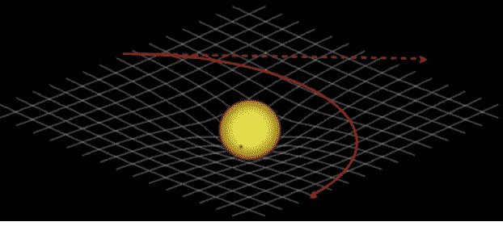

# 基于相对论引力理论的在线讨论参与动力学

> 原文：<https://towardsdatascience.com/engagement-dynamics-of-online-discussions-using-relativistic-gravitational-theory-77bbb25f90e2?source=collection_archive---------42----------------------->

## 当物理学在解决社交计算方面派上用场的时候

从物理和生物过程中进行类比在历史上被证明对计算机科学领域是有益的——神经网络、进化算法、社区增长模型等等。这种类比往往依赖于一些非常简单但有力的假设。这些类比中的科学严谨性应该被小心地提醒——大多数这样的类比实际上是“类比”,而不是对统一理论的主张。在本文中，我们将详细阐述“广义相对论的场方程”如何帮助建模在线讨论平台上的用户参与度。首先，我们需要定义我们要建模的参与动力是什么，以及革命性的场方程如何发挥作用。

**用户参与度与引力**

让我们从一个非常简单的用户参与讨论的模型开始。我们有一些用户数量固定的讨论平台。现在，一个随机的用户发布一些东西——一个观点，新闻，一个音乐视频，或者可能是一个讽刺的“模因”。并非所有用户都开始评论这篇文章；只有那些对帖子主题“感兴趣”的人才会加入讨论。然而，这种“兴趣”并不是一种静止的现象。随着时间的推移，特定的讨论可能会吸引以前不感兴趣的用户。

利用这个讨论平台的简单模型，我们可以从两个非常基本的假设开始:(I)用户居住在一个 *n* 维空间上的点上(并且在移动),使得近邻具有共同的兴趣；以及(II)讨论具有在不同程度上吸引不同用户的一些属性。第二个假设是，用户和讨论之间可以没有吸引力，但没有排斥。实际上，用户可能会对讨论感到“厌恶”,因此选择不参与。但是实际上不可能识别“排斥”(“不喜欢”或“否决”也是参与)，除非用户明确这样说。

这两个假设反映了讨论平台和引力场之间惊人的相似性。人们可以想象一个讨论具有某种“质量”性质，它会随着时间而变化。这个质量在 n 维用户空间的不同点产生了一些“引力”,根据引力的大小，用户会来到那个位置。为了更详细地计算质量和拉力，我们需要重温一下重力实际上是如何工作的。

图一。存在大质量物体和光的引力弯曲时时空流形的曲率:红线表示光线的实际弯曲运动，而虚线表示不间断的路径(来源:[http://www . zamandayolculuk . com/cetin bal/htmldosya 1/relativity file . htm](http://www.zamandayolculuk.com/cetinbal/HTMLdosya1/RelativityFile.htm))。

**爱因斯坦场方程**

到目前为止，阿尔伯特·爱因斯坦在他的广义相对论中给出了对引力最精确的描述。著名的爱因斯坦场方程将引力描述为“时空的弯曲”。在这里，空间(3 维)和时间(1 维)不是独立的实体；相反，它们构成了时空(四维)的复杂混合体。任何质量-能量-动量的存在都会在时空的几何中产生一个曲率，结果，任何移动的物体都会弯曲它的路径(被拉着)(见图 1)。场方程是:

不进入严格的数学细节，上述等式的左侧对应于流形的曲率，而右侧对应于能量-动量密度。

**从用户交互到用户时空**

因此，如果我们想开发一个类似的用户参与模型，我们需要做的第一件事就是定义用户到一些固定维度点(向量)的映射。这种映射应该保持我们的第一个假设，即共同感兴趣的用户必须保持密切联系。为了从数学上定义“共同兴趣”，我们可以在一对用户之间分配三种类型的接近度:

I)交流接近度:用户已经回复了彼此之前的评论或帖子；II)时间接近度:用户在最近的时间内对同一讨论发表了评论；III)语义接近度:用户评论了语义相似的帖子。

这三种邻近性加在一起，为每一对用户分配一个聚合邻近性(或共现)值。现在，如果我们用一个 *n* 维向量来表示每个用户，使得他们的标量积与他们的接近度成比例，我们就得到期望的用户空间。与时间值连接，这产生了用户时空。

**从讨论中获取能量**

下一个任务是将讨论表示为随时间变化的能量函数。在论坛中，讨论是否会吸引用户取决于各种特征——讨论的主题、帖子和评论中表达的观点的极性、文本的可读性、不同的词语用法以及发表评论的用户。我们可以学习一个参数化的非线性函数，它将这些特征映射到固定维度的向量(在这种情况下，维度必须与用户时空相同)。这种表示将初始化应力-能量张量的对角元素， *Tμv.*

**把所有的碎片放在一起**

我们为简化参与度建模问题所做的最后一个假设是，用户在共同兴趣的基础上形成自然集群。因此，我们将用户空间划分为集群，并预测每个时间段内来自特定集群的用户对给定帖子发表评论的概率。聚类中心被认为是聚类的位置向量。我们建立了一个学习计算度量张量的模型

从集群位置和应力-能量张量的讨论特征。对于不同时间间隔的给定讨论，这两个张量的组合将给出每个集群中心的用户时空的曲率。现在，我们可以比较这些曲率来决定哪些集群更有可能是接合集群。
应该记住的是，这个简单的模型并不声称在线讨论平台遵循广义相对论。相反，它将用户交互历史与讨论的文本特征相融合，非常类似于广义相对论如何提供重力的整体定义，将能量密度与时空几何相融合。

研究的细节可在 https://arxiv.org/pdf/1908.03770.pdf 获得

这就是查克拉博蒂。使用相对论引力理论对在线讨论的参与动力学进行建模，第 19 届 *IEEE 数据挖掘国际会议* (ICDM)，中国北京，2019 年 11 月 8 日至 11 日。