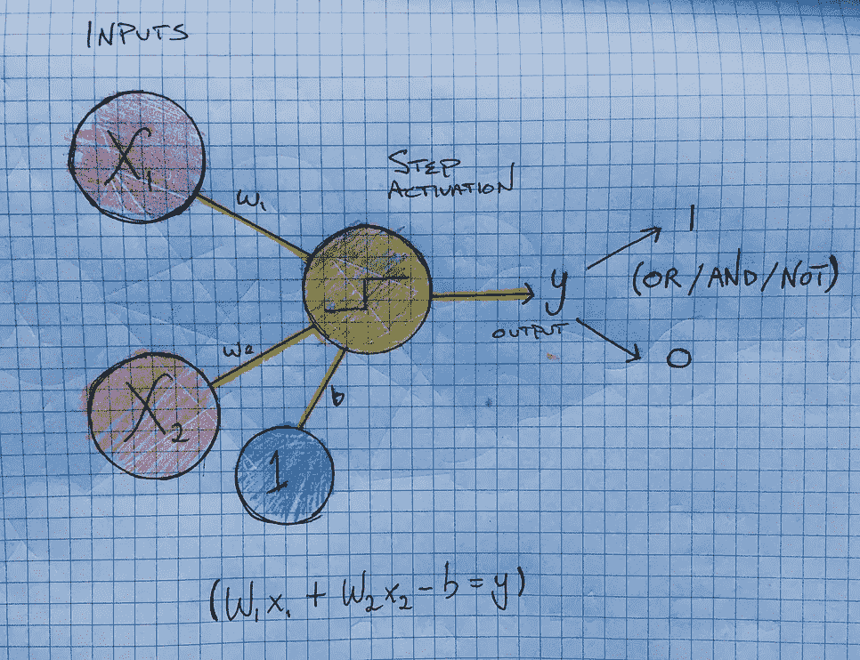

# 设计多层感知器

> 原文：<https://towardsdatascience.com/engineering-a-multilayer-perceptron-8a177b60e6cf?source=collection_archive---------52----------------------->

## 数字神经数学简评

作者绘画

在这篇文章中，我将*简要地*概述从左边图像中描述的单层感知器到右边图像中描述的多层结构的数学发展；现在被称为*神经网络:*现代人工智能的基础单元。

要深入了解感知机发展的历史和社会影响，请阅读迈克尔·伊比的[内核连接:感知机图解](https://tripleampersand.org/kernelled-connections-perceptron-diagram/)。

Theano、TensorFlow、Keras、py torch——每一个都提供了让深度学习更容易获得的资源。我花了很多时间处理这些模块。然而，有时我会忘记数学上到底发生了什么。每个库都有自己的语法。我发现每一种语法的透镜形成了我对架构如何通过功能处理信号的概念化，例如:向前和向后传播；或者如何应用激活。像任何实用程序库一样，有许多元素被整齐地打包并存储在引擎盖下。让我们打开其中一些工具。

使用 Keras 和玩具数据集作为基线。

用玩具数据集展示 keras 建筑的笔记本

也许我厌倦了，但那太容易了。这可能只是让一个模型运行起来的一个练习，但是在设计一个模型的时候，你应该练习的不仅仅是你的打字速度。下面是一个笔记本，我在其中获得了相同的数据集 raw，并能够产生更好的分数，从数据中获得更多洞察力，以及将定制功能设计到从 Numpy 构建的定制多层感知器。

笔记本走过预处理和训练 Senti_Net

# 后退一步

我们如何到达这里？我们如何把感知器这样的东西作为简单的逻辑算子，发展成深度学习模型？

## 什么是感知器？

感知器是一个线性的二进制分类器。它找到了两个阶级之间最清晰的界限。为了实例化更直观的描述，感知器能够感知两个给定类之间的差异，并检测给定数据点属于哪个类。它能够感知将一个数据点与另一个数据点线性分离的代表性空间。

## 作为逻辑运算符

逻辑运算符是控制信号流的函数。产生二进制输出的主要逻辑运算符有三种。

1.  和
2.  运筹学
3.  不

在程序设计中，一个逻辑运算器将一个多输入信号通过线性激活处理后，解析成一个合成的单一输出。如果您的数据是图表上的一个点，这尤其有用；比如图上的(3，4)。(3，4)是一个身份，是一个位置。感知器可以评估该点的位置，并区分身份属于哪个类别。再次假设类属性是线性划分的。

# 逻辑运算符如何工作

## **和**

并且是真值运算符。并且只有当两个输入都为真时才为真。换句话说，如果 A 和 B 都是 1，AND 运算符只会产生 1。如果 A =1，B =0，那么结果=0。这意味着，在 1 和 0 之间的四个可能结果中，只有一次是真的:当两个点都是 1 时。

## 运筹学

OR 是 AND 的反义词。除非两个操作数都为 0，否则 OR 始终为真。这意味着 A = 1，B = 0 为真。此外，A = 0 和 B = 1 也成立。A = 1 和 B = 1 是三次，真！只有 A = 0 和 B = 0 是假的。

而 AND 只有 25%的时间是正确的，或者 75%的时间是正确的。

## 不

没有什么是简单反向投资。如果 A 和 B = 1，那么 NOT = 0；如果 A 和 B = 0，那么 NOT = 1。

**下一个笔记本里有每个操作员的直接例子*

感知器是第一个为模拟生物、神经功能而开发的算法和硬件实例。然而，大约 20 年后，在 80 年代，人们普遍意识到，感知器在解释任何不适合其线性受体的数据方面严重不足。现实是多维的，非线性的。

> 此外，感知器正确地指出，单层感知器无法分类非线性模式；它的分类能力仅限于线性可分的模式。在欧几里德几何中，线性可分性是指将两组数据聚类成 A 和 B 区域。这最容易用二维平面来形象化。如果一条线或决策面能够将数据整齐地分为 A 和 B，则该模式被认为是线性可分的。如果数据分布不是如此清晰地界定，模式被认为是非线性的。

*迈克尔·伊比*

## **步进到乙状结肠**

感知机发展的另一个重要观点是:不仅有 0 和 1，而且在 0 和 1 之间有无限的连续可能性。通过 sigmoid 和 sigmoid 导数的识别，感知器能够生成类的可能性，以及更新感知器在可能性预测中的置信度。

下面的笔记本给出了逻辑运算符的例子，并演示了 sigmoid 的实现。此外，它显示了如何在反向传播中使用 sigmoid 的衍生物。

从单层感知器到多层感知器的逻辑

让我们使用上面笔记本中的函数更仔细地看看梯度下降的过程。

每个时期的更新是如何发生的

现在让我们更仔细地看看 SENTI_NET 的架构，*情感分类多层感知器*。

感觉网

我们可以看到，Senit_Net 不仅仅是一个 MLP，它还有一个文本预处理单元。虽然这可以在外部完成，但我想构建专门处理文本的模型。Senti_Net 是硬编码的，只能辨别积极和消极情绪，但可以在任何带标签的文本数据上进行训练。我们可以在笔记本的末尾看到，利用一个经过训练的 Senti_Net，在传递它从未见过的政治推特的文本数据后，它能够准确地对情绪进行分类。

在我建立 Senti_Net 之后，我想看看我是否可以制作另一个二元分类器，但我没有将情绪分类为*【正面】*或*【负面】*，而是让 MLP 对一条推文是来自民主党还是共和党进行分类。结果可以在下面的笔记本中找到。

** Twitter 数据由来自*的推文组成

*   乔·拜登
*   巴拉克·奥巴马
*   伯尼·桑德斯
*   希拉里·克林顿
*   迈克·彭斯(都是@Mike_Pence 和@VP 手柄)
*   唐纳德·特朗普
*   肖恩·哈尼蒂

**从每个账户——从 4 月 21 日星期二开始——按时间顺序回顾，提取了 3000 条推文*

Tw 网分类推文是来自民主党还是共和党

Tw 网表现还不错！将这两个模型加在一起，你就可以探究每一方推文的情绪。

这个练习的目的是激发人们对深度学习图书馆的好奇心。我们经历了一个简单的 MLP，但是现在问问你自己 CNN，或者 RNN 在数学上是如何表现的。是什么样的复制过程使*变得智能*？例如，MLP 的数学正在复制识别的过程。感知*这个*和*那个*之间的能力。人工智能有时可能看起来超凡脱俗或神奇，但当人们密切关注时，人工智能不仅揭示了数学的美，还揭示了人类如何使用数学作为表达我们大脑内部过程的交流工具的美。