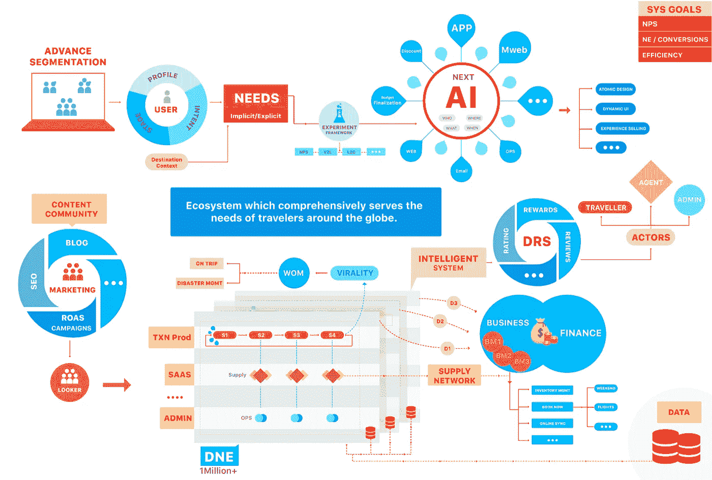
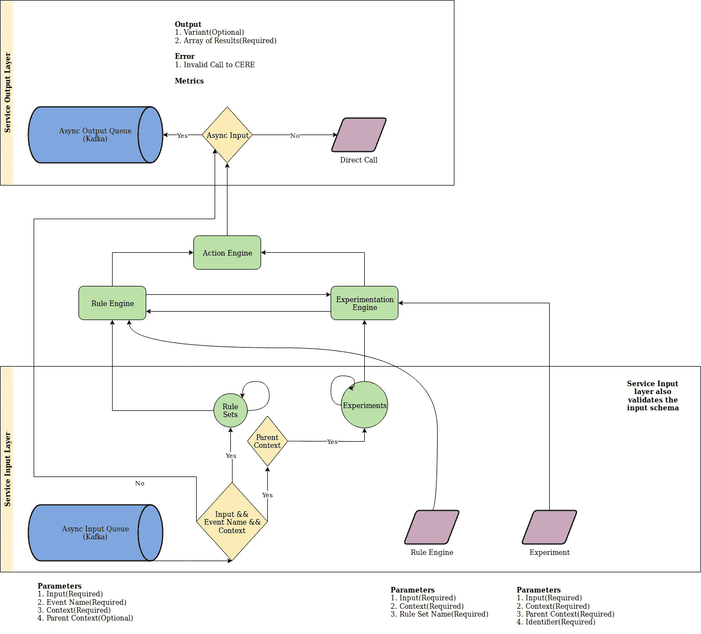
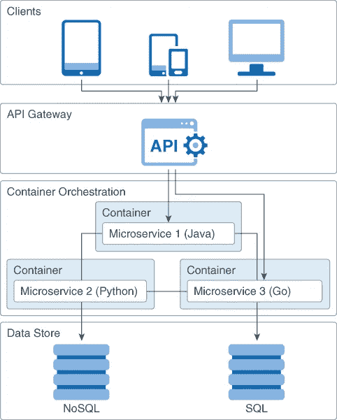
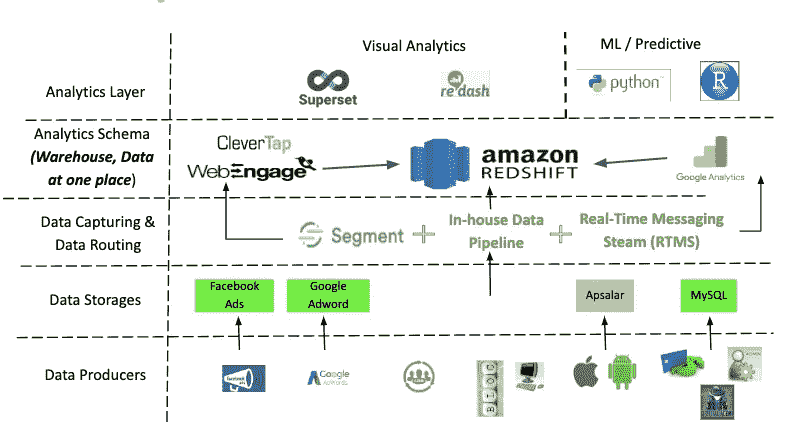
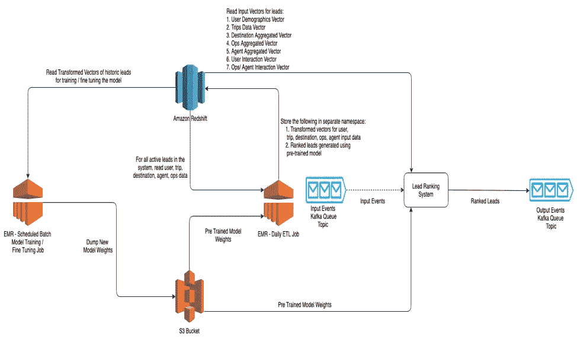
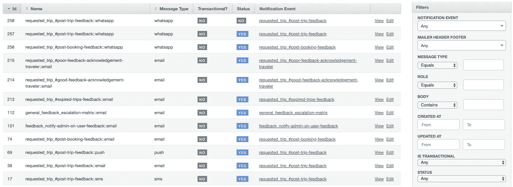

# 工程和数据科学@ travel triangle——构建复杂且可扩展的假日市场(第一部分)

> 原文：<https://towardsdatascience.com/engineering-data-science-traveltriangle-building-complex-and-scalable-holiday-marketplace-9d9e66741ca8?source=collection_archive---------37----------------------->

## 本博客讨论了由我们的工程和数据科学团队开发的通用和可扩展框架，并让您对工程指南和 culture @ TravelTriangle 有所了解

TravelTriangle 假日产品景观

TravelTriangle(TT)是一个在线度假市场，它将旅行者与多家当地旅行社联系起来，帮助他们打造一个定制的难忘假期。

假期是一个复杂的实体，涉及许多活动的部分。它包括最终确定目的地、城市、航班、酒店、活动、观光、出租车、日期、预算、公司、代理商。对于不同的人来说，所有这些终结都以不同的顺序发生。对于一些预算的最终确定是第一位的，对于其他活动的最终确定。在每一步，都有多个因素参与最终确定。旅行者、代理商、旅游顾问等多个参与者以及多种产品和电话互动增加了额外的复杂性。

由于问题的多方面复杂性，在过去的几十年里，假日销售一直通过电话、电子邮件进行，因为这对旅行社来说是一个非常主观的销售过程。

> 在 traveltriangle，我们一直致力于为旅行者创造最佳的度假计划和预订体验

# 技术愿景和通用框架

你可以在此阅读我们解决这一复杂旅游生态系统的整体产品愿景[。多个 B2C 和 B2B 产品线(*当前和未来*)促使我们尽可能地让我们的技术架构松散耦合、高度可配置和有效重用。](https://medium.com/tt-product-stories/product-ecosystem-for-holiday-marketplace-traveltriangle-com-16e510ed4d5c)

此外，作为首席技术官，我一直认为，技术团队应该尽可能地致力于更新的东西，而不只是忙于增强已开发的东西，只是一个功能一个功能地增加。这也有助于我们节俭地开发东西，保持最高的效率，不损害质量，反过来，让非工程团队能够快速移动，并且也是用最少的技术带宽(因为它相当昂贵:)。

考虑到这一点，我们总是将一组功能组合起来，首先在更大的框架上理解，这应该能够无缝地在顶部实现更多的功能，而不需要在每个功能出现时构建它们。事实上，该框架应该可以轻松地扩展到类似的其他产品线。

> *…通过适当的设计，这些功能很便宜。这种方法是艰巨的，但不断取得成功。—丹尼斯·里奇*

以下是我们的工程和分析团队迄今为止构建的几个通用框架，以便灵活高效地实现我们的产品和技术愿景:

# 可配置和实验框架(CERE)

实现我们的产品愿景的第一步也是最重要的一步是，我们的产品团队如何推出足够多的实验/变化，分析数据并不断搅动实验，以快速排除故障，而不会陷入技术带宽和/或发布周期。实验可以围绕优化当前以及为旅行者和代理商测试新的页面和/或产品流。此外，迫切需要了解用户的心理，通过使用高级 ML 算法的详细数据理解，将他们聚集在一个或另一个细分市场中，并在此明确或派生意图的基础上，触发/测试多种行动，以使旅行者和代理之间的规划周期更快、更有效。

我们设计了一个早期实验方法( [blog here](https://www.linkedin.com/pulse/startup-guide-empowering-product-marketing-teams-fail-fast-gupta/) )，以使团队能够发布和测试处理高频率用例的新变体。然而，这种方法不能扩展到其他用例，其他用例的频率正在增加，而且，一旦我们在 React+Redux 堆栈上移动页面，这种方法就停止工作了。我们开始在启用实验的任何页面加载上获得闪烁效果。为了避免闪烁，我们搜索了许多解决方案，然后我们在 Nginx、varnish 和我们自己开发的动态 UI 框架的帮助下构建了自己的解决方案，该框架使任何页面都可以拾取组件以及组件中的数据，以动态呈现整页。该框架对于我们的移动和桌面平台是通用的。对于这款应用，由于应用内页面渲染的细微差别，我们不得不做一些调整(完整的[博客在此](https://insights.traveltriangle.com/technical/dynamic-programming-in-react-with-ab-testing/))。

借助 GTM、用于基本 HTML 更改的 VWO 以及与 varnish 和 Nginx 集成的内部动态 UI 框架，我们能够让产品团队测试不同种类的动态生成的前端页面，并运行 A/B 测试以更快、更客观地获得结果。

然而，我们还没有完全达到目标。同样的方法/工具不能用于后端工作流。为了解决这一挑战，我们首先将我们的架构转移到基于事件，这样我们就可以轻松地配置和控制触发器，并在其上关联所需的操作。我们使用 Kafka 在发布/订阅模式上开发了自己的事件流。我们进一步使其可配置和 A/B 测试友好，为此我们在[规则引擎](https://insights.traveltriangle.com/technical/rules-rules-everywhere-one-engine-to-rule-them-all/)和[事件驱动架构](https://insights.traveltriangle.com/technical/event-driven-architecture/)上开发了 [CERE(可配置实验和规则引擎)](https://insights.traveltriangle.com/technical/rules-rules-everywhere-one-engine-to-rule-them-all/)，让产品团队在不需要技术带宽的情况下随时调整和测试不同的后端工作流。

在这一点上，我们的框架已经很好地建立了快速实验，前端和后端的动态流程。利用这一点，我们的产品团队能够改变我们的产品页面和工作流程，引导分配流程，使用不同的沟通渠道等。等等。不需要任何技术带宽和/或发布周期。

# 面向松散耦合和经济高效的可扩展性的微服务设计

我们的每条产品线(B2B 或 B2C)都会有不同的技术差异和规模增长。例如，面向旅行者的浏览页面需要以极快的速度显示丰富的数据和内容，而事务性页面需要在信息方面更加可靠和一致。内部服务的报告量更大，需要更快的大数据处理，以便团队能够利用实时数据进行分析和决策。需要第三方库存或支付提供商集成的其他系统甚至会有更多不同的细微差别和规模。

资料来源:Oracle.com

微服务方法是我们的大救星。我希望我们一开始就采取了这种方法，但迟到总比不到好。每种服务在各自的方面都有不同的扩展，需要不同的基础设施、不同类型的数据库以及遵循不同的开发指南。此外，它甚至给了我们很大的优势，让我们可以在近期或长期需要更高并发性的地方，从 RoR 到 Golang 重写我们的一些服务。此外，我们能够轻松地从 MySQL、MongoDB 和 Redshift 中选择不同的 SQL/NoSQL 数据库。

当我们大约在 2-2.5 年前开始转向微服务架构时，我们的大多数团队成员都是开发微服务的新手，虽然这看起来非常有利可图，但它也有自己的缺点。

*   我们必须认识到这样一个事实，我们不是为了中断而分解服务，而是只在必要的时候分解服务。
*   工作流变得越来越复杂，单个事务现在可能跨越许多服务，并需要更精细的状态和状态转换。
*   回滚和数据不一致也需要注意，因为现在有多个数据存储。
*   从测试和部署的角度来看，QA 和 DevOps 团队需要分别发展他们的测试和 CI/CD 方法。
*   此外，我们必须确保服务发现和服务间通信顺利进行，同时服务本身具有弹性，断路器得到有效使用。
*   除此之外，还有对通用服务的迫切需求，如认证/授权、API 网关、服务注册等。开始出现(我们仍在通过在原始整体层本身上创建立面层来构建相同的和当前创建的工作区)。

也就是说，从 monolith 转移到微服务在一开始看起来开销很大..:))更不用说，服务器成本的急剧增加，但是，你会在不久的将来看到结果。它将在开发、可伸缩性、故障处理、更好的团队责任分离，甚至在近期节省服务器成本方面带来很多效率。

# 数据仓库、数据湖和数据建模

*任何没有被衡量的东西，都不会得到改进。有多个接触点以及一个供旅行者和代理商与产品/系统互动的平台。需要有一个中央数据储存库。此外，我们还希望使用数百万个数据点，如旅行者浏览、预订、个人资料、通话、电子邮件等数据，向旅行者建议下一个最佳行动项目，以及从过去的数据中可以获得哪些有意义的见解？*

TravelTriangle 的核心文化价值观之一是以数据为中心。以下是任何人想到数据湖时都要注意的几个方面，这也符合大数据的 4v(容量、多样性、准确性和速度):

*   将所有来源的数据收集到一个
*   验证和三角测量数据的正确性
*   结构化数据以消除噪音并对其进行处理
*   对数据进行分析或建模，以获得业务洞察力(大数据的第五个方面——价值)
*   将洞察力融入系统和/或日常决策中
*   保持对新品种和新数据量的培训或更新见解

虽然很快会有一个完整的独立博客*围绕这一点，我将简单地提及我们在 TravelTriangle 使用的方法、工具和技术，以建立我们自己的数据仓库、数据湖，并培训和部署各种数据模型，以从数据中获取洞察力&为旅行者和代理商实时触发某些行动。*

**

*我们使用细分工具以及产品和营销团队使用的外部工具将各种产品线的事件传递到我们的中央数据仓库(RedShift)。然而，对于我们的业务量来说，分段已经变得太昂贵了，因此我们正在用我们内部的实时消息流(“RTMS”)来转换它，以便将事件从任何来源转发到目的地。然而，在“RTMS”整合一个新的目的地并不像在细分市场那么容易，但我们可以接受——现在代替成本，不需要在需要的时候使用高科技..)*

*此外，我们还开发了一个内部数据管道来同步 MySQL 数据库和 redshift 之间的数据。由于频繁的问题和/或需要定制，AWS 数据管道未能满足我们的期望，因此在使用 AWS DMS 一段时间后，我们选择在内部开发自己的数据管道。我们也尝试了 AWS Glue、AWS data pipeline，但都无法满足我们的实时同步要求。目前，我们使用外部资源，如 FlyData 和 Stitch，但由于我们的数据量每月增长数倍，它们变得相当昂贵。(*博客即将推出..*)*

*对于利益相关者的第 2 天报告，我们选择了 Superset 和 Redash。在我们探索过的所有工具中，这些工具满足了我们的大部分需求，而且是开源的。超集中唯一缺少开发的是漏斗可视化，一旦可用，它就可以满足我们所有的需求。我们的工程师还使用各种技术优化技术优化了 Superset 和 Redash，以支持 5 倍的请求和从 10 秒到 1 秒的响应时间，以及长达 3-4 秒的少量繁重报告。我们现在正在为我们测试和集成 druid、PySpark 和类似的大数据工具，以决定一个并将其与我们的主要应用程序集成，以便更快地处理大数据。*

*在 TravelTriangle 上集中数据，并能够向我们的团队显示实时报告以执行日常分析后，我们开始为我们的业务用例开发和培训数据模型。一个这样的例子是动态线索评分，它必须是我们帮助代理有效地确定其线索优先级的实时基础。我们目前使用 EMR 来处理模型，并将我们的应用程序与 Kafka 集成在一起*

**

# *通信/通知层(Sandesh)*

**通知是任何系统不可或缺的一部分，无论是促销系统还是交易系统。我们知道它必须是全渠道的，因此应该快速集成任何新的通信渠道/ API。此外，该流程需要高度可配置、可重用以及与任何其他微服务无缝集成(通过事件或 API)**

*“Sandesh”，我们在这里称之为通知服务，负责不同的交互媒介，可以是短信、IVRs、电子邮件、WhatsApp 或推送通知。通过集成一个映射层和提供者 API，还可以灵活地添加另一种通信媒介。*

*由于这项服务需要高并发性和 IO，我们还必须实现一般的速率限制、突发处理以及队列管理系统。基于前面提到的实验框架构建的通知模板引擎为产品团队提供了非常高的灵活性，可以根据通知类型和时间 A/B 测试他们的消息以及不同媒体的性能，而且也不需要技术带宽和/或新版本。*

**

*此外，我们还创建了数据事件来监控和分析不同媒体上每条消息的发送率、打开率(短信除外)以及点击率，所有这些都存储在我们的中央数据仓库中，以便从中进行分析并得出有意义的见解。*

*我们的促销活动目前通过外部工具 WebEngage 进行管理，但是，我们正在将活动管理器与我们的通知服务和实验框架进行内部集成。*

*虽然这篇文章提到了一些与我们的技术愿景和路线图一致的框架，但[第二部分](https://www.linkedin.com/pulse/engineering-data-science-traveltriangle-building-complex-gupta/)将告诉您更多的框架，以及我们的 QA 和 DevOps 团队为提高发布质量和周转时间而构建的框架。*

*发生了很多有趣的事情@ TravelTriangle。如果您需要了解更多细节，请告诉我们，或者发送电子邮件至 lead_on@traveltriangle.com，与我们一起亲眼见证，同时解决更具挑战性的问题，打造世界级的度假 B2C 和 B2B 生态系统。*

*如果你知道你的网络中有人可能对解决这些问题感兴趣，请分享这篇文章。*

*如果你喜欢这篇文章，就去喜欢和/或鼓掌，这样别人可能会偶然发现这篇文章。*

*【https://www.linkedin.com】最初发表于**。***