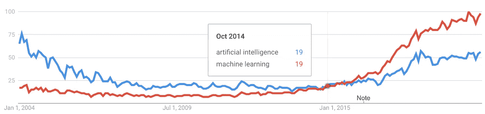
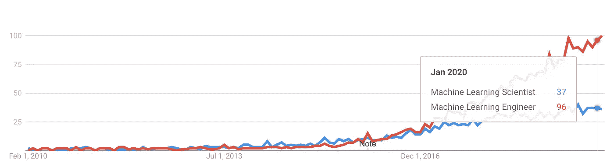
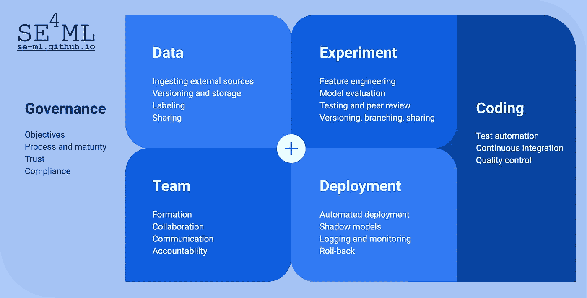
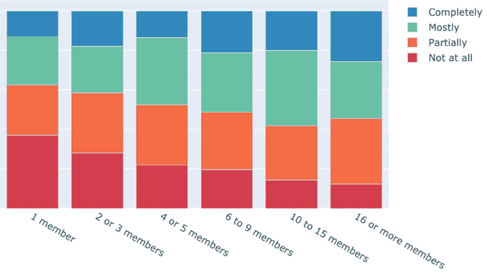
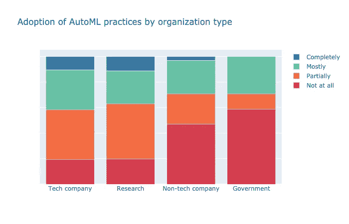

# 学习的工程机器

> 原文：<https://towardsdatascience.com/engineering-machines-that-learn-d4beb34dfa80?source=collection_archive---------34----------------------->

## 软件工程与基于 ML 的软件系统开发的相关性

我们正在通过调查开发包含 ML 组件的软件系统的最佳实践来研究机器学习工程的新兴学科。在本文中，我们分享了研究动机和方法、一些初步结果，并邀请大家参加我们关于 ML 工程最佳实践的 [*7 分钟在线调查*](https://se-ml.github.io/survey/) *。*

照片由 [Franck V.](https://unsplash.com/@franckinjapan?utm_source=unsplash&utm_medium=referral&utm_content=creditCopyText) 在 [Unsplash](https://unsplash.com/?utm_source=unsplash&utm_medium=referral&utm_content=creditCopyText) 上拍摄

***机器学习是新一波人工智能的关键***

不可否认，人工智能(AI)正在经历一波新的关注、能量和极高的期望。这一浪潮是由我们互联的数字社会产生的大量数据以及巨大计算资源的低门槛可用性所驱动的。

在各种人工智能技术中，机器学习(ML)尤其扮演着关键角色。

当前人工智能的激增是由机器学习推动的，根据[谷歌趋势](https://trends.google.com/trends/explore?date=all&q=artificial%20intelligence,machine%20learning)对搜索词的相对兴趣表明了这一点。

## ***从例子中学习复杂行为***

机器学习允许我们解决复杂的问题，不是通过费力地编写新代码，而是通过让一个现有的算法从例子中学习新的行为。我们正在见证图像识别、语音处理、医疗诊断、证券交易、自动驾驶、产品设计和制造等领域的突破性成果。

## ***机器学习是否取代编程？***

机器学习的快速崛起是否意味着软件系统将不再需要编程？我们会需要数据科学家而不是软件开发人员吗？

对于那些经历过与软件相关的项目延迟、系统中断和无限期不完整特性集的人来说，一个没有程序员的世界可能看起来很有吸引力。

## ***机器学习需要编程吗？***

但没那么快。机器学习将**而不是**取代编程，而是使软件工程学科更加丰富和复杂，这有几个原因。

1.  ML 算法本身是需要开发、测试和维护的软件。
2.  使用 ML 算法需要编程，用于接收、清理、合并和增强数据的任务，用于将数据输入 ML 算法，用于运行重复的训练实验以生成、评估和优化 ML 模型，以及用于在生产系统中测试、集成、部署和操作 ML 模型。
3.  经过训练的 ML 模型只是构建复杂软件系统的一个构件。

## 那么，有什么不同呢？

尽管如此，机器学习的一些具体特征对传统的软件开发实践提出了挑战。对于涉及机器学习组件的应用程序，要管理的数据量通常要大得多。开发过程倾向于包括更多的快速循环实验，在这些实验中，替代解决方案被例行地尝试、比较和丢弃。并且最终产品中固有的不确定性水平更高。

机器学习工程师的出现。根据[谷歌趋势](https://trends.google.com/trends/explore?date=2010-01-22%202020-02-22&q=machine%20learning%20scientist,machine%20learning%20engineer)对搜索词的相对兴趣。

## ML 工程

在全球范围内，许多组织正在逐步学习如何开发包含 ML 组件的软件系统。随着越来越多的人自认为是 ML 工程师，机器学习工程学科正在兴起。这引发了有趣的问题:

*   ML 工程和软件工程有区别吗？还是一个是另一个的子学科？
*   当用 ML 组件构建软件系统时，已建立的软件工程最佳实践同样适用吗？或者这些最佳实践需要修改或替换吗？
*   一套规范的 ML 工程最佳实践能够被识别出来，从而指导从业者并教育新人吗？

## 调查 ML 工程实践

为了调查这些问题，软件工程和机器学习领域的研究人员已经合作。

我们已经开始广泛回顾[的科学和流行文献](https://github.com/SE-ML/awesome-seml/blob/master/readme.md)，以**确定**从业者和研究人员描述和推荐了哪些实践。这些实践的范围从数据管理(例如，如何处理大型数据集的存储和版本控制)，到模型训练(例如，如何运行和评估训练实验)，再到操作(例如，如何部署和监控训练模型)。

组织成实践团体的 ML 工程的方面。

## 调查 ML 工程实践的采用

然后，我们在用 ML 组件构建软件的团队代表中进行的**调查**中嵌入了确定的实践。本次调查目前正在进行中， [**向新参与者**](https://se-ml.github.io/survey/) 开放(见下文)。在撰写本文时，大约有 200 个团队参与其中。早期的结果表明，较大的团队倾向于采用更多的工程实践。

我们关于机器学习团队采用工程实践的全球调查的早期结果。较大的团队倾向于采用更多的实践。

还有，早期的结果告诉我们，有些实践被广泛采用，可以被认为是*，而另一些实践只被更大组织中更有经验的团队应用，可以被认为是*。**

**更高级实践的一个例子是使用所谓的*自动化*机器学习技术，团队能够以自动化的方式进行模型选择和超参数优化。早期调查结果表明，与非科技公司和政府相比，这些技术在科技公司和(学术)研究实验室中的采用程度要高得多。**

****

**我们关于机器学习团队采用工程实践的全球调查的早期结果。与非科技公司和政府组织的团队相比，科技公司、大学和非商业研究实验室的团队往往会更多地利用自动化机器学习技术。**

## **迈向 ML 工程最佳实践目录**

**我们正在利用调查结果将最佳实践整理成一个全面的目录。在目录中，每个 ML 工程实践都被记录在一个统一的结构中，就像过去的*设计模式*和*重构*一样。**

**该结构的要素包括实践的*意图*和*动机*，在各种环境中的*适用性*，与其他实践的*相互依赖性*，以及如何应用该实践的简短且可操作的描述。我们还提供参考文献和支持工具。**

**使用调查结果，我们还能够**量化**每个实践的*难度*。这有助于我们将它们按照从*基础*到*高级*的难度级别进行分类，指导团队优先采用它们。**

**我们的最终目标是，最终的目录将有助于 ML 工程团队的形成和有效性，不仅在 ML 工程已经得到广泛采用的大型技术公司，而且在较小的非技术组织中。**

## ****参加调查！****

**如果您是构建包含机器学习组件的软件的团队的一员，请**通过参加我们的调查来帮助我们**。**

*****拿调查:***[***【https://se-ml.github.io/survey/】***](https://se-ml.github.io/survey/)**

**Joost Visser 是莱顿大学软件和数据科学教授。此前，Joost 在软件改进小组担任过各种领导职务。他是许多关于软件质量和相关主题的出版物的作者。**

***与* [*合作*](https://cs.ru.nl/~aserban/)*[*霍尔格·霍斯*](http://ada.liacs.nl/members/#Holger)*[*柯恩·范德布鲁姆*](http://liacs.leidenuniv.nl/~blomkvander/) *。*****

***更多信息请咨询* [*SE4ML 项目网站*](https://se-ml.github.io/) *。***

***这篇文章的早期版本发表在*[*Bits&Chips*](https://bits-chips.nl/)*中。***

** [## SE-ML/awesome-seml

### 涵盖构建机器学习(ML)的软件工程(SE)最佳实践的文章精选列表…

github.com](https://github.com/SE-ML/awesome-seml/blob/master/readme.md)**