# 使用工具提示页面增强电源 BI 报告

> 原文：<https://towardsdatascience.com/enhance-power-bi-report-with-tooltip-pages-3ae472b43e2?source=collection_archive---------44----------------------->

## 了解关于工具提示页面如何增强您的 Power BI 报告的各种技巧

Salvatore Ventura 在 Pexels 上拍摄的照片

Power BI 是一个很棒的工具(我知道你也意识到了)。我最喜欢它的一点是，它提供了许多可能性，可以使用一些简单的技术来增强您的报告，并为您的用户创造无与伦比的体验。

在我之前的文章中，我分享了 5 个简单的技巧来提高你的 Power BI 开发过程。由于只包括了五个，我最喜欢的技术之一没有在那里找到位置，因为我已经决定为此专门写一篇文章。

最酷的技巧之一是创建工具提示报告页面。只需几分钟的时间，您就可以让您的用户更加灵活地浏览数据窗口。

## *默认提示*

我已经使用 Contoso 数据集创建了一个简单的报告。默认情况下，当您将鼠标悬停在数据栏上时，您将看到特定数据部分的数字:

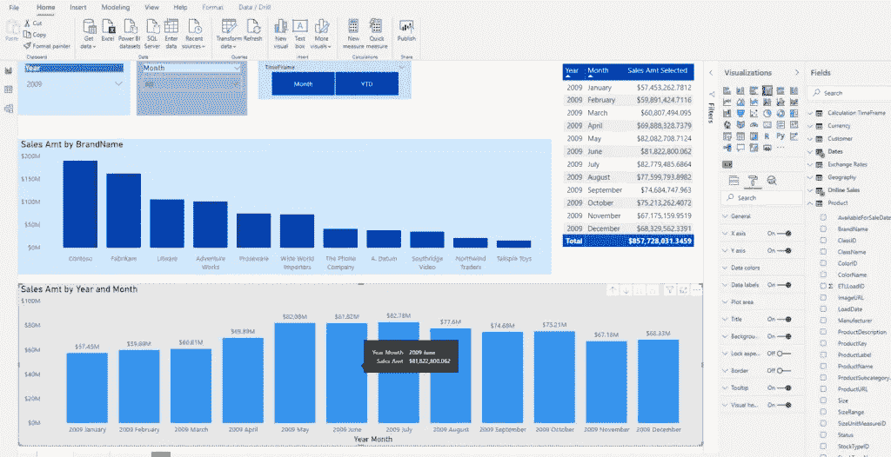

在这里，您可以看到 2009 年 6 月的销售额约为 8200 万英镑。

## 自定义工具提示

比方说，我想让我的用户有机会通过将鼠标悬停在数据栏上来快速获得对底层数据的更好的概述。

第一步是通过单击“+”号创建一个新的报告页面。

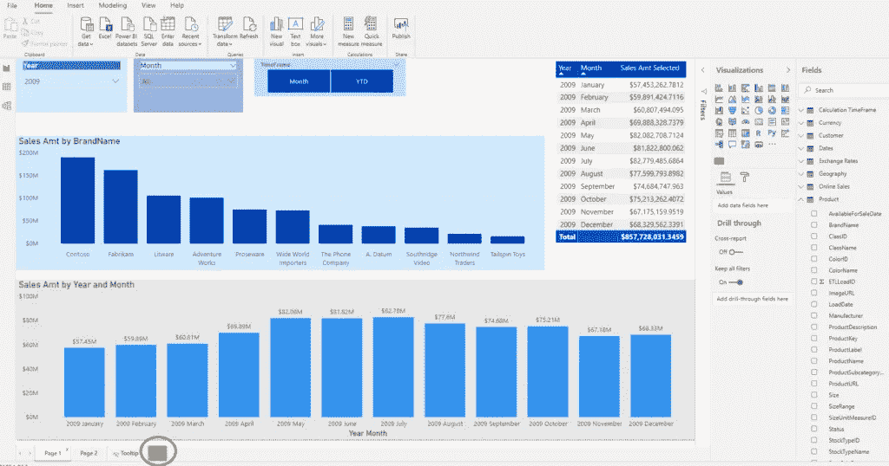

在新创建的页面的格式部分，我们需要应用一些设置来使这个页面成为工具提示页面。在“页面大小”菜单下，选择“工具提示大小”,而不是默认的 16:9。

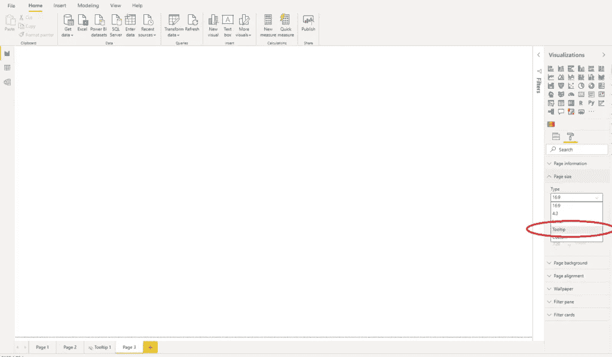

然后，在“视图”选项卡的“页面视图”下，我选择“实际大小”，这样我就可以创建“实际”大小的可视化效果，因为它将显示在主报表页面上。

我已经将我的工具提示报告页面重命名为工具提示 1(当然，您应该给它一个更有意义的名称，尤其是当您处理多个工具提示页面时)。在这个页面上，我放置了一个显示总销售额的卡片和一个显示销售额排名前 5 的地区的聚类条形图。我还隐藏了这个页面，这样用户打开报告时就看不到它了。

最后一步是“告诉”Power BI 我打算将这个页面用作工具提示。因此，在页面信息下，我将工具提示切换为开:

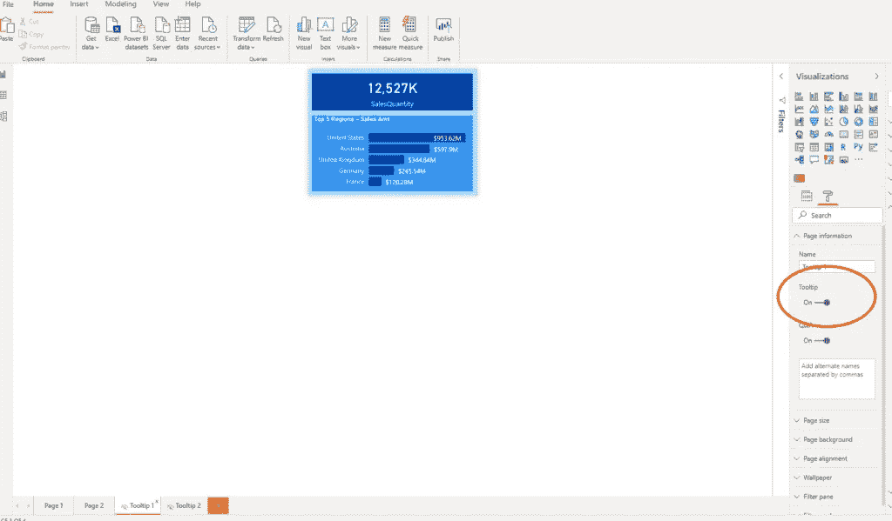

现在，让我们切换回主页。在“格式”窗格下，有一个工具提示菜单。您只需要在 Type 下选择报告页面，并在 page:

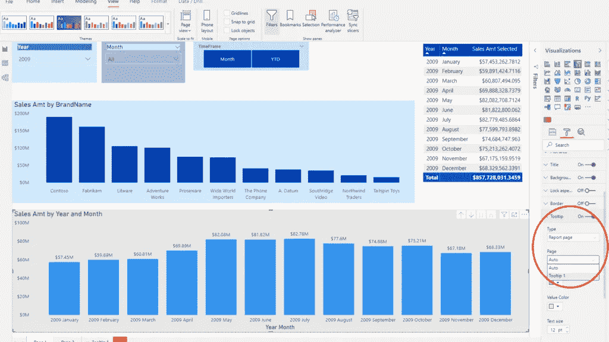

就是这样:现在，当用户悬停在特定的数据栏上时，他可以立即看到向下钻取的数据，如我们的工具提示中所定义的！

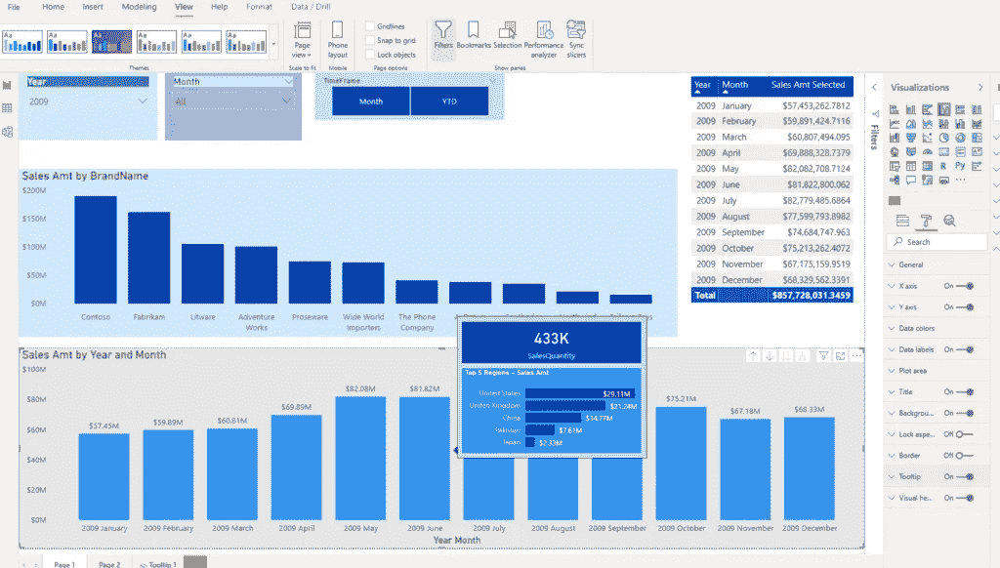

2009 年 6 月的工具提示数据

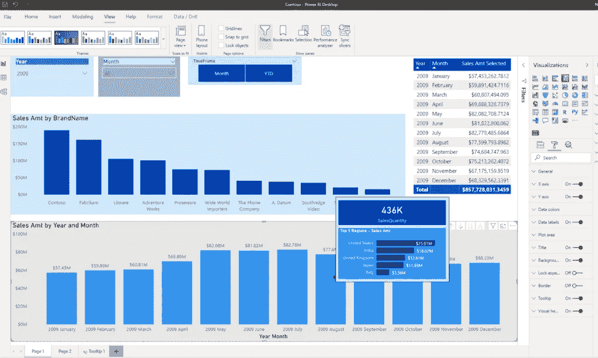

2009 年 8 月的工具提示数据

## 让它成为你自己的…

除了默认的工具提示页面大小(320x240px)，您还可以创建自己的工具提示页面大小。不要选择“页面大小”下的工具提示，只需选择“自定义”并输入您想要的值。我已经创建了一个工具提示页面 Tooltip 2，并将大小改为 328×200 像素。它只是显示每种产品颜色的销售额，所以现在当用户将鼠标悬停在产品上时，他将看到所选产品每种颜色的数字:

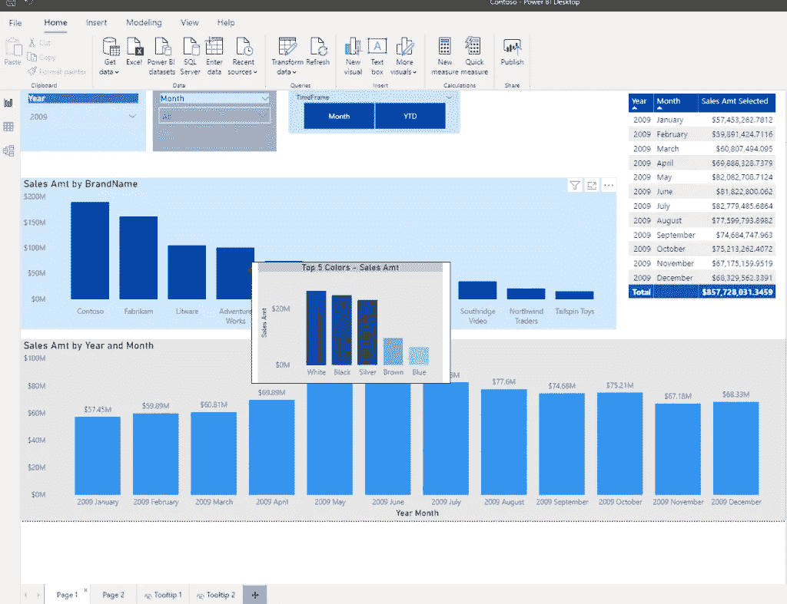

这样，我就能看出 2009 年 Adventure Works 品牌的最大销售额来自哪种颜色。

最后，您可以在工具提示页面上指定工具提示字段。这意味着您的报告中引用指定字段的每个可视内容都将显示您的工具提示页面，而不是默认的 Power BI 工具提示。

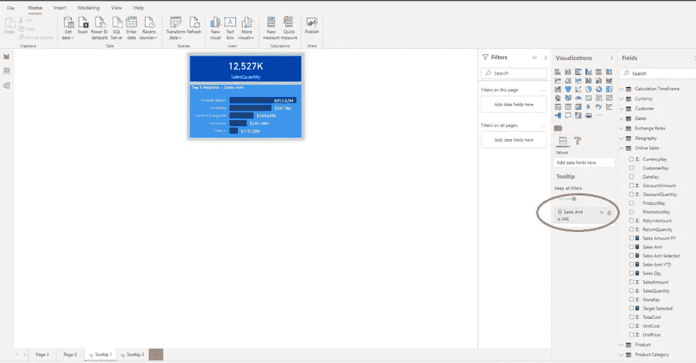

现在，如果我返回到主报告，并将自动选项作为工具提示报告页面，任何显示销售额度量的可视化工具都将显示我定制的工具提示！多酷啊！

因此，当我将鼠标悬停在品牌名称上时，我将获得销量和前 5 名地区:

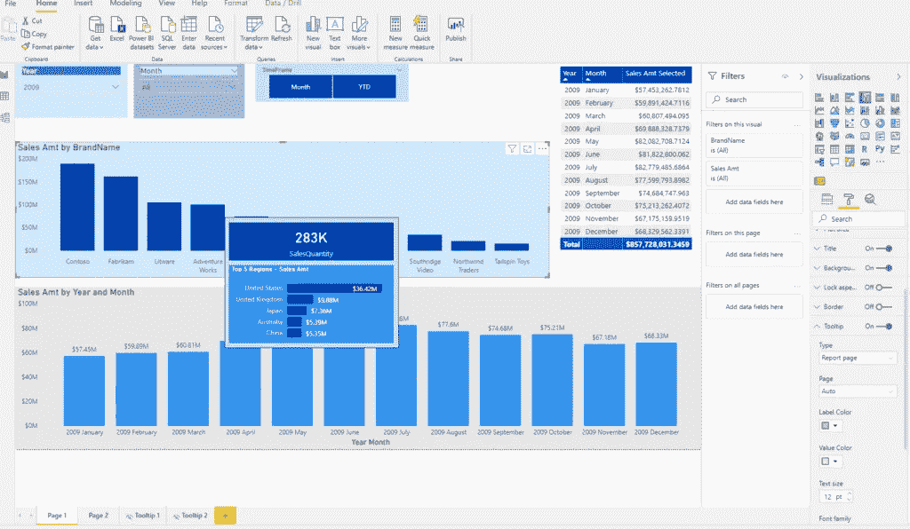

## 带有动画工具提示的专业级

最后一项技术是真正的专业水平，并归功于来自 [Exceleratorbi](https://exceleratorbi.com.au/animated-visual-header-tooltip-cue-for-drill-through-help/) 的 Jason Cockington，他详细解释了这一点。总之可以添加 GIF 作为工具提示！这非常有用，因为许多用户并不了解所有 Power BI 功能，需要某种指导才能充分利用报告。

最常见的情况之一是，当您在报表中创建钻取页面时，您的用户并不知道它，或者根本不知道如何访问它。所以，我创建了一个 GIF(网上有很多免费的 GIF 创建者，[这个](https://ezgif.com/maker)就是其中之一)展示了从主页面表格到每个品牌销售额详细概览的钻取操作步骤。

在你创建了一个 GIF 之后，之前在这篇文章中解释的所有步骤都是一样的。唯一的区别是，您应该将 GIF 设置为背景图像，透明度为 100%,并将 Image Fit 属性设置为 Fill，而不是将 GIF 作为图像放在工具提示页面上:

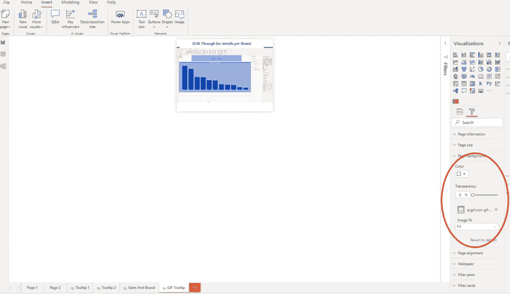

接下来，在主页表格上，我打开了可视标题工具提示图标:

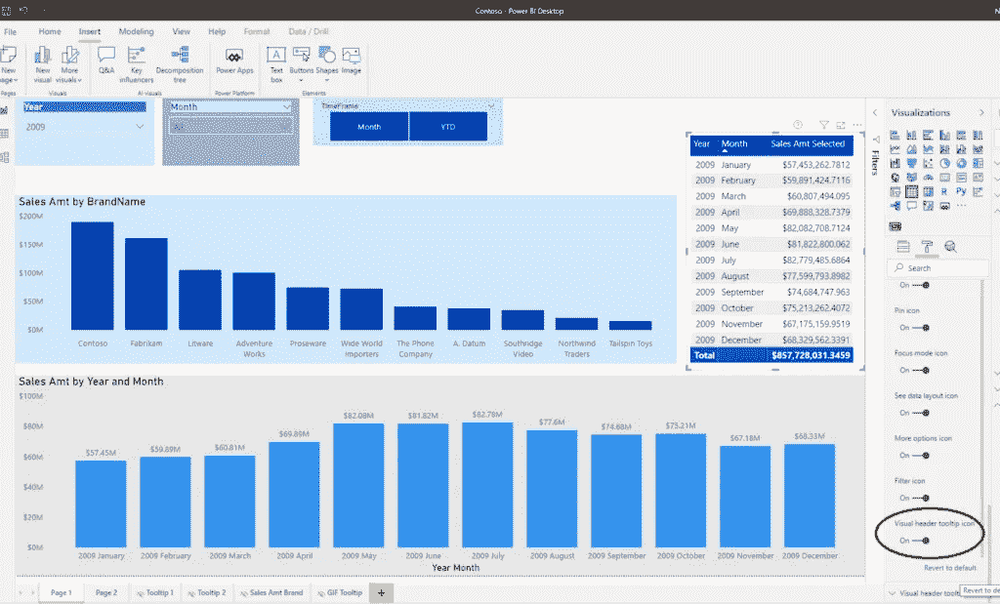

最后，在可视标题工具提示下，我定义了新创建的工具提示页面(在我的例子中它被称为 GIF 工具提示)。

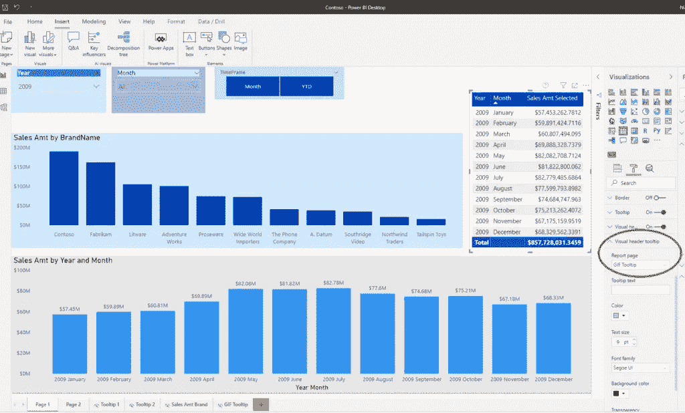

因此，现在当某人将鼠标悬停在一个小问号图标上时，他会看到如何执行钻取操作的动画说明。厉害！

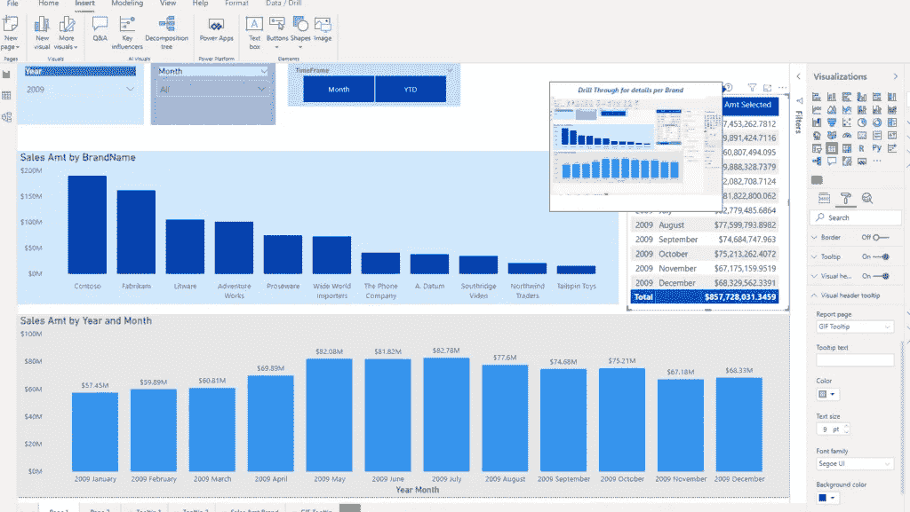

## 结论

报告页面工具提示是一个非常强大的功能，它们可以丰富你的报告。但是，使用它们时要小心，尤其是当您的报表包含许多视觉效果时，因为渲染时间的增加会导致性能下降。

至于 Power BI 中的任何其他技术:尝试在用户体验增强和关于报告性能的额外开销之间找到正确的平衡。

成为会员，阅读 Medium 上的每一个故事！

订阅[这里](http://eepurl.com/gOH8iP)获取更多有见地的数据文章！