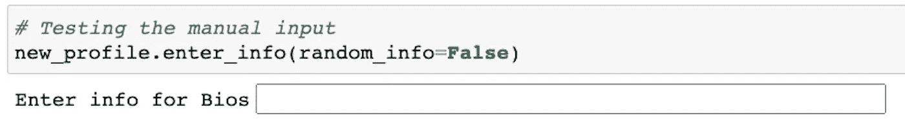
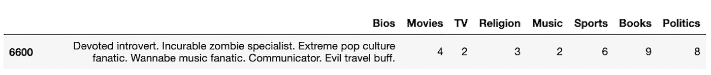
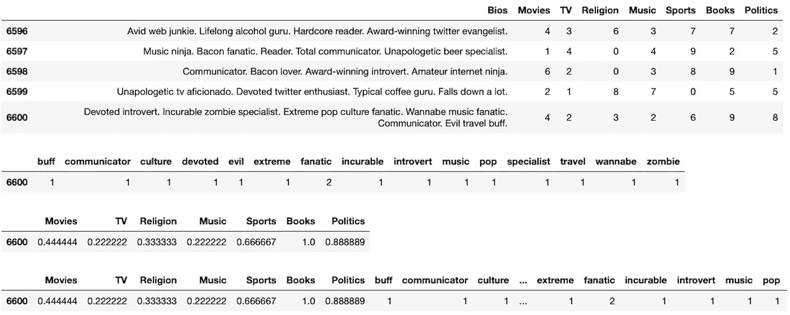

# 什么是 Python 类，你如何使用它？

> 原文：<https://towardsdatascience.com/enhance-your-python-project-code-with-classes-5a19d0e9f841?source=collection_archive---------1----------------------->

## 了解 Python 的类机制


克里斯里德在 [Unsplash](https://unsplash.com?utm_source=medium&utm_medium=referral) 上的照片

W 在从事数据科学项目或任何 Python 编程项目时，你很可能会发现自己使用了大量自制的函数和变量。为了简化项目过程，您甚至可能已经创建了一个完整的脚本，其中包含了您创建的函数。

这些函数可以用于代码中的许多事情。从清理数据帧到训练机器学习模型。创建大量的函数来组织你的 Python 代码是很有用的，但是还有另一种方法可以让你的代码看起来和行为起来更像样——通过使用 Python ***类*** ！

# 什么是 Python 类？

Python 类就像是创建新对象的大纲。对象是您在处理代码时希望操作或更改的任何东西。每当一个类对象被实例化，也就是当我们声明一个变量时，一个新的对象就从零开始。只要需要，类对象可以反复使用。

## 示例:约会档案

在我们的案例中，在我们以前的文章中，我们一直在撰写一系列关于创建约会算法的文章，该算法通过使用机器学习对约会档案进行聚类和分类。看这里:

[](/dating-algorithms-using-machine-learning-and-ai-814b68ecd75e) [## 我用机器学习和人工智能做了一个约会算法

### 为约会应用程序利用无监督机器学习

towardsdatascience.com](/dating-algorithms-using-machine-learning-and-ai-814b68ecd75e) 

在上面的文章中，我们经历了数据预处理的整个过程，以便让我们的数据变得对人工智能友好，例如将约会简档转换为一组数字。*对象，在本例中为*，是为了让所有这些发生而需要操作的约会配置文件。

这个数据预处理步骤是通过使用许多函数来实现的。它不是以最好的方式组织的，但是它完成了工作。然而，我们可以通过利用 Python 类来改进这个过程。

> [在这里注册一个中级会员，可以无限制地访问和支持像我这样的内容！在你的支持下，我赚了一小部分会费。谢谢！](https://marco-santos.medium.com/membership)

# 约会档案的类别

为了学习更多关于类对象和利用它们，我们将为我们的人工智能约会算法实现一个类对象。让我们将我们使用的代码组织和整理成一个类对象。

## 类对象用途

首先，我们必须问自己——我们希望这个类对象做什么？我们希望它:

1.  创建新的约会档案。
2.  将新的个人资料添加到更大的约会个人资料池中。
3.  对简档进行缩放或矢量化，以使其对机器学习模型友好。

基本上，我们希望它将整个数据预处理步骤浓缩到一个类对象中，然后我们可以将它用于我们希望添加的每个新的约会配置文件。每当我们需要创建一个新的约会档案时，我们都可以使用这个类对象。

# 构造一个类

在创建类之前，我们建议您导入必要的库。在我们的课程中，我们将使用以下库来格式化新的约会配置文件:

```
import pandas as pd
from sklearn.feature_extraction.text import CountVectorizer
from sklearn.preprocessing import MinMaxScaler
```

首先，为了创建一个类对象，您只需键入以下内容:

```
class CreateProfile:
```

类的名字是主观的，但是关于名字格式的一般规则是遵循一个叫做 [*的东西。这是我们的类对象的开始，我们将从这里开始构建。*](https://en.wikipedia.org/wiki/Camel_case#:~:text=Camel%20case%20(stylized%20as%20camelCase,iPhone%22%20and%20%22eBay%22.)

在类中，切换到开始定义我们的第一个函数。通常，当创建一个类时，你必须定义一个名为`__init__`的函数，以`self`作为初始参数。

```
class CreateProfile:
    def __init__(self):
```

## 什么是`__init__”`功能？

当一个类被*实例化*时，一个`__init__`函数被调用。通过实例化，我们指的是当你声明一个类的时候，它可以自己发生，也可以通过把它赋给一个变量来发生。以下是实例化类对象的一些快速示例:

```
CreateProfile()# ORprofile = CreateProfile()
```

这里我们正在实例化类对象，通过这样做，我们隐式地调用了`__init__`函数。在实例化类对象时，`__init__`函数中的任何参数也将是相同的参数。这些初始参数可以是我们希望在整个类对象中操作的数据。但是对于`self`参数，在实例化类对象时没有必要替换。

## 什么是“自我”？

`self`参数只会在构建 Python 类时出现。它在整个类中使用，通常是在该类中创建的任何函数的第一个参数。但是，无论何时实例化后使用类对象，`self`都不会是你需要填充的参数。

`self`参数是一个隐式参数，当实例化该类或者在该类中使用自定义函数时，总是会调用这个参数。`self`指的是它正在操纵的对象。在我们的例子中，我们希望创建新的约会资料。

# 使用“自我”

为了进一步理解`self`的用法，我们将继续构造我们的类。让我们填写一些我们的`__init__`函数将采用的其他参数:

```
class CreateProfile:
    def __init__(self, 
                 dataset=None,
                 profile=None): self.dataset = dataset
        self.profile = profile
```

正如你在这里看到的，我们在`self`后面添加了一些参数。这些论点现在是空的，但我们将使用熊猫数据框架来创建一个新的约会档案。为了在整个类中使用这些 DFs，我们必须将它们分配给对象或`self`,稍后我们将使用函数对其进行操作。

## 类别属性

当在我们的`__init__`中分配这些 DFs 时，我们有效地创建了*类属性*。在实例化类之后可以调用它们，它们将返回我们分配给对象的任何变量(`self`):

```
# Instantiating the class
new_profile = CreateProfile()# Calling the class attribute
new_profile.dataset 
```

这将返回我们在实例化该类时提供的任何数据集。在这种情况下，运行这段代码将不会返回任何内容，因为`None`是在`__init__`函数中建立的默认参数。

我们也可以运行`new_profile.profile`来返回我们正在创建和操作的概要文件。这个创建的配置文件现在将是空的，但是我们将使用新的信息填充它，并通过使用我们稍后将构造的类中的一些自定义函数来格式化它。

为了进行下一步，让我们建立所有的类属性来创建我们最终的`__init__`函数。我们将需要它们用于类中未来的自定义函数:

在这里，我们为新的概要文件添加了更多的条件和更多的属性，供以后使用

# 类方法(函数)

我们在类中创建的函数被称为*方法*。函数和方法本质上是一样的，但是在类对象的上下文中，函数被称为方法。为了操作和利用给定的数据，我们需要为我们的类创建一些方法。

在这种情况下，我们将使用我们之前创建的日期配置文件的合成数据集。*参见以下文章，了解该数据集的创建*:

[](/generating-fake-dating-profiles-for-data-science-cd3b929972bc) [## 我为数据科学制作了 1000 份假的约会资料

### 我如何使用 Python Web Scraping 创建约会档案

towardsdatascience.com](/generating-fake-dating-profiles-for-data-science-cd3b929972bc) 

该数据集将为我们提供创建新约会档案的背景。

## 使用类方法创建新的约会配置文件

我们希望我们的类做的第一件事是创建一个全新的概要文件，如果它还没有提供的话。为此，我们可以在`__init__`方法下创建一个新方法:

```
class createProfile:
    def __init__(self, 
                 dataset=None,
                 profile=None): self.dataset = dataset
        self.profile = profile # Here we add another function
    def enter_info(self):
        # Code goes here
```

如你所见，我们仍然在使用`self`参数。当我们键入下面的代码时，我们将需要它:

上面的方法在整个代码中都使用了`self`。当我们使用`self.profile`时，我们指的是我们在`__init__`方法中分配的属性。首先，我们检查它是否是一个空的数据帧，它确实是。接下来，我们将使用在`__init__`方法中分配的`self.dataset`变量，并使用它的特性来创建新的概要文件。

我们允许选择使用更大数据集中的随机信息来填充新的配置文件，或者手动输入信息。在输入配置文件信息之后，方法*用新的配置文件信息覆盖*属性。如果您试图再次运行这个方法，它将返回字符串:"*概要文件中已经包含的数据。*

如果你想输入新的信息，你必须*重新初始化*这个类，然后从头再运行一次。实例化该类将从头开始整个过程。

## 运行类方法

下面是我们如何从实例化步骤开始运行该方法:

```
# Instantiating with the data from the DF of synthetic profiles
new_profile = createProfile(dataset=data)# Running the method
new_profile.enter_info()
```

这正是我们所需要的。只有两行代码。当我们运行它时，它要么为配置文件输入随机信息，这是函数的默认行为，要么提示我们手动输入信息，如下所示:



对于每个需要信息的功能，都会出现此提示

无论哪种方式，class 方法都将创建一个全新的概要文件，供我们以 DataFrame 的形式操作:



新的约会档案

# 更多类方法

对于我们来说，创建一个全面的类，它必须做的不仅仅是创建一个新的约会配置文件。在这种情况下，我们将添加之前在`__init__`方法中提到的方法。下面是我们将添加到类中的方法，以使用我们的新概要文件:

我们的类中将要用到的其余方法

## 解释每种方法

类中的每个方法都执行特定的功能。给定在`self`中创建的属性，这些方法将用每个方法的结果值替换类的属性。

*   `add_profile_to_dataset()` —此方法假设已经有一个包含信息的约会档案。它将比较来自剖面图和更大数据集的要素，以查看它们是否匹配。如果它们匹配，那么它会将新的配置文件添加到数据集中，并返回添加了新配置文件的更大的数据集。否则，它会通知用户数据集的要素与剖面图的要素不匹配。
*   `vect_text()` —对于新的概要文件数据，该方法实例化`CountVectorizer()`来为概要文件的 *Bios* 中使用的每个单词创建一个数字数组。然后它创建一个数字数组的 DF 并返回它。
*   `scale_profile()` —给定新的轮廓数据，该方法使用适合更大轮廓数据集的`MinMaxScaler()`来缩放新的轮廓数据。此外，在该方法的参数中，有一个不进行缩放的已排除要素或列的列表。然后，它使用`self.scaled_profile`属性，并用一个包含缩放值的新 DF 重新分配它，并返回那个 DF。
*   `format_profile()` —这种方法基本结合了前面两种方法:`vect_text()`和`scale_profile()`。如果运行这两个方法返回的属性已经存在，那么它将连接两个 DF 并返回结果 DF。如果没有，那么它仍然运行这些方法，并返回两个 DFs 的连接结果。

运行每个方法与之前运行`enter_info()`方法相同:

```
# Running each method after having ran enter_info()
new_profile.add_profile_to_dataset()new_profile.vect_text()new_profile.scale_profile()new_profile.format_profile()
```

# 查看类属性

现在我们已经运行了类中的所有方法，我们可以通过查看每个方法使用的新类属性来检查结果。

```
# Running each attribute to check their results
new_profile.combined_df.tail(5)new_profile.vectorized_textnew_profile.scaled_profilenew_profile.formatted_profile
```

如果您运行这段代码，您将能够看到每个方法处理的类属性以及它们的最终结果(按顺序*):*



每个属性的结果(从上到下):组合 _df、矢量化 _text、缩放 _profile、格式化 _profile

正如您所看到的，新的概要文件有一个索引值 *6600* ，并且显示了每个方法如何操作它。我们现在可以随时引用类中的每个属性，它将包含这些结果。

# 导入类

在创建一个类时非常有用的一点是，我们可以将我们创建的类导入到其他 Python 文件或笔记本中。只需将 Python 类保存在一个`.py`文件中，您可以在以后导入它。只要确保它在同一个目录中。您可以像导入任何其他 Python 库一样导入该类:

```
from your_file_name import CreateProfile
```

现在，您可以随时使用 Python 类，而无需复制/粘贴代码。

# 关闭

使用类来简化我们的数据预处理步骤对于任何开始数据科学项目的人来说都是非常有用的。在我们的例子中，我们需要一种方法来处理新概要文件的创建和格式化。Python 的类的伟大之处在于我们可以随时重用它。如果我们想添加另一个约会配置文件，那么我们所要做的就是实例化另一个类对象。这可以继续下去，直到我们对新创建的配置文件的数量感到满意。

总的来说，类对象可以用来在编码项目中组织代码。这里我们只讨论了 Python 类的基础知识，还有一些概念需要学习。如果你想了解更多关于 Python 的类，那么 [**点击** **这里**](https://docs.python.org/3/tutorial/classes.html) 。

如果需要，可以查看下面参考资料中的 Github 以获得完整代码。到目前为止，您可能已经看到了为您的项目创建 Python 类的价值。

## 资源

[](https://github.com/marcosan93/AI-Matchmaker) [## Marcos an 93/人工智能媒婆

### 使用无监督机器学习和 NLP - marcosan93/AI-Matchmaker 的匹配简档

github.com](https://github.com/marcosan93/AI-Matchmaker) [](/dating-algorithms-using-machine-learning-and-ai-814b68ecd75e) [## 我用机器学习和人工智能做了一个约会算法

### 为约会应用程序利用无监督机器学习

towardsdatascience.com](/dating-algorithms-using-machine-learning-and-ai-814b68ecd75e) [](/generating-fake-dating-profiles-for-data-science-cd3b929972bc) [## 我为数据科学制作了 1000 份假的约会资料

### 我如何使用 Python Web Scraping 创建约会档案

towardsdatascience.com](/generating-fake-dating-profiles-for-data-science-cd3b929972bc)