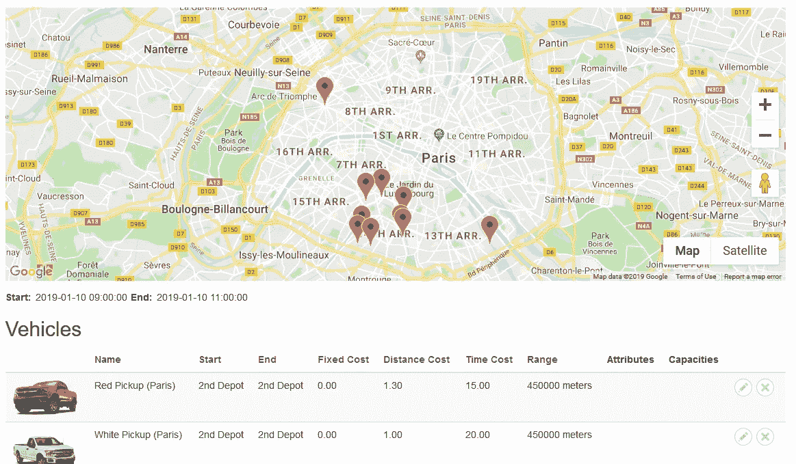
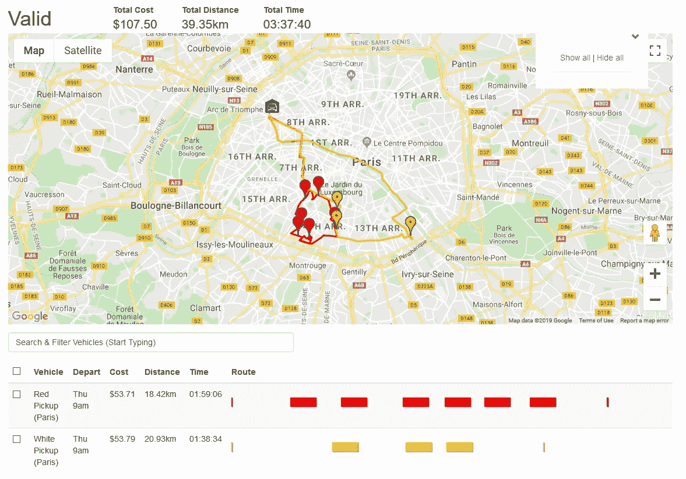
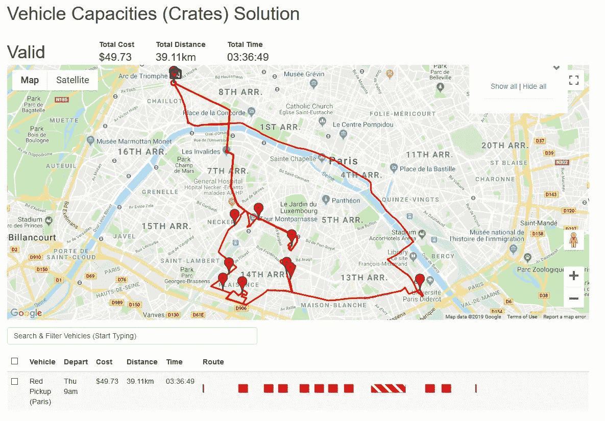
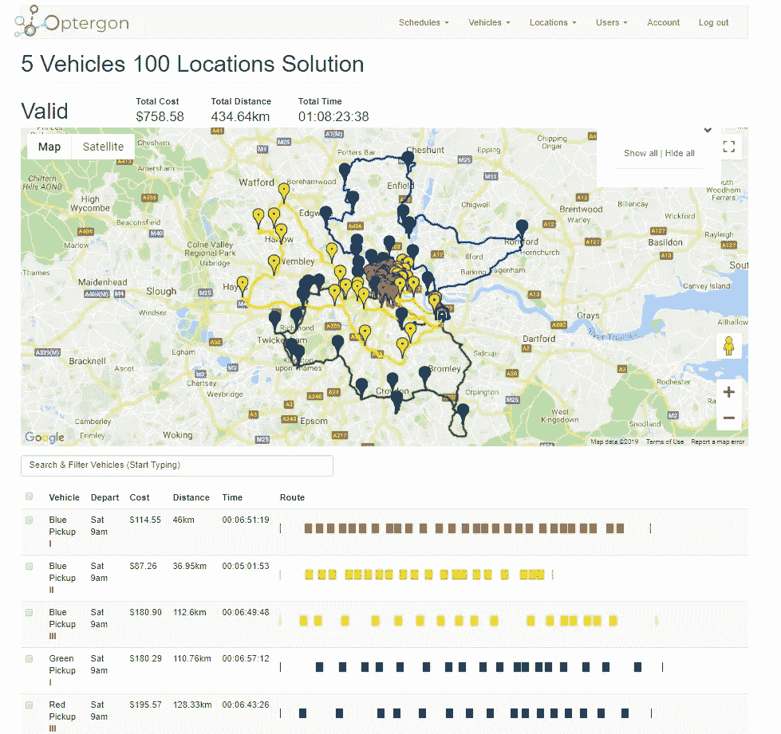

# 为极具竞争力的公司增强车辆路线和车队优化

> 原文：<https://towardsdatascience.com/enhanced-vehicle-routing-fleet-optimization-for-ultra-competitive-companies-9349d7e0bdf0?source=collection_archive---------44----------------------->

企业可以削减与“最后一英里”相关的供应链成本。图片来自 [Pixabay](https://pixabay.com) 的 [wiggijo](https://pixabay.com/users/wiggijo-3628174/) 。

所谓的“最后一英里”会导致整个供应链成本的 30%*,这使得它成为创新新技术的主要目标。*

众所周知，车辆路线问题很难解决，但近年来，大量路线优化服务涌现出来，有望提高效率和降低成本。

问题是，

所有的路线优化系统都是平等的吗？

绝对不行。

解决相对平凡的日常问题的巨大复杂性迫使路线规划系统走捷径。虽然它们提供的解决方案比您手工或使用简单的路线优化软件所能实现的更好，但您仍有可能获得更好的结果。

> 一个只有一辆车和 50 个站点的简单路线优化问题的排列比太阳中的氢原子多 3000 万倍。

如果与送货和取件相关的运输成本占了您成本的很大一部分，那么您需要将这些整合到您的系统中(*我们将通过一些例子来说明为什么需要这些功能，以及您从拥有这些功能中获得的竞争优势*)。

# 基本车队优化要求

为了确保您的业务尽可能简化和高效，任何优化都必须考虑以下影响成本和执行能力的条件:

*   **满足固定的时间&距离相关成本** ( *仅使用时间或距离成本可能导致次优结果，因为只有一半的真实成本生成器被考虑*)
*   **考虑车辆的容量类型和限制** ( *使用一条最佳路线是没有意义的，这条路线要求车辆运送远远超过它所能承载的东西，或者装载它所不能承载的东西——比如冷冻食品*
*   **允许在行程中及行程之间进行提货和交货** ( *即从该地点提货并将其交付至该地点，或将其带回仓库*
*   **允许在一天内多次往返停车场** ( *在再次出发之前，必须允许车辆返回停车场补充货物*
*   **满足位置**的灵活时间限制(*即包裹必须在上午 11 点之前到达，或者取件时间必须在下午 2 点到 4 点之间*)
*   **考虑车辆限制** ( *即本次取货需要冷链车，或者本次交付需要多人搬运等*

无论您使用的是第三方基于网络的系统、路线优化 API 还是集成到车队跟踪中的路线优化系统，上述列表都代表了对实际的“*黑盒*”数字处理后端至关重要的功能，该后端可为您的业务提供优化的交付时间表。

# 增强的路线优化优势

除了避免不必要的长途旅行之外，还有许多不太明显的好处，不仅可以降低路上的成本，还可以提高整个组织的效率(在车辆离开停车场之前*)。*

## *利用时间和距离成本因素提高效率*

*现实世界的路线规划必须考虑与您的车队相关的一系列成本，以便根据车队的具体特征准确描绘最佳解决方案。*

*任何只考虑距离或时间的系统(*而不是两者都考虑*)都无法计算出最佳可能的解决方案，因为它忽略了一半的成本生成因素。*

*考虑以下场景，其中一辆车的距离成本较高，而另一辆车的时间成本较高。*

**

*路线优化时间表由 [Optergon](https://optergon.com) 提供*

*您希望解决方案是什么样的？一个不考虑这两种成本的系统不可能给出答案。*

*这是结果。*

**

*基于最佳时间和距离成本的解决方案由 [Optergon](https://optergon.com) 提供*

*具有较高距离成本的车辆选择了保持其距离最小的路线(*尽管它最终在路上花费了更长的时间*，而具有较高时间成本的车辆行驶得更远(*但是用了更少的时间*)。*

*对于在市区和大城市运营的公司来说，同时计算时间和距离的基于成本的路线优化绝对至关重要。*

## *增强的虚拟车队优化*

*用更小、更轻、更便宜的车来完成接送会更好吗？还是用载重量更大的车会更有效率？*

*较小的车辆可能必须返回到车厂，并做多次旅行，花费更长的时间，走得更远。这比更大、更贵、载重量更大的汽车更好还是更差？*

**

*多行程最佳路线由 [Optergon](https://optergon.com) 提供*

*试错是一项相当昂贵的工作，因为你至少要租用和运行不同的车队来比较它们的成本。*

*有了路线规划，你可以输入你的车辆的虚拟版本，对照历史时间表运行，看看从长远来看哪个最终更便宜。*

*虚拟测试不同的车队(*及其相关的成本和容量限制*)要快得多，也便宜得多，最终意味着你会购买和维护尽可能最便宜的车队。*

## *关键业务洞察力*

*假设您的业务正在快速增长，因此您需要扩大车队以满足不断增长的需求。*

*为了便于讨论，让我们假设你一天在 3 个邻近的城镇完成超过 300 次送货，并想购买 3 辆新车。*

*你真的需要三个吗？还是两个？或者任何？*

*知道如何更有效地利用你所拥有的可能会带来一些令人惊讶的见解。*

*在扩张(*以巨大的成本*)之前，使用现有车队对历史交付进行路线优化。*

*优化的路线可以很好地表明，不仅昂贵的车队扩张和就业活动(*雇用新司机*)是不必要的，而且你可以实际减少你的车辆数量，仍然履行所有义务。*

## *提高竞争力*

*良好的交付计划不仅能降低成本，还有一个额外的好处，那就是它能告诉你某件事情是否有可能实现。*

*如果您今天安排了 100 次提货和交付，有 5 辆车可用，您如何知道在没有运行全面的交付计划优化的情况下是否有可能呢？*

**

*100 个位置，5 条车辆路线优化由 [Optergon](https://optergon.com) 提供*

*通过预先运行优化，可以了解您的预期工作负载实际上是否可行——考虑到您业务的实际限制。*

*这可以帮助你变得更有竞争力，因为它允许你比竞争对手更好地计划，竞争对手可能:*

*   *承担比他们能提供的更多的工作——最终惹恼客户和顾客*
*   *为了安全地完成他们的订单，所承担的远远少于他们的资源所允许的*

## *额外的组织效率*

*考虑到车队车辆的容量限制，提前了解最佳配送路线会带来额外的优势。*

*您现在还知道哪些车辆正在交付什么，更重要的是，它们执行这些交付的顺序。*

*与您的仓库人员分享这些路线可以让他们更好地计划、储存和包装仓库和车辆，从而在车辆离开仓库之前降低成本并进一步简化流程。*

## *更好的沟通*

*你有多少次等着公司上门取货或送货，甚至是上门提供服务，却被告知“我们会在周一或者周二的某个时候到那里”。*

*这并不理想——但是公司通常没有能力明确他们什么时候到达。*

*通过提前优化路线，你可以确定地知道(*不包括不可抗力事件*)司机将在什么时候到达他们计划中的每个地点。*

*这让你的组织有能力告诉客户类似这样的话，“*我们将在周一 11:45 到达。**

*更好的服务和体验。*

*对于大中型企业来说，确保您拥有所有必要的功能可以大幅降低成本，这远远超出了您已经从更基本的车辆路线、交付计划或路线优化系统中获得的成本。*