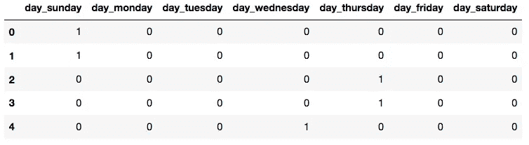
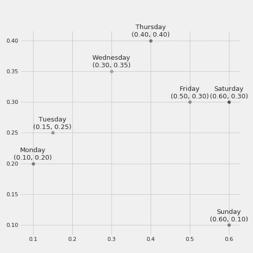
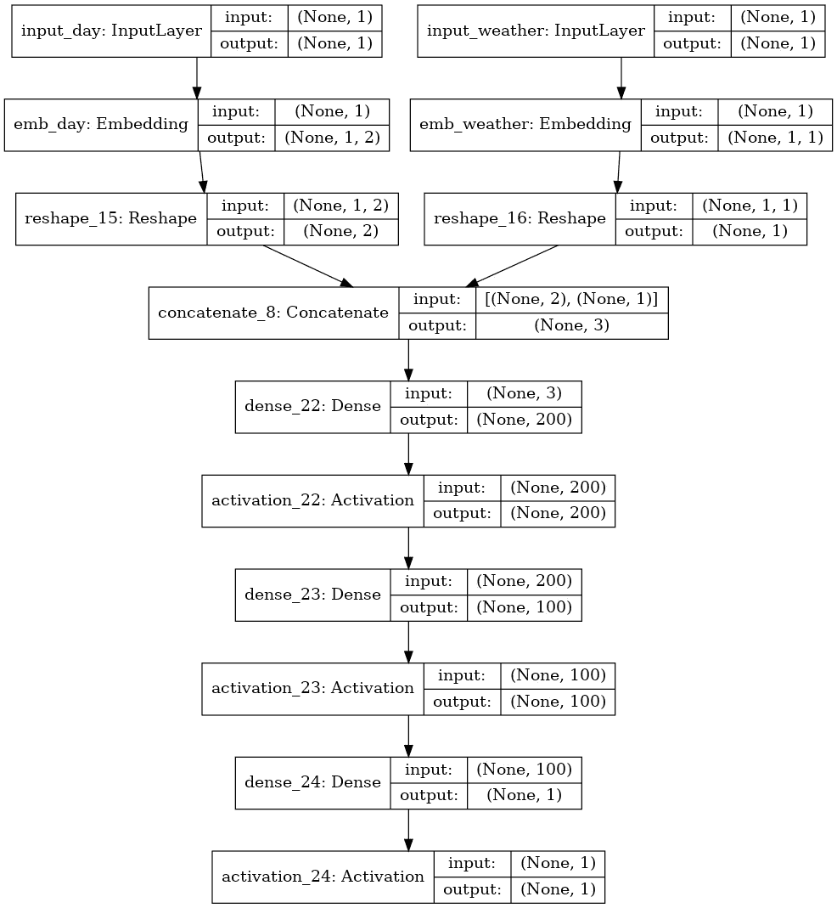
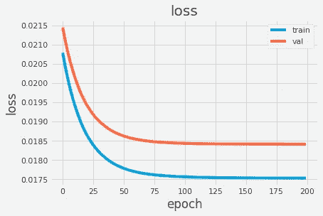
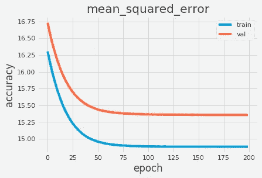

# 用实体嵌入增强分类特征

> 原文：<https://towardsdatascience.com/enhancing-categorical-features-with-entity-embeddings-e6850a5e34ff?source=collection_archive---------10----------------------->

## 首先，我们来谈谈卖啤酒

假设你是一家酒馆的老板，你想根据两个变量来预测你的店在某一天要卖多少啤酒:星期几和当前天气。我们可以在某种程度上想象，与一周开始和寒冷的日子相比，周末和温暖的日子会卖出更多的啤酒。

面对这个问题，我们通常首先将我们的分类数据(在这个例子中，星期几和天气)编码成虚拟变量，以便为我们的分类器提供输入，而在现有的分类值之间没有任何层次。

对于一周中的某一天功能，我们的数据如下所示(对于天气功能，您可以想象类似的情况):



但是这真的有意义吗，将每个分类值视为彼此完全不同，例如当使用一个热编码时？或者我们可以利用某种技术来“学习”每个可能值和我们的目标变量之间的关系和内在联系吗？

## 实体嵌入拯救

考虑到这个给定的场景，我们可以继续采用 NLP(自然语言处理)领域中众所周知的技术作为实体嵌入，这允许我们将给定的特征集映射到一个具有较少维数的新特征集中。在我们的例子中，它还允许我们从分类数据中提取有意义的信息。

实体嵌入的使用基于用分类数据训练神经网络的过程，目的是检索嵌入层的权重。与单一的热编码方法相比，这允许我们有更重要的输入。通过采用实体嵌入，我们还能够缓解两个主要问题:

*   不需要领域专家，一旦我们能够训练一个神经网络，它可以有效地学习模式和相同分类特征的值之间的关系。这导致避免了特征工程步骤(例如手动给一周中的每一天或每种天气赋予权重)；
*   计算资源的缩减，一旦我们不再用一次热编码来编码我们可能的分类值，这可能意味着巨大的资源使用。假设您有一个包含一万个可能唯一值的分类特征。这将转化为具有相同数量的空位置的特征向量，仅仅表示给定值。

## 实体嵌入的定义

嵌入层相当于一个神经网络层，它将具有相似输出值的分类值分组到一个 N 维空间中。这种空间表示允许我们获得每个分类值的内在属性，这可以在以后用作旧的虚拟编码变量的替代。如果我们以一种更简单的方式来考虑它，这将意味着一周中具有相似产量(在我们的例子中，是售出啤酒的数量)的日子将彼此接近。如果你不明白，也许一张图可以帮助你:



在这里，我们可以看到我们有四个主要组:组 1，周一和周二，可能与低销量的啤酒有关，因为这是一周的开始；第二组，周三和周四，与第一组有一段距离；第 3 组，星期五和星期六相对接近第 2 组，表明它们比第 1 组显示出更多的相似性；第四组是周日，与其他组相比没有太多相似之处。这个简单的例子可以向我们展示嵌入层可以从现实世界中学习信息，比如最常见的外出和喝酒的日子。很酷，不是吗？

## 把它和 Keras 放在一起

首先，我们需要知道，为了使用嵌入层，我们必须指定我们希望用于给定嵌入的维数。正如您所注意到的，这是一个超参数，应该逐个案例地进行测试和实验。但是作为一个经验法则，您可以采用维度的数量等于类别的唯一值的数量的平方根。所以在我们的例子中，我们对一周中某一天的表示不是七个不同的位置，而是三个位置(四舍五入)。下面我们给出了两个提到的特征的例子，并在我们的模型中添加了一些隐藏层，以便有更多的参数来捕捉细微的数据差异。

```
# Embedding layer for the 'Day of Week' feature
n_unique_day = df['Day'].nunique()
n_dim_day = int(sqrt(n_unique_day))input_week = Input(shape=(1, ))
output_week = Embedding(input_dim=n_unique_day, 
                        output_dim=n_dim_day, name="day")(input_week)
output_week = Reshape(target_shape=(n_dim_day, ))(output_week)# Embedding layer for the 'Weather' feature
n_unique_weather = df['Weather'].nunique()
n_dim_weather = int(sqrt(n_unique_weather))input_weather = Input(shape=(1, ))
output_weather = Embedding(input_dim=n_unique_weather, 
                           output_dim=n_dim_weather, 
                           name="weather")(input_weather)output_weather = Reshape(target_shape=(n_dim_weather,))(output_weather)input_layers = [input_week, input_weather]
output_layers = [output_week, output_weather]model = Concatenate()(output_layers)# Add a few hidden layers
model = Dense(200, kernel_initializer="uniform")(model)
model = Activation('relu')(model)model = Dense(100, kernel_initializer="uniform")(model)
model = Activation('relu')(model)# And finally our output layer
model = Dense(1)(model)
model = Activation('sigmoid')(model)# Put it all together and compile the model
model = KerasModel(inputs=input_layers, outputs=model)
model.summary()opt = SGD(lr=0.05)
model.compile(loss='mse', optimizer=opt, metrics=['mse'])
```

从图形上看，我们的神经网络将具有以下表示形式:



就是这样！我们可以看到，我们的架构最初由每个分类值的输入层组成，接着是嵌入层，然后是整形层。然后全部放在一起。最后，我们添加一些隐藏层来捕捉任何额外的信息。

以 0.05 的学习率训练我们的网络 200 个时期，我们可以看到损失和均方误差的一些相当好的结果:



## 结论

在这个简单的例子中，这听起来可能很傻，但是我们可以再次考虑我们的一万个唯一值的场景。当我们考虑计算资源时，一个具有一万个位置的特征向量(通过使用 One-Hot-Encoding)和另一个只有 100 个位置的特征向量(当使用实体嵌入时，通过经验法则测量)之间的差异是巨大的。这只是单个要素的单个记录的差异，但您可以想象这对于真实世界的数据集会变得多么复杂，类别有时会变得非常庞大。

如果你毫无疑问地达到了这一步，那么恭喜你！但是如果你有任何问题、建议或抱怨，请随时联系我。我还创建了一个 GitHub 存储库，其中包含一个库，可以帮助任何希望在自己的数据上执行实体嵌入的人，请随意查看:

[https://github . com/Rodrigo bressan/entity _ embeddings _ categorial](https://github.com/rodrigobressan/entity_embeddings_categorical)。

下次见，编码快乐！