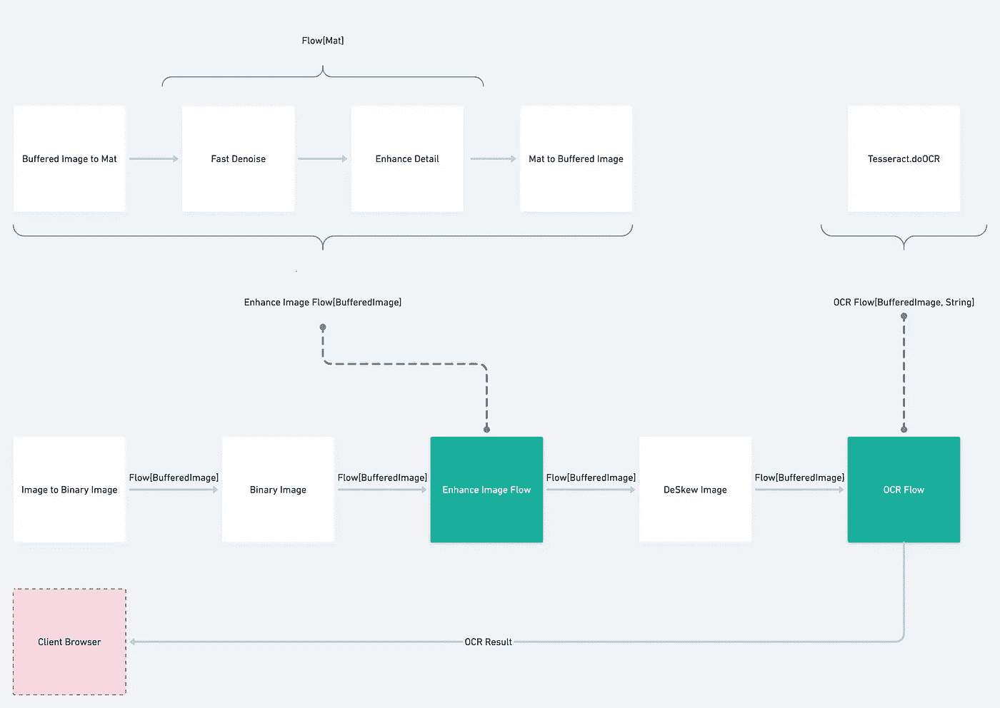
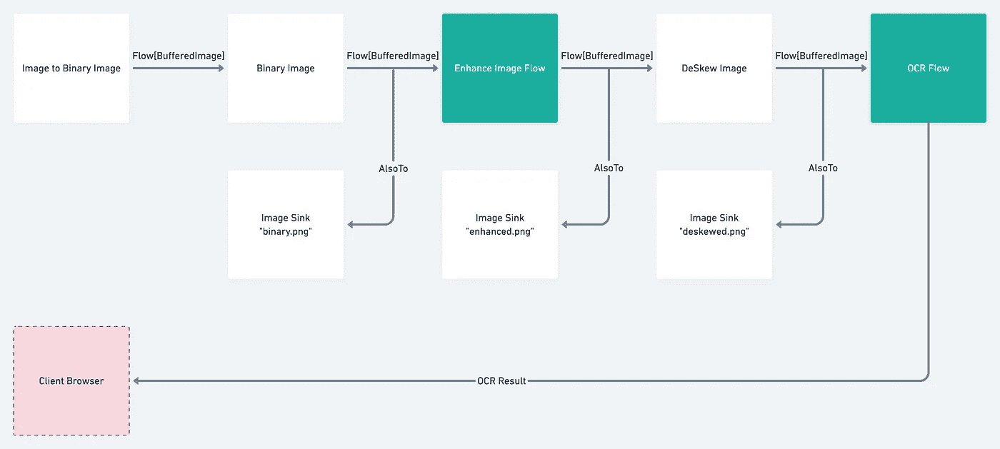
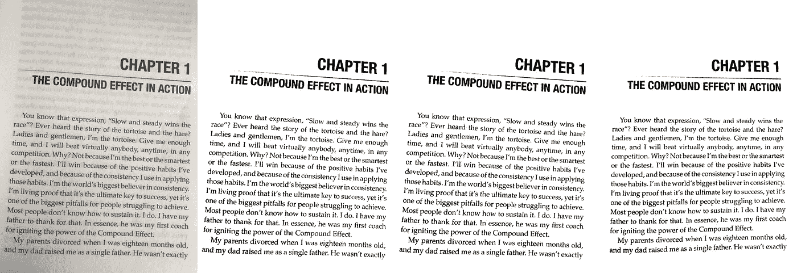
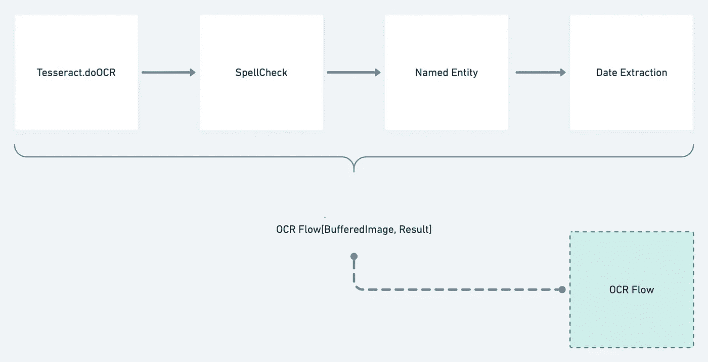
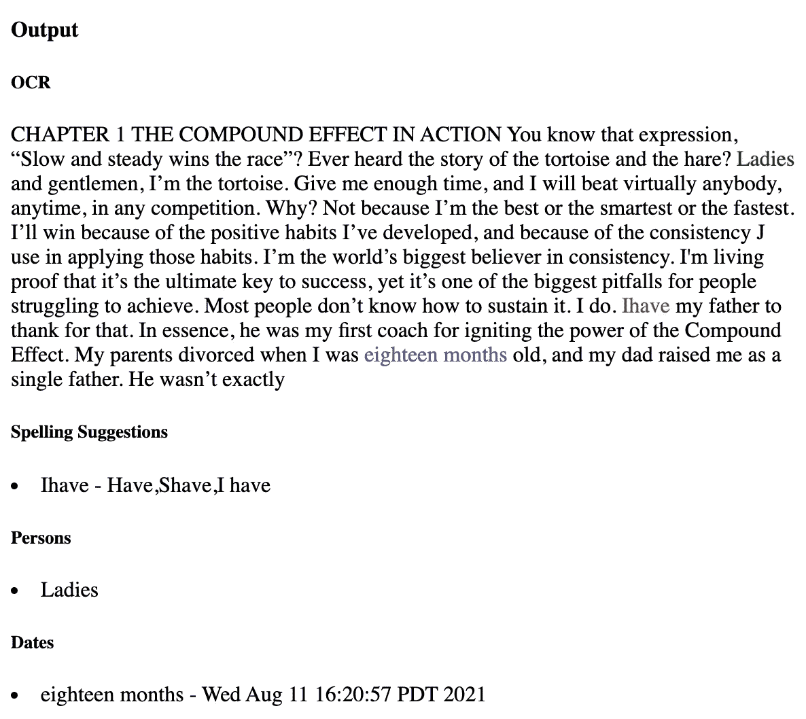
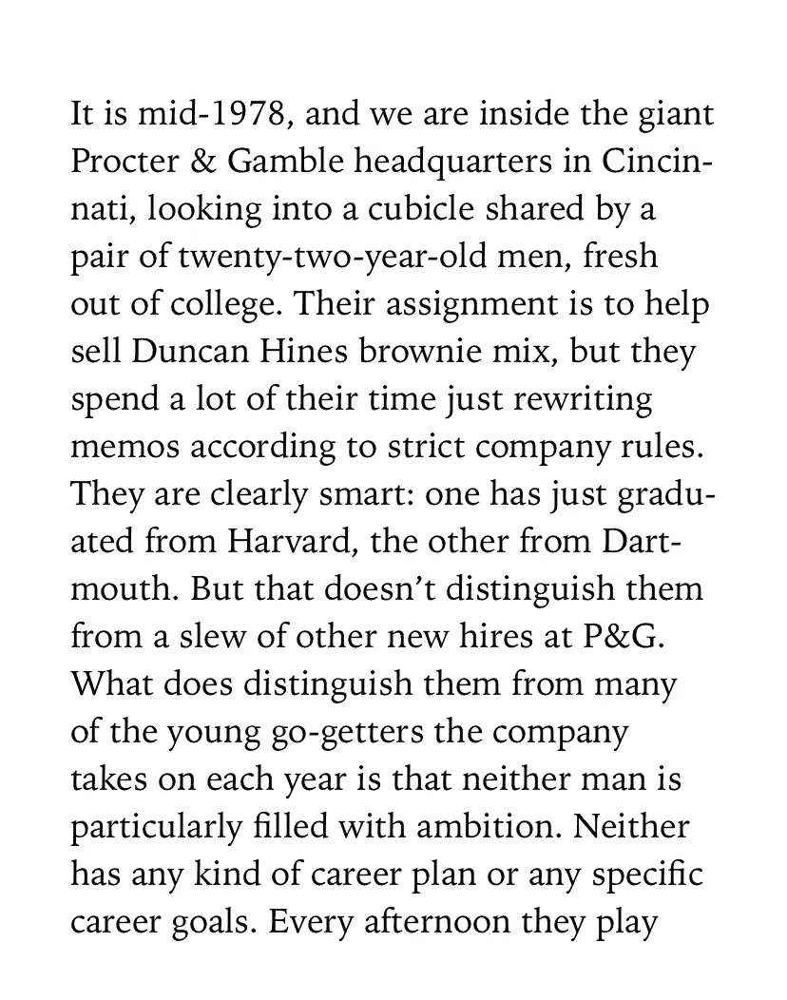
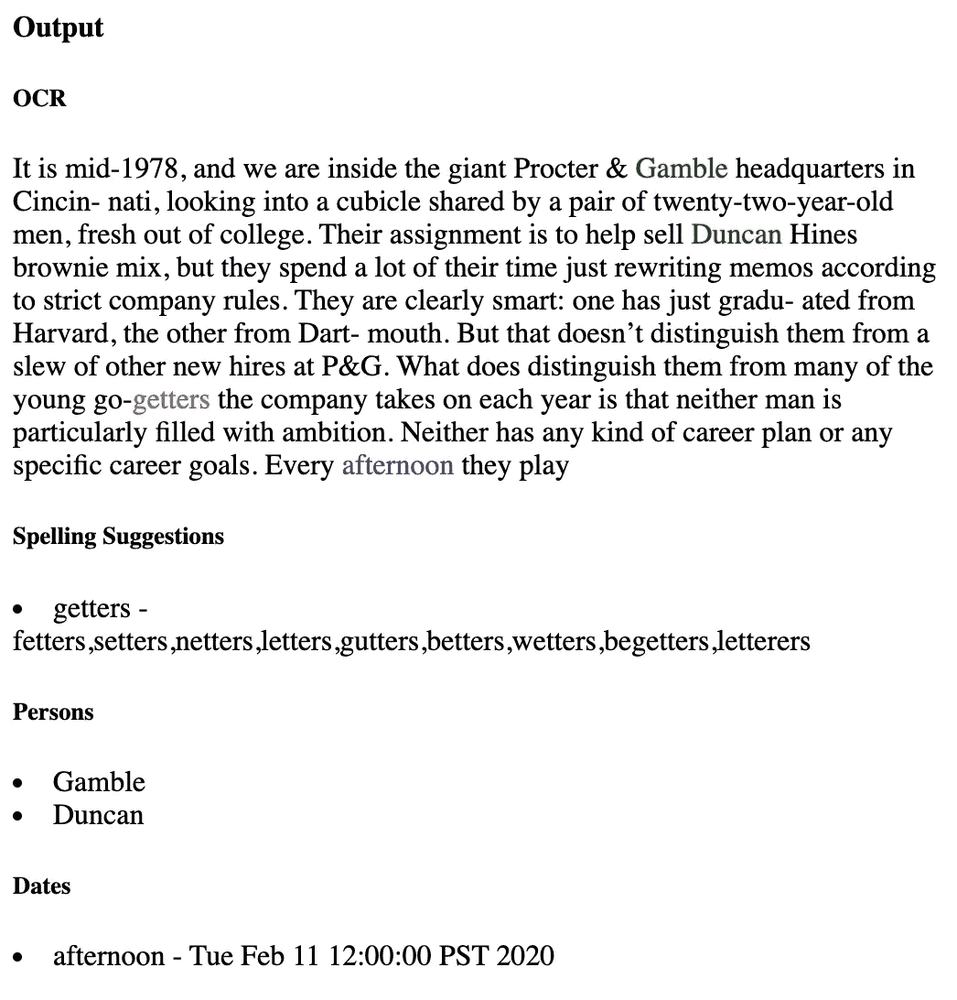

# 用 Akka 流丰富 OCR

> 原文：<https://towardsdatascience.com/enriching-ocr-with-akka-streams-7e48990be929?source=collection_archive---------26----------------------->


马丁·桑切斯在 [Unsplash](https://unsplash.com?utm_source=medium&utm_medium=referral) 上的照片

Tesseract 文档[列出了一些预处理步骤](https://github.com/tesseract-ocr/tesseract/wiki/ImproveQuality)以获得更好的 OCR 结果。由于我不知道如何执行这些步骤，所以我决定创建一个可插拔的流架构，以便在进行过程中添加它们。在 Akka Streams 世界中，这最终看起来像一个带有 sub `Flow[Mat]`的`Flow[BufferedImage]`——其中 [Mat 是一个 OpenCV 构造](https://docs.opencv.org/2.4/doc/tutorials/core/mat_the_basic_image_container/mat_the_basic_image_container.html)。然后将`BufferedImage`传递给宇宙魔方，宇宙魔方返回一个字符串。这就是我们在 [OCR 与 Akka、Tesseract 和 JavaCV](/ocr-with-akka-tesseract-and-javacv-part-1-702781fc73ca) 中讨论的内容。这篇文章着眼于获取 OCR 结果，并通过几个处理阶段来丰富它。



先前系统的图示

> 如果你想继续的话，所有的代码都已经在 Github Repo 中更新了！

> 理解这篇文章不需要[上一篇文章](/ocr-with-akka-tesseract-and-javacv-part-1-702781fc73ca)。它只是用来显示我们是如何得到 OCR 文本结果的。

# 快速洞察

以上给了我一些不错的结果，但如果能看到图像随着每个阶段的变化会更好。计划是连接一个`ImageSink`将图像写入文件。



当我们运行应用程序并上传样本文件时，我们可以在项目的根目录中看到预处理的 3 个不同阶段:



原始、二进制、增强、消除倾斜

从 Tesseract 的 OCR 过程返回的文本是:

```
CHAPTER 1 THE COMPOUND EFFECT IN ACTION You know that expression, “Slow and steady wins the race”? Ever heard the story of the tortoise and the hare? Ladies and gentlemen, I’m the tortoise. Give me enough time, and I will beat virtually anybody, anytime, in any competition. Why? Not because I’m the best or the smartest or the fastest. I’ll win because of the positive habits I’ve developed, and because of the consistency J use in applying those habits. I’m the world’s biggest believer in consistency. I'm living proof that it’s the ultimate key to success, yet it’s one of the biggest pitfalls for people struggling to achieve. Most people don’t know how to sustain it. I do. Ihave my father to thank for that. In essence, he was my first coach for igniting the power of the Compound Effect. My parents divorced when I was eighteen months old, and my dad raised me as a single father. He wasn’t exactly
```

通过扫描，我们可以看到两个错误，`consistency **J** use in applying`和`**Ihave** my father to thank`。不错的成绩！但是，让我们通过更多的处理阶段来运行 OCR 结果，从而变得更加智能；拼写检查、自然语言处理和日期提取。😎

# OCR 后处理

我们的 OCR 流程将变成:



新的 OCR 后处理阶段

## 拼写检查

首先，我们将添加一个拼写检查器。我在这里买了 100 本英语词典。我们可以将它们添加到我们的资源目录中，并创建这个拼写特征:

我们确保我们的主要对象扩展了这一特性:

```
object Main extends App with OCR with Spell
```

现在我们可以添加一个遵循`Flow[String]`协议的拼写检查方法。它删除换行符、大部分标点符号，并过滤拼写错误的单词。对于每个拼写错误的单词，我们会添加一个建议列表。

如果你运行 OCR 应用程序(`sbt run`)并上传一张图片，你会看到潜在的拼写错误和建议列表。对于上面的图像，我们得到以下结果:

```
{ 
   **"ocr"**:"...",
   **"suggestions"**:[
      {
         **"Ihave"**:["Have", "Shave", "I have"]
      }
   ]
}
```

## 命名实体识别

接下来，我们将添加一个阶段来尝试和识别命名实体，特别是人。对于 NLP，我们将按字符进行标记，但是让我们也添加一个句子模型。我们使用以下模型创建 NLP 特征:

我们的主要对象也扩展了 NLP…

```
object Main extends App with OCR with Spell with NLP
```

我们现在可以建造我们的提取者`Flow`。注意，这个流接收一个类型的`OcrSuggestions`，输出一个`OcrSuggestionsPersons`类型。该类型与`OcrSuggestions`相同，但也包含一个“Persons”字符串列表。

我们已经构建了 3 个附加流中的 2 个，最后需要添加一些数据提取:


## 日期提取

从文本中提取日期有许多选择。我决定使用 [Natty](http://natty.joestelmach.com/) ，但对试用 diggamma . ia 的 [timeextractor 很感兴趣。](https://github.com/digamma-ai/timeextractor)

我决定使用 OpenNLP 将 Tesseract 返回的整个文本拆分成句子，然后将这些句子传递给 Natty。让我们来看看我们简单整洁的特点:

我们和我们的主要目标结合得很好

```
object Main extends App with OCR with Spell with NLP with Natty
```

然后我们可以构建一个`Flow`，它接受一个`OcrSuggestionsPersons`类型并输出一个`OcrSuggestionsPersonsDates`类型:

我们现在已经完成了 OCR 流程！


最终 OCR 流程

我们对上图的最新回应是:

```
{ **"suggestions"**:[{
      **"Ihave"**:["Have", "Shave", "I have"]
   }],
   **"persons"**:["Ladies"],
   **"dates"**:[[
       ["Wed Aug 11 16:20:57 PDT 2021"],
        "eighteen months"
   ]]}
```

我们可以看到，Natty 将“十八个月”解析为“从现在起十八个月”NLP 将“女士”标记为人称代词。我们可以争论这些元数据有多有用，但最终它比我们以前拥有的数据更多。

如果你上传一张图片，同时我们的应用程序的网页在 [http://localhost:8080，](http://localhost:8080,)运行，你会看到我高亮显示的各种结果的 HTML:



让我们尝试不同的图像…



如果你能说出这本书的名字，加分:)

这会产生以下内容作为 JSON 响应的一部分:

```
**"persons"**:["Gamble","Duncan"],
**"dates"**:[["Tue Feb 11 12:00:00 PST 2020"], "afternoon"]
```

我们的简单网页上的输出如下:



OpenNLP 决定将“Duncan”和“Gamble”标记为 people，Hunspell 将“go-getters”标记为潜在的拼写错误，Natty 决定“午后”是 2020 年 2 月 11 日这一天的午后。

😎希望你喜欢这第二个帖子！和往常一样，所有代码都在 [Github Repo](https://github.com/duanebester/streaming-ocr) 中进行了更新。