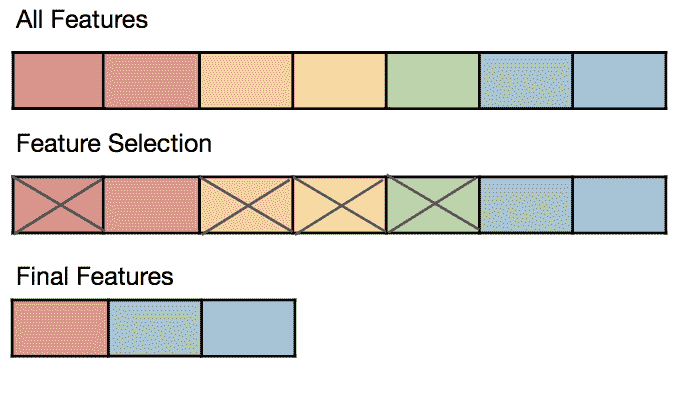
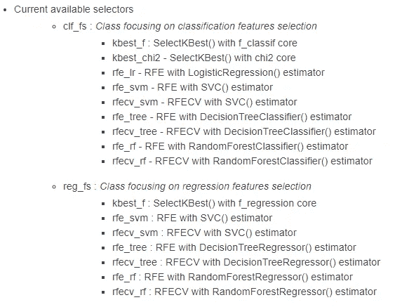
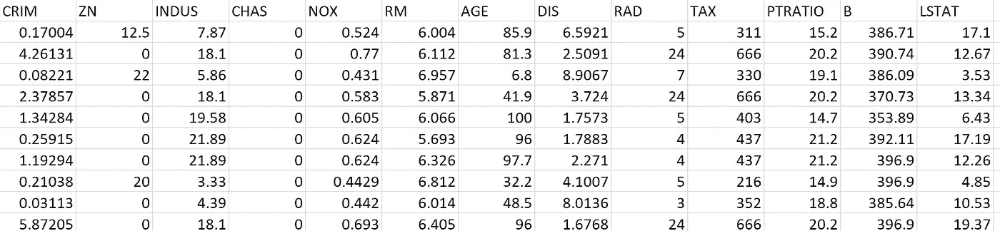
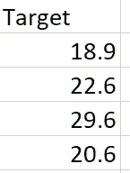

# 基于 OptimalFlow 的机器学习集成特征选择

> 原文：<https://towardsdatascience.com/ensemble-feature-selection-in-machine-learning-by-optimalflow-49f6ee0d52eb?source=collection_archive---------41----------------------->

## 用简单的代码选择顶级特性的简单方法



特征选择是机器学习工作流的关键部分。特征选择的好坏直接关系到模型的性能。数据科学家通常会遇到两个难题:

*   哪种特征选择算法比较好？
*   需要保留输入数据集中的多少列？

因此，我编写了一个名为 ***OptimalFlow*** 的 Python 库，其中包含一个集合特征选择模块，名为 ***autoFS*** 以轻松简化这一过程。

***OptimalFlow*** 是一个 Omni-ensemble 自动化机器学习工具包，它基于*流水线簇遍历实验(PCTE)* 方法，帮助数据科学家以简单的方式构建最优模型，并使用简单的代码自动化机器学习工作流。

为什么我们使用 ***OptimalFlow*** ？你可以读另一个关于它的介绍的故事:[*一个全方位的自动化机器学习——optimal flow*](/an-omni-ensemble-automated-machine-learning-optimalflow-369d6485e453)。


*autoFS* 模块将通过流行的特征选择算法(选择器)，如 kBest、RFE 等。并且选择从它们的输出中选择的多数特征作为最重要的特征。以下是 [*autoFS*](https://optimal-flow.readthedocs.io/en/latest/autoFS.html) 模块和默认选择器的详细链接:



您可以阅读*optimal flow***optimal flow****autoFS*模块的 [**文档。此外， ***OptimalFlow*** 还提供了特征预处理、模型选择、模型评估、*流水线簇遍历实验(PCTE)* 自动化机器学习模块。**](https://optimal-flow.readthedocs.io/en/latest/index.html)*

**

*这里我们将有一个演示，使用 ***OptimalFLow*** ，在几分钟内完成一个回归问题的特征选择。我们使用经典的波士顿住房数据集作为输入。*

***第一步:安装 *OptimalFlow* :***

```
*pip install optimalflow*
```

***第二步:导入 *OptimalFlow* 模块:***

```
*import pandas as pd
from optimalflow.autoFS import dynaFS_reg*
```

***第三步:导入输入数据集:***

```
*tr_features = pd.read_csv('./data/regression/train_features.csv')
tr_labels = pd.read_csv('./data/regression/train_labels.csv')*
```

*我们使用波士顿住房数据集作为输入文件，它有 506 行和 14 列。你可以在这里找到关于它的细节[。](https://www.kaggle.com/c/boston-housing)*

**

*波士顿住房数据集 train _ features.csv*

**

*波士顿住房数据集 train _ labels.csv*

***第四步:运行 *autoFS* 模块:***

*我们希望为进一步的建模过程提供前 5 个重要特征。我们使用的是 *autoFS 的*默认选择器，但是你也可以通过它的 **custom_selectors** 属性自定义设置你只想通过的选择器。*

```
**# Set input_form_file = False, when label values are array. Select 'True' from Pandas dataframe.*

reg_fs_demo **=** dynaFS_reg**(** fs_num **=** **5,**random_state **=** **13,**cv **=** **5,**input_from_file **=** True**)**

*# You can find details of each selector's choice in autoFS_logxxxxx.log file in the ./test folder*

reg_fs_demo**.**fit**(**tr_features**,**tr_labels**)***
```

*一切就绪！以下是输出结果:*

```
******optimalflow***** autoFS Module **===>** Selector kbest_f gets outputs**:** **[**'INDUS'**,** 'NOX'**,** 'RM'**,** 'PTRATIO'**,** 'LSTAT'**]**
Progress**:** **[***###-----------------] 14.3%*

*****optimalflow***** autoFS Module **===>** Selector rfe_svm gets outputs**:** **[**'CHAS'**,** 'NOX'**,** 'RM'**,** 'PTRATIO'**,** 'LSTAT'**]**
Progress**:** **[***######--------------] 28.6%*

*****optimalflow***** autoFS Module **===>** Selector rfe_tree gets outputs**:** **[**'CRIM'**,** 'RM'**,** 'DIS'**,** 'TAX'**,** 'LSTAT'**]**
Progress**:** **[***#########-----------] 42.9%*

*****optimalflow***** autoFS Module **===>** Selector rfe_rf gets outputs**:** **[**'CRIM'**,** 'RM'**,** 'DIS'**,** 'PTRATIO'**,** 'LSTAT'**]**
Progress**:** **[***###########---------] 57.1%*

*****optimalflow***** autoFS Module **===>** Selector rfecv_svm gets outputs**:** **[**'CRIM'**,** 'ZN'**,** 'INDUS'**,** 'CHAS'**,** 'NOX'**,** 'RM'**,** 'AGE'**,** 'DIS'**,** 'RAD'**,** 'TAX'**,** 'PTRATIO'**,** 'B'**,** 'LSTAT'**]**
Progress**:** **[***##############------] 71.4%*

*****optimalflow***** autoFS Module **===>** Selector rfecv_tree gets outputs**:** **[**'CRIM'**,** 'CHAS'**,** 'NOX'**,** 'RM'**,** 'AGE'**,** 'DIS'**,** 'TAX'**,** 'PTRATIO'**,** 'B'**,** 'LSTAT'**]**
Progress**:** **[***#################---] 85.7%*

*****optimalflow***** autoFS Module **===>** Selector rfecv_rf gets outputs**:** **[**'CRIM'**,** 'ZN'**,** 'NOX'**,** 'RM'**,** 'AGE'**,** 'DIS'**,** 'RAD'**,** 'TAX'**,** 'PTRATIO'**,** 'B'**,** 'LSTAT'**]**
Progress**:** **[***####################] 100.0%*

The optimalflow autoFS identify the top **5** important features **for** regression are**:** **[**'RM'**,** 'LSTAT'**,** 'PTRATIO'**,** 'NOX'**,** 'CRIM'**].***
```

*您会发现['RM '，' LSTAT '，' PTRATIO '，' NOX '，' CRIM']列是为我们选择的五大功能 *autoFS* ！简单容易，对吧？*

*关于 ***OptimalFlow*** 的相关阅读:*

> *[集成模型选择&使用 OptimalFlow 在机器学习中进行评估——使用简单代码选择最佳模型的简单方法](/ensemble-model-selection-evaluation-in-machine-learning-by-optimalflow-9e5126308f12)*
> 
> *[端到端 OptimalFlow 自动化机器学习教程结合真实项目-公式 E 圈数预测第 1 部分](/end-to-end-optimalflow-automated-machine-learning-tutorial-with-real-projects-formula-e-laps-8b57073a7b50)*
> 
> *[端到端 OptimalFlow 自动化机器学习教程结合真实项目——公式 E 圈数预测第二部分](/end-to-end-optimalflow-automated-machine-learning-tutorial-with-real-projects-formula-e-laps-31d810539102)*
> 
> *[用 OptimalFlow Web App 建立无代码自动机器学习模型](/build-no-code-automated-machine-learning-model-with-optimalflow-web-app-8acaad8262b1)*

# *关于我:*

*我是一名医疗保健和制药数据科学家以及大数据分析和人工智能爱好者。我开发了 ***OptimalFlow*** 库，帮助数据科学家以简单的方式构建最优模型，用简单的代码实现机器学习工作流程的自动化。*

*作为一名拥有多年分析经验的大数据洞察寻求者、流程优化者和人工智能专家，我使用数据科学中的机器学习和问题解决技能将数据转化为可操作的洞察，同时提供战略和量化产品作为最佳结果的解决方案。*

*你可以在我的 [LinkedIn](https://www.linkedin.com/in/lei-tony-dong/) 或者 [GitHub](https://github.com/tonyleidong) 上和我联系。*