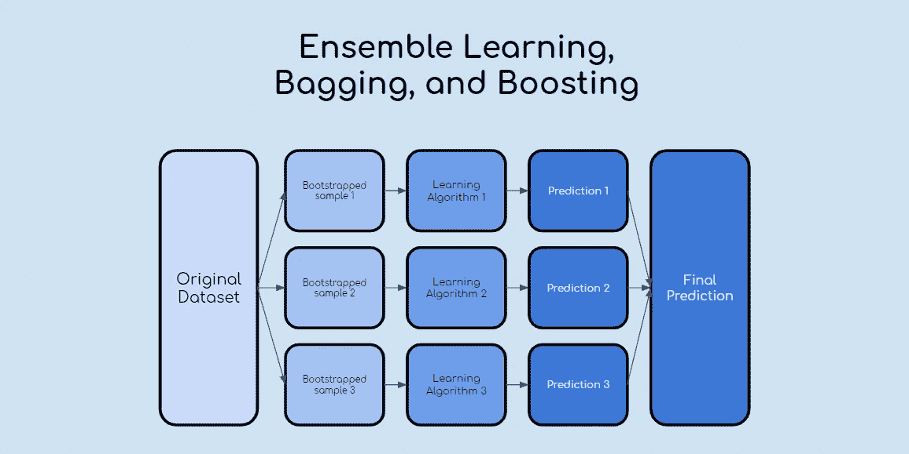
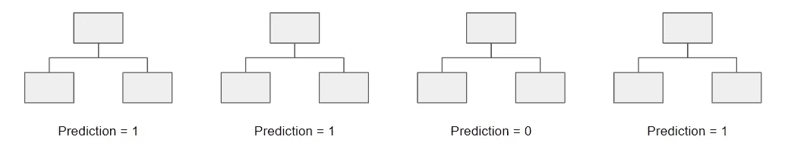
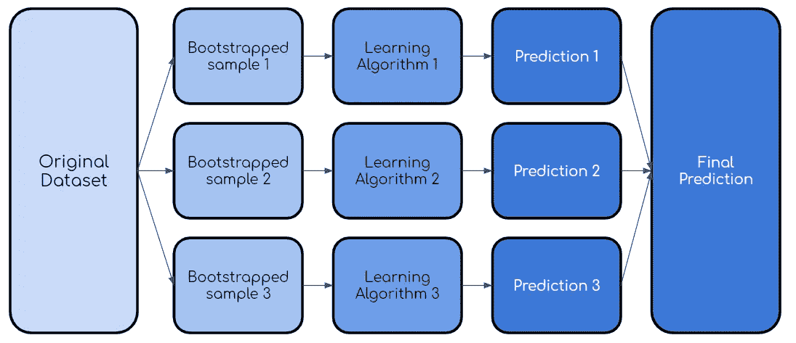

# 在 3 分钟内解释集成学习、打包和增强

> 原文：<https://towardsdatascience.com/ensemble-learning-bagging-and-boosting-explained-in-3-minutes-2e6d2240ae21?source=collection_archive---------18----------------------->

## 直观的解释和揭开基本概念的神秘面纱

作者创建的图像

> **请务必在此** [**订阅**](https://terenceshin.medium.com/membership) **或我的** [**个人简讯**](https://terenceshin.substack.com/embed) **千万不要错过另一篇关于数据科学指南、技巧和提示、生活经验等的文章！**

在之前的另一篇文章中，我解释了什么是 **bootstrap sampling** 以及它为什么有用。如果你不知道什么是 bootstrap 抽样，我建议你[看看我写的关于 bootstrap 抽样的文章](/what-is-bootstrap-sampling-in-machine-learning-and-why-is-it-important-a5bb90cbd89a?source=friends_link&sk=21cdc68c9bd7c9433efd50a1b9c42255)，因为这篇文章将建立在它的基础上！

当您开始数据科学之旅时，您肯定会听说“集成学习”、“打包”和“助推”。因为我没有任何指导或方向，我花了一段时间才明白装袋和助推实际上是什么意思。因此，我的目标是尽可能简单直观地解释这些术语！

# 什么是集成学习？

**集成学习**是一种多种学习算法联合使用的方法。这样做的目的是让您获得比单独使用单个算法更高的预测性能。

## 例 1:“三个臭皮匠胜过一个诸葛亮”

作者创建的图像

一种简单的思考方式是，如果一个人在解决一个数学问题，而一群人在解决一个数学问题。如果一个人解决了错误的问题，他/她将没有其他人来检查他/她的答案。另一方面，这群人可以协作解决，互相寻找对方的错误，并对最终答案进行投票。

## 示例 2:随机森林

随机森林是一种基于决策树的集成学习技术。随机森林涉及使用原始数据的自举数据集创建多个决策树。然后，该模型选择每个决策树的所有预测的模式(大多数)。这有什么意义？依靠“多数获胜”模型，它降低了单个树出错的风险。

例如，如果我们创建一个决策树，第三个，它会预测 0。但是如果我们依赖所有 4 个决策树的模式，预测值将是 1。这就是集成学习的力量！

现在你知道什么是集成学习，让我们来介绍两种流行的集成方法:bagging 和 boosting。

> **请务必在此** [**订阅**](https://terenceshin.medium.com/membership) **或我的** [**个人简讯**](https://terenceshin.substack.com/embed) **千万不要错过另一篇关于数据科学指南、技巧和提示、生活经验等的文章！**

# 什么是装袋？

**Bagging** 又称 **bootstrap aggregating** ，是用原始数据集的自举样本对同一学习算法的多个模型进行训练的过程。然后，像上面的随机森林示例一样，对所有模型的输出进行投票。

装袋过程

# 什么是助推？

Boosting 是 bagging 的一种变体，其中每个单独的模型都是按顺序构建的，并迭代上一个模型。具体来说，任何被前一个模型错误分类的数据点都会在后一个模型中得到强调。这样做是为了提高模型的整体准确性。这里有一个图表，可以更好地理解这个过程:

一旦建立了第一模型，除了第二自举样本之外，还采用错误分类/预测的点来训练第二模型。然后，针对测试数据集使用集合模型(模型 1 和 2 ),并且该过程继续。

而这就是合奏学习的精髓，装袋，助推！

# 感谢阅读！

如果你想学习更多的机器学习基础知识，了解我的最新内容，你可以在这里[学习。](https://docs.google.com/document/d/1UV6pvCi9du37cYAcKNtuj-2rkCfbt7kBJieYhSRuwHw/edit#heading=h.8dxlgh60ooti)

## 特伦斯·申

*   *查看* [*我的免费数据科学资源*](https://docs.google.com/document/d/1UV6pvCi9du37cYAcKNtuj-2rkCfbt7kBJieYhSRuwHw/edit#heading=h.m63uwvt9w358) *每周都有新素材！*
*   *如果你喜欢这个，* [*在 Medium 上关注我*](https://medium.com/@terenceshin) *了解更多*
*   *我们来连线上*[*LinkedIn*](https://www.linkedin.com/in/terenceshin/)