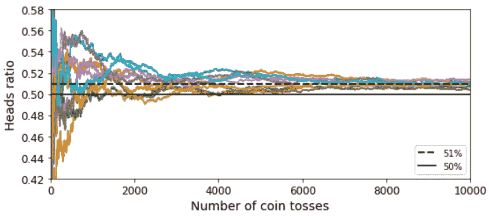
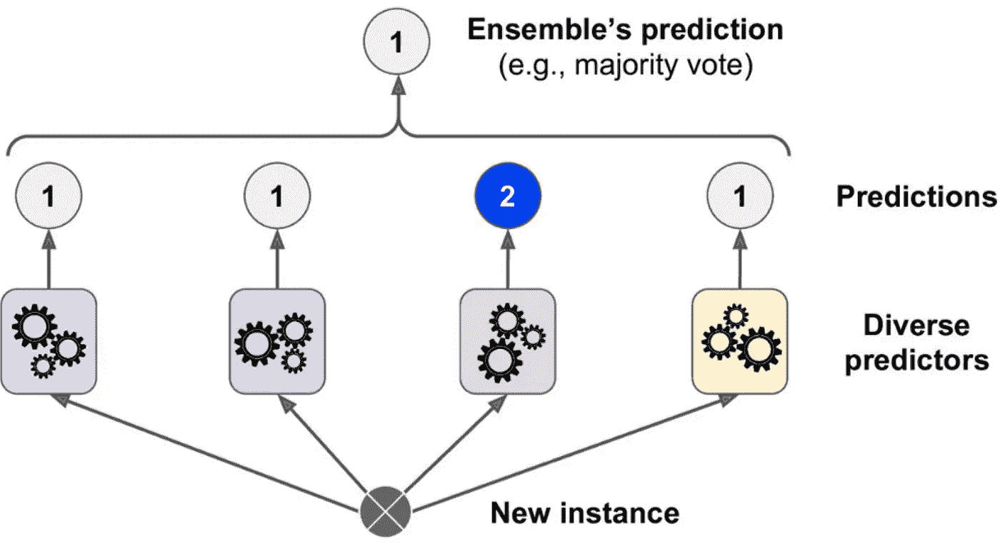
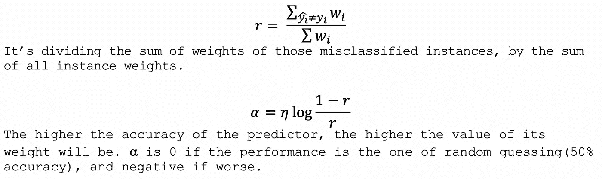
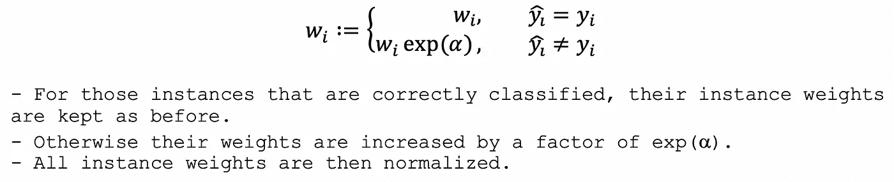
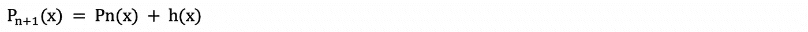
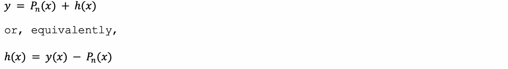
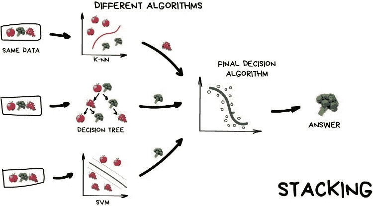

# 从零开始的集成学习

> 原文：<https://towardsdatascience.com/ensemble-learning-from-scratch-20672123e6ca?source=collection_archive---------28----------------------->

## 引入集成学习，这是一种通过组合训练好的模型来提高性能的强大工具。


图片来自[来源](https://www.technologyreview.com/s/615102/tree-planting-is-a-great-idea-that-could-become-a-dangerous-climate-distraction/)。

对于许多数据科学和应用机器学习的初学者来说，找到符合手头数据的**最佳模型**通常意味着尝试尽可能多的合理选项，**保留最佳模型，而其余的则被丢弃**。集成学习提供了一种替代方案，即通过**所有经过训练的模型**形成一个集成，其性能可以与最好的模型一样好，**如果不是更好**！

集成学习力量的一个合法代表是**随机森林**，在本文中，我们将揭示一些可以用来建立集成模型的**方法**，并直观地解释其背后的**原理**。

本文的结构遵循 ***第 7 章***-**-*集成学习与随机森林*** ，出自 ***用 Scikit-Learn 的动手机器学习，Keras 和 TensorFlow，第 2 版，*作者 *Aurélien Géron (O'Reilly)。***

## 大数定律

> “三个臭皮匠，顶个诸葛亮”

当我第一次看到**大数定律**时，我在学校里学到的这句古老的中文谚语突然出现在我的脑海里。它解释了被称为**群众的智慧**——**一大群人的集体智慧可能比一个专家的智慧更好。**

集成学习通过组合**独立的**模型(称为**预测器**)来应用该定理，以形成**强学习器**(实现高精度)。它甚至在所有预测者都是**弱学习者**时也能工作(表现仅比**随机猜测**稍好)。



*“用 Scikit-Learn、Keras 和 TensorFlow 实践机器学习，第二版，作者 Aurélien Géron (O'Reilly)。”，第七章。*

但是为什么会这样呢？**群众的智慧**可能听起来很“聪明”，但它仍然有点**违反直觉**。为了回答这个问题，下面的类比可能有助于揭示这个秘密:假设你投掷一枚**略有偏差的硬币**，有 51%的机会正面朝上。如果你做 100 次，不太可能会有**正好** 51 个头，甚至有可能你最后没有**多数个头**。但随着你不断折腾，你会观察到人头的**比** **会越来越接近 **51%** 。您进行的试验越多，平均****值**就越接近预期****值**，获得多数人头**的概率就越大。****

**集成学习在本质上做着同样的事情——弱学习者在分类任务中只有微小的机会预测正确的类别，但是如果我们使用许多独立的预测器做出同样的预测，聚集的结果将更有可能预测正确的类别。**

**集合模型的输出是**关于**分类**任务时最频繁的预测**。对于一个**回归**任务，使用**平均值**代替。**

## **集成方法**

**训练一个集成时的关键要素是，它的所有分类器必须完全独立，这可以通过使用不同的算法来实现，或者使用相同的算法，但在训练集的不同子集上进行训练。在这里，我们探索这两种方法来构建集成分类器。**

****

***“用 Scikit-Learn，Keras & TensorFlow 进行动手机器学习”，第 7 章。***

## **1.投票分类器**

**训练不同的预测器算法以形成集成被称为**投票分类器**，其机制很简单——一组不同的算法在同一个**训练集**上训练，当进行预测时，集成的输出被**聚集**，取最多**投票的类别**作为集成的预测。**

**当通过每个预测器的**输出类**进行聚合时，称为**硬投票**，当使用**输出概率**时，称为**软投票**。软投票通常表现更好，因为它捕捉了更多的**细微差别**(逻辑上它要求所有的预测器都能够输出概率)。**

## **2.装袋和粘贴**

**另一方面，代替训练不同的算法来实现**多样性**，一个替代方案是使用相同类型的预测器，但是在训练集的不同**随机采样子集**上进行训练。**

****装袋**和**粘贴**是对这些子集进行抽样的两种不同方式，它们的区别在于有无替换的抽样**。****

**当通过**打包**(带替换)进行采样时，随机**选择一个实例**并立即将其返回给训练集，因此在每次选择时，源数据仍具有其所有实例，并且可以再次**选择相同的实例**。**粘贴**反过来，**同一个实例不能在同一个子集中出现超过一次**。**

**对于打包和粘贴，同一个实例可以出现在不同的子集中，但是只有**打包**允许**同一个实例**在同一个子集**中出现两次或更多次**。由于所有子集都具有相同大小的**，具有替换的采样**可以实现更多的**子集多样性**，并且它们对应的预测器将更少**相关**。这种方法的另一个优点是，每个预测器都有不在它们的训练子集中的实例，它们可以直接用于**验证**，而不必保存验证数据。******

****随机森林**是集成学习器家族的著名成员，它由一组在不同子集**采样** **到** **打包**上训练的**决策** **树**(与训练集大小相同)。当分割给定的**节点**时，所使用的**特征**是从随机生成的**特征子空间**中选择的最合适的一个，而不是从所有可用特征的空间中选择的。**多余的** **树**，各种随机森林，更进一步——不仅特征来自随机选择的子空间，而且使用的**阈值**也是**随机生成的****。****

## ****3.增强——连续训练****

******增强**使用与之前相同的****预测器**用于集合，但不是在**并行**中采样**不同的** **子集**和训练预测器，而是顺序**完成**，每个预测器试图**纠正**其**前任**的错误。******

****再来看看 **AdaBoost** 和**渐变提升**。****

******— AdaBoost******

****当对集合中给定的预测器进行训练时，算法**对**实例权重**进行重新加权，使得**错误分类的**实例能够从下一个预测器获得更多的 ***关注*** ，并且有希望将其正确分类。实例权重定义了实例被选择为子集的一部分的机会-给定实例的实例权重**越高，**越多，** **可能**它会在采样时出现在子集中。********

```
AdaBoost Algorithm:1\. Set the initial **instance weights**(w)to *1/m*, with *m* being the number of training instances in the training set.2\. Compute the **predictor weight**(⍺) of the current predictor using its **weighted error rate**(r).
```



```
3\. To train the next predictor, the instance weights are updated.
```



```
4\. Finally, a new predictor is trained using the updated weights, steps 2 to 4 are repeated until the number of predictors is reached or a perfect predictor is found.
```

在推断时间期间，集合的预测是其输出的**加权** **平均值**。使用的**权重**是步骤 2 中的**预测权重**。作为随机猜测的，预测器是执行**更好**、**更差**还是**确切地说** **决定了其对集合预测的**贡献的**类型:**


**—梯度增强**

**梯度** **增强**处理训练**迭代**作为 AdaBoost，但是每个预测器不是调整实例权重，而是通过拟合其**残差** **误差**来校正其前任。

但是为什么要拟合残差呢？假设我们正在用 ***N*** 预测器*训练一个集成模型。*对于每个预测器 **P *n*** ，****1<N<N***，我们假设它是**不完美的**，它的性能可以通过**增加**一个估计器 ***h*** 来改善:*

**

*现在，为了找到 ***h*** ，我们先来看看一个完美的 ***h*** 应该是怎样的:*

**

*一个完美的估计器*将**填充******目标*和当前预测***【Pn(x)***之间的****。本质上，它试图通过插入一个额外的预测器来使**最小化**一个**成本** **功能**。*****

## ****4.立桩标界****

********

****图片来自[来源](https://i.pinimg.com/originals/ed/d8/87/edd8873400deea9625ee67b37377d077.jpg)。****

****完成拼图的最后一块是**立桩**。如果我们**训练** **一个** **模型**来为我们做这件事，而不是使用一个给定的函数来处理预测器的输出，会不会**增加** **的准确性**？答案是**是的**。这些模型通常被称为**混音器**，它们可以找到方法**校正**和**组合**合奏的输出，以实现**增强的** **性能**。****

****训练搅拌机的常见方法是首先将训练数据分成**训练集**和**保持集**。第一种用于训练预测器，采用任何上述方法。然后，坚持组用于训练**搅拌机**。当预测器被训练时，我们将它们的预测放在保留集上，并将其用作**混合器的输入**。如果集合中有 ***N* 个预测值**，那么混合器将在一个***N***维数据加上原始目标上被训练。****

****当完成训练时，混合器被期望获得集合的输出，并且以最大化整体模型的准确性的方式' ***混合*** '它们。****

## ****最后的话****

****你已经坚持到最后了！我希望你能愉快地阅读这篇文章，也希望你能对**合奏** **学习**有所了解。这是一个强大的工具，关于它的写作帮助我巩固了对这个话题的许多理解。它仅仅触及了集成学习的基础理论的表面，并且没有给出实际的**实现**。我强烈推荐浏览 [***这篇文章***](https://machinelearningmastery.com/super-learner-ensemble-in-python/) 来自 ***机器学习掌握*** ，它带你浏览如何从**开始构建一个**超级工薪族合奏**(堆叠)**！****