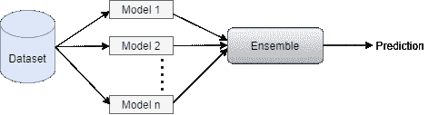

# 集成学习技术

> 原文：<https://towardsdatascience.com/ensemble-learning-techniques-6346db0c6ef8?source=collection_archive---------32----------------------->

## 合奏可以让事情变得简单


图片来源:pixabay

当你在读这篇关于集成学习的文章时，我希望你至少熟悉一些机器学习模型及其实现。当我们在任何数据集上训练 ML 模型时，我们都面临着称为偏差和方差的错误同伴。大多数时候，要么我们没有得到令人满意的精度结果，要么数据过度拟合到模型中。然后我们再次调整数据，创建/删除特征，重新训练模型，这个过程可以重复几次。在接下来的几节中，我将解释什么是集成学习，它如何与偏差和方差相关，以及什么是集成学习的技术。

**什么是集成学习？**

集成学习是一个过程，其中多个基本模型(最常被称为“弱学习者”)被组合和训练来解决同一问题。该方法基于这样的概念，弱学习者单独执行任务很差，但是当与其他弱学习者结合时，他们形成强学习者，并且这些集成模型产生更准确的结果。

这就是集成学习方法在许多在线比赛中最常被信任的原因。



> 集成学习是一种结合多种机器学习算法来产生一个最佳预测模型的技术，该模型具有降低的方差(使用 bagging)、偏差(使用 boosting)和改进的预测(使用 stacking)。

**带有偏差和方差的集成学习关系**

最大似然模型的预测误差是下列各项之和

**1。偏差误差** —偏差是模型预测结果与实际结果之间的差异。高偏差意味着模型拟合不足。因此，我们必须使用更复杂的模型。

**2。方差误差** —方差是模型对训练数据中微小波动的敏感度。高方差意味着模型过度拟合。因此，我们必须获得更多的训练数据(如果训练数据较少)或使用不太复杂的模型(如果该模型的数据简单)

**3。噪声**通常被称为不可约误差


> 以平衡的方式管理偏差和方差是集成学习的核心，这可以通过使用多种模型(简单和复杂模型的混合)并在不欠拟合或过拟合数据的情况下组合它们来完成。

**简单的集成学习方法**

基于投票和平均的集成方法是非常简单和最容易的集成学习形式。投票用于分类问题，平均用于回归问题。

1.  **平均**

顾名思义，在这种技术中，我们取所有模型预测的平均值。

**例如**，*如果我们预测房价，如果有 3 个基础模型预测房价为 45 万，50 万，55 万。对于平均，我们取平均值为(450000+500000+550000)/ 3 = 500000，这是最终预测*。

让我们看看代码:

现在，为了证明集成(或平均预测)是否比基础模型做得更好，我们将比较基础模型和最终模型的平均绝对误差。

```
Average Ensembler Mean Absolute Error: 0.48709255488962744
KNN Mean Absolute Error: 0.5220880505643672
Lasso Mean Absolute Error: 0.7568088178180192
SVR Mean Absolute Error: 0.5015218832952784
```

集成模型的平均绝对误差远小于单个模型。

**2。最大投票分类器**

最大投票与平均投票非常相似，唯一的区别是它用于分类问题。在这种技术中，来自多个模型的预测被收集(这通常被称为投票),并且来自大多数模型的预测被认为是最终预测。

**例如，** *如果从多个模型得到的一组最终房价预测值分别为— 50 万、45 万、60 万、45 万、65 万、45 万、60 万。然后使用最大投票分类器，最终预测将是 450000。*

```
Max Voted Ensembler Accuracy: 72.0
KNN Accuracy: 67.2
Logistic Regression Accuracy: 74.4
SVC Accuracy: 70.39999999999999
```

Sklearn 库有一个用于 Max Voting 的类，叫做 VotingClassifier，你可以在这里传递分类器列表，它会选择 max voted 预测。让我们看看代码-

```
Sklearn Max Voting Classifier Accuracy: 72.0
```

**3。加权平均**

加权平均是平均的延伸。在平均中，所有基础模型被赋予同等的重要性，但是在该技术中，具有较高预测能力的基础模型被赋予比其他基础模型更大的重要性/更高的权重。

模型的权重是总和等于 1 的十进制数。

**例如，** *如果 3 个模型预测房价为 45 万，60 万，65 万。并且这些模型的权重为 25%、50%和 25%，则最终预测将是-*

*0.25 * 450000+0.50 * 600000+0.25 * 650000 = 575000*

```
Weightage Average Ensembler Mean Absolute Error: 0.46186097145642674
KNN Mean Absolute Error: 0.5220880505643672
Lasso Mean Absolute Error: 0.7568088178180192
SVR Mean Absolute Error: 0.5015218832952784
```

**结论**

正如我们在上面的例子中看到的，简单的集成技术可以减少误差，并在最终的预测中产生巨大的差异。在下一篇文章中，我将分享一些先进的合奏技术，如装袋、助推和堆叠。

要访问简单合奏技术的完整代码，请查看这个 Github [链接](https://github.com/charumakhijani/Ensemble-Learning/blob/master/EnsembleTechniques1.ipynb)。

谢谢你的阅读。如果你喜欢这个故事，请喜欢，分享和关注更多这样的内容。如往常一样，请联系我们以获得任何问题/评论/反馈。

*Github:*[https://github.com/charumakhijani](https://github.com/charumakhijani)*LinkedIn:*[https://www.linkedin.com/in/charu-makhijani-23b18318/](https://www.linkedin.com/in/charu-makhijani-23b18318/)