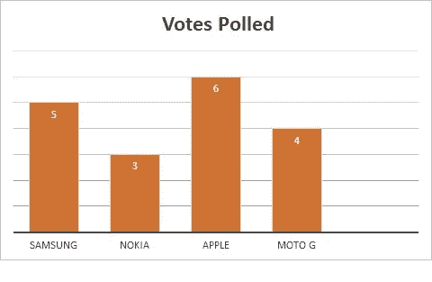
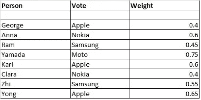
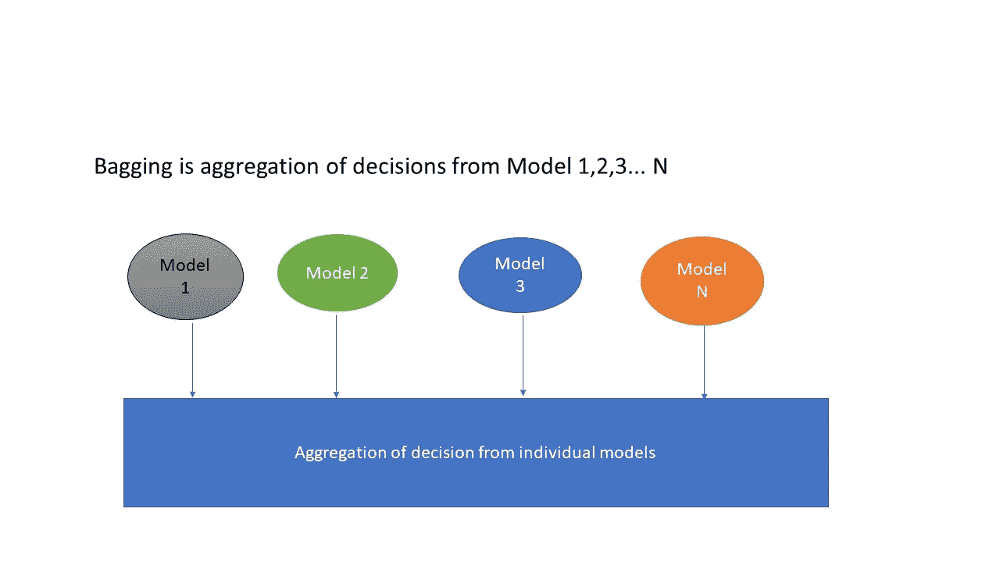

# 集合机器学习:群体的智慧

> 原文：<https://towardsdatascience.com/ensemble-machine-learning-wisdom-of-the-crowd-56df1c24e2f5?source=collection_archive---------67----------------------->

尼古拉斯·格林在 [Unsplash](https://unsplash.com?utm_source=medium&utm_medium=referral) 上的照片

假设你想买一部新手机。你不太可能走进一家商店只买一部手机。你在网上浏览产品，阅读评论，比较型号，价格。你征求家人和朋友的意见。简而言之，在做出明智的决定之前，你要进行大量的研究，寻求大众的智慧。众所周知，收集各种观点和意见可以改善决策过程。

# 什么是集成学习？

照片由 [Clarisse Croset](https://unsplash.com/@herfrenchness?utm_source=medium&utm_medium=referral) 在 [Unsplash](https://unsplash.com?utm_source=medium&utm_medium=referral) 上拍摄

整体机器学习的运作方式类似于图中所示的移动购买体验。它是一种结合多种方法的决策以产生最佳结果的技术。传统机器学习技术中误差的主要原因是噪声、偏差和方差。集成机器学习有助于最小化这些错误，提高稳定性和准确性。

# 基本集成技术

1.  **模式**:在这种技术中，使用多个模型进行预测。每个模型的预测都被视为单独的投票。获得最多票数的人将作为结果。回到手机购买体验，我们寻求对多个手机的评论——苹果、三星、诺基亚、Moto G。获得最多票数的手机就是赢家。

**图片来源:克里希南·斯里纳斯**

**2。Mean:** 在这种技术中，我们从多个模型中获取预测的平均值，并使用它们来进行最终预测。回到手机购买体验，我们将多部手机的评分相加，并根据我们征求意见的人来划分数字。

**均值=(不同人的评分总和)/(人数)**

**3。加权平均值:**这是平均法的扩展。所有模型被赋予不同的权重，定义每个模型对于预测的重要性。例如，你给那些有更多手机使用经验的人更多的权重，而给那些没有手机使用经验的人更少的权重。

**图片来源:克里希南·斯里纳斯**

# 高级集成技术

1.  **Bagging** — Bagging 代表引导聚合。我们创建训练数据集的随机样本。然后，我们为每个样本建立一个模型(分类器或决策树)。最后，使用平均或多数投票来组合这些多个模型的结果。组合来自多个模型的输出减少了方差，产生了比单个模型更可靠的预测。

**图片来源:克里希南·斯里纳斯**

2.**增强—** 增强是一种迭代技术，它根据上一次分类调整观察的权重。如果一个观察被错误地分类，它会试图增加这个观察的权重，反之亦然。它降低了偏置误差。它受到先前建造的性能的影响。

# 结束语

正如肯·布兰查德的名言所说“没有人比我们所有人都聪明”。集成方法符合这一说法，利用不同方法的智慧来预测更好的结果。

感谢您的阅读。我希望你从阅读这篇文章中学到的和我写这篇文章时学到的一样多。