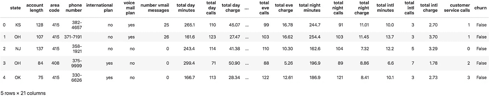
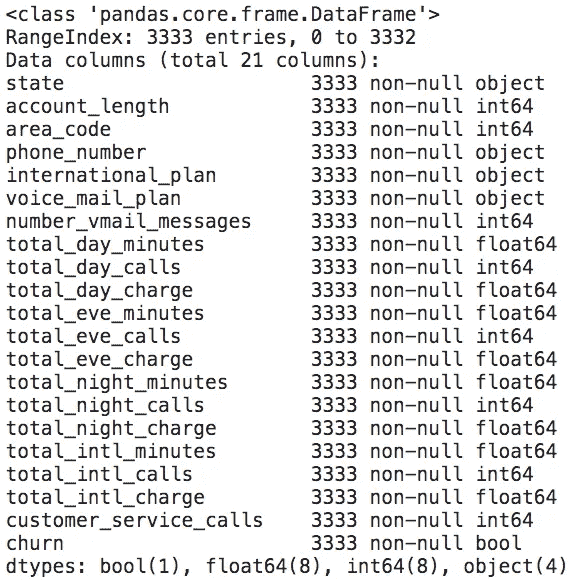

# 集成方法编码

> 原文：<https://towardsdatascience.com/ensemble-methods-code-along-60a6eaa2e8dc?source=collection_archive---------50----------------------->

## 为数据科学初学者提供的随机森林、AdaBoosting 和梯度增强方法的代码。


# 这是给谁的:

正如副标题所暗示的，这篇代码文章是为有兴趣制作他们的第一个更高级的监督机器学习模型的初学者准备的。也许你想知道如何提高你在 Kaggle 上的 [Titanic 分数——这段代码将向你展示一种可以直接显著提高你分数的方法。](https://www.kaggle.com/c/titanic/data)

> 这是给那些通过 ***做*** 学得最好的人的。

我的目的是揭开机器学习应用的神秘面纱。是的，机器学习背后的理论可能相当复杂，我强烈鼓励你深入研究，让自己接触你所做和使用的事物的潜在“数学”。然而，我们都需要从某个地方开始，有时感受一下事情是如何运作的，看到结果可以激发你更深层次的学习。

我不喜欢重复在 Medium 等平台上已经饱和的内容。因此，我不会深究这些算法是如何工作的。

我将提供非常简短的*“简而言之，这是正在发生的事情”*对每种方法的解释，并将为您指出一些相关文章、博客和论文的方向(我真的鼓励您深入研究)。

# 先决条件:

这段代码旨在帮助您直接使用三种不同的*集成*方法构建机器学习模型:随机森林、AdaBoosting 和梯度增强。

我假设你对监督学习和非监督学习有一个大致的了解，并且对基本的决策树模型有一些了解。

## 我将使用:

*   [Kaggle 电信数据集中的流失](https://www.kaggle.com/becksddf/churn-in-telecoms-dataset/data#)
*   用于数据清理的熊猫
*   sci kit-为建模而学习

## 我们现在要做的是:

*   快速 EDA
*   创建 4 个模型(有限状态机和 3 个集合模型)
*   比较每个模型的准确性和召回指标

# 集合模型:

不要想太多了—

> *系综模特是* **系综模特！**

惊呆了。

集合方法背后的思想是“群体的智慧”。我认为

> "我的屁股穿这条裙子好看吗？"

我可以肯定地说

> “地狱耶女孩！”

但是也许你想确定我不只是出于礼貌，所以你问了另外 5 个人，他们给了你同样的回答。在问了 20 多个人之后，你对自己很有信心(你应该这样！).

*这个*就是集成方法背后的思想。

集合模型通过结合大量单一模型的预测给出更好的预测。这可以通过汇总预测结果或改进模型预测来实现。出于这个原因，集合方法往往会赢得比赛。关于这一点的更多信息，请看[这篇文章](https://blogs.sas.com/content/subconsciousmusings/2017/05/18/stacked-ensemble-models-win-data-science-competitions/)和[这篇博客](https://medium.com/diogo-menezes-borges/ensemble-learning-when-everybody-takes-a-guess-i-guess-ec35f6cb4600)。

随机森林、AdaBoosting 和梯度增强只是我今天选择的 3 种集成方法，但还有许多其他方法！

# 随机森林:

随机森林是一种用于分类和回归问题的监督学习算法。

***简而言之*** ，随机森林算法是[决策树](/decision-trees-in-machine-learning-641b9c4e8052)模型的集合。

决策树算法基于在每个阶段最大化信息增益来选择其分裂，因此在同一个数据集上创建多个决策树将产生同一个树。为了使我们的集合方法有效，我们需要个体模型的可变性。随机森林算法利用[装袋](https://machinelearningmastery.com/bagging-and-random-forest-ensemble-algorithms-for-machine-learning/)和[子空间采样方法](https://ieeexplore.ieee.org/abstract/document/709601)来创造这种可变性。

请参见 Leo Breiman 的[论文](https://www.stat.berkeley.edu/~breiman/randomforest2001.pdf)和[网站](https://www.stat.berkeley.edu/~breiman/RandomForests/cc_home.htm)了解随机森林的基本细节。或者，如果你更喜欢博客/文章，请看这里。

# AdaBoosting(自适应升压):

AdaBoosting 又名自适应增强，是发明的第一个增强算法，所以出于怀旧，我在这里提到它。自那以后，出现了许多基于 AdaBoosting 的 Boosting 算法，但这仍然是开始学习 boosting 算法的好地方。

***简而言之*** ，AdaBoost 模型在数据集的子样本上进行训练，为数据集中的每个点分配权重，并在每次模型迭代时改变这些权重。如果学习者(当前模型)正确地分类了一个点，则该点的权重减小，如果学习者错误地分类了一个点，则该点的权重增大。

点击查看更多关于 AdaBoosting [的信息。](/boosting-algorithm-adaboost-b6737a9ee60c)

# 梯度提升:

梯度增强是一种更高级的增强算法，它利用了梯度下降，您可能还记得线性回归。

***简而言之*** ，梯度增强以类似于 AdaBoosting 算法的方式对每个弱学习器进行改进，除了梯度增强计算每个点的残差并将其与损失函数相结合。因此，该算法使用梯度下降来最小化总损失，并使用梯度和损失作为预测器来训练下一个学习者。

更多信息，请阅读[本](https://www.ritchievink.com/blog/2018/11/19/algorithm-breakdown-why-do-we-call-it-gradient-boosting/)和[本](https://sefiks.com/2018/10/29/a-step-by-step-gradient-boosting-example-for-classification/)。

好吧好吧！让我们开始有趣的部分吧！

# EDA:

让我们做一些超级快速的探索性数据分析。我特意选择了这个数据集，因为当你从 Kaggle 下载它时，它已经非常干净了。但是，作为新的数据科学家，继续磨练我们的 EDA 技能对我们来说很重要。

## 数据问题:

正如您可能从数据集的标题中猜到的那样，该模型旨在预测客户流失，这是企业面临的一个非常常见的问题。

考虑我们想要使用哪些指标来评估我们的模型，让我们考虑我们希望我们的模型预测什么，以及什么更糟:假阴性预测或假阳性预测。

我们的模型应该预测数据集中的客户是会留在公司(`False`)还是会离开(`True`)。

在这个场景中，我们有:

> ***假阴性:*** *模型预测一个客户会留在公司(* `*False*` *)，而实际上那个客户在翻盘(* `*True*` *)。*
> 
> ***误报:*** *模型预测某个客户会流失(* `*True*` *)，而实际上他们会留下来(* `*False*` *)。*

鉴于此，我们可能会说，假阴性对公司来说成本更高，因为这将是一个错过的保持这些客户的营销机会。出于这个原因，我们将使用准确性和召回分数来评估我们的模型性能。*

## 加载和预览数据:

首先，将数据下载到您的目录[这里](https://www.kaggle.com/becksddf/churn-in-telecoms-dataset)。

进口:

```
import pandas as pdfrom  .model_selection import train_test_split
from sklearn.metrics import accuracy_score, recall_score
from sklearn.tree import DecisionTreeClassifier
from sklearn.ensemble import RandomForestClassifier, AdaBoostClassifier, GradientBoostingClassifier
```

加载和预览:

```
df = pd.read_csv('data/raw/telecom_churn_data.csv')
df.head()
```



前 5 行数据

从这里我们可以看到，一行代表一个电信客户。

我们可以很快确定我们的目标变量是什么:`churn`。

我不喜欢列标题中的空格，所以我们将改变它，检查我们的数据类型并检查任何丢失的数据(空值)。

```
df.columns = df.columns.str.replace(' ', '_')
df.info()
```



检查列

正如我提到的，我选择这个数据集是因为它已经相当干净了。我们的数据类型是有意义的，你可以看到我们没有`null`值。当然，看到`3333 non-null`并不一定意味着我们没有空值——有时我们的数据集中有伪装的空值。我已经检查了每一列的唯一值，并且可以确认数据在这一点上看起来是完整的(当然，如果您确实发现了我遗漏的可疑之处，请务必通知我！).

## 创建目标和特征变量:

```
# our target, 'y' variable:
y = df.churn# df of our features data 'X' - drop target
X = df.drop("churn", axis=1)
```

## 处理分类特征:

你可能已经注意到我们之前的`df.info()`，我们有 4 个`object`类型的柱子。这些列中有 3 列是有用的类别:`state`、`international_plan`和`voice_mail_plan`。

另一个对象列是`phone_number`，您猜对了，这是一个客户的电话号码。我认为，一个人的电话号码不应该对他们是否决定继续使用电话公司有任何大的影响，因此，出于这个原因，我选择简单地从我们的功能集中删除这个专栏。**

```
# drop phone_number column
X = X.drop('phone_number', axis = 1)
```

因此，现在让我们虚拟出剩余的 3 个分类列。这将会给我们的特性集增加很多列，反过来也会给我们的模型增加一些复杂性，但是为了我们的例子，我们现在不会太担心这个。

```
# create dummy variables for categorical columns
X = pd.get_dummies(X, drop_first = True)
```

要了解更多关于虚拟变量、一次热编码方法以及为什么我指定了`drop_first = True`(虚拟陷阱)，请阅读本文。

这是一个再做一次`X.head()`的好机会，看看你的数据框现在是什么样子。

## 列车测试分离:

首先，我们将我们的`X`和`y`数据分成一个用于训练模型的训练集，和一个用于(你猜对了)测试模型的测试集。我选择在这里做一个`0.25`分裂。

```
X_train, X_test, y_train, y_test = train_test_split(X, 
                                                    y, 
                                                    test_size=0.25, 
                                                    random_state=15)
```

# 系统模型化

在我们的建模过程中，我主要是在实例化模型对象时使用它们的默认参数。我将在最后谈到超参数调整，但简而言之，所有的乐趣都在于调整参数，所以我想让你去探索。我想重点向你展示模型是如何通过使用它们的默认值来改变的。

为了简洁起见，我将简单地拟合模型，并给出一些指标来比较每个模型。

如上所述，我们将使用`accuracy_score`和`recall_score`作为我们的衡量标准进行比较。

## FSM——第一个低劣模型:单一决策树

要想知道我们的集成方法是否有效，我们首先需要知道一个单一的基础模型如何处理我们的数据。由于这是一个分类问题，我们将使用决策树作为我们的有限状态机。由于决策树有过度拟合的习惯，我将把`max_depth`设为 5。

```
# instantiate decision tree object with default params
dtc = DecisionTreeClassifier(max_depth = 5) # fit the model to our training data
dtc.fit(X_train, y_train)
```

**结果:**

精确度:

```
# calculate accuracy_score for training data:
print(accuracy_score(y_train, dtc.predict(X_train)))0.9559823929571829# calculate accuracy_score for test data:
print(accuracy_score(y_test, dtc.predict(X_test)))0.934052757793765
```

这是可疑的高，并强调了一些问题，我们有与准确性评分…

但是，就这里的准确性而言，这个模型做得并不太差，训练和测试分数之间也没有很大的差异。

```
# calculate recall_score for train data:
print(recall_score(y_train, dtc.predict(X_train)))0.7388888888888889# calculate recall_score for test data:
print(recall_score(y_test, dtc.predict(X_test)))0.6422764227642277
```

我们可以看到，训练和测试回忆分数之间的差别稍大一些。尽管如此，对于第一个模特来说，这些分数已经很不错了。

记住，对于这个问题，我们更关心召回分数，因为我们想抓住假阴性。召回是我们试图从这个模型中最大化的。

## 模型 2:随机森林

接下来，我们创建一个 max_depth 为 5 的随机森林模型。如果我们将`n_estimators`留空，一些版本的 sklearn 会发出警告，所以我在这里将其设置为 100。

```
# instantiate random forest classifier object
rft = RandomForestClassifier(n_estimators=100, max_depth= 5)# fit the model to the training data:
rft.fit(X_train, y_train)
```

**结果:**

精确度:

```
# calculate accuracy_score for training data:
print(accuracy_score(y_train, rft.predict(X_train)))0.8855542216886755# calculate accuracy_score for test data:
print(accuracy_score(y_test, rft.predict(X_test)))0.86810551558753
```

从我们的第一个模型开始，我们的准确度分数实际上已经下降了。让我们检查回忆:

```
# calculate recall_score for train data:
print(recall_score(y_train, rft.predict(X_train)))0.20555555555555555# calculate recall_score for test data:
print(recall_score(y_test, rft.predict(X_test)))0.1056910569105691
```

哇，我们的随机福里斯特模型的召回分数下降了！乍一看，这似乎很奇怪，但这可能是由多种原因造成的。需要记住的一个概念性原因是，单决策树模型是一个模型，而随机森林模型本质上是根据森林中所有树的投票做出最终预测的。由于这个原因，我们得到了比一棵树的‘意见’更准确的预测。

我们也没有考虑职业不平衡或者超参数，所以这个例子有点做作。

让我们以同样的方式继续，看看如何实现 AdaBoosting 和 Gradient Boosting 模型，并比较它们的性能:

## 模型 3: AdaBoosting

```
# instantiate adaboost classifier object
abc = AdaBoostClassifier(random_state = 15)# fit the model to the training data:
abc.fit(X_train, y_train)
```

**结果:**

精确度:

```
# calculate accuracy_score for training data:
print(accuracy_score(y_train, abc.predict(X_train)))0.8979591836734694# calculate accuracy_score for test data:
print(accuracy_score(y_test, abc.predict(X_test)))0.86810551558753
```

令人惊讶的是，我们对测试数据的准确性分数保持不变，但我们对测试数据的准确性分数有所提高。

回忆:

```
# calculate recall_score for train data:
print(recall_score(y_train, abc.predict(X_train)))0.4638888888888889# calculate recall_score for test data:
print(recall_score(y_test, abc.predict(X_test)))0.3333333333333333
```

与随机森林模型相比，我们的回忆分数有了显著的提高。

让我们看看梯度增强的表现。

## 模型 4:梯度推进

```
# instantiate gradient boost classifier object
gbc = GradientBoostingClassifier(random_state = 15)# fit the model to the training data:
gbc.fit(X_train, y_train)
```

**结果:**

精确度:

```
# calculate accuracy_score for training data:
print(accuracy_score(y_train, gbc.predict(X_train)))0.9731892757102841# calculate accuracy_score for test data:
print(accuracy_score(y_test, gbc.predict(X_test)))0.9508393285371702
```

目前为止我们最高的准确率。他们离我们的第一个决策树模型不远了。初步检查也没有明显的过度装配迹象。

回忆:

```
# calculate recall_score for train data:
print(recall_score(y_train, gbc.predict(X_train)))0.8194444444444444# calculate recall_score for test data:
print(recall_score(y_test, gbc.predict(X_test)))0.7235772357723578
```

再一次，这是我们目前为止最高的召回分数，这确实比我们的第一个模型好很多。

给定这 4 个模型，我们将选择梯度推进模型作为我们的最佳选择。

# 最后注意事项和后续步骤:

正如你所看到的，使用这些模型并不困难——我们只是简单地创建模型对象并比较结果——我们没有太深入地思考幕后发生了什么。很容易创建和试验这些不同的方法，看看哪种方法更好。

然而，应该注意的是，这是一个非常人为的例子，仅仅是为了向你展示你可以如何使用这些模型，并且集成方法通常比单一模型做得更好。由于我们使用了所有的默认参数，这些模型中呈现的指标不一定会产生有意义的影响，因此下面是开始思考和了解的一些后续步骤…

## 超参数调谐:

超参数是在学习过程之前*设置的参数值。这不同于我们在*训练模型后*发现的模型参数。*

如果您熟悉线性回归，那么*斜率*和*截距*参数就是我们试图通过训练模型来优化的模型参数。

我们在这个例子中调整的超参数的一个例子是当我们设置`max_depth = 5`时，我们在拟合模型之前设置这个*。*

我知道你可能没有接触过很多这些概念，所以随着你的接触，这些概念会变得更加清晰。但是我鼓励您尝试不同的超参数，看看模型如何随着不同的参数调整而变化。

> **提示:**在 Jupyter 和其他 ide 中，任何方法或类的括号内的`shift + tab`允许您快速检查对象所采用的参数。对于模型类，这将显示您可以使用的大多数超参数。

> **不要低估“修修补补”的价值**

[这里有一篇关于超参数调整和特征工程的文章。](/why-you-should-do-feature-engineering-first-hyperparameter-tuning-second-as-a-data-scientist-334be5eb276c)

## 阶级不平衡:

我可以用一行代码来解释什么是阶级不平衡:

```
y.value_counts()False    2850
True      483
Name: churn, dtype: int64
```

正如您在这里看到的，我们将近 86%的数据被标记为`False`。这意味着我们的模型可能变得不公平地偏向`False`预测，仅仅是因为我们数据中那个标签的比率。这就是我们所说的“阶级不平衡”问题。

有很多方法可以处理职业不平衡，包括职业权重和 SMOTE。将这一点与我们的数据集一起考虑将会极大地改进我们的模型。

# 包扎

我希望您已经看到了这些集成方法如何改进您的模型的价值，并且我鼓励您在不同的数据集上尝试它们以获得对它们的感觉。随着您对这些算法背后的理论、它们的超参数、应用正则化和类平衡方法的了解越来越多，您将对这些功能如何发挥以及它们对您的模型有何影响有一个良好的开端。

快乐学习！

## 脚注

*   *有些人可能会说，误报对公司来说也是昂贵的，因为你在留住客户上花了钱，而客户无论如何都会留下来。我让您来思考这个问题，并尝试不同的评分标准。[这里有一篇文章介绍了您可以研究的一些不同指标。](/accuracy-recall-precision-f-score-specificity-which-to-optimize-on-867d3f11124)
*   **我让您来探索您可能想要如何处理`phone_number`功能。
*   ***注意，在这个例子中，我没有进行特征工程。调整正则化超参数对此也有帮助。

## 引文

感谢我向读者推荐的博客和论文的作者，来补充这个博客。