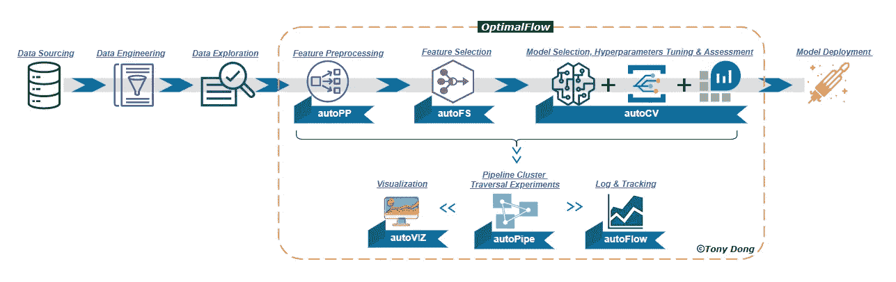
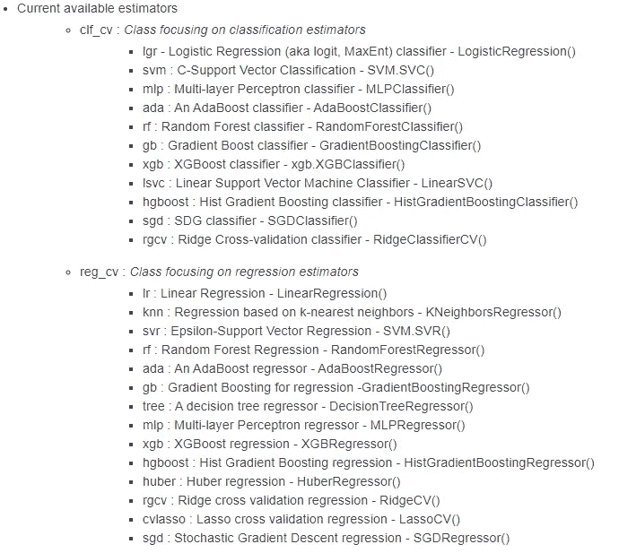
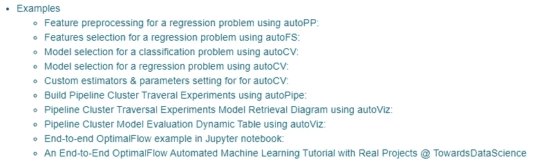
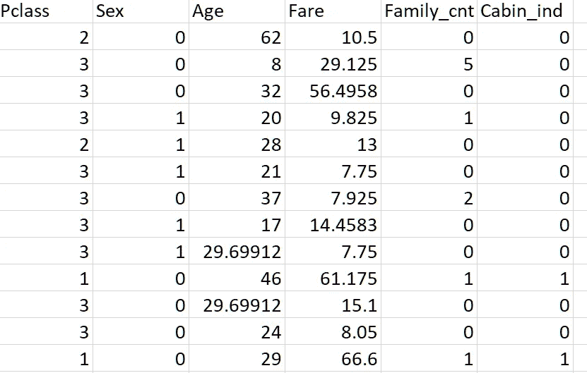
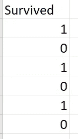
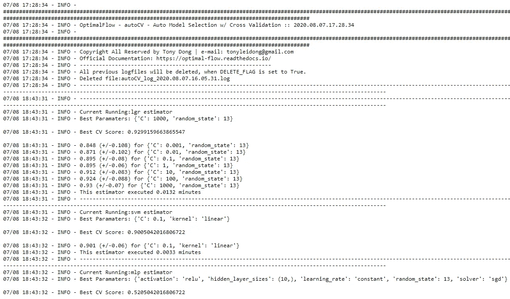

# 基于 OptimalFlow 的机器学习集成模型选择与评估

> 原文：<https://towardsdatascience.com/ensemble-model-selection-evaluation-in-machine-learning-by-optimalflow-9e5126308f12?source=collection_archive---------48----------------------->

## 用简单的代码选择最佳模型的简单方法


Artem Sapegin 在 [Unsplash](https://unsplash.com?utm_source=medium&utm_medium=referral) 上拍摄的照片

在机器学习工作流中，模型选择是创建基线模型的重要步骤。这个步骤通常是一个耗费时间的过程，并且需要更多的模型调整实验。

因此，我编写了一个名为 ***OptimalFlow*** 的软件包，其中有一个集成模型选择模块 [*autoCV*](https://optimal-flow.readthedocs.io/en/latest/autoCV.html) ，它可以通过流行的监督建模算法进行交叉验证，还可以在超参数上应用“懒惰”搜索来选择最佳模型。

> 为什么我们使用 ***OptimalFlow*** ？你可以阅读另一个关于它的介绍的故事:[*一个 Omni-ensemble 自动化机器学习——optimal flow*](/an-omni-ensemble-automated-machine-learning-optimalflow-369d6485e453)。



*autoCV* 模块目前覆盖了大多数主流的监督模型，包括 11 个分类和 14 个回归估计量，即 XGBoost、Random Forest、MLP 和 SVM 等。



您可以阅读*optimal flow***optimal flow 的*** *autoCV* 模块的 [**文档。此外， ***OptimalFlow*** 还提供了特征预处理、模型选择、模型评估、*流水线簇遍历实验(PCTE)* 自动机器学习模块。**](https://optimal-flow.readthedocs.io/en/latest/index.html)*

**

*你可以阅读它的集成特征选择实现的另一个故事:[*通过 optimal flow*](/ensemble-feature-selection-in-machine-learning-by-optimalflow-49f6ee0d52eb)在机器学习中进行集成特征选择的简单方法。*

*这里我们将有一个演示，使用 ***OptimalFlow*** ，在几分钟内完成一个分类问题的模型选择。我们使用一个干净的泰坦尼克号数据集作为输入。*

***第一步:通过 pip:** 安装 *OptimalFlow**

```
*pip install OptimalFlow*
```

***第二步:导入库:***

```
*import pandas as pd
from OptimalFlow.autoCV import dynaClassifier,evaluate_clf_model
import joblib*
```

*注意:这个演示使用的是基于网格搜索的动态分类器类；或者，您可以使用基于随机搜索的 *fastClassifier* 类，尽管这是一种在运行时间和解决方案质量之间的权衡(参见 *autoCV* 模块的 [***文档***](https://optimal-flow.readthedocs.io/en/latest/autoCV.html) 中的更多细节)。*

***第三步:导入输入数据集:***

```
*tr_features = pd.read_csv('./data/classification/train_features.csv')
tr_labels = pd.read_csv('./data/classification/train_labels.csv')#Splitting validate data sets for models evaluation
val_features = pd.read_csv('./data/classification/val_features.csv')
val_labels = pd.read_csv('./data/classification/val_labels.csv')*
```

**

*清理过的泰坦尼克号数据集 train _ features.csv*

**

*清理过的泰坦尼克号数据集 train _ label.csv*

***第四步:运行 *autoCV* 模块:***

*我们将交叉验证拆分策略确定为 5 个文件夹。并且使用 *fit_clf()* 方法来训练集成方法中的模型，并且自动保存每个模型的具有最高 CV 分数的参数调整估计器。然后，优化的估计量全部保存到。/plk 文件夹进行进一步的模型验证。*

```
*# We customize models cadidates for this demo:
custom_cv = ['lgr','svm','mlp','rf','ada','gb','xgb']*# Set input_form_file = False, when label values are array. Select 'True' from Pandas dataframe.*clf_cv_demo **=** dynaClassifier**(**custom_estimators = custom_cv, random_state **=** **13,**cv_num **=** **5,**input_from_file **=** True**)***# Select detail_info = True, when you want to see the detail of the iteration*clf_cv_demo**.**fit**(**tr_features**,**tr_labels**)***
```

*然后，我们添加一些模型验证的代码，从保存的模型 pickles 中选择最优的模型。*

```
*models = {}for mdl in ['lgr','svm','mlp','rf','ada','gb','xgb']:
    models[mdl] = joblib.load('./pkl/{}_clf_model.pkl'.format(mdl))for name, mdl in models.items():
    evaluate_clf_model(name, mdl, val_features, val_labels)*
```

*一切就绪！以下是输出结果:*

```
******OptimalFlow***** autoCV Module **===>** lgr_CrossValidation **with** **5** folds**:**

Best Parameters**:** **{**'C'**:** **1,** 'random_state'**:** **13}**

Best CV Score**:** **0.7997178628107917**

Progress**:** **[***###-----------------] 14.3%*

*****OptimalFlow***** autoCV Module **===>** svm_CrossValidation **with** **5** folds**:**

Best Parameters**:** **{**'C'**:** **0.1,** 'kernel'**:** 'linear'**}**

Best CV Score**:** **0.7959619114794568**

Progress**:** **[***######--------------] 28.6%*

*****OptimalFlow***** autoCV Module **===>** mlp_CrossValidation **with** **5** folds**:**

Best Parameters**:** **{**'activation'**:** 'tanh'**,** 'hidden_layer_sizes'**:** **(50,),** 'learning_rate'**:** 'constant'**,** 'random_state'**:** **13,** 'solver'**:** 'lbfgs'**}**

Best CV Score**:** **0.8184094515958386**

Progress**:** **[***#########-----------] 42.9%*

*****OptimalFlow***** autoCV Module **===>** rf_CrossValidation **with** **5** folds**:**

Best Parameters**:** **{**'max_depth'**:** **4,** 'n_estimators'**:** **250,** 'random_state'**:** **13}**

Best CV Score**:** **0.8240521953800035**

Progress**:** **[***###########---------] 57.1%*

*****OptimalFlow***** autoCV Module **===>** ada_CrossValidation **with** **5** folds**:**

Best Parameters**:** **{**'learning_rate'**:** **0.1,** 'n_estimators'**:** **100,** 'random_state'**:** **13}**

Best CV Score**:** **0.824034561805678**

Progress**:** **[***##############------] 71.4%*

*****OptimalFlow***** autoCV Module **===>** gb_CrossValidation **with** **5** folds**:**

Best Parameters**:** **{**'learning_rate'**:** **0.01,** 'max_depth'**:** **3,** 'n_estimators'**:** **300,** 'random_state'**:** **13}**

Best CV Score**:** **0.8408746252865456**

Progress**:** **[***#################---] 85.7%*

*****OptimalFlow***** autoCV Module **===>** xgb_CrossValidation **with** **5** folds**:**

Best Parameters**:** **{**'learning_rate'**:** **0.1,** 'max_depth'**:** **3,** 'n_estimators'**:** **200,** 'verbosity'**:** **0}**

Best CV Score**:** **0.8464292011990832**

Progress**:** **[***####################] 100.0%*

lgr **--** Accuracy**:** **0.775** **/** Precision**:** **0.712** **/** Recall**:** **0.646** **/** Latency**:** **0.0**ms
svm **--** Accuracy**:** **0.747** **/** Precision**:** **0.672** **/** Recall**:** **0.6** **/** Latency**:** **2.0**ms
mlp **--** Accuracy**:** **0.787** **/** Precision**:** **0.745** **/** Recall**:** **0.631** **/** Latency**:** **4.1**ms
rf **--** Accuracy**:** **0.809** **/** Precision**:** **0.83** **/** Recall**:** **0.6** **/** Latency**:** **37.0**ms
ada **--** Accuracy**:** **0.792** **/** Precision**:** **0.759** **/** Recall**:** **0.631** **/** Latency**:** **21.4**ms
gb **--** Accuracy**:** **0.815** **/** Precision**:** **0.796** **/** Recall**:** **0.662** **/** Latency**:** **2.0**ms
xgb **--** Accuracy**:** **0.815** **/** Precision**:** **0.786** **/** Recall**:** **0.677** **/** Latency**:** **5.0**ms*
```

*现在，我们可以找到带有{'learning_rate': 0.01，' max_depth': 3，' n_estimators': 300，' random_state': 13}的 GradientBoost 是由 *autoCV 选择的最优模型，其中*具有最高的准确度和精确度分数，具有较低的召回率。*

*当您需要了解型号选择过程的更多细节时，您可以通过 [*autoFlow*](https://optimal-flow.readthedocs.io/en/latest/autoFlow.html) 模块找到自动生成的日志文件。*

**

*一切就绪！ ***OptimalFlow*** 的 *autoCV* 模块完成繁琐的选型&超参数实验。简单容易，对吧？😎*

*关于**的相关阅读*optimal flow*:***

> *[使用 OptimalFlow 在机器学习中进行集成特征选择——使用简单代码选择顶级特征的简单方法](/ensemble-feature-selection-in-machine-learning-by-optimalflow-49f6ee0d52eb)*
> 
> *[端到端 OptimalFlow 自动化机器学习教程结合真实项目-公式 E 圈数预测第 1 部分](/end-to-end-optimalflow-automated-machine-learning-tutorial-with-real-projects-formula-e-laps-8b57073a7b50)*
> 
> *[端到端 OptimalFlow 自动化机器学习教程结合真实项目-公式 E 圈数预测第二部分](/end-to-end-optimalflow-automated-machine-learning-tutorial-with-real-projects-formula-e-laps-31d810539102)*
> 
> *[用 OptimalFlow Web App 建立无代码自动机器学习模型](/build-no-code-automated-machine-learning-model-with-optimalflow-web-app-8acaad8262b1)*

# *关于我:*

*我是一名医疗保健和制药数据科学家以及大数据分析和人工智能爱好者。我开发了 ***OptimalFlow*** 库，帮助数据科学家以一种简单的方式构建最佳模型，并通过简单的代码实现机器学习工作流的自动化。*

*作为一名拥有多年分析经验的大数据洞察寻求者、流程优化者和人工智能专家，我使用数据科学中的机器学习和问题解决技能将数据转化为可操作的洞察，同时提供战略和量化产品作为最佳结果的解决方案。*

*你可以在我的 [LinkedIn](https://www.linkedin.com/in/lei-tony-dong/) 或者 [GitHub](https://github.com/tonyleidong) 上和我联系。*