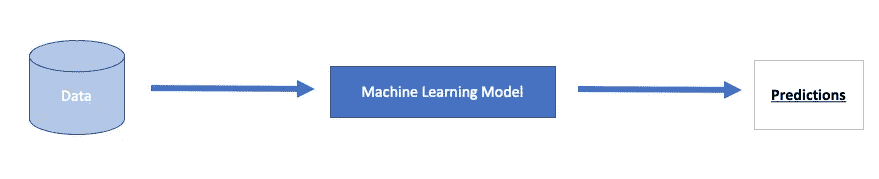
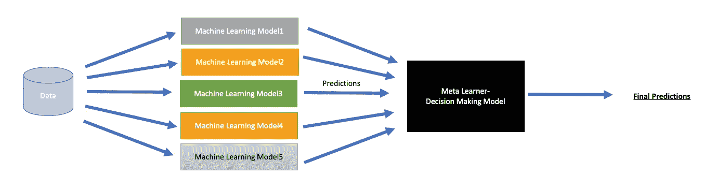
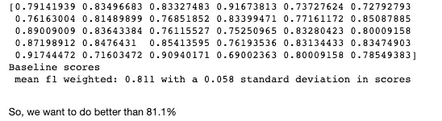
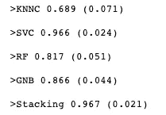
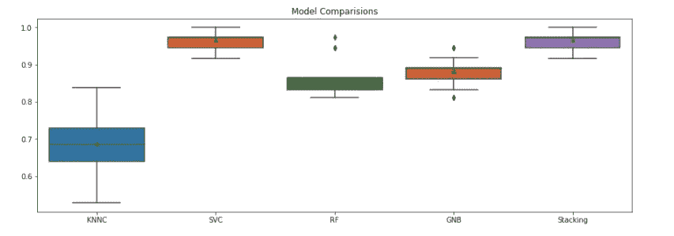

# 用于分类的集成模型

> 原文：<https://towardsdatascience.com/ensemble-models-for-classification-d443ebed7efe?source=collection_archive---------30----------------------->

## 堆叠表现不佳的模型以创建更强的模型。他们从彼此的错误中吸取教训

您已经清理了数据并移除了所有相关要素。您还可视化了数据集，并且知道类标签是可分离的。你也调整了你的超参数。太好了，但是为什么你的模型表现不好呢？

## 什么是模型堆叠？

你试过叠模型吗？传统上，我们用单一的算法来模拟我们的数据。这可能是逻辑回归、高斯朴素贝叶斯或 XGBoost。



作者图片:传统 ML 模型

系综叠加模型的作用如下:



作者图片:堆叠 ML 模型

## 元学习者

用于**组合基本估计器**的算法被称为元学习器。我们可以确定我们希望该算法如何响应来自其他模型(本例中为分类器)的不同预测。它可以是:

1.  估计量的预测
2.  预测以及原始训练数据

但是这仅仅是最后一类**预测吗？**不，您可以选择推动决策的指标:

1.  可能是`'predict_proba'`或`'predict'`或者两者都是
2.  也可以使用 [sklearn](https://scikit-learn.org/stable/modules/generated/sklearn.ensemble.StackingClassifier.html#sklearn.ensemble.StackingClassifier.decision_function) 中的其他`'decision_function'`

最终的元学习者可以是任何估计者(默认情况下，sklearn 有逻辑回归)

我们采用**基线高斯朴素贝叶斯估计器**，并将所有未来结果与其预测准确度进行比较:

```
rf = OneVsRestClassifier(estimator = GaussianNB())cv = RepeatedStratifiedKFold(n_splits=10, n_repeats=3, random_state=20)n_scores = cross_val_score(rf, X, y, scoring='f1_weighted', cv=cv, error_score='raise')print(n_scores)
print('Baseline scores \n mean f1 weighted: %.3f with a %.3f standard deviation in scores ' % (np.mean(n_scores), np.std(n_scores)))
```



作者图片:基本模型分数

创建多层调优估值器，并将它们堆叠在一起



图片作者:堆叠模型胜过其他模型！



作者图片:堆叠模型优于所有分类器

最终，我们想要一个 F1 值高于 81.1%的分类器，我们最终用堆叠模型得到了 96.7%的 F1 值。

在医疗保健设置中，我将接受相对于 SVC 模型的 0.1%的改进，并且不会牺牲堆叠模型的复杂性！

你可以在这里找到完整的代码:[https://github . com/gaurikatyagi/Machine-Learning/blob/master/class ification/Ensemble % 20 model-% 20 stacked % 20 class ification . ipynb](https://github.com/gaurikatyagi/Machine-Learning/blob/master/Classification/Ensemble%20Model-%20Stacked%20Classification.ipynb)

现在就去堆栈…