# 对对立例子的集成鲁棒性

> 原文：<https://towardsdatascience.com/ensemble-robustness-to-adversarial-examples-ff93033aae1a?source=collection_archive---------69----------------------->

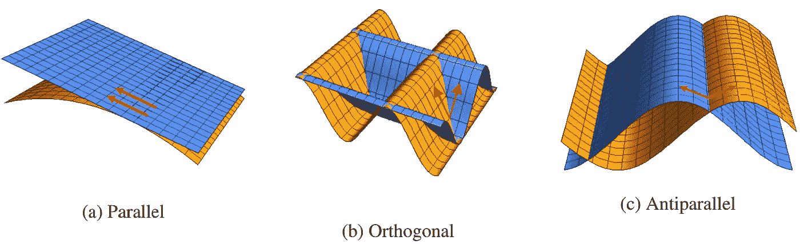

具有不同梯度关系的模型对

去年夏天，我有幸与一位才华横溢的本科生研究员 Romain Speciel 合作了一个项目，该项目旨在研究如何以一种提高对抗样本鲁棒性的方式来规范模型集合。我们主要关心的是减少模型之间对立例子的可移植性，因为这是黑盒设置中的一个主要威胁。这篇文章旨在展示在[预印本](https://arxiv.org/abs/2005.05750)中进一步详述的工作，同时提供额外的直觉。

## 对抗性例子的背景

我们将用 *f* 来指代一个模型，它的输出应该通过上下文显而易见:有时是预测的标签，有时是预测的概率。

图像分类模型的一个相反的例子是通过以人类不可察觉的方式扰动输入图像而获得的图像，然而这导致模型对输入进行错误分类。给定样本-标签对 x，y 的对立输入集被精确定义为

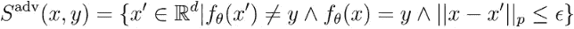

其中 x 是原始图像，𝜀被选择为使得人类不能辨别原始图像和扰动图像之间的差异，并且 p 通常被选择为 1、2 或∞。因此，为了找到对抗输入，必须解决下面的优化问题

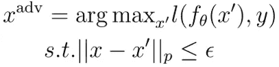

这种受约束的优化试图最大化给定样本-标签对的损失函数，同时还保持制作的输入 x’足够接近 x，使得人类不能区分这两个图像。

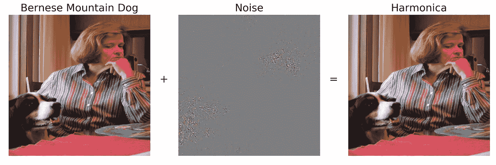

在 ImageNet 上训练的 ResNet-50 模型的典型对抗示例

这不是一个要解决的简单的优化问题，但是我们可以通过获取约束并将其嵌入到 x '的构造中来简化它。神经网络通常用某种梯度下降的变体来训练，以最小化关于模型参数的期望损失函数

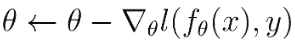

类似于优化模型参数以适应数据集(即学习)，我们可以通过利用模型的可区分性来优化输入。我们使用损失相对于输入图像的梯度在像素空间方向上移动，使得损失最大化，如下

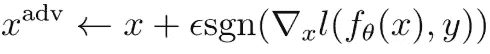

其中 sgn 是符号函数，1 表示正值，-1 表示负值，否则为 0。通过使用 signum 函数，我们控制 L-∞范数的大小，使得扰动图像和原始图像之间的最大像素差至多为𝜀.这被称为 f [ast 梯度符号(FGS)攻击](https://arxiv.org/abs/1412.6572),是一种非常有效的制造对抗例子的方法。然而，这是最弱的攻击，并且假设模型的输出表面是线性的。我们注意到，对抗性扰动不是唯一的，对于一个给定的输入，可能存在多个扰动，所有这些都会导致分类器对它进行错误分类。此外，对立的例子特定于给定的模型，尽管[可转移现象](https://arxiv.org/abs/1704.03453)表明对立的例子跨网络体系结构转移，甚至跨模型类转移。

## 梯度的重要性

考虑精度差不多的两个型号 *f* 和 *g* 。如果 *f* 和 *g* 的损失梯度之间的角度大于𝛑/2，那么在 *f* 的梯度方向上扰动输入 x 将降低 *f* 的预测置信度，但增加 *g* 的置信度。这在这个故事的封面图的子图 c)中得到最好的说明，在红色箭头的底部，模型输出表面相交并具有相同的值，而梯度指向相反的方向。如果我们可以假设

那么理论上 FGS 的攻击不可能同时愚弄 f 和 g。此外， *f* 和 *g* 之间的不一致，假设它们都具有相似的测试集性能，可以用来标记潜在的敌对输入。这不是对对抗性例子的直接防御，但是检测也很重要，并且让对抗性例子不在模型之间转移也可以降低黑盒设置中的攻击成功率。在实践中实现这样的梯度关系仅仅需要将正则化项添加到期望的损失函数(例如交叉熵损失)中。如果所讨论的集合仅由两个模型组成，则最佳正则化项将最小化余弦相似性

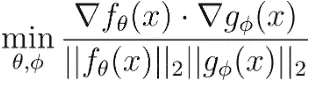

模型渐变之间。梯度的正则化相当抽象，所以让我们从模型使用的特征的角度来讨论这意味着什么。正交梯度意味着模型在进行分类时使用不相交的特征集，使得扰动模型 *f* 的最显著特征对模型 *g* 的预测几乎没有影响。请注意，这并不限制模型所使用的特征之间的关联。比如对汽车的图像进行分类时， *f* 可能会使用轮胎作为特征， *g* 可能会使用车门。即使这些特征可能在图像中同时出现(即这些特征是相关的)，扰动图像使得 *g* 不再检测图像中的门也不会影响 *f* 的预测。

继续以汽车为例，当 *f* 的输出随着轮胎的存在而增加，但随着车门的存在而减少，反之亦然 *g* 的情况下，可以实现余弦相似度小于 0 的坡度。在任一情况下，梯度正则化都是有代价的，因为集合中的模型不使用相同的特征，因此不能在个体基础上实现最大性能。在标准精度和敌对干扰下的精度之间有一个基本的权衡。在有许多与标签弱相关但在一起使用时具有高度预测性的特征的情况下，如果这些特征不稳健，那么对它们的微小改变会显著改变输出。

在实践中，既优化两个模型集合的精度又调整模型梯度的损失函数看起来像

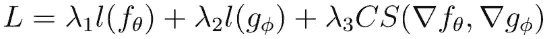

第三项使梯度正则化，进一步的检查表明它需要二阶优化，因为我们优化的是梯度而不是参数。

## 测量集合合作

涉及的模型多了会怎么样？最小化模型之间的成对余弦相似性已经不够了。相反，我们必须考虑所有模型的对立子空间的交集，并以最小化该子空间的方式正则化模型梯度。完整的细节可以在[预印本](https://arxiv.org/abs/2005.05750)中找到，因此我们在这里重点关注该方法背后的动机，并证明为什么成对余弦相似性在考虑两个以上模型时不理想，正如 [Kariyappa 和 Quershi](https://arxiv.org/abs/1901.09981) 所做的那样。假设我们的组合由三个模型组成。然后，最大化成对余弦相似性将导致接近下面的蓝色渐变排列

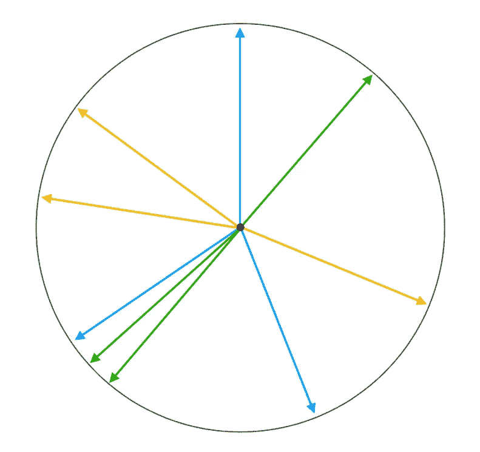

三模型系综的梯度排列

请注意，对于具有 2D 梯度的三个模型，即𝛑/3.，只有一个成对角度最大化成对余弦相似性然而，我们不需要如此强的条件，因为绿色和黄色梯度的可视化也会降低模型之间的可转移性。我们的方法能够获得更少的限制条件，这使得优化更容易。为了进一步说明模型梯度如何影响对立子空间的大小，下图用橙色显示了两个模型集合的对立子空间。

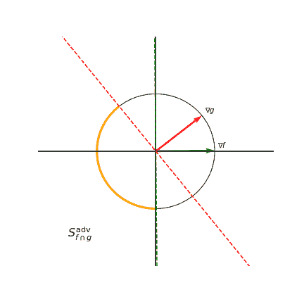

两模型集成的敌对子空间依赖于梯度

位于橙色区域的任何扰动都负向投射到 *f* 和 *g* 的梯度上，从而降低两个模型的预测置信度。为了测量集成中的模型如何合作来减少可以同时欺骗所有模型的敌对子空间，我们引入了**梯度多样性评级(GDR):**

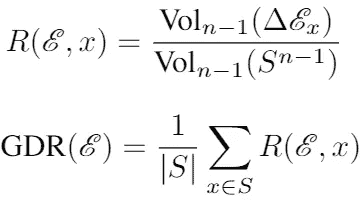

简而言之，该评级测量敌对子空间的体积，该子空间以相同的方式同时愚弄集合中的所有模型(即，它们都错误地预测了相同的错误类别)，通过与模型相同维数的单位球体的体积来归一化。看一下[预印本](https://arxiv.org/abs/2005.05750)看看如何最小化不同大小的系综的 GDR。在这里，我们只展示了表明 GDR 和对抗性攻击成功率之间存在相关性的结果，因此最小化 GDR 是系综的期望属性。

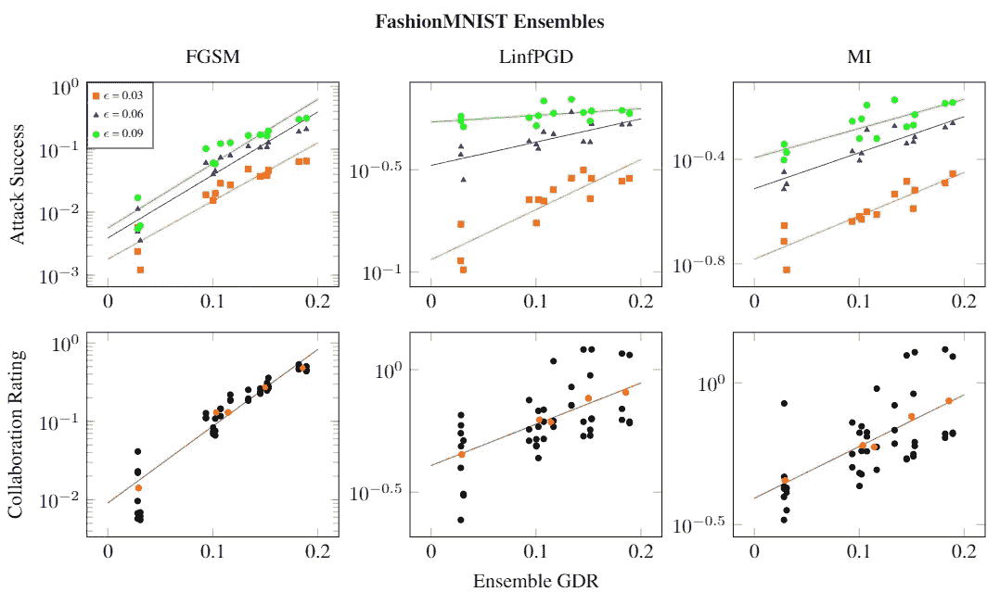

GRD 与时尚达人的攻击成功率

总之，由于 ML 工程师能够控制模型梯度，并创建攻击不会从一个模型转移到另一个模型的集合，因此黑盒防御设置具有更好的防御对手的可能性，从而为敌对示例创建了一种可能的检测机制。关于这些结果如何推广到其他数据集，以及 GDR 正则化有效的一些假设有多现实，还有更多需要了解。在这两种情况下，我们认为这是一个值得追求的途径，并且对对抗性例子的几何理解可以产生更有原则的防御方法。