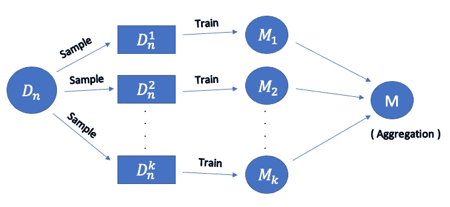
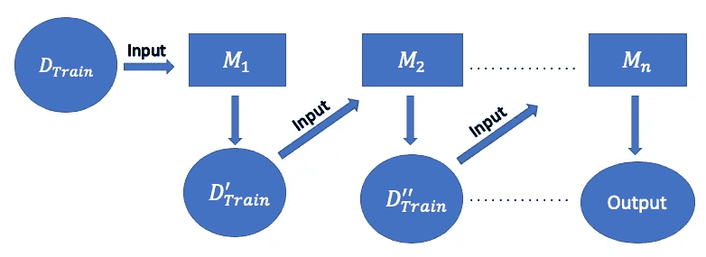

# 集成技术

> 原文：<https://towardsdatascience.com/ensemble-techniques-c1b0831a8865?source=collection_archive---------58----------------------->

## 集成技术的高级概述

我们知道决策树是一种非常强大的技术，但是我们可以使用集成建模技术来改进它。

Ensemble 的基本意思是‘在一起’，所以 ensemble 模型就是一组一起工作的基础模型。

为了使集合模型更好地工作，你应该选择不同的基础模型，也就是说，这些模型越不同，你就越能更好地组合它们。

在这篇博客中，我将向你介绍以下合奏技巧:

1.  **装袋**
2.  **助推**

# 使用集合技术的好处

每个模型都有自己的优点和缺点，所以通过使用这种技术，我们得到的最终模型具有模型的所有优点，而掩盖了单个模型的缺点。所以，模型表现更好。

# 制袋材料

Bagging 也被称为 **Bootstrap Aggregation** ，用于提高机器学习算法的准确性。

**装袋**的主要目的是在不影响偏差的情况下减少方差，并有助于避免过度拟合。

在上图中，Dn 是我们的训练数据，包含我们的类标签和预测标签 yi。每个模型 Mi 是使用大小为 m (m

First step of the Bagging is **自举，**的每个 Di 构建的，这只不过是带有替换的随机采样。因此，每个模型接收具有不同数据子集的样本。

打包的第二步是**聚合，**这一步是组合我们从每个模型获得的输出。对于每个问题，这一步是不同的，取决于您遇到的问题类型。

1.  对于**分类**问题，我们只是采用多数投票来预测它属于哪个类标签。
2.  对于**回归**问题，我们采用均值/中值来预测值，因为输出可以是任何实数。

> 最流行的套袋技术之一是随机森林。

# **增压**

Boosting 指的是将弱学习者转化为强学习者的一系列机器学习算法。

**提升**的主要目的是在保持我们的方差较低的同时，增加组合并减少模型的偏差。

boosting 算法将数据输入到第一个模型，然后第一个模型的输出作为第二个模型的输入。这里，我们在第一个模型中得到的误差被第二个模型减小了。

在上图中，每个模型都能够对负点或正点进行分类，但是每个模型的误分类误差都非常高。因此，在 boosting 的帮助下，我们将所有掩盖了彼此缺点的模型结合起来。所以，我们通过组合弱模型得到了一个强模型。

我们得到的最终模型能够对这些点进行最佳分类。

> XGBoost 是最流行的提升技术之一。

我希望你对什么是合奏技术以及它们有多强大有了一个高层次的了解。