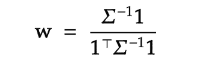
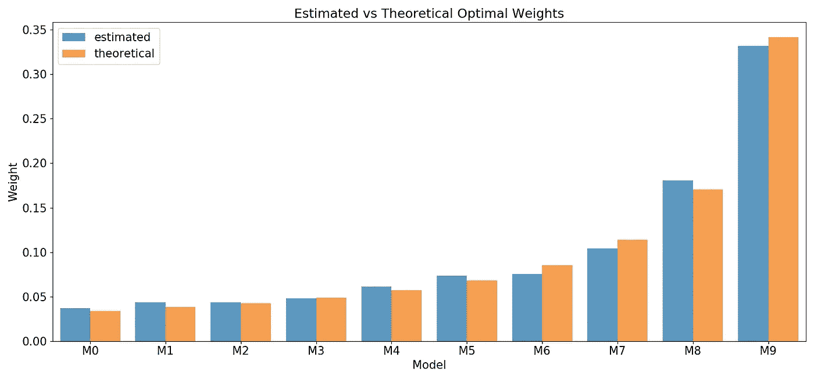
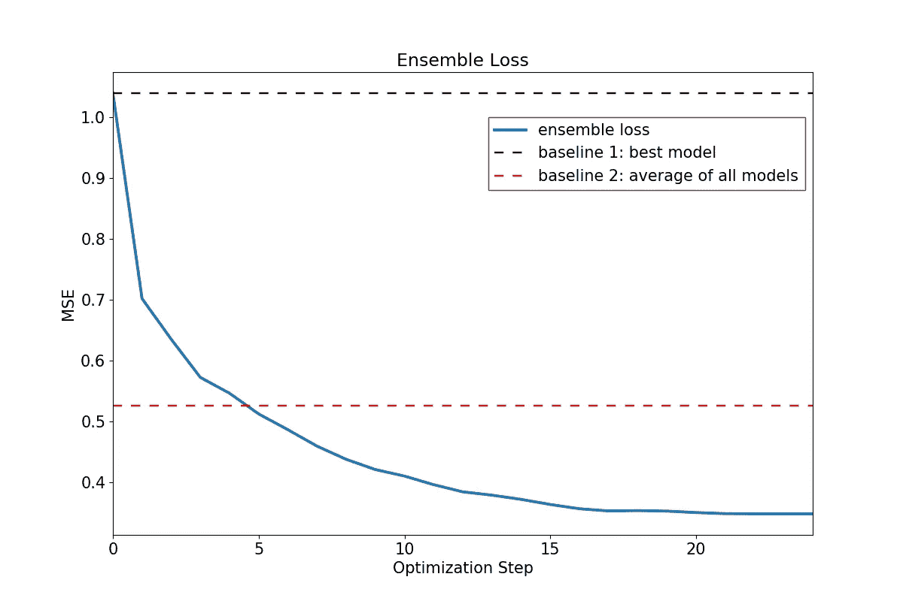
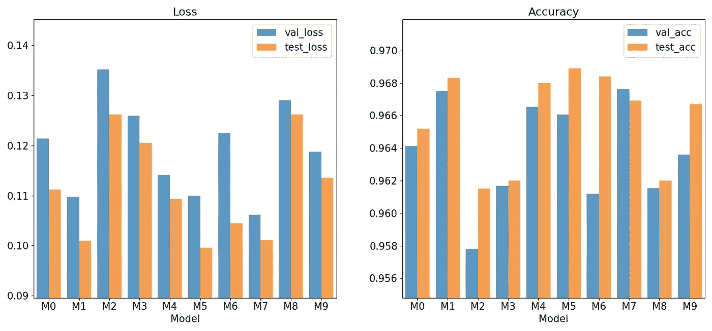
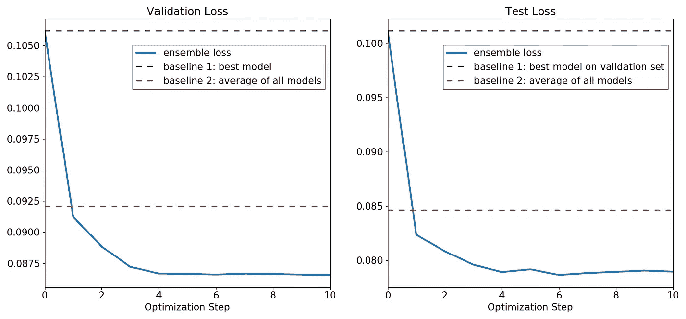
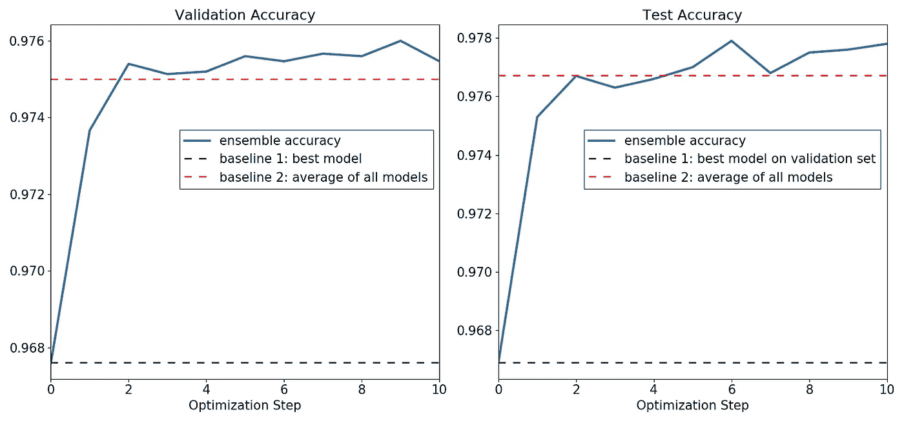
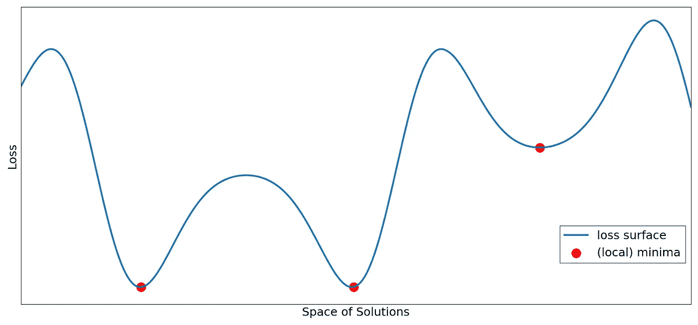
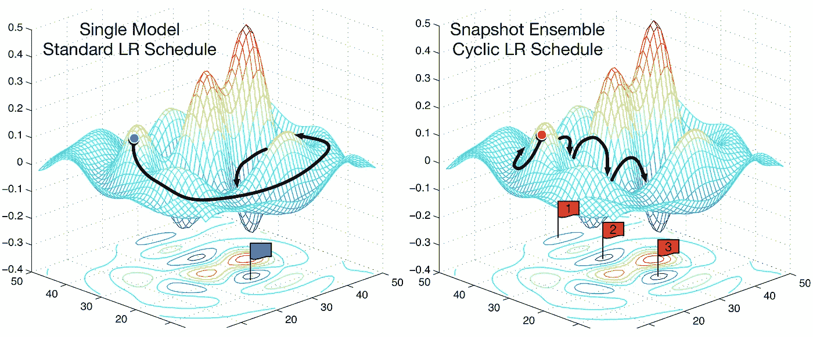

# 集成:机器学习中唯一(几乎)免费的午餐

> 原文：<https://towardsdatascience.com/ensembles-the-almost-free-lunch-in-machine-learning-91af7ebe5090?source=collection_archive---------11----------------------->

## **用 PyTorch 和 NumPy 建立神经网络的最佳集成**


照片由 [Riho Kroll](https://unsplash.com/@rihok?utm_source=medium&utm_medium=referral) 在 [Unsplash](https://unsplash.com?utm_source=medium&utm_medium=referral) 上拍摄

这篇文章附带的笔记本可以在这里找到。

*感谢* [*捷季扬娜德罗博特*](https://www.linkedin.com/in/tetyana-drobot/) *和* [*伊戈尔波兹杰耶夫*](https://www.linkedin.com/in/igor-pozdeev/) *的评论和建议。*

## 摘要

在这篇文章中，我将讨论集成优化这个有些被忽视的话题。我首先简要概述了一些常见的合奏技术，并概述了它们的弱点。然后，我介绍了一个简单的集成优化算法，并演示了如何用 Python 和 PyTorch 将它应用于构建神经网络集成。在这篇文章的最后，我讨论了集成方法在深度学习中的有效性，这是在当前关于神经网络损失曲面几何的文献的背景下进行的。

关键要点:

*   强集成由既准确又多样的模型组成
*   存在允许不适合作为 ML 模型的直接优化目标的现实目标函数的集成方法(考虑使用交叉熵进行训练，同时对一些其他度量感兴趣，如准确性)
*   集成不仅通过抑制神经网络对噪声的固有敏感性，而且通过组合质量上不同且不相关的解来提高神经网络的性能

帖子组织如下:
[一、简介](#2d63)
[二、帖子。集成优化](#1bf6)
[III。构建神经网络集成](#bcd1)
[IV。神经网络集成:损失面几何形状的作用](#2871)
[五、结论](#b087)

## 一.导言

集合是模型的集合，通过组合它们的预测来超越其中的每一个。强集成包括精确的模型，它们本身表现良好，但在犯不同错误的意义上是多样化的。这让我产生了深深的共鸣，因为我是一名金融专业人士——组合类似于建立一个由许多单个资产组成的稳健投资组合，并牺牲其中一些资产的更高预期回报，以通过分散投资来整体降低风险。“多元化是金融领域唯一的免费午餐”这句话出自现代投资组合理论之父哈里·马科维茨。鉴于集合和多样化在概念上是相关的，而且在某些问题上，两者在数学上是等价的，我决定给这篇文章起个名字。

为什么*差点*不过呢？因为考虑到最强大的模型(是的，神经网络)对资源的渴求，计算成本总是一个挥之不去的问题。除此之外，集成还会模糊单个模型的决策边界，从而损害决策树等更透明的机器学习算法的可解释性——这一点并不真正适用于神经网络，因为可解释性问题已经在单个模型层面上出现了。

构建合奏有几种方法:

*   **Bagging** 引导训练集，在产生的样本上估计模型的许多副本，然后平均它们的预测。
*   **增强**依次对训练样本重新加权，迫使模型关注具有较高损失值的训练样本。
*   S **跟踪**使用一个单独的验证集来训练一个结合多个模型预测的元模型。

例如，参见[Gilbert Tanner](/a-guide-to-ensemble-learning-d3686c9bed9a)[的这篇文章](https://medium.com/u/b986eefd54ba?source=post_page-----91af7ebe5090--------------------------------)或[Joseph Rocca](/ensemble-methods-bagging-boosting-and-stacking-c9214a10a205)的文章或 [Juhi Ramzai](https://medium.com/u/dc327e50cf35?source=post_page-----91af7ebe5090--------------------------------) 的文章[以获得这些方法的广泛概述。](/simple-guide-for-ensemble-learning-methods-d87cc68705a2)

当然，上面的方法都有一些共同的问题。首先，给定一组训练好的模型，如何选择最有可能概括得好的模型？在堆叠的情况下，这个问题将读作“如何将集合候选的数量减少到可管理的数量，以便堆叠模型可以处理它们，而没有大的验证集或高的过度拟合风险？”好吧，只需选择表现最好的模型，并应用与它们的损失成反比的权重，对吗？不对。尽管这通常是一个很好的起点。回想一下，一个好的集合由精确的和多样的模型组成:将几个高度精确的模型与强相关的预测结合在一起通常会导致所有的模型都采用相同的 rake。

第二个问题更微妙。通常，我们训练的机器学习算法几乎都是美化的特征提取器，即现实生活应用中的目标可能与用于训练模型的损失函数明显不同。例如，交叉熵损失是深度学习中分类任务的主要内容，因为它在优化期间具有可微性和稳定的数值行为，然而，根据我们可能对准确性、F1 分数或假阴性率感兴趣的领域。作为一个具体的例子，考虑对洪水或飓风等极端天气事件进行分类，在这种情况下，产生第二类错误(假阴性)的成本可能会高得惊人，甚至会导致准确性，更不用说交叉熵作为评估指标了。类似地，在回归设置中，常见的损失函数是均方误差。例如，在金融领域，为样本中的每项资产训练相同的模型来预测下一阶段的回报是很常见的，而在现实中，多个投资组合中有数百项资产的优化目标与强化学习和最优控制中遇到的目标类似:多个时间范围以及状态和路径依赖。在任何情况下，你既不被低 MSE 评判，也不被低 MSE 补偿(除非你在学术界)。

在这篇文章中，我详细讨论了卡鲁阿纳等人(2004) 提出的集成优化算法，它解决了上述问题。该算法可以广义地描述为无模型的贪婪堆叠，即在每个优化步骤，该算法或者向集合添加新的模型，或者改变当前成分的权重，从而最小化总损失，而没有任何支配性的可训练模型来指导选择过程。[卡鲁阿纳等人(2004)](#0418) 的方法配备了几个功能，可以缓解过拟合问题，还可以构建集成优化自定义指标，这些指标可能不同于用于训练单个模型的指标，从而解决了第二个问题。我进一步演示了如何应用该算法:首先，一个具有封闭形式解决方案的简单示例，接下来，通过为 MNIST 数据集构建一个最佳神经网络集合来解决一个现实问题(完整的 PyTorch 实现可以在[这里](https://github.com/DmitryBorisenko/ensemble_tutorial)找到)。在这篇文章的结尾，我探索了支持深度学习中集成有效性的机制，并讨论了当前关于损失曲面几何在神经网络泛化属性中的作用的文献。

本文的其余部分结构如下:[第二节](#1bf6)介绍了[卡鲁阿纳等人(2004)](#0418) 的总体优化方法，并用一个简单的数值例子加以说明。在第三部分的[中，我为 MNIST 数据集优化了一组神经网络(](#bcd1) [PyTorch 实现](https://github.com/DmitryBorisenko/ensemble_tutorial))。[第四节](#2871)简要讨论了深度学习中优化前景的文献及其对集成的影响。[第五节](#b087)结束。

**二。集成优化:** [**卡鲁阿纳等人(2004)**](#0418) **算法**

卡鲁阿纳等人(2004 年) 的方法相当简单。给定一组训练模型和它们在验证集上的预测，它们的集成构造算法的变体如下:

1.  设置`inint_size` *—* 初始集合中模型的数量和`max_iter` —最大迭代次数
2.  通过平均它们的预测和计算总集合损失，初始化具有`init_size`最佳性能模型的集合
3.  将集合中的模型(带有替换)添加到集合中，这最小化了总集合损失
4.  重复步骤 3，直到到达`max_iter`

这个版本的算法包括几个旨在防止验证集过拟合的特性。首先，用几个性能良好的模型初始化集成，形成一个强初始集成；第二，用替换来绘制模型实际上保证了验证集上的集合损失不会随着算法迭代的进行而增加——如果添加另一个模型不能进一步改善集合损失，则算法添加现有模型的副本，实质上调整它们在最终预测中的权重。这种权重调整属性允许将该算法视为无模型堆叠。这种方法的另一个有趣的特征是，用于集合构建和用于训练单个模型的损失函数不需要相同:如前所述，我们通常用特定的损失函数来训练模型，因为它在数学或计算上方便,(合理地)希望模型能够很好地用难以直接优化的相关性能度量来概括。事实上，与例如假阴性率相比，在恶性肿瘤分类任务中测试集上的交叉熵值不应该是我们主要关心的。

以下 Python 函数实现了该算法:

[卡鲁阿纳等人(2004)](#0418) 集成选择算法

考虑下面的玩具例子:假设我们有 10 个零均值正态分布不相关预测的模型。此外，假设预测的方差从 10 线性减少到 1，即第一个模型具有最高的方差，而最后一个模型具有最低的方差。给定一个数据样本，目标是建立一个集合，使相对于地面真实值 0 的均方误差最小化。请注意，在[卡鲁阿纳等人(2004)](#0418) 算法的上下文中,“构建一个集合”意味着为每个模型的预测分配一个介于 0 和 1 之间的权重，以便加权预测使 MSE 最小化，服从所有权重总和为 1 的约束。

通过将模型的预测视为某些资产的回报，并将优化目标视为最小化投资组合方差，金融爱好者会认识到最小方差优化问题的特殊情况。这个问题有一个封闭的解:



其中 **w** 是模型权重的向量，***σ***是预测的方差-协方差矩阵。在我们的例子中，预测是不相关的，并且*的非对角元素为零。以下代码片段通过使用`ensemble_selector`函数和分析方法解决了这个玩具问题，它还通过平均预测构建了一个简单的集合:*

*[下面的图 1](#bad0) 比较了集合优化(蓝色)和封闭形式解决方案(橙色)隐含的权重。结果非常接近，特别是考虑到我们使用真实方差而不是样本估计来计算解析解。请注意，尽管预测不确定性较低的模型获得了较高的权重，但高不确定性模型的权重不会变为零:预测是不相关的，我们总是可以通过添加不相关的变量(当然是有限方差)来降低随机变量加权和的方差。*

**

*图 1:估计的与理论的最佳重量*

*下一张图中的蓝色实线描绘了算法的前 25 次迭代的总体损失。黑色虚线和红色虚线分别表示由最佳单一模型和平均所有模型预测的简单集合获得的损失。在大约五次迭代之后，优化的集合击败了原始集合，此后获得显著更低的 MSE 值。*

**

*图 2:系综损失与优化步骤*

**如果池中模型数量非常多怎么办？**

*如果模型池非常大，一些模型可能会完全偶然地超过验证集。[卡鲁阿纳等人(2004 年)](#0418)建议使用装袋来解决这个问题。在这种情况下，该算法应用于从池中随机抽取的 *M* 个模型的行李，并替换为单个行李的平均最终预测。例如，抽取一个模型和 20 个袋子的概率为 25%，任何特定模型不在任何一个袋子中的概率仅为 0.3%左右。*

## ***三。构建神经网络集成:MNIST 实例***

*配备了上一节中的技术，在这一节中，我们将把它们应用到一个实际的任务中，在 MNIST 数据集上构建和优化一个神经网络集成。使用随附的笔记本可以完全复制本节的结果，因此我将本节中的代码片段限制为最少，主要集中在集成上，而不是模型定义和培训上。*

*我们从一个简单的 MLP 开始，它有 3 个隐藏层，每层 100 个单位，每个都有 ReLU 激活。自然，MNIST 数据集的输入是一个 28x28 像素的图像，展平为一个 784 维的矢量，输出图层有 10 个对应于位数的单元。因此，PyTorch 中实现的`MNISTMLP`类指定的架构如下所示:*

```
*MNISTMLP(
  (layers): Sequential(
    (0): Linear(in_features=784, out_features=100, bias=True)
    (1): ReLU()
    (2): Linear(in_features=100, out_features=100, bias=True)
    (3): ReLU()
    (4): Linear(in_features=100, out_features=100, bias=True)
    (5): ReLU()
    (6): Linear(in_features=100, out_features=10, bias=True)
  )
)*
```

*然后，我们使用独立的权重初始化(即，除了起始权重之外，一切都是相同的)对模型的 10 个实例进行 3 个时期的训练，每个时期的批量大小为 32，学习率为 0.001，保留 60，000 幅图像的训练集的 25%用于验证，最后的 10，000 幅图像构成测试集。目标是最小化交叉熵(等价地，负对数似然)。请注意，只有 3 个时期的训练以及每个模型相当小的容量可能会导致数据拟合不足，从而允许以更生动的方式展示集合的好处。*

*训练完成后，我们恢复 10 个模型中每个模型的最佳检查点(通过验证损失)。下图左侧面板显示了从`M0` 到`M9`的每个型号的验证(蓝色)和测试(橙色)损失。类似地，右边的面板显示了验证和测试的准确性。*

**

*图 3:模型的验证和测试集性能*

*正如所料，所有模型的表现都很差，其中最好的一个模型`M7`，在测试集上仅达到 96.8%的准确率。*

*为了构建一个最优集合，让我们首先调用上一节定义的`ensemble_selector`函数，然后在当前问题的上下文中检查各个参数:*

*`y_hats_val`是一个字典，其中模型名称作为关键字，验证集的预测类概率作为项目:*

```
*>>> y_hats_val["M0"].round(3)
array([[0\.   , 0\.   , 0\.   , ..., 0.998, 0\.   , 0.001],
       [0\.   , 0.003, 0.995, ..., 0\.   , 0.001, 0\.   ],
       [0\.   , 0\.   , 0\.   , ..., 0.004, 0\.   , 0.975],
       ...,
       [0.999, 0\.   , 0\.   , ..., 0\.   , 0\.   , 0\.   ],
       [0\.   , 0\.   , 1\.   , ..., 0\.   , 0\.   , 0\.   ],
       [0\.   , 0\.   , 0\.   , ..., 0\.   , 0.007, 0\.   ]])>>> y_hats_val["M7"].round(3)
array([[0\.   , 0\.   , 0\.   , ..., 1\.   , 0\.   , 0\.   ],
       [0\.   , 0\.   , 1\.   , ..., 0\.   , 0\.   , 0\.   ],
       [0\.   , 0\.   , 0\.   , ..., 0.003, 0\.   , 0.981],
       ...,
       [0.997, 0\.   , 0.002, ..., 0\.   , 0\.   , 0\.   ],
       [0\.   , 0\.   , 1\.   , ..., 0\.   , 0\.   , 0\.   ],
       [0\.   , 0\.   , 0\.   , ..., 0\.   , 0.002, 0\.   ]])*
```

*`y_true_one_hot_val`是对应的真独热编码标签的 numpy 数组:*

```
*>>> y_true_one_hot_val
array([[0., 0., 0., ..., 1., 0., 0.],
       [0., 0., 1., ..., 0., 0., 0.],
       [0., 0., 0., ..., 0., 0., 1.],
       ...,
       [1., 0., 0., ..., 0., 0., 0.],
       [0., 0., 1., ..., 0., 0., 0.],
       [0., 0., 0., ..., 0., 0., 0.]])*
```

*`loss_function`是一个可调用的映射数组，将预测和标签映射到一个标量:*

```
*>>> cross_entropy(y_hats_val["M7"].round(3), y_true_one_hot_val)
0.010982255936197028*
```

*最后，`init_size=1`表示我们从单一模型的系综开始；`replacement=True`表示模型加入集成后不从模型池中移除，允许算法多次加入同一个模型，从而调整集成成分的权重；`max_iter=10`设置算法的步数。*

*现在让我们检查输出。`model_weights`是一个 pandas 数据帧，包含每个优化步骤的每个模型的总体权重。在每个优化步骤中删除所有权重为零的模型会产生:*

```
*>>> model_weights.loc[:, (model_weights != 0).any()] M1        M4        M5        M7        M9
0   0.000000  0.000000  0.000000  1.000000  0.000000
1   0.000000  0.000000  0.500000  0.500000  0.000000
2   0.000000  0.000000  0.333333  0.333333  0.333333
3   0.000000  0.250000  0.250000  0.250000  0.250000
4   0.200000  0.200000  0.200000  0.200000  0.200000
5   0.166667  0.166667  0.166667  0.333333  0.166667
6   0.142857  0.142857  0.285714  0.285714  0.142857
7   0.125000  0.250000  0.250000  0.250000  0.125000
8   0.111111  0.222222  0.222222  0.222222  0.222222
9   0.100000  0.200000  0.200000  0.300000  0.200000
10  0.181818  0.181818  0.181818  0.272727  0.181818*
```

*下图绘制了作为优化步骤函数的总体成分权重，其中较暗的色调对应于模型在所有优化步骤中获得的较高平均权重。在步骤 0，集合以单个最强的模型`M7`初始化，然后逐步添加更多的模型，给每个模型分配相等的权重:在步骤 1，有两个模型`M7`和`M5`，每个模型具有 50%的权重，在步骤 2，集合包括模型`M7`、`M5`和`M9`，每个模型具有三分之一的权重。在步骤 4 之后，没有新的模型可以进一步改进集合预测，并且算法开始调整其成分的权重。*

**

*图 4:总体权重*

*另一个输出——`ensemble_loss`——包含每个优化步骤的系综损失。与上一节中的图 2[相似，下图的左面绘制了优化过程中验证集的总体损失(蓝色实线)。黑色虚线和红色虚线分别表示最佳单一模型和简单集合(对所有模型分配相同的权重)所达到的验证损失。集合损失下降得非常快，在几次迭代后超过了其简单对应物的性能，并且在算法进入权重调整模式后稳定下来，这在模型池相当小的情况下并不令人惊讶。右边的面板报告了测试集的结果:在每次迭代中，我使用当前的集合权重来产生预测并测量测试集的损失。该集成在测试样本上概括得很好，有效地重复了在验证集上观察到的模式。](#0d4d)*

**

*图 5:MNIST 的系综损失*

*[卡鲁阿纳等人(2004)](#0418) 算法非常灵活，我们可以很容易地调整`ensemble_selector`，例如，通过改变`loss_function`参数直接优化精度:*

*其中`accuracy`定义如下:*

*下图重复了前面的分析，但这次是为了验证和测试准确性。结论是相似的，尽管在两个样本中集合的精度路径更不稳定。*

**

*图 6:集合精度，MNIST*

## *四。更多关于神经网络中的集合:损失表面几何的重要性*

**为什么随机初始化有效？**

*简而言之，这完全是关于损失面的。当前的深度学习研究强调优化前景的重要性。例如，批量标准化( [Ioffe 和 Szegedy (2015)](#a210) )传统上被认为是通过减少*内部协变量移位*——训练期间网络激活分布的变化，来加速和规范训练。然而， [Santurkar 等人(2018)](#121d) 提供了一个令人信服的论点，即该技术的成功源于另一个属性:批处理规范化使优化前景明显更加平滑，从而稳定梯度并加快训练。类似地， [Keskar 等人(2016)](#50f3) 认为，与地形较平坦区域的最小值相比，损失面上的尖锐最小值具有较差的泛化属性。*

*在训练期间，神经网络可以被视为将参数映射到给定训练数据的损失值的函数。下图描绘了(非常)简化的网络损耗图:解的空间和损耗分别沿水平轴和垂直轴。 *x* 轴上的每个点代表产生相应损耗的网络的所有权重和偏差(蓝色实线)。红点表示我们可能使用基于梯度的优化结束的局部最小值(最左边的两个点是全局最小值)。*

**

*在集合的上下文中，这意味着我们想要探索许多局部最小值。在上一节中，我们已经看到，同一神经网络结构的不同初始化的组合产生了更好的泛化能力。事实上，在他们最近的论文[中，Fort 等人(2019)](#d15f) 证明了随机初始化最终会达到遥远的最优，因此能够探索完全不同的模型，具有相似的准确性和相对不相关的预测，从而形成强集成组件。这一发现补充了神经网络的标准直觉，即神经网络是最终的低偏差高方差算法，能够以几乎外科手术的精度拟合任何东西，尽管受到噪声敏感性的困扰，因此受益于方差减少带来的集成。*

**但是如果训练同一个模型的几个副本是不可行的，该怎么办呢？**

*[黄等(2018)](#cefb) 提出在单次训练运行期间使用循环学习率和退火构建集成，并在每个循环结束时存储模型检查点或快照。直观上，增加学习速率可以允许模型避开上图中的任何局部最小值，并以不同的局部最小值落在邻近区域，最终收敛到该区域，随后学习速率降低。下图说明了快照集成技术。左图显示了模型在具有恒定学习速率的标准训练体系期间穿过损失景观的路径，并且最终停止点用蓝色旗帜标记。右图描绘了循环学习率时间表和用红旗标记的定期快照。*

**

*快照集，来源:[黄等(2017)](https://arxiv.org/abs/1704.00109)*

*但是，请记住，在前面的两个图中，整个参数空间分别被压缩到 *x* 轴和 *xy* 平面上的一个点中，这意味着图形上的一对相邻点在实际参数空间中可能相距很远，因此， 梯度下降算法遍历多个最小值而不被卡住的能力取决于损失表面上的对应谷是否被非常高损失的区域分开，使得学习中没有有意义的增加会导致到新谷的过渡。*

*幸运的是， [Garipov 等人(2018)](#1bc6) 证明了在优化景观上存在连接局部最小值的低损耗路径，并提出了利用这些连接的快速几何组合(FGE)过程。[伊兹迈洛夫等人(2018)](#48a7) 提出了 FGE 的进一步细化——随机加权平均(SWA)。*

*[Max Pechyonkin](https://medium.com/u/38025716cba8?source=post_page-----91af7ebe5090--------------------------------) 为[提供了快照集](/stochastic-weight-averaging-a-new-way-to-get-state-of-the-art-results-in-deep-learning-c639ccf36a)FGE 和西南威尔士州。*

## *动词 （verb 的缩写）结论*

*让我们回顾一下这篇文章的要点:*

*   *强集成由既准确又多样的模型组成*
*   *一些无模型集成方法，如[卡鲁阿纳等人(2004)](#0418) 算法，允许不适合作为 ML 模型优化目标的实际目标函数*
*   *集成不仅通过抑制神经网络对噪声的固有敏感性，而且通过组合质量上不同且不相关的解来提高神经网络的性能*

*总而言之，集成学习技术应该是每个机器学习实践者的武器库中最重要的工具之一。不要把所有的鸡蛋放在一个篮子里这句古老的格言到底走了多远，确实令人着迷。*

**感谢您的阅读。我们热切期待您的评论和反馈。还有，在*[*LinkedIn*](http://www.linkedin.com/in/dmitry-borisenko)*上联系我。**

## *进一步阅读*

*[](/stochastic-weight-averaging-a-new-way-to-get-state-of-the-art-results-in-deep-learning-c639ccf36a) [## 随机加权平均——一种获得深度学习最新结果的新方法

### 更新:你现在可以在我的个人博客上欣赏这篇文章，这里的数学排版要好得多(Medium 不支持…

towardsdatascience.com](/stochastic-weight-averaging-a-new-way-to-get-state-of-the-art-results-in-deep-learning-c639ccf36a) [](/a-guide-to-ensemble-learning-d3686c9bed9a) [## 集成学习指南

### 没有人能知道所有的事情，但是在帮助下，我们可以克服每一个障碍。这正是合奏背后的理念…

towardsdatascience.com](/a-guide-to-ensemble-learning-d3686c9bed9a) 

## 参考

Caruana，r .，Niculescu-Mizil，a .，Crew，g .，& Ksikes，A. (2004 年 7 月)。模型库中的集成选择。第二十一届机器学习国际会议论文集(第 18 页)。

Fort，s .，Hu，h .，& Lakshminarayanan，B. (2019)。损失景观透视。 *arXiv 预印本*[arXiv:1912.02757](https://arxiv.org/abs/1912.02757)

茨韦塔纳·加里波夫、伊兹迈洛夫、波多普里欣、维特罗夫和威尔逊(2018 年)。损耗面、模式连接性和 dnn 的快速组装。在*神经信息处理系统的进展*(第 8789-8798 页)。在[T3 可用 arXiv:1802.10026](https://arxiv.org/abs/1802.10026)

黄，李，杨，普莱斯，刘，郑，霍普克罗夫特，J. E .，，温伯格，K. Q. (2017)。快照合集:火车 1，免费获得 m。 *arXiv 预印本*[*arXiv:1704.00109*](https://arxiv.org/abs/1704.00109)

Ioffe，s .，& Szegedy，C. (2015 年)。批量标准化:通过减少内部协变量转移加速深度网络训练。 *arXiv 预印本*[*arXiv:1502.03167*。](https://arxiv.org/abs/1502.03167)

伊兹迈洛夫、波多普里欣、加里波夫、维特罗夫和威尔逊(2018 年)。平均权重导致更宽的最优值和更好的泛化能力。 *arXiv 预印本*[*arXiv:1803.05407*。](https://arxiv.org/abs/1803.05407)

Keskar，N. S .，Mudigere，d .，Nocedal，j .，Smelyanskiy，m .，，Tang，P. T. P. (2016)。深度学习的大批量训练:泛化差距和尖锐极小值。 *arXiv 预印本*[*arXiv:1609.04836*。](https://arxiv.org/abs/1609.04836)

桑图尔卡尔、齐普拉斯、易勒雅斯和马德瑞(2018 年)。批量规范化对优化有什么帮助？。在*神经信息处理系统的进展*(第 2483-2493 页)。可在[*arXiv:1805.11604*](https://arxiv.org/abs/1805.11604)获得。*