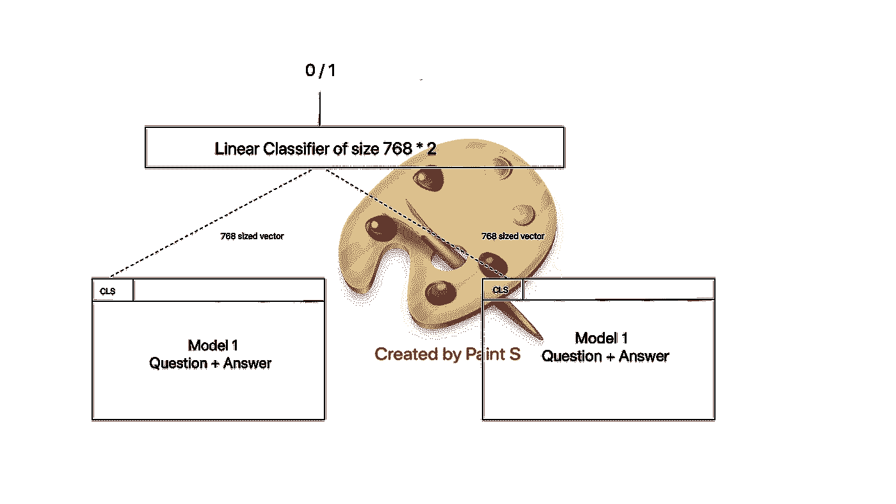
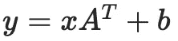

# 组装 HuggingFaceTransformer 模型

> 原文：<https://towardsdatascience.com/ensembling-huggingfacetransformer-models-f21c260dbb09?source=collection_archive---------23----------------------->


照片由 [@jeetdhanoa](https://unsplash.com/@jeetdhanoa) 在 [unsplash](https://unsplash.com/) 上拍摄

## 使用一个简单的线性层将两个或更多的变形金刚组合在一起。

最近，当我使用 BERT 进行问答研究时，有人建议我集成两个 BERT 模型。我选择了一条显而易见的路线——谷歌搜索。但令我惊讶的是，什么都没有出现。有很多关于变形金刚的文章，但是没有关于如何组合变形金刚模型的。本文讨论的正是这个问题——如何集成两个 PyTorch 拥抱脸变压器模型。

**什么是模型组装？**
在很多情况下，一个单一的模型可能不会给出最好的结果。然而，如果我们将“几个弱”分类器组合在一起，并以一种有意义的方式组合这些弱分类器的结果，我们可能会得到更好的结果。

例如，假设我们正在使用 BERT 进行问答—如果我们将两个句子*send _ 1*和*send _ 2*传递给 BERT 模型，该模型应该预测这两个句子是否形成问答对，即*send _ 2*answers*send _ 1*。

通常的技术是以两种方式向模型提供问答对—
*【CLS】+sent _ 1+【SEP】+sent _ 2+【SEP】*和
*【CLS】+sent _ 2+【SEP】+sent _ 1+【SEP】*
到*一个单一模型*，并训练该模型。

如果我们宁愿*集合* 2 个模型——以如下方式训练 2 个模型，而不是这样做:
**模型 1** 获得输入，
*【CLS】+sent _ 1+[SEP]+sent _ 2+[SEP]*，
**模型 2** 获得输入，
*【CLS】+sent _ 2+[SEP]+sent _ 1+[SEP]*

然后，使用一个简单的前馈网络，我们可以结合模型的结果(不要在如何做上敲你的头，只是假设它现在可以做。我将展示如何做到这一点，这是本文的关键)。

1.  **为什么组装更好？** *嗯，这不！至少不总是这样。*在某些情况下，集成的结果可能优于单个大模型。这是可行的，因为手头的任务可能太复杂，一个单一的模型无法理解。
    这与一个有 100 个神经元的深度 CNN 比一个有 1 层和 100 个神经元的 CNN 工作得更好的原因是一样的——每一层都学到不同的东西，使整个模型变得更好。这和一个人比一头狮子弱是一个道理，但是作为一个社会，我们是地球上最优越的物种。这和 5 个我比 1 个梅西强是一个道理(至少我昨天是这么想的😆).这和悟吉塔比布罗利强是一个道理。但是最主要的原因是他们没有过度适应。

# 单一模型方法

让我们回到问答的例子。让我们考虑 3 个句子，

*句子 _1* =谁杀了弗里扎？
*句子 _2* =弗里扎被小悟空杀死
*句子 _3* =弗里扎消灭了玛雅人却放过了玛雅人。

我们馈入模型，
**输入**:*【CLS】+句子 _ 1+【SEP】+句子 _ 2+【SEP】*
**输出** : 1
**输入**:*【CLS】+句子 _ 1+【SEP】+句子 _ 3+【SEP】*
**输出** : 0

如前所述，如果我们有一个单一的模型，那么训练模型的正常方式是，
*【CLS】+问题+【SEP】+答案+【SEP】
【CLS】+答案+【SEP】+问题+【SEP】*
具体到我们的情况，
*【CLS】+句子 _ 1+【SEP】+句子 _ 2+【SEP】
【CLS】+句子 _ 2+【SEP】+句子 _ 1+【SEP】* 

# 变形金刚合奏

在这种方法中，我们有两种模式

1.  模型 1
    **输入**:*【CLS】+提问+【SEP】+回答+【SEP】*
2.  模型 2
    **输入**:*【CLS】+回答+【九月】+提问+【九月】*

现在的问题变成了如何将两个模型的输出合并成一个，即系综？

嗯，空谈是廉价的，所以让我们编码。由于代码并不便宜，我将尝试解释它的大部分。



*作者提供的图片(使用 Paint S 创建)*

# 代码

首先，我创建了一个名为*BertEnsembleForNextSentencePrediction 的新模型。*

```
self.bert_model_1 = BertModel(config)        
self.bert_model_2 = BertModel(config)         
self.cls = nn.Linear(self.n_models * self.config.hidden_size, 2)
```

*BertEnsembleForNextSentencePrediction*以 2 个 *BertModel* 作为输入(在 *__init__* 中可以看到)并增加一个 *nn。线性*在它们上面。 *nn。线性，*如前面提到的[*这里的*](https://pytorch.org/docs/master/generated/torch.nn.Linear.html) *，*应用线性变换就像:



在输入端。我来解释一下为什么 *nn。使用了线性*(尽管任何看过一点变形金刚代码的人应该能够立即看到许多 *nn。线性*如*bertonlynshead，BertForSequenceClassification，*等。).

```
input_ids_1 = input_ids[0]        
attention_mask_1 = attention_mask[0]        
token_type_ids_1 = token_type_ids[0]input_ids_2 = input_ids[1]        
attention_mask_2 = attention_mask[1]        
token_type_ids_2 = token_type_ids[1]
```

接下来是主*前进*功能。转发函数的参数 *input_ids、attention_mask、token_type_ids* 为元组，第 0 个索引用于第一个模型，第 1 个索引用于第二个模型。因此，第一个模型将 T28 输入 _ 标识[0]，注意 _ 屏蔽[0]，令牌 _ 类型 _ 标识[0]作为输入。(我不会详细说明这些术语的含义，因为它们是标准的 BERT 术语)。以上 6 行正是这么做的。

```
outputs.append(self.bert_model_1(input_ids_1, attention_mask=attention_mask_1, token_type_ids=token_type_ids_1))outputs.append(self.bert_model_2(input_ids_2, attention_mask=attention_mask_2, token_type_ids=token_type_ids_2))
```

然后，我们将上面的左侧变量，即*输入 _ 标识 _1、注意 _ 屏蔽 _1、令牌 _ 类型 _ 标识 _1、输入 _ 标识 _2、注意 _ 屏蔽 _2、令牌 _ 类型 _ 标识 _2* 传递给 BERT 模型— *BertModel* 。

如[此处](https://huggingface.co/transformers/model_doc/bert.html#bertmodel)所示， *BertModel* 返回 *last_hidden_state* 和 *pooler_output* 作为前两个输出。我们对这里的*池 _ 输出*感兴趣。这里所说的[和](https://huggingface.co/transformers/model_doc/bert.html#bertmodel)中的 *pooler_output* 是

> L 由线性层和双曲正切激活函数进一步处理的序列的第一个标记(分类标记)的 ast 层隐藏状态。在预训练期间，根据下一句预测(分类)目标来训练线性层权重。

对于给定的输入， *pooler_output* 的大小为( *batch_size，hidden_size* )。默认情况下 *hidden_size = 768。*

```
last_hidden_states = torch.cat([output[1] for output in outputs], dim=1) 
logits = self.cls(last_hidden_states)
```

现在进入使用 *nn.Linear.* 的主要组合部分，如何组合模型 1 和模型 2 的输出？很简单——每个模型中的*【CLS】*令牌都是大小( *batch_size * 768* )。所以基本上对于每个问答配对，我们都有一个大小为 768 的向量。因此，对于每个给定的问答配对，将有分别从 2 个模型中的每一个生成的每个大小为 768 的 2 个向量。比如
*【cls 1】+谁杀了 Freeza？+ [SEP] +弗里扎被悟空+[SEP]*
*【cls 2】+弗里扎被悟空+ [SEP] +谁杀了弗里扎？+ [SEP]*

*nn。线性*接受*输出*数组元素的串联，即展平*输出*数组并执行线性运算*。*因此，线性层将大小为(2 * 768)的向量作为输入，并输出 0 或 1 的概率，即*逻辑值*(逻辑值并不完全是概率，但如果我们对逻辑值应用 softmax，我们会得到概率，所以它足够接近)。

因此，线性层将大小为(2 * 768)的向量作为输入，并输出 0 或 1。

这是一个完整的工作示例。
[https://colab . research . Google . com/drive/1 syrrbaudjhikjhnxxazt 5 w _ uka 0 bmk 9 x？usp =分享](https://colab.research.google.com/drive/1SyRrBAudJHiKjHnxXaZT5w_ukA0BmK9X?usp=sharing)

请注意，代码中使用的数据集非常小，代码的编写方式对于这样小的数据集来说是一个巨大的破坏。但是我编写代码的方式使得任何更大的数据集都可以使用。此外，PyTorch 的通用模式已用于编写代码。我发现保存这个模板并根据用例稍微调整一下代码很有用。

就是这样！

# 参考和链接:

1.  为什么集合更好:[https://www . quora . com/How-do-ensemble-methods-work-and-why-be-superior-to-individual-models](https://www.quora.com/How-do-ensemble-methods-work-and-why-are-they-superior-to-individual-models)
2.  PyTorch *nn。线性*:[https://py torch . org/docs/master/generated/torch . nn . linear . html](https://pytorch.org/docs/master/generated/torch.nn.Linear.html)