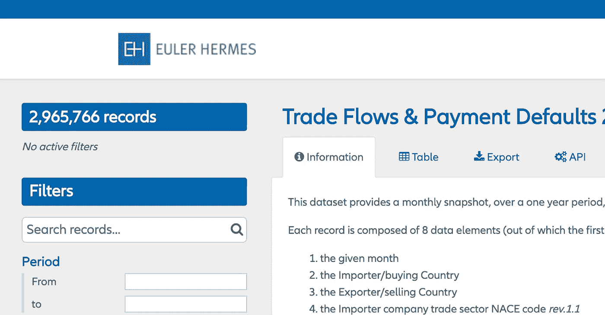
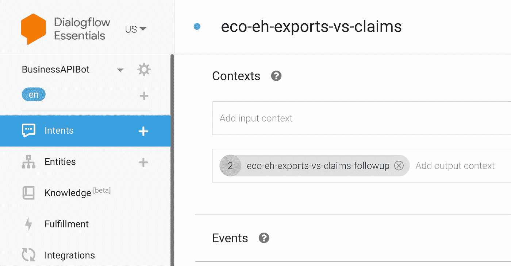
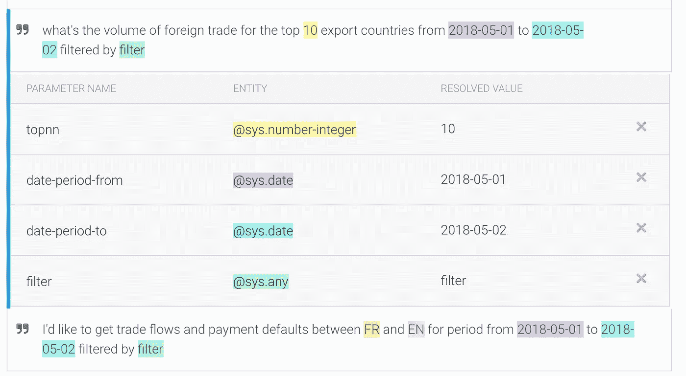
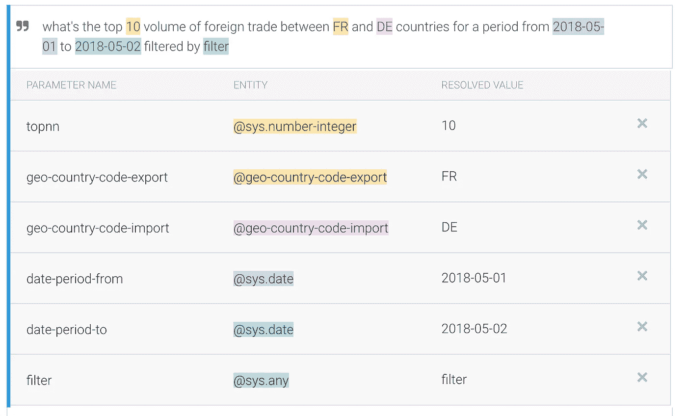
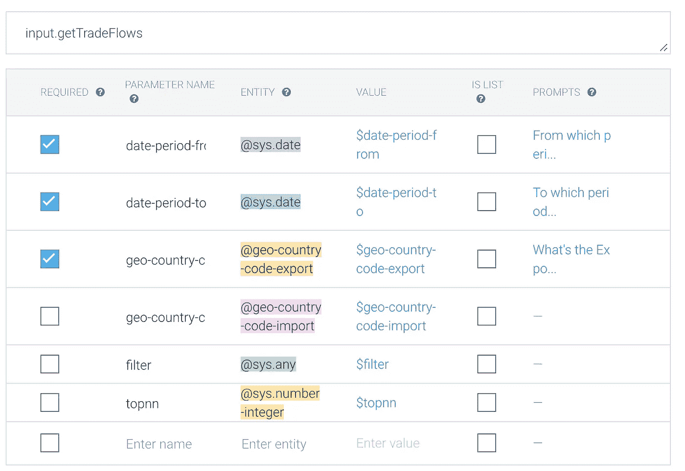
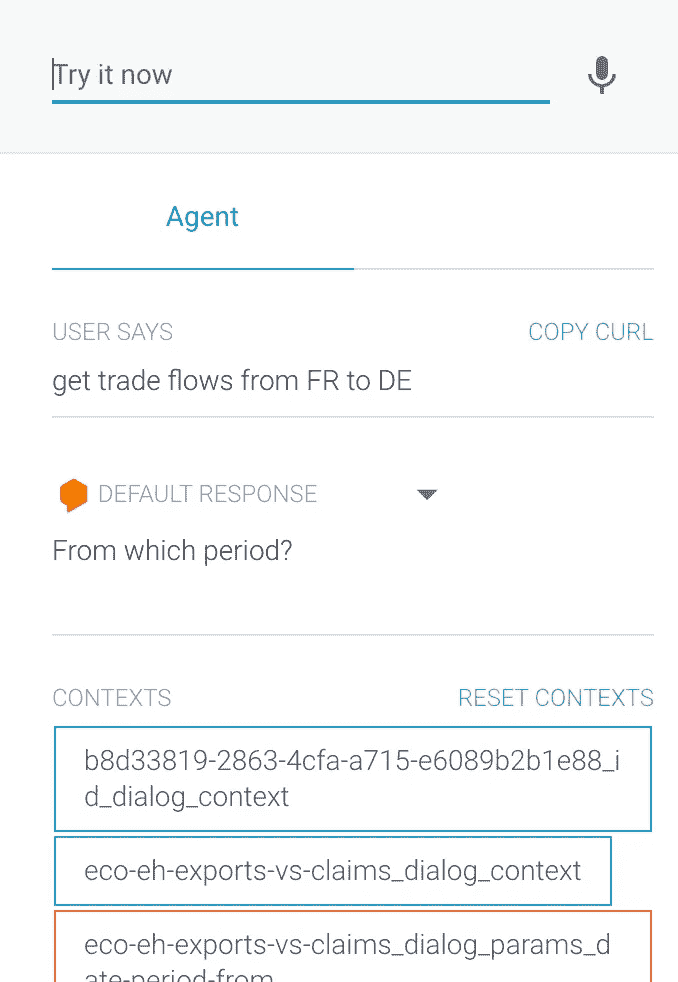
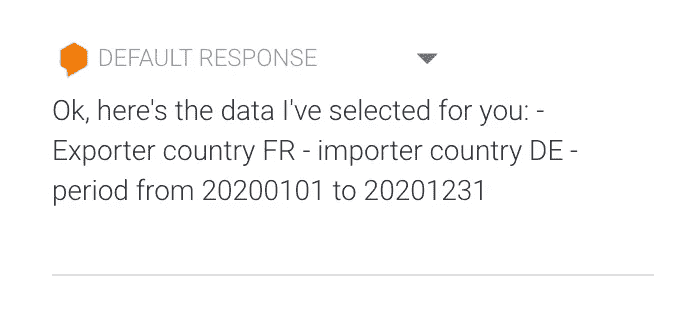

# 带有 Google Dialogflow & Flutter 的企业级聊天机器人(第一部分)

> 原文：<https://towardsdatascience.com/enterprise-grade-multi-platform-virtual-assistant-with-google-dialogflow-flutter-part-i-da6f05edfed?source=collection_archive---------50----------------------->

参见第二部分[此处](https://osy-46577.medium.com/enterprise-grade-multi-platform-virtual-assistant-with-google-dialogflow-and-flutter-part-ii-343327236d8f?source=friends_link&sk=e4dc10d1758a5834d14af42ada375718)。

# 1)人工智能和虚拟助手革命

*图片经 Canva 授权给 Catherine Torchy (* 我的妻子)

消费级虚拟助手(如谷歌助手、Alexa、Siri)已经深刻改变了人们在个人生活中与技术打交道的方式。但我是相信有一天，虚拟助理和人工智能将被大规模用于改变员工在工作中与系统互动的方式，并自动化他们的日常任务的人之一。

目前，挑战主要是与现有业务解决方案(如 ERP)的集成、与用户系统上不存在的外部数据连接的能力，以及在各种平台(包括 web 和移动设备)上获得一致的用户体验的能力。

这一系列 3 篇技术文章的想法是在对市场上提出的几个聊天机器人和对话引擎进行评估后产生的。它们中的大多数都提供了与语言(NodeJS、Java、Python..)、消息系统(Facebook Messenger、Slack、Telegram、Hangouts……)但要想知道如何将它们集成到一个商业解决方案中并不容易。此外，它们的渲染通常非常有限，无法为业务需求提供可接受的用户体验。

我读过很多提供部分解决方案的文章。然后开始了三重挑战:

*   如何将对话引擎与外部 API 轻松集成
*   如何通过使用自定义消息和一组丰富的组件来解决默认呈现引擎的布局限制(例如，Google Assistant 的限制),以获得更好的用户体验
*   如何用相同的代码管理多平台/移动前端

所以，我选择了最强大的 NLP 对话引擎之一，Google Dialogflow，但它也可能是微软 Bot 或亚马逊 Lex。然后我结合一个 Google Flutter 应用，突破 Google Assistant、Slack 等的布局限制。

如果你已经读过我的文章，那么答案是……“是的”，这篇文章是为那些打算继续实践的人提供的又一个简单的循序渐进的教程。它将集中于超越虚拟助理的基本设计所需的知识。还需要一些关于 Dialogflow、NodeJS、API/web services 和 Flutter 的知识。像往常一样，这些文章(Dialogflow & Flutter 项目)的全部源代码将会发布在我的 git lab(【https://gitlab.com/osadey】)上

有大量的教程描述了如何在 Dialogflow 中配置意图。这一篇将关注与业务 API 使用相关的 dialog flow Intents & Fulfillment NodeJS 代码。下一步将在 Google Assistant 集成中使用相同的意图，然后在定制的 Flutter 移动应用程序中使用相同的意图。

# 2)欧拉·爱马仕金融开放数据 API 介绍

作者图片

本节的目的是让您在询问财务数据时配置理解用户请求的对话。每个请求都可以用不同的方式表达，并且有参数。如果缺少，将要求用户完成它们。一旦满足要求，就会调用 Opendata API，并将财务数据返回给用户。

我们的财务虚拟助理将从 Euler Hermes Economics Open Data 获得一些财务数据，并将它们显示给用户(参见[https://opendata.eulerhermes.com/pages/home-page/](https://opendata.eulerhermes.com/pages/home-page/)),但它也可能是令人印象深刻的数据库。经济学数据提供商。(【https://db.nomics.world/】T2

你在这两个网站上看到的大部分东西都可以通过 RESTful APIs 查询。

现在我们来探究一下欧拉·赫尔墨斯的一些国际贸易数据。在我们的例子中，我们将连接到一个数据集，该数据集提供了进口国和出口国之间的**贸易流和支付默认值**(参见:[https://open data . Euler Hermes . com/explore/dataset/exports-vs-claims/information/](https://opendata.eulerhermes.com/explore/dataset/exports-vs-claims/information/))

数据集由 8 个数据元素组成:

*   年/月
*   进口商/购买国
*   出口商/销售国
*   进口商公司贸易部门 NACE 代码
*   给定月份向 Euler Hermes 申报的贸易流量总额(€)
*   给定月份向 Euler Hermes 申报的拖欠付款总额(€)
*   交通灯是给定购买人群的风险指示器
*   给定人群的损失率代理

# 3)配置您的对话流代理和意图

作者图片

**3.1。我们的使用案例**

代理是关于相同主题的一组会话的配置，共享相同的目标。我们的代理将显示一个贸易流和付款违约的清单，从一个出口国到一个进口国之间的两个日期。然后，用户将能够通过几个标准过滤列表。(例如“建筑”)

用户可以使用不同的短语来提问，应该会给出相同的结果。

以下部分假设您已经对 Dialogflow 有了基本的了解。

**3.2。创建代理**

让我们创建一个基本的对话流**代理**

一旦登录到谷歌对话流控制台([https://dialogflow.cloud.google.com/](https://dialogflow.cloud.google.com/))

1.  创建一个**新代理**，并将其命名为 *BusinessAPIBot*
2.  在“常规”选项卡上添加描述

您可以保留其他选项卡上的其他默认值。

**3.2。创建意图**

意图代表用户和虚拟助理之间的典型对话。

让我们创建我们的第一个意图。

1.  点击左侧菜单中的“+”按钮添加意向
2.  将其命名为'*生态出口与索赔'*
3.  输入您的第一个训练短语如下“*由过滤器*过滤的 2018-05-01 至 2018-05-02 前 10 大出口国家的对外贸易额是多少？”

正如您所注意到的，训练短语有一些以不同颜色突出显示的参数。可以选择训练短语的每个元素，然后作为参数添加。参数可以有多种类型:例如整数、日期或用户定义。

参数需要与实体相关联。

如果 Dialogflow 无法自动创建它们，您将首先需要使用左侧的“实体”菜单手动创建它们，然后将它们添加到实体列表中。

现在，我们将向我们的训练短语添加参数:

1.  选择“从”日期(此处为“2018–05–01”)
2.  将出现一个弹出窗口。选择一个“@sys.date”实体
3.  将参数命名为“日期-期间-自”
4.  对“至”日期“2018–05–01”执行相同的操作，并将其命名为“日期-期间-至”
5.  对“10”值执行相同的操作，并将其分配给“@sys.number-integer”实体。把它命名为‘topnn’
6.  最后，对“filter”值执行相同的操作，并将其分配给一个“@sys.any”实体。将其命名为“过滤器”

你的第一个训练短语应该是这样的:

作者图片

现在，让我们添加另外两个训练短语，以便当对话引擎提出不同的请求时，能够更好地理解它的请求。

输入您的第二个训练短语如下:“*在 2018-05-01 至 2018-05-02 期间，由过滤器过滤的法国和德国之间的前 10 大对外贸易额是多少”*

你可以注意到这个有点不同。“topnn”参数出现在开头，有两个新的附加参数:出口国和进口国。

1.  选择“FR”国家值，并将其分配给新的“@geo-country-code-export”实体。将参数命名为“地理国家代码导出”
2.  选择“DE”国家值，并将其分配给新的“@geo-country-code-import”实体。将参数命名为“地理国家代码导入”
3.  对第一个训练短语进行相同的操作，以确定其他参数

你的第二个训练短语应该是这样的:

作者图片

最后，将第三个训练短语添加到列表中，如下所示:“*我希望获得由过滤器*过滤的 2018–05–01 至 2018–05–02 期间 FR 和 en 之间的贸易流量和付款默认值。”

如您所见，它与之前的训练短语具有相同的参数。我们只是用“获取贸易流量”取代了“对外贸易额”。

然后，对第二个训练短语进行同样的操作，以识别所有参数。

NLP 对话流引擎允许你只用一小组训练短语来训练 AI。理想情况下，你最好增加一些训练短语，让你的代理表现更好。

在下面的屏幕上，您可以看到您定义的所有参数:

作者图片

参数可以是可选的，也可以是强制的。如果它们丢失，Dialogflow 将要求用户自动完成它们。

1.  在顶部字段中，请键入以下内容:“input.getTradeFlows”
2.  选中“地理位置-国家代码-出口”、“日期-期间-自”和“日期-期间-至”的“必填”框
3.  添加提示文本“从哪个时期开始？”“日期-期间-自”参数
4.  添加提示文本“到哪个期间？”到“日期-周期-到”参数
5.  在“地理国家代码-出口”参数中添加提示文本“出口国家代码是什么(de，FR，SP…)”

您还可以发送回一个响应，其中包含您的输入参数的格式化值。

为此，在**响应**部分添加以下文本:

*好的，这是我为你选择的数据:* *—出口国$地理-国家代码-出口* *—进口国$地理-国家代码-进口* *—期间从$日期-期间-自.原始到$日期-期间-至.原始*

单击“保存”按钮保存您的意向并创建您的代理。

现在，我们能够对代理进行非常基本的测试。

**3.3。我方代理人的基本测试**

作者图片

在右边的屏幕框中，您可以测试您的代理，并查看训练短语是否被识别，参数是否被正确识别和解析。

如果缺少强制参数，Dialogflow 应该询问其他问题。

对于我们最基本的测试，让我们键入以下内容:

*   “获得从法国到德国的贸易流量”
*   代理应询问缺失的强制日期“从哪个时间段开始？”
*   输入“20200101”
*   代理应询问缺失的强制日期“截止到哪个时间段？”
*   输入“20201231”

那么代理的回答应该如下:

"*好的，这是我为你选择的数据:*

*-出口国 FR-进口国 DE*

*-从 20200101 到 20201231 期间*

作者图片

下一篇文章(第二部分)将向您展示如何:

*   使用 NodeJS 将新代理与 Euler Hermes API 集成
*   将数据呈现给用户
*   使用代理跟进意图过滤数据
*   配置闲聊