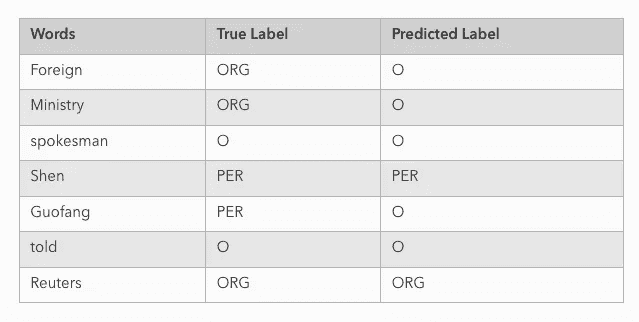
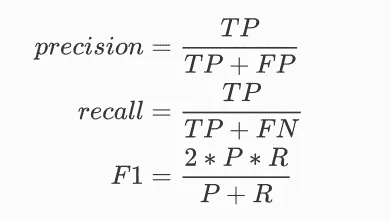
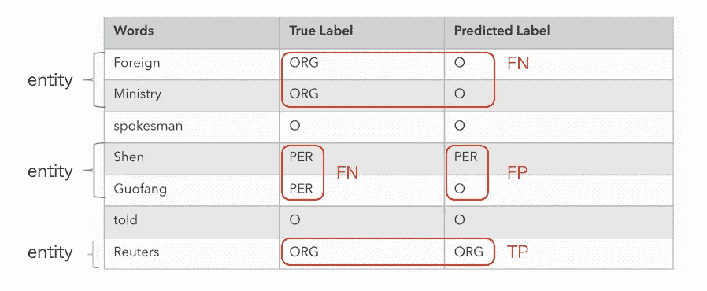
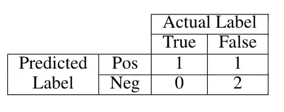
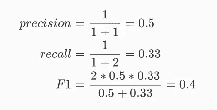

# NER 任务的实体级评估

> 原文：<https://towardsdatascience.com/entity-level-evaluation-for-ner-task-c21fb3a8edf?source=collection_archive---------7----------------------->

## 如何计算 NER 任务的混淆矩阵(TP，TN，FP，FN)


亚历山大·安德鲁斯在 [Unsplash](https://unsplash.com/s/photos/measurement?utm_source=unsplash&utm_medium=referral&utm_content=creditCopyText) 上拍摄的照片

当我们评估 NER(命名实体识别)任务时，有两种方法，令牌级方法和实体级方法。比如我们下面预测的这句话:“外交部发言人沈国放告诉路透社”。如果用令牌级评价，令牌“申”是对的，令牌“国芳”是错的。但是如果我们使用实体级评估，“沈国放”是一个完整的命名实体，因此对“沈”和“国放”的预测必须是“PER”和“PER”。否则，这是错误的预测实体，甚至令牌“申”被预测为“每”。



NER 预测的例子

# 实体级与令牌级

那么我们应该用哪种方法呢？

答案是**实体级评测**。正如任务名“命名实体”所表明的，我们真正关心的是我们的模型如何预测整个实体，而不是单独的标记。

我一般用[**sk learn-CRF suite**](https://sklearn-crfsuite.readthedocs.io/en/latest/index.html)**来实现 CRF 模型，这个库很棒。但是它的一个缺点是使用的评估方法是[令牌级评估](https://sklearn-crfsuite.readthedocs.io/en/latest/tutorial.html#evaluation)。**

```
precision    recall  f1-score   support

      B-LOC      0.775     0.757     0.766      1084
      I-LOC      0.601     0.631     0.616       325
     B-MISC      0.698     0.499     0.582       339
     I-MISC      0.644     0.567     0.603       557
      B-ORG      0.795     0.801     0.798      1400
      I-ORG      0.831     0.773     0.801      1104
      B-PER      0.812     0.876     0.843       735
      I-PER      0.873     0.931     0.901       634

avg / total      0.779     0.764     0.770      6178
```

**我们希望对这些进行更改，以产生如下所示的实体级评估:**

```
precision    recall  f1-score   support

      LOC      0.775     0.757     0.766      1084
     MISC      0.698     0.499     0.582       339
      ORG      0.795     0.801     0.798      1400
      PER      0.812     0.876     0.843       735

avg/total      0.779     0.764     0.770      6178
```

**不使用官方的评测方法，我推荐使用这个工具， [seqeval](https://github.com/chakki-works/seqeval) 。该库可以在实体级别运行评估。**

```
>>> from seqeval.metrics import accuracy_score
>>> from seqeval.metrics import classification_report
>>> from seqeval.metrics import f1_score
>>> 
>>> y_true = [['O', 'O', 'O', 'B-MISC', 'I-MISC', 'I-MISC', 'O'], ['B-PER', 'I-PER', 'O']]
>>> y_pred = [['O', 'O', 'B-MISC', 'I-MISC', 'I-MISC', 'I-MISC', 'O'], ['B-PER', 'I-PER', 'O']]
>>>
>>> f1_score(y_true, y_pred)
0.50
>>> accuracy_score(y_true, y_pred)
0.80
>>> classification_report(y_true, y_pred)
             precision    recall  f1-score   support

       MISC       0.00      0.00      0.00         1
        PER       1.00      1.00      1.00         1

  micro avg       0.50      0.50      0.50         2
  macro avg       0.50      0.50      0.50         2
```

# **混淆矩阵计算**

**好了，我们已经有了一个很棒的解决度量计算的工具，为什么还要关心幕后的计算呢？**

> **给一个人一条鱼，你可以喂他一天；教一个人钓鱼，你就喂了他一辈子。**

**混淆矩阵是机器学习领域的一个重要话题，但对于 NER 任务，关于如何计算混淆矩阵的帖子很少，所以我希望这篇帖子可以清除不确定性。**

**首先，我们写出混淆矩阵表:**

****

**然后计算精度、召回率和 F1:**

****

**我们用上面的例子来填充混淆矩阵表:**

****

**“外交部”算 FN，“路透社”算 TP。这两个很好区分。棘手的问题是预测何时会产生边界误差。如果模型产生了边界误差，我们算作两个误差。比如我们把实体“沈国放”算作两个错误，一个是 FN，一个是 FP。**

**我们忽略实体类型，并像这样填充混淆矩阵表:**

****

**然后计算矩阵:**

****

# **代码实现**

**我们忽略实体类型，只计算上面例子中一个句子的混淆矩阵。为了更好的推广，代码实现必须**考虑实体类型**并计算**所有句子**的混淆矩阵。**

> ****查看我在** [**上的其他帖子**](https://medium.com/@bramblexu) **与** [**一个分类查看**](https://bramblexu.com/posts/eb7bd472/) **！
> GitHub:** [**荆棘徐**](https://github.com/BrambleXu) **领英:** [**徐亮**](https://www.linkedin.com/in/xu-liang-99356891/) **博客:**[](https://bramblexu.com)**

# ****参考****

*   ****[https://www.youtube.com/watch?v=0uI_5FYd5k0](https://www.youtube.com/watch?v=0uI_5FYd5k0)****