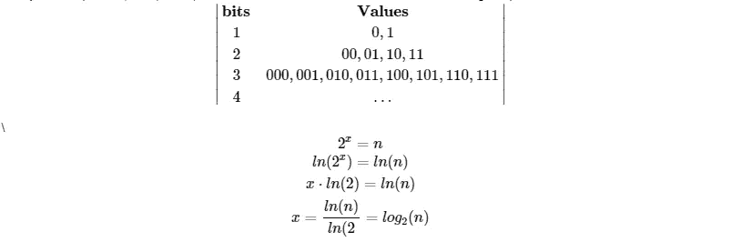
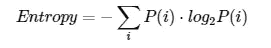
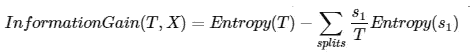

# 熵和信息增益

> 原文：<https://towardsdatascience.com/entropy-and-information-gain-b738ca8abd2a?source=collection_archive---------19----------------------->

## 另一个用来做决策树分割的工具。

杰克·布吕克在 [Unsplash](https://unsplash.com?utm_source=medium&utm_medium=referral) 上的照片

信息增益是另一种方法，也可用于优化选择分割数据集的要素。在我们继续学习信息增益之前，我们必须首先讨论熵，它是由**香农(1948)** 提出的。

# 熵

> [定义](https://en.wikipedia.org/wiki/Entropy_(information_theory)):【E】熵提供了对信源产生的数据进行无损压缩编码的最短可能平均长度的绝对限制，如果信源的熵小于通信信道的信道容量，则信源产生的数据可以可靠地传递给接收方。

这个定义非常难以理解，而且它不一定与我们讨论的决策树相关。 **Shannon(1948)** 将熵的概念用于通信理论，以确定如何将编码(比特)信息从发送者发送到接收者，而不丢失信息并使用最少的比特数。

请看看[揭秘熵](/demystifying-entropy-f2c3221e2550)和[香农熵](/the-intuition-behind-shannons-entropy-e74820fe9800)背后的直觉，以获得一个容易理解的解释。

## 位

比特是什么？当使用 1 位数据的 if 语句时，我们通常有 TRUE 或 FALSE。一个位取单个二进制值 0(假)或 1(真)。请参见下表，了解存储容量如何随着每一位的增加而增加。

**x:** 位数， **n:** 组数值

马库斯·斯皮斯克在 [Unsplash](https://unsplash.com?utm_source=medium&utm_medium=referral) 拍摄的照片

## 无损的

这个概念仅仅意味着在从发送者到接收者的传输中没有信息丢失。

## 公式

上面的公式给出了最小平均编码大小，它使用每种消息类型的最小编码大小。

高熵:更多的不确定性

低熵:更多的可预测性

## 例子

我们将计算每次分裂的熵。例如，我们将对“情感”列进行两次拆分。一个写着“不恶心”，另一个写着“恶心”。

一旦我们完成了每次分割，我们就可以计算目标变量“stayhome”的熵。

# 信息增益

既然我们已经讨论了熵，我们可以继续讨论信息增益。这是分割要素上的数据后熵减少的概念。信息增益越大，熵或不确定性下降越大。

*   T:拆分前的目标人群 T =∑{所有拆分}，拆分前的观察总数。
*   熵(T):测量分裂前的无序度，或不确定性水平
*   s{i}:第{i}次分割的观察次数
*   熵(s{i}):测量分裂 s{i}上目标变量的无序度

给定上面的例子，T=8，s{1}=5，s{2}=3，熵(s { 1 })= 0.9709…熵(s{2}) = 0.91829…$。很难判断，但是即使当我们使用特征“情感”分割原始数据集时，我们也没有获得太多信息来获得同质的桶(纯粹的集合来识别“N”或“Y”)。

正如你所看到的，我们在分裂的“情感”上获得的信息很少。我们可以通过分开温度来更好地休息吗？

这比我们获得的信息量有了很大的提高。让我们以表格的形式来看一下。正如你所看到的，我们已经从原始数据集中的平均分割，变成了在温度条件下的 25% / 75%分割。因此，我们获得了更多信息，因为我们能够将每个预测值放入具有相似值的桶中。

[亚历克斯](https://unsplash.com/@alx_andru?utm_source=medium&utm_medium=referral)在 [Unsplash](https://unsplash.com?utm_source=medium&utm_medium=referral) 上的照片

# 附录

有时候，一个存储桶能够完全隔离其中一个决策参数，并正确地识别它。出现这种情况时，其他参数出现的概率为 0。我们不能取 log(0 ),因为它创建了一个— *inf*

此外，上面的代码是硬编码的，只能处理两种可能的结果。