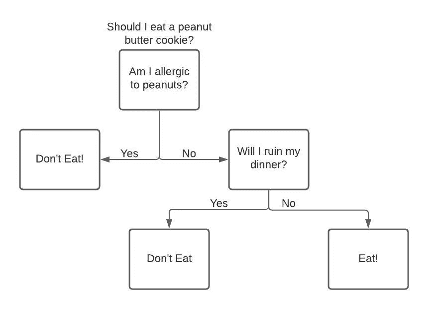
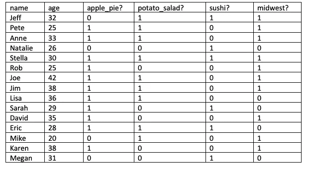
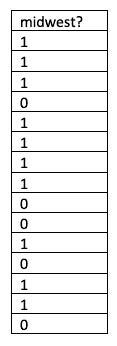
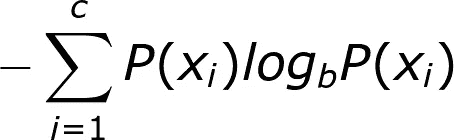
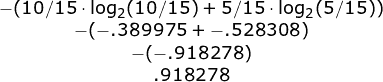
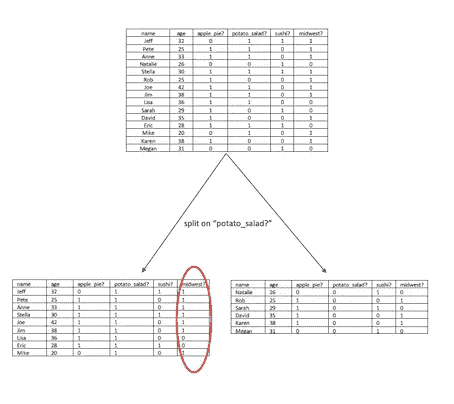
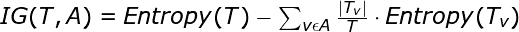
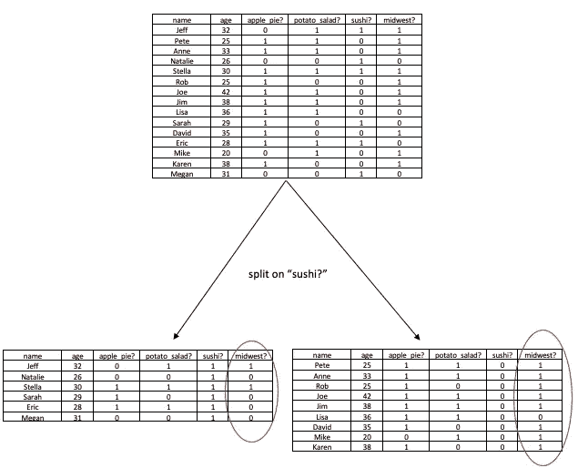

# 决策树中的熵和信息增益

> 原文：<https://towardsdatascience.com/entropy-and-information-gain-in-decision-trees-c7db67a3a293?source=collection_archive---------1----------------------->


由 [Unsplash](https://unsplash.com/s/photos/information-gain?utm_source=unsplash&utm_medium=referral&utm_content=creditCopyText) 上的[absolute vision](https://unsplash.com/@freegraphictoday?utm_source=unsplash&utm_medium=referral&utm_content=creditCopyText)拍摄

## 简单了解一些关键的信息论概念，以及在构建决策树算法时如何使用它们。

> 决策树算法应该使用什么标准来拆分变量/列？

在构建决策树算法之前，第一步是回答这个问题。我们来看看回答这个问题的方法之一。为此我们将需要理解一个使用来自[信息论的几个关键概念。](https://en.wikipedia.org/wiki/Information_theory)

让我们通过以下步骤来检查这种方法:

1.  简单看一下什么是**决策树**。
2.  定义并检查熵的公式。
3.  讨论信息论中的一个**位**是什么。
4.  定义**信息增益**和用熵来计算。
5.  用上面的概念写一些基本的 **Python 函数**。

# 决策树

在数据科学中，决策树算法是一种用于分类或回归问题的监督学习算法。我们的最终目标是使用历史数据来预测结果。与线性回归不同，决策树可以提取数据中变量之间的非线性交互。

让我们看一个非常简单的决策树。下面是一个工作流程，可以用来决定是否吃花生酱饼干。



关于是否吃饼干的决策树示例

在这个例子中，决策树可以发现这样一个事实，即只有在满足特定标准的情况下，您才应该吃 cookie。这是决策树的最终目标。我们希望继续做决策(拆分)，直到满足某些标准。一旦相遇，我们可以用它来分类或作出预测。这个例子非常简单，只使用了两个变量(过敏，破坏晚餐)。但是，如果您有一个包含数千个变量/列的数据集，您如何决定拆分哪些变量/列是最有效的呢？解决这个问题的一个流行的方法，特别是如果使用一个 [ID3 算法](https://en.wikipedia.org/wiki/ID3_algorithm)，是使用**熵**和**信息增益**。

# 任务

假设我们有一些数据，我们想用它来做一个在线测验，预测一些关于应试者的事情。在查看了数据中的关系后，我们决定使用决策树算法。*如果你从未被吸进过网上的小测验，你可以在这里* *看到上百个例子* [*。这个小测验的目标是猜测参加测验的人是否来自美国中西部的一个州。测验中的问题将围绕他们是否喜欢某种食物展开。下面是一个小的虚构数据集，有 15 个条目。每个条目都有一系列问题的答案。大多数问题都是关于他们是否喜欢某种食物，参与者回答(1)表示喜欢，回答(0)表示暂时喜欢。最后一栏(“中西部？”)是我们的**目标列，**意味着一旦构建了决策树，这就是我们试图猜测的分类。*](https://www.buzzfeed.com/quizzes)



# 熵

为了让我们开始，我们将使用一个叫做熵的信息论度量标准*。*在数据科学中，熵被用来衡量一列的“混合”程度。具体来说，熵是用来衡量无序的。让我们从寻找我们的目标列“中西部”的熵开始。



我们的目标专栏，“中西部？”

有十个人住在中西部，五个人不住在中西部。如果有人要问你这个群体有多混杂，你可以说是混杂的，大多数人(2/3)来自中西部。熵给了我们一个量化答案“有点混合”的方法。列中的(1)和(0)越混合，熵越高。如果“中西部？”有等量的(1)和(0)我们的熵将是 1。如果“中西部？”仅由(1)组成，熵将是 0。

我们可以用下面的公式来计算熵:



熵的公式

让我们遍历公式的每一步，计算“中西部”的熵专栏。

1.  我们需要遍历单个列中的每个唯一值，并将它赋给 I。列，可以是(0)或(1)。
2.  然后，我们计算该值出现在数据中的概率。对于(1)的情况，概率为 **10/15** 。对于(0)的情况，概率为 **5/15** 。
3.  我们取每种情况的概率，乘以概率的对数底 2。2 是最常见的基数，因为熵是用比特来度量的(后面会详细介绍)。为什么使用 2 的完整解释超出了本文的范围，但是 stack exchange 上的一个用户提供了一个很好的 [*解释*](https://stats.stackexchange.com/questions/87182/what-is-the-role-of-the-logarithm-in-shannons-entropy#answer-87206) *。*对于(1)的情况，我们得到 **10/15*log2(10/15)** 。对于(0)的情况，我们得到 **5/15*log2(5/15)。**
4.  接下来，我们从上述每个案例中取出我们的乘积，并将其相加。对于本例，**10/15 * log2(10/15)+5/15 * log2(5/15)。**
5.  最后，我们对上面的总和，**——(10/15 * log2(10/15)+5/15 * log2(5/15))。**

一旦我们把所有的步骤放在一起，我们得到如下:



我们的最终熵是. 918278。那么，这到底意味着什么呢？

# 信息论和一点信息

展望未来，理解双边投资条约的概念是很重要的。在信息论中，一个比特被认为是一个二进制数，0 代表无信息，1 代表全比特信息。我们可以用二进制数来表示一位信息，因为它的值要么是(1)，要么是(0)。假设明天下雨(1)或不下雨(0)的概率相等。如果我告诉你明天会下雨，我已经给了你一点信息。

我们也可以认为熵是信息。假设我们有一个加载的六面骰子，它总是落在(3)上。每次我们掷骰子，我们预先知道结果将是(3)。我们滚动骰子并没有获得新的信息，所以熵是 0。另一方面，如果骰子离我们很远，我们掷出 a (3)，则有 1/6 的机会掷出(3)。现在我们获得了信息。因此，滚动骰子给我们一点信息——数字落在哪一边。

*为了更深入地了解一点概念信息，你可以在这里阅读更多*[](https://en.wikipedia.org/wiki/Information_theory#Quantities_of_information)**。**

*我们得到的信息少于一个“比特”——只有 0 . 918278——因为在“中西部”有更多的“1”这意味着，如果我们预测一个新的值，我们可以猜测答案是(1)，并且正确的概率大于错误的概率(因为答案是 1 的概率为 2/3)。由于这种先验知识，当我们观察一个新值时，我们获得的信息少于一个完整的“比特”。*

# *用熵来做决策*

*我们的目标是在构建决策树时找到要拆分的最佳变量/列。最终，我们希望继续分割变量/列，直到我们的混合目标列不再是混合的。*

*例如，让我们看看“中西部”的熵在“土豆沙拉”上分割数据集后的列专栏。*

**

*分吃“土豆沙拉？”圆柱*

*上面，我们的数据集分为两部分。左边，喜欢土豆沙拉的各位。右边是所有不喜欢的人。我们把重心放在了左边，现在有七个人来自中西部，两个人不是。通过使用左边拆分中西部列的熵公式，新的熵是. 764204。这太棒了！我们的目标是降低熵，我们从. 918278 到. 764204。但是，我们不能就此止步，如果我们看看右边的列，我们的熵增加了，因为有等量的(1)和(0)，我们需要的是一种方法，看看熵在分裂的两边是如何变化的。信息增益的公式会做到这一点。它给了我们一个数字来量化我们每次分割数据时获得了多少信息。*

# *信息增益*

*前面我们已经确定，我们希望拆分可以降低目标列的熵。当我们分吃“土豆沙拉”时我们在“中西部”看到了熵在左边倒下了。现在我们需要理解，当我们看分裂的两边时，总熵降低了。让我们来看看信息增益。*

*信息增益将使用以下公式:*

**

*让我们来分析一下这是怎么回事。*

*我们会回到我们的“土豆沙拉？”举例。上述公式中的变量将表示如下:*

*   *T = Target，我们的“中西部？”圆柱*
*   *A =我们正在测试的变量(列)“土豆 _ 沙拉？”*
*   *v =中的每个值,“土豆 _ 沙拉”中的每个值圆柱*

1.  *首先，我们将计算分裂前(T)的原始熵， **.918278***
2.  *然后，对于变量(A)中的每个唯一值(v ),我们计算(A)取值(v)的行数，并将其除以总行数。“土豆沙拉？”列我们得到唯一值为(1)的 **9/15** 和唯一值为(0)的 **6/15** 。*
3.  *接下来，我们将结果乘以(A)为(v)的行的熵。为左分裂(分裂 1 为“土豆 _ 沙拉？”)我们得到 **9/15 * .764204** 。对于右侧拆分(拆分为 0 表示“土豆 _ 沙拉？”)**我们得到 6/15 * 1。***
4.  *我们将所有这些子集乘积相加，**9/14 * . 764204+6/15 = . 8585224**。*

*5.然后我们从总熵中减去得到信息增益，**. 918278-. 8585224 = . 059754***

*我们的信息增益是. 059754。这告诉我们什么？*

*这是另一种解释。我们正在寻找每个集合拆分后的熵，用每个拆分中的项目数对其进行加权，然后从当前熵中减去。**如果结果是肯定的，我们已经通过拆分降低了熵。结果越高，我们降低的熵越多。***

*我们最终得到. 059754，这意味着我们通过在“土豆沙拉”上分割我们的数据集获得了. 059754 位信息。变量/列。我们的信息增益很低，但仍然是正的，这是因为我们降低了分裂左侧的熵。*

*现在我们需要对我们使用的每一列重复这个过程。让我们写一些 Python 代码，而不是手动完成。*

# *用 Python 把它包起来*

*现在我们已经了解了信息增益，我们需要一种方法来重复这个过程，以找到具有最大信息增益的变量/列。为此，我们可以用 Python 创建几个简单的函数。*

## *导入数据*

*让我们使用 Python [pandas](https://pandas.pydata.org/) 库将上面的表转换成数据帧。我们将导入熊猫，并使用 [read_csv()](https://pandas.pydata.org/pandas-docs/stable/reference/api/pandas.read_csv.html) 函数制作一个名为“midwest”的数据帧。*

```
*import pandas as pd
midwest = pd.read_csv('midwes.csv')*
```

## *熵的 Python 函数*

*对于这个函数，我们需要 [NumPy 库](https://numpy.org/)来使用 bincount()函数，需要[数学模块](https://docs.python.org/3/library/math.html)来使用 log()函数。*

```
*import numpy
import math*
```

*接下来，我们将用一个参数定义我们的函数。给出的参数将是我们试图计算熵的序列、列表或 NumPy 数组。*

```
*def calc_entropy(column):*
```

*我们需要找到列中每个案例的百分比。为此，我们可以使用 [numpy.bincount()](https://numpy.org/doc/stable/reference/generated/numpy.bincount.html) 函数。返回值是一个 NumPy 数组，它存储作为参数传递的列中每个唯一值的计数。*

```
*counts = numpy.bincount(column)*
```

*我们将通过将“计数”数组除以列的长度来存储每个唯一值的概率。*

```
*probabilities  = counts / len(column)*
```

*然后，我们可以初始化一个名为“熵”的变量，并将其设置为 0。*

```
*entropy = 0*
```

*接下来，我们可以使用“for 循环”遍历概率数组中的每个概率，并使用 [math.log()函数](https://docs.python.org/2/library/math.html#math.log)将其乘以概率的以 2 为底的对数。然后，将每个案例添加到我们存储的熵变量中。* *确保检查你的概率大于 0，否则 log(0)将返回未定义的**

```
*for prob in probabilities:
    if prob > 0:
       endtropy += prob * math.log(prob,2)*
```

*最后，我们将返回我们的负熵变量。*

```
*return -entropy*
```

*现在一起:*

*太好了！现在我们可以建立一个函数来计算信息增益。*

## *用于信息获取的 Python 函数*

*我们需要定义一个函数，它有三个参数，一个用于整个数据集，一个用于我们要拆分的列的名称，一个用于我们的目标列的名称。*

```
*def calc_information_gain(data, split_name, target_name):*
```

*接下来，我们可以使用前面的熵函数来计算目标列的原始熵。*

```
*orginal_entropy = calc_entropy(data[target_name])*
```

*现在我们需要拆分我们的列。*

***对于这个例子，我们将只使用具有两个唯一的变量/列。如果您想在变量/列(如“年龄”)上进行拆分，有几种方法可以做到这一点。一种方法是分割每个唯一值。另一种方法是简化信息增益的计算，并通过不对每个唯一值进行拆分来使拆分更简单。取而代之的是被分割的变量/列的中间值。变量值低于中值的任何行都将转到左分支，其余的行将转到右分支。为了计算信息增益，我们只需要计算两个子集的熵。我们不会遍历这个方法，但是一旦对中间值进行了分割，剩下的步骤将与下面概述的相同。**

*因为我们正在处理的列只有两个唯一值，所以我们将进行左拆分和右拆分。*

*我们将从[熊猫开始。Series.unique()](https://pandas.pydata.org/pandas-docs/stable/reference/api/pandas.Series.unique.html) 给出一个列中唯一值的数组*

```
*values = data[split_name].unique()*
```

*接下来，我们将使用“值”创建左右拆分。*

```
*left_split = data[data[split_name] == values[0]]
right_split = data[data[split_name] == values[1]]*
```

*现在我们可以初始化一个变量，从原始熵中减去。*

```
*to_subtract = 0*
```

*然后，我们将遍历通过拆分创建的每个子集，计算子集的概率，然后将概率和子集目标列的熵的乘积相加。*

```
*for subset in [left_split, right_split]:
    prob = (subset.shape[0] / data.shape[0])
    to_subtract += prob * calc_entropy(subset[target_name])*
```

*最后，我们可以返回从原始熵中减去 to _ subract 的差值。*

```
*return original_entropy - to_subtract*
```

*整个函数如下。*

## *获得最高信息增益的 Python 函数*

*我们的最终函数将返回具有最高信息增益的变量/列名。*

*如前所述，在本例中，我们只使用具有两个唯一值的列。我们将把这些列名存储在一个列表中，以便在函数中使用。*言归正传* w *我们将对这个示例进行硬编码，但是在大型数据集中，最好是编写代码来基于我们用来选择列的标准动态构建这个列表。**

```
*columns = ['apple_pie?', 'potato_salad?', 'sushi?']*
```

*让我们将最后一步封装在一个函数中，这样我们就可以在需要时重用它。它将有一个参数，即我们希望找到最高信息增益的列的列表。*

```
*def highest_info_gain(columns):*
```

*我们将初始化一个空字典来存储我们的信息收获。*

```
*information_gains = {}*
```

*然后我们可以遍历列列表，并将结果存储在 information_gains 字典中。*

```
*for col in columns:
    information_gain = calc_information_gain(midwest, col, 'midwest?)
    information_gains[col] = information_gain*
```

*最后，我们可以返回字典中最高值的键。*

```
*return max(information_gains, key=information_gains.get)*
```

*现在一起:*

*一旦我们执行了最后一个函数*

```
*print(highest_info_gain(midwest, columns, 'midwest?'))
//sushi*
```

*我们看到信息增益最高的变量/列是“寿司？”。*

*我们可以想象寿司的分割如下:*

**

*分割寿司列上的数据集*

*我们的左翼有六分之二来自中西部。来自中西部的九个人中有八个是右派。这是一个有效的分裂，降低了我们双方的熵。如果我们要继续，我们将使用递归来继续分裂每个分裂，目标是以零熵结束每个分支。*

# *结论*

*决策树可以是一种有用的机器学习算法，用于提取数据中变量之间的非线性交互。在这个例子中，我们看了决策树分类算法的开始阶段。然后我们看了三个信息论概念，熵、比特和信息增益。通过使用这些概念，我们能够在 Python 中构建一些函数来决定哪些变量/列是最有效的分割。牢牢掌握了这些概念，我们就可以继续构建决策树了。*