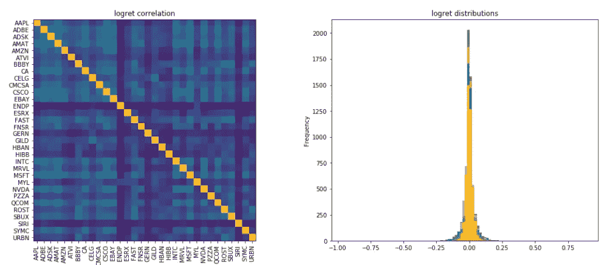
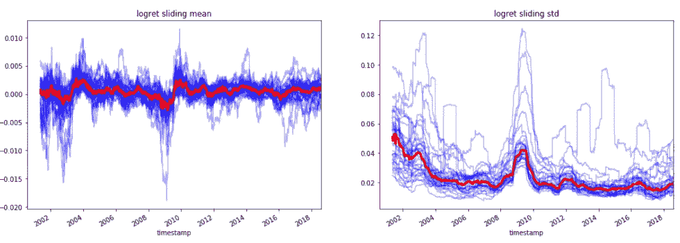
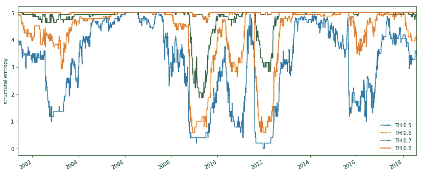

# 熵在股票市场中的应用

> 原文：<https://towardsdatascience.com/entropy-application-in-the-stock-market-b211914ed1f3?source=collection_archive---------11----------------------->

## 用结构熵随时间监控相关网络

戴夫·塞贝莱在 [Unsplash](https://unsplash.com?utm_source=medium&utm_medium=referral) 上拍摄的照片

***来自《走向数据科学》编辑的提示:*** *虽然我们允许独立作者根据我们的* [*规则和指导方针*](/questions-96667b06af5) *发表文章，但我们并不认可每个作者的贡献。你不应该在没有寻求专业建议的情况下依赖一个作者的作品。详见我们的* [*读者术语*](/readers-terms-b5d780a700a4) *。*

熵有很多定义和公式。总的来说正确的是，熵被用来衡量关于实验可能结果的*信息*、*惊喜*或*不确定性*。特别是，香农熵是统计学和机器学习中使用最频繁的熵。因此，这是我们关注的焦点。

*惊喜*和*不确定性*是金融市场中的日常概念。因此，使用熵作为工具来探索市场听起来是一个非常辛辣的想法。我们所期望的是揭示新指标和资产价格随时间的波动性之间的显著模式。

考虑到我们的目标，我认为有必要介绍一下 [**本工作**](https://www.ncbi.nlm.nih.gov/pmc/articles/PMC6658667/) 中提供的标准方法和注意事项。作者引入了**结构熵**的概念，并用它来监控一个基于相关性的网络，并将其应用于金融市场。

# 数据

在我们的分析中，我们使用从 [Kaggle](https://www.kaggle.com/danieljperez/financial-data-20002018) 上收集的数据集中的每日收盘价。它存储了 32 只股票，来自不同的市场部门，从 2000 年到 2018 年连续交易。对于数据集中的每只股票，我们得到其每日对数收益的时间序列。对数差额价格(对数收益)可以产生适合我们范围的稳定和正态分布的信号。

我们开始用传统的测量方法研究数据中湍流的存在。波动性是对给定市场指数回报离差的统计度量。该指标指的是与市场变化规模相关的不确定性或风险水平。高波动水平对应于股票价格的大范围波动。这意味着一项资产的价格可以在短期内发生巨大的双向变化。较低的波动性意味着资产价值不会大幅波动，更趋于稳定。

使用滑动窗口方法生成的个体(蓝色)和中位数聚集(红色)统计数据

在我们的例子中，高波动期出现在新千年的最初几年(网络泡沫)、2008 年(最近的金融危机)以及随后的一些时期。

# 结构熵

一个特别有趣的想法是将金融市场表示为基于相关性的网络。在金融市场的情况下，网络节点是金融资产，网络边缘是它们之间的相互作用，其中这种相互作用通常通过随时间推移的价格相关性的大小来衡量。将金融市场表示为网络对于识别动荡或结构性断裂是有价值的。

> 基于这种社区结构，**结构熵**是一种量化给定网络中结构多样性水平的度量。在这个框架中，结构熵是指网络中节点的异质性水平，其前提是共享功能或属性的节点比其他节点更具连通性。

为了计算给定时间范围内的结构熵，我们需要遵循定义的工作流程:

*   测量序列的皮尔逊相关性，得到一个 *NxN* 对称矩阵。
*   创建一个邻接矩阵作为网络边的表示。标准方法是使用阈值来确定相关矩阵的哪些值将被转换成网络中的边。
*   在邻接矩阵上，我们应用社区检测算法(在我们的例子中是*连通分量*)。
*   聚类过程的结果标签(整数向量)用于计算经典的香农熵。更具体地说，我们计算聚类计数频率的熵。结果值被定义为网络的**结构熵**。

将这些步骤放在一个滑动窗口过程中，我们可以监视我们感兴趣的系统中随时间的动态变化。结果是一个新的单一时间序列的结构熵值。

[来源](https://www.ncbi.nlm.nih.gov/pmc/articles/PMC6658667/figure/Fig2/)

一般来说，结构熵可以解释为众所周知的香农指数的调整版本。它们都是多样性的指标，但是结构熵可以从具有空间和时间依赖性的复杂结构中提取值。

在我们处理的系列上采用整个程序，产生了下面描述的结果。

用不同的相邻矩阵阈值产生的结构熵

结构熵的最小可达值是 0，并且这是当网络中的所有节点被分配到相同社区(即，单个巨大社区)时获得的。当每个节点构成一个团体时，达到最大值。最大值取决于网络中节点的数量(观察到的级数)。

正如我们所看到的，在我们的例子中，结构熵可以捕捉到新千年早期(网络泡沫)、2008 年(最近的金融危机)以及随后一些时期的动荡。如果我们把相关矩阵想成一个图，并用散点来绘制，就可以直观地解释在引擎盖下发生了什么。点代表每只股票(我们的网络节点)，颜色是股票所属的聚类(由社区检测算法创建)，边是关系的强度，如果两只股票的相关性超过一定量，则绘制边。

随机相关矩阵取自高、中和低结构熵的时期

在结构熵最大的时期，股票倾向于保持独立，形成独特的集群。在中熵时期，我们可以看到一些股票属于同一个聚类，通过一些强相关性联系在一起。在低结构熵时期，大部分股票属于同一个群落，由大量的相关关系联系在一起。

# 摘要

在这篇文章中，我们介绍了一种观察价格序列几何结构变化的替代方法。资产的价格随着可用信息的变化而变化。信息的一个简单变化会立即反映在价格中。金融市场的相互关联性需要采取一种措施来捕捉空间和时间维度。从这个意义上来说，结构熵帮助我们在这种涉及不确定性的情况下进行陈述和计算。

[**查看我的 GITHUB 回购**](https://github.com/cerlymarco/MEDIUM_NoteBook)

保持联系: [Linkedin](https://www.linkedin.com/in/marco-cerliani-b0bba714b/)

**参考文献**

结构熵:随时间监控基于相关性的网络及其在金融市场的应用。埃雷兹·什穆埃利·阿萨夫·阿尔莫格