# 熵，交叉熵，KL-散度解释！

> 原文：<https://towardsdatascience.com/entropy-cross-entropy-and-kl-divergence-explained-b09cdae917a?source=collection_archive---------6----------------------->

## 让我们试着去理解最广泛使用的损失函数——交叉熵。

**交叉熵**(也称为 log-loss)是分类问题最常用的损失函数之一。但是我们大多数人经常在没有真正了解熵的核心概念的情况下就开始解决问题，这是由于当今庞大的库和框架的存在以及它们的易用性。因此，在这篇文章中，让我们来看看**熵**背后的基本直觉，将它与**交叉熵**和**KL-散度**联系起来。我们还将检查一个使用损失函数作为交叉熵的分类问题的例子。

# 熵是什么？

为了开始了解熵到底指的是什么，让我们深入一些信息论的基础知识。在这个数字时代，信息由比特(0 和 1)组成。交流的时候，有些比特是有用的，有些是多余的，有些是错误的，等等。当我们传递信息时，我们希望向接收者传递尽可能多的有用信息。

> 在克劳德·香农的论文《通信的数学理论》(1948 年)中，他指出，传输 1 比特的信息意味着将接收者的不确定性减少 2 倍。

让我们看看他是什么意思。例如，假设一个地方的天气是随机的，每天有 50%的几率是晴天或雨天。

现在，如果一个气象站告诉你明天会下雨，那么他们已经把你的不确定性降低了 2 倍。起初，有两种同样可能的可能性，但在收到气象站的更新后，我们只有一种可能。这里，气象站给我们发送了一点有用的信息，不管他们如何编码这些信息，这都是真的。

即使发送的消息是‘Rainy’并且每个字符占用一个字节，消息的总大小对应于 40 比特，但是它们仍然只传达了 1 比特的有用信息。

假设天气有 8 种可能的状态，所有的可能性相等。

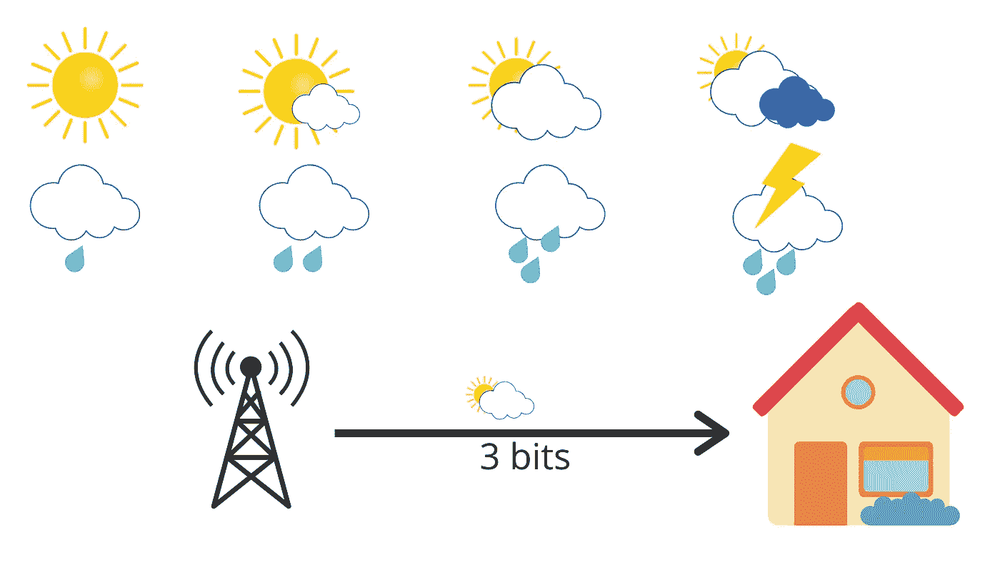

现在，当气象站给你第二天的天气时，他们就把你的不确定性降低了 8 倍。因为每个事件有 1/8 的机会发生，所以缩减系数是 8。

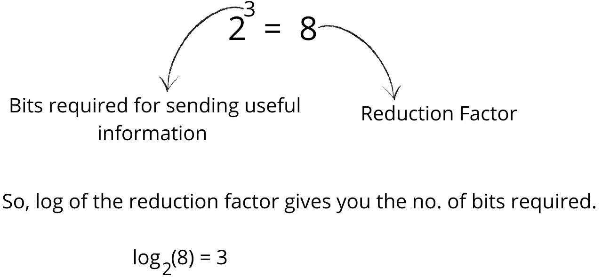

但是如果可能性不相等呢？

比方说，75%的机会是晴天，25%的机会是雨天。

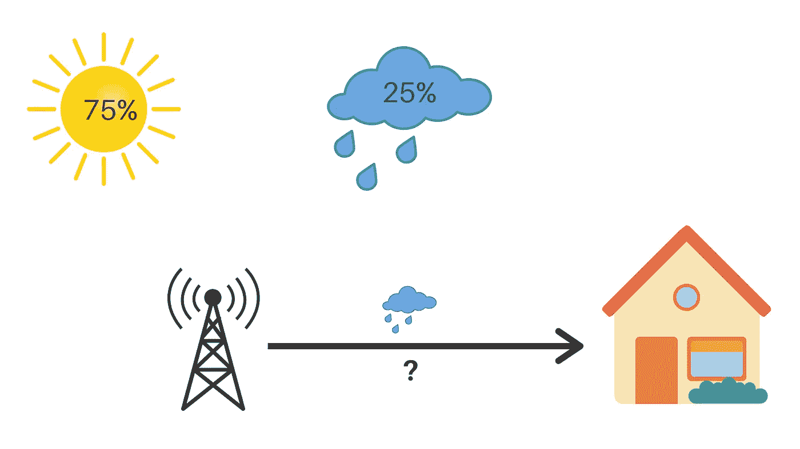

现在，如果气象站说第二天将会下雨，那么你的不确定性下降了 4 倍，这是 2 比特的信息。不确定性的减少正好是事件概率的倒数。在这种情况下，25%的倒数是 4，对数(4)以 2 为底等于 2。所以，我们得到了两个有用的信息。

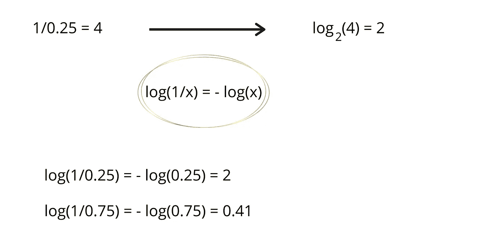

如果气象站说第二天将是晴天，那么我们得到 0.41 比特的有用信息。那么，平均来说，我们能从气象站获得多少信息呢？

嗯，明天有 75%的可能性是晴天，这给了你 0.41 比特的信息，而明天有 25%的可能性是雨天，这给了你 2 比特的信息，相当于，

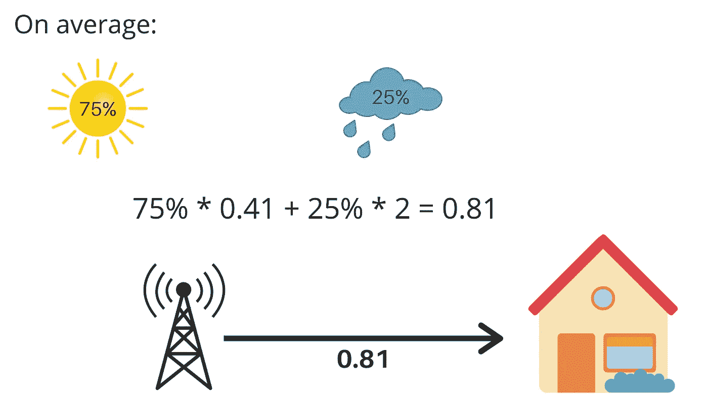

我们平均每天从气象站得到 0.81 比特的信息。所以，我们刚刚计算的叫做熵。这很好地衡量了事件的不确定性。它是由，

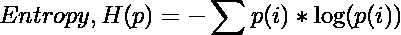

希望熵的方程式现在能完全有意义。它测量的是你每天了解天气时获得的平均信息量。一般来说，它给出了我们从一个给定的**概率分布 p** 中抽取的样本中获得的平均信息量。它告诉我们概率分布是多么不可预测。

如果我们住在每天都阳光明媚的沙漠中心，平均来说，我们每天都不会从气象站获得太多信息。熵将接近于零。另一方面，如果天气变化很大，熵会大得多。

# 交叉熵

现在，我们来谈谈交叉熵。它只是平均消息长度。考虑同样的 8 种可能的天气状况的例子，所有都是同等可能的，每一种都可以用 3 比特编码。

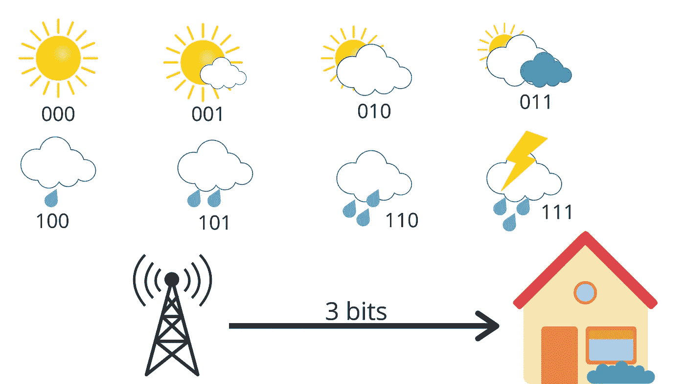

这里的平均消息长度是 3，这就是交叉熵。

但是现在，假设你住在一个阳光充足的地区，那里的天气概率分布如下:

每天有 35%的机会是晴天，只有 1%的机会是雷雨。所以，我们可以计算这个概率分布的熵，我们得到，

**熵=-(0.35 * log(0.35)+0.35 * log(0.35)+0.1 * log(0.1)+0.1 * log(0.1)+0.04 * log(0.04)+0.01 * log(0.01)+0.01 * log(0.01))**

**熵= 2.23 比特**

注意，这里使用的日志是一个**二进制日志。**

因此，平均来说，气象站发送了 3 个比特，但接收者只能得到 2.23 个有用的比特。我们可以做得更好。

例如，让我们这样修改代码:

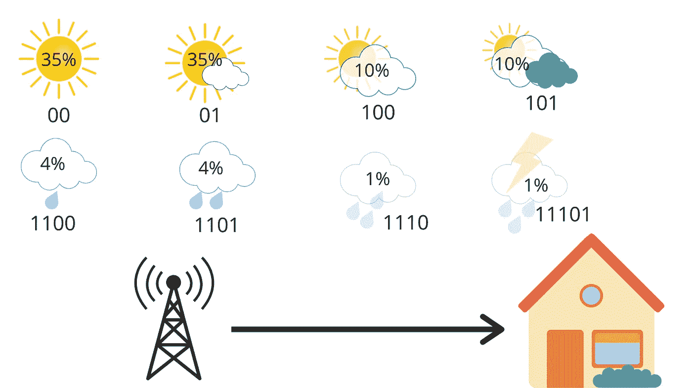

我们现在只使用 2 位表示晴天或部分晴天，3 位表示多云和大部分多云，4 位表示小雨和中雨，5 位表示大雨和雷雨。天气是以一种明确的方式编码的，如果你将多条消息链接起来，只有一种方式来解释比特序列。例如，01100 只能表示部分晴，然后是小雨。所以，如果我们计算电台每天发送的平均比特数，那么我们得到，

**35% * 2+35% * 2+10% * 3+10% * 3+4% * 4+4% * 4+1% * 5+1% * 5 = 2.42 位**

这是我们新的和改进的交叉熵，比我们以前的 3 位更好。现在，假设我们在不同的地方使用相同的代码，那里的天气是相反的，大部分时间是多雨的。

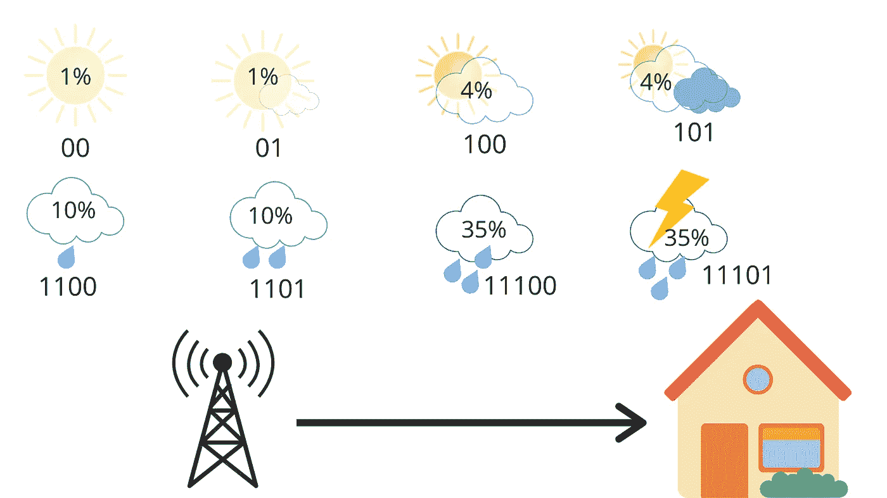

对于这个，如果我们计算交叉熵，

**1% * 2+1% * 2+4% * 3+4% * 3+10% * 4+10% * 4+35% * 5+35% * 5 = 4.58 位**

我们得到 4.58 比特。它大约是熵的两倍。平均而言，该站发送 4.58 比特，但只有 2.23 比特对接收者有用。每封邮件发送的信息是必要信息的两倍。这是因为我们使用的代码对天气分布做了一些隐含的假设。例如，当我们用一个 2 位的信息来表示晴朗的天气时，我们隐含地预测了晴天的概率为 25%。这是因为负二进制对数(0.25)给出 2。

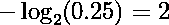

同样，我们计算所有的天气条件。

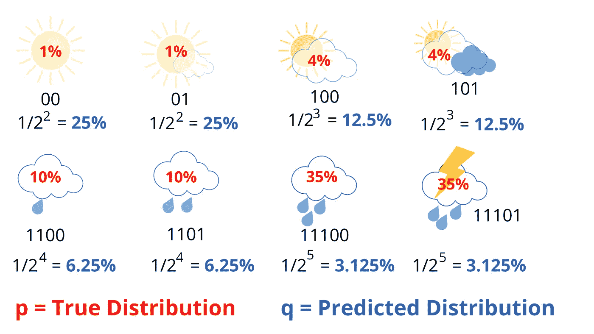

分母中 2 的幂对应于用于传输消息的位数。现在，很明显，预测的分布 ***q*** 与真实的分布 ***p*** 大相径庭。

因此，现在我们可以将交叉熵表示为真实概率分布 ***p*** 和预测概率分布 ***q*** 的函数，其表示为:

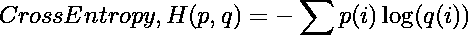

请注意，我们示例中使用的日志是针对**基 2** 的。

如你所见，它看起来非常类似于熵方程，除了我们在这里使用预测概率的对数。如果我们的预测是完美的，即预测的分布等于真实的分布，那么交叉熵就等于熵。但是，如果分布不同，那么交叉熵将比熵大一些位数。交叉熵超过熵的这个量被称为**相对熵**或者更普遍地被称为**库尔巴克-莱布勒散度(KL 散度)**。简言之，

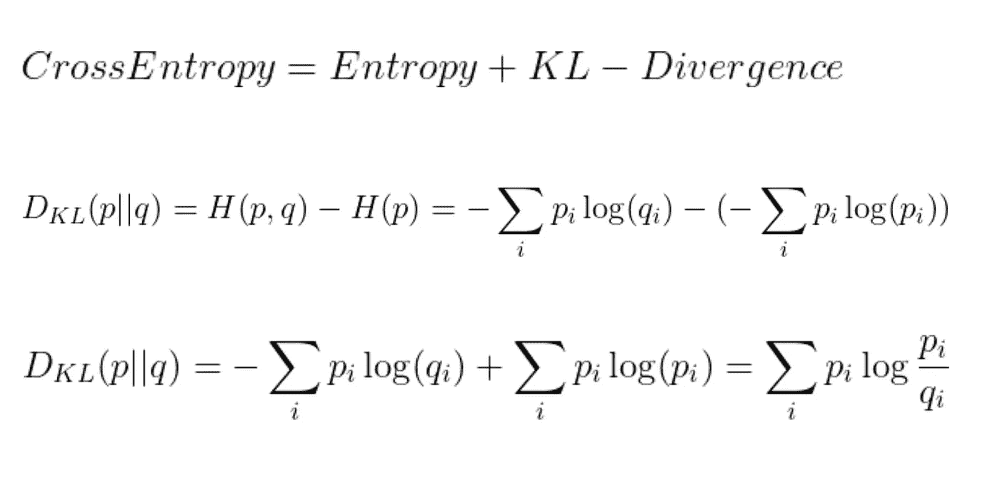

从上面的例子中，我们得到

**K-L 散度=交叉熵-熵= 4.58–2.23 = 2.35 比特。**

# 应用

现在，让我们在一个应用中使用交叉熵。假设我们正在训练一个图像分类器来分类不同的看起来很像的动物，比如浣熊、小熊猫、狐狸等等。

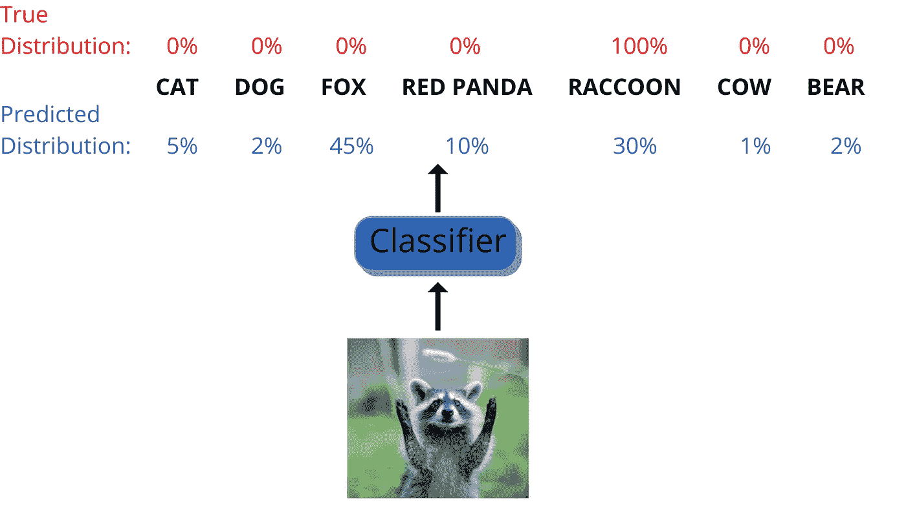

因此，对于可能的 7 个类别中的每一个，分类器估计一个概率，这被称为预测分布。由于这是一个监督学习问题，我们知道真实的分布。

在上面的例子中，我拍摄了一只浣熊的图像，因此在真实分布中，它的概率为 100%，其他的概率为 0。我们可以使用这两个分布之间的交叉熵作为成本函数，称为**交叉熵损失**。

这只是我们之前看到的等式，只是它通常使用自然对数，而不是二进制对数。这对于训练来说关系不大，因为二进制 log(x)等于自然 log(x)/log(2)，其中分母是常数。

因此，当类别概率被称为一个热点向量(这意味着一个类别有 100%，其余的都是 0)时，那么交叉熵就是真实类别的估计概率的负对数。

在这个例子中，**交叉熵是-1*log(0.3) = — log(0.3) = 1.203**

现在，你可以看到，当真实类的预测概率接近于 0 时，成本会增长得非常大。但是当预测概率接近 1 时，代价函数接近 0。

由于获得的损失更多(因为预测的分布太低)，我们需要用每个类别的更多数量的示例来训练分类器，以减少损失量。

# 结论

我们举了一个气象站更新第二天天气的例子来理解香农信息论的概念。然后我们把它与熵和交叉熵联系起来。最后，我们通过一个例子来说明交叉熵损失函数的实际应用。我希望这篇文章阐明了熵、交叉熵和 KL 散度背后的基本直觉以及它们之间的关系。

## **参考文献**

1.  "使用 Scikit-Learn 和 TensorFlow 进行机器实践学习."作者奥雷连·盖伦。
2.  [https://www.youtube.com/watch?v=ErfnhcEV1O8](https://www.youtube.com/watch?v=ErfnhcEV1O8)