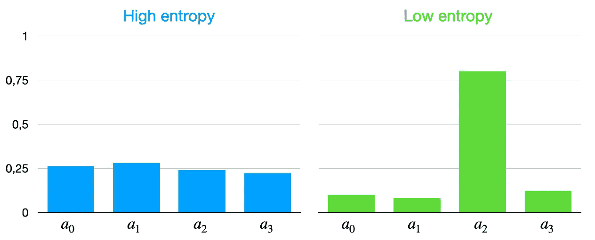
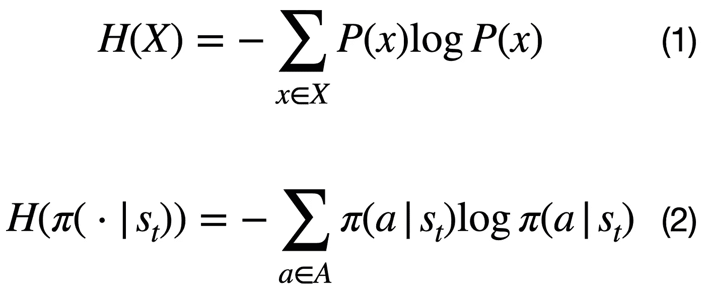
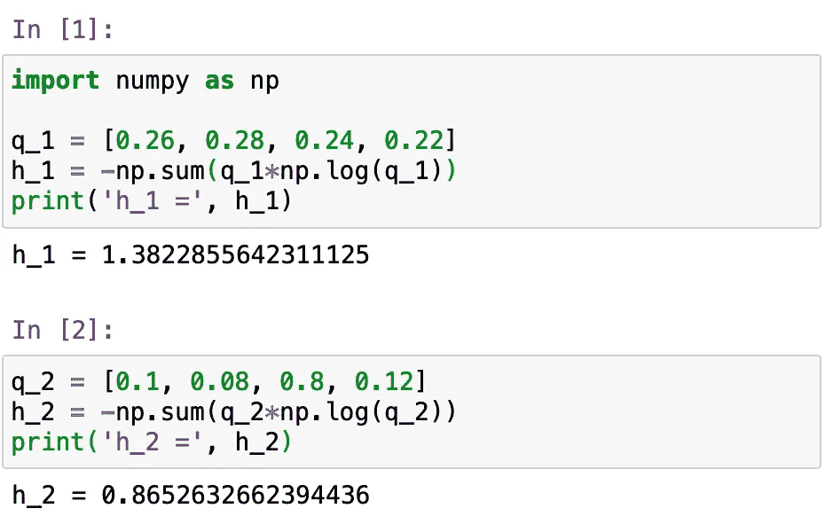
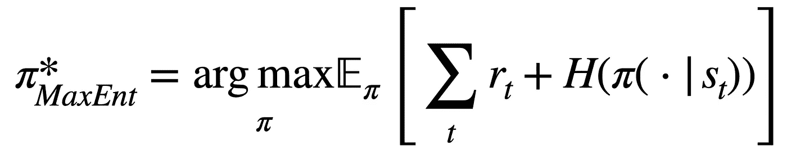
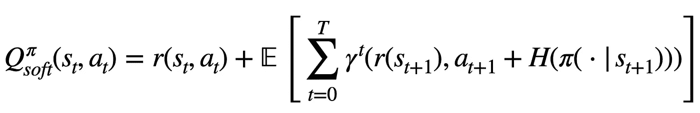

# 强化学习中的熵正则化

> 原文：<https://towardsdatascience.com/entropy-regularization-in-reinforcement-learning-a6fa6d7598df?source=collection_archive---------13----------------------->

> 在这篇文章中，我假设你已经知道强化学习的基础。如果你是一个初学者，想了解更多关于 RL 的知识，你可以从我在这里写的[一个关于 RL 的介绍性故事开始。](/reinforcement-learning-for-everyone-9c1163f61440)

在我们的日常语言中，我们通常使用术语“*熵*”来指一个系统(例如，宇宙)缺乏秩序或可预测性。)在强化学习(RL)中，该术语以类似的方式使用:**在 RL 中，*熵*指的是代理**动作的可预测性。这与其政策的确定性密切相关，即什么行动将产生最高的长期累积回报:如果确定性高，熵就低，反之亦然。您可以在以下图像中看到这一点:

图 1:RL 中 Q 值的高低熵分布；a_i 代表行动【自制。]

RL 中熵的正式定义来自信息论，其中熵的计算如等式(1)所示，针对具有概率质量函数 *P(X)* 的离散随机变量 *x* 。在 RL 中，公式变成等式(2)，因为我们计算策略π(a|s_t)的熵，其中 *a* 表示每个动作， *s* 表示状态， *t* 表示时间步长。注意，为了简单起见，这里我们使用离散动作空间，但是通过用积分代替和，该定义可以容易地应用于连续动作空间。

信息论中计算一个离散随机变量熵的方程(1) [ [摘自维基百科](https://en.wikipedia.org/wiki/Entropy_(information_theory)#Definition)，]和 RL (2)中计算一个策略π(a|s)熵的方程。

图 2:图 1 所示 q 值分布的熵计算。

如果我们计算第一张图中显示的分布的熵，我们可以看到这个公式是如何工作的。在 q 值的第一次分布中，所有的概率都类似地低，而在第二次分布中，a_2 具有高概率，而其他动作具有低概率。这使得第一次分布的熵高于第二次分布的熵，正如你在左边看到的。

# 我们如何在 RL 中使用熵

当代理正在学习它的策略，并且一个动作为一个状态返回一个正奖励时，可能会发生代理在将来总是使用这个动作，因为它知道它产生了*一些*正奖励。可能存在另一个产生更高回报的行为，但代理人永远不会尝试，因为它只会利用它已经学到的东西。这意味着代理可能会陷入局部最优，因为没有探索其他行为的行为，永远不会找到全局最优。

这就是熵派上用场的地方:我们可以用熵来鼓励探索，避免陷入局部最优。为了使这一点正式化，我们用政策的熵来增加传统的 RL 目标，如 [Ziebart (2010)](http://citeseerx.ist.psu.edu/viewdoc/download?doi=10.1.1.206.2460&rep=rep1&type=pdf) 。最大熵 RL 目标定义为:

最大熵 RL 目标【来自[唐&哈诺贾(2017)](https://bair.berkeley.edu/blog/2017/10/06/soft-q-learning/) 。]

学习这种[最大熵模型](https://en.wikipedia.org/wiki/Principle_of_maximum_entropy)的思想起源于统计建模，其目标是找到具有最高熵的概率分布，同时仍然满足观察到的统计量[[Tang&Haar noja(2017)](https://bair.berkeley.edu/blog/2017/10/06/soft-q-learning/)]。最大熵的**原理**陈述了具有最大熵的概率分布是在精确陈述的先验数据(在我们的情况下，这些陈述的先验数据是代理的经验)的上下文中最好地代表当前知识状态的概率分布。)

我们现在使用一个*熵加成*来计算 q 值，这意味着我们现在将熵 H[π(a|s_t)]加到我们的 q 值上。在软 Q 学习中， [*Haarnoja 等人(2017)*](https://dl.acm.org/ft_gateway.cfm?id=3305521&type=pdf) 将熵与以下等式合并:

使用熵计算软 q 值[ [*哈尔诺贾等人(2017)*](https://dl.acm.org/ft_gateway.cfm?id=3305521&type=pdf) 。]

# 为什么我们在 RL 中使用熵

熵已经迅速成为 RL 中流行的正则化机制。事实上，许多当前最先进的 RL 方法，如软演员评论家、A3C 和 PPO，使用它有多种好处:

## 改进勘探

如前所述，熵鼓励探索，避免代理人陷入局部最优的情况。这对于奖励很少的任务非常重要，因为代理人不会经常收到对其行为的反馈，因此可能会“高估”收到的一些奖励，并总是重复导致该奖励的行为。

## **微调政策**

间接来说，鼓励探索也有助于将学习从已有的政策转移到新的政策。例如，如果我们训练一个机器人在一个区域行走，当我们将这个机器人放入迷宫时，机器人可以重新利用其行走知识来导航迷宫，而不是从零开始，没有任何知识。如果我们使用常规策略——不使用熵——智能体将需要更长的时间来适应新任务，因为它已经了解了以前产生回报的情况，不会像使用最大熵策略的智能体那样探索那么多。这在下面的视频中可以看到:

一个软 Q 学习代理被预先训练行走，然后用于不同的任务。还将代理与随机初始化的代理和 DDPG 代理进行比较【视频来自[软学习](https://www.youtube.com/watch?v=7Nm1N6sUoVs&feature=youtu.be)。]

## 更加稳健

由于智能体在学习时会探索更多的状态，这要归功于其最大熵策略的鼓励性探索，智能体在开发任务时也将对异常或罕见事件更具鲁棒性。这使得代理更加健壮，因为它将知道如何在不同的情况下更好地处理。

# 结论

熵在 RL 中的应用带来了许多好处:它改进了代理的探索，它让我们微调以前用于不同任务的策略，并且对于环境的罕见状态也更加健壮。正因为如此，它在软演员评论家、A3C 等 RL 方法的设计中变得非常流行。

它的效果在它所应用的环境中会有很大的不同，因此有必要检查一下熵是否真的对你的 RL 设置有益。如果您想更深入地了解这个主题，我推荐这两个出版物，它们提供了 RL 中熵正则化的详细分析(我在撰写本文时使用了它们和其他材料):

*   [t .哈尔诺贾，唐，h .，Abbeel，p .，&莱文，S. (2017)。基于深层能量策略的强化学习。ICML。](https://dl.acm.org/ft_gateway.cfm?id=3305521&type=pdf)
*   [艾哈迈德，z .，鲁，N. L .，诺鲁齐，m .，&舒尔曼斯，D. (2018)。理解熵对政策优化的影响。 *arXiv 预印本 arXiv:1811.11214* 。](https://arxiv.org/pdf/1811.11214.pdf)

感谢阅读！:)