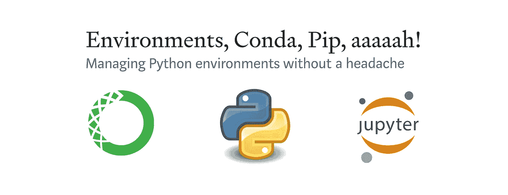
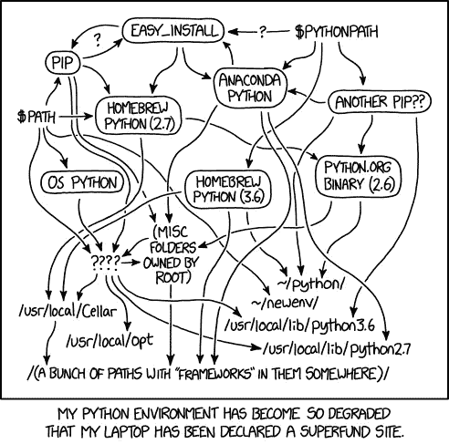
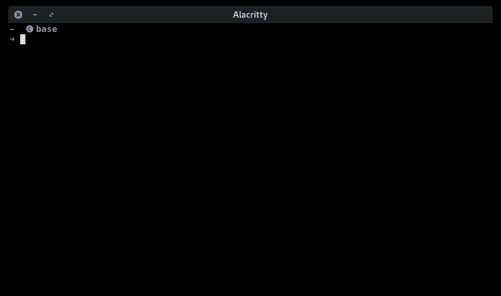
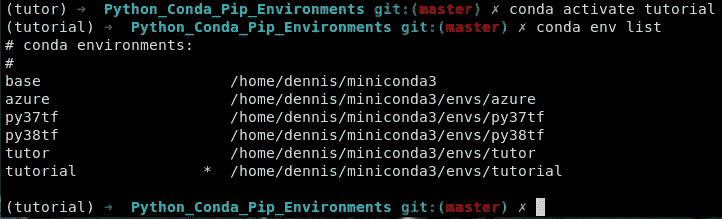
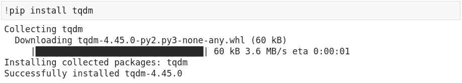
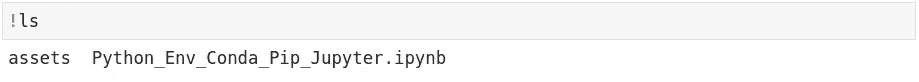
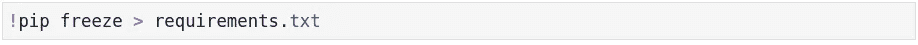

# 环境，康达，匹普，啊啊！

> 原文：<https://towardsdatascience.com/environments-conda-pip-aaaaah-d2503877884c?source=collection_archive---------9----------------------->



## 轻松管理 Python 环境

安装 Python 的方法有很多，不幸的是，这很容易造成混乱。在这篇博文中，我描述了一种非常有效的方法。我知道其他很棒的解决方案，但这是我通常推荐的方式，尤其是对初学者。

👉[这是我每天 10 分钟 Python 课程的一部分](/master-python-in-10-minutes-a-day-ac32996b5ded)！

虽然没有太多代码，但这个文档仍然可以在[我的 Github](https://github.com/dennisbakhuis/Tutorials/tree/master/0_Python_Conda_Pip_Environments) 上作为 Jupyter 笔记本使用。你也可以在那里找到我以前的教程。

**我们将讨论的主题的简短概述:**

1.  Python 很棒，但是…
2.  有效的方法
3.  典型的工作流程
4.  围捕

# Python 很棒，但是…

和很多人一样，我是❤️巨蟒！您可以非常迅速地将您的想法转化为可读的代码解决方案。Python 如此成功的一个重要原因是非常活跃的社区，在这个社区里，了不起的人分享他们令人敬畏的解决方案。这就是为什么您不必从头开始编写数据结构，而只需导入 Pandas。将数据写入 hdf5 文件格式？进口 h5py！剧情有些图， *xkcd* 风格？导入 matplotlib！更好的是，有多种*风格*因此，如果您喜欢以不同的方式绘制数据，请导入各种其他绘图系统中的一种，例如 Plotly、Bokeh、ggplot 等等。所有这些共享的优点使得 Python 在许多快速发展的领域非常受欢迎，比如机器学习。

不幸的是，大社区的所有努力都是有代价的。您使用的包得到更新、重构、改进，或者只是重写，仅仅是因为作者想出了解决他们问题的更好的方法。这些变更可能是对您编写的代码的*破坏*变更。流行的软件包，如 Numpy 或 Matplotlib 是非常可靠的，你得到突破性变化的机会很小。然而，使用不那么流行的包，可能会发生破坏性的改变，尤其是在升级包或 Python 本身的时候。

Python 社区解决这个问题的一种方法是使用虚拟环境。这些用它们自己的一组包创建独立的 Python 安装。为每个项目或任务建立一个独特的环境是一个好的实践。这确保了一个项目的依赖关系不会对另一个项目产生破坏性的变化。这个解决方案工作得很好，但是也创建了一些簿记，因为您有不同的 Python 安装，每个安装可能都有自己的包管理器 Pip。所有这些指向 Python 和/或 Pip 的引用会很快造成混乱，我们最终会看到下面著名的图表 van [XKCD](https://xkcd.com/1987/) :



有趣是因为这是真的。

虽然所有 XKCDs 都很有趣，因为它们通常包含一些真理，事实上，如果您没有某种系统来记账，您的 Python 安装可能会变得一团糟。与 Python 中的所有东西一样，有许多不同的方式来组织它，包括一些很棒的工具，如诗歌、Pipenv 等等。在下一节中，我将描述我正在使用的系统。这对我有效，对你也可能有效。这些只是我的两毛钱，你当然要选择最适合自己的。

# 有效的方法

虽然有很多方法来组织你的 Python 版本、虚拟环境和包，但我还是做了以下这些:

1.  Python 和虚拟环境的 conda
2.  虚拟环境中的包管理 pip

## 放弃 gui，使用 shell

可能有非常好和灵活的图形用户界面(GUI ),但是我更喜欢命令行界面(CLI)。他们给我的印象是我更有控制力。我不确定这是不是真的，但至少我在做的每一步都得到了确认。有许多不同的外壳可供选择，这真的没有多大关系。使用您现有的一个通常是最容易的。当你花更多的时间在 CLI 中，你可能有一天会变得更挑剔，选择不同的*风格*。

**Windows** 默认安装了两种不同的 CLI，命令行提示符(CMD)和 Windows Powershell。两个都可以，但是动力外壳给人的感觉更多的是外壳。如果您从未使用过 CLI，在 Youtube 上观看 power shell 的教程可能会很有用。虽然我已经有一段时间没有使用 windows 了，但是还有其他选择，包括在 Windows 上运行著名的 Linux Bash shell。

MacOs 默认有 Bash (MacOs Catalina 有 Zsh)很棒。您可以使用终端应用程序访问 shell，这是一种与 bash 或 zsh 交互的方式。我个人更喜欢 Zsh 作为外壳，iTerm2 与之交互。两者都可以用自制软件安装。如果你不熟悉 Bash，我强烈建议你去看一个关于它的教程，因为它非常有用。

Linux 用户可能已经熟悉了 shell。安装哪个 shell 和终端应用程序取决于您安装的发行版。一般来说都可以，用你现有的。

虽然您的 shell 看起来很可能会非常不同，但这里是我的 shell 的图像:



Nerd 信息:服务于 Zsh 并显示空格提示的 Alacritty 终端模拟器。

## 安装 conda 软件包管理器

现在我们已经熟悉了 shell，让我们来看看下一个需求:conda 发行版。Conda 是一个流行的 Python(和许多其他语言)包管理器，它让您可以访问几乎所有的 Python 版本和包。它包括一个管理虚拟环境的简单系统。虽然 conda 可以用于安装包，但我只将其用于虚拟环境和 Python 版本。Conda 有一个叫做依赖检查的特性，它工作得很好，但是有时会有点慢。此外，一些软件包使用 pip 更新，因此我选择只使用 Pip。混合使用这两种工具可能会有效，但是使用一种工具可能会更好。

通常，conda 是使用 [Anaconda](https://www.anaconda.com/products/individual) 安装的，这是一个成熟的发行版，包括许多包、工具和一个 GUI。它安装了许多你可能永远不会用到的软件包，我发现 GUI 使用起来很慢。安装 conda 的另一个选择是使用 [Miniconda](https://docs.conda.io/en/latest/miniconda.html) ，另一个发行版，顾名思义要小得多。Miniconda 是一个基础安装，带有 Python 系统、Pip、conda 和一些其他工具。虽然安装非常简单，但这里有一些简单的指导原则:

*   安装在您的*主目录* **中，当且仅当**在完整路径中有*而非*空格。例如，如果您有一个使用空格的用户名，例如“dennis bakhuis”，那么您的主目录路径也将包含一个空格(/home/dennis bakhuis/)。这可能会导致一些包出现问题，因为不是所有的导入都在路径周围使用引号，这是 spaces 文件夹名称所必需的。如果您碰巧在文件夹中有一个空间，请在不同的位置安装 miniconda。例如在 Windows 中，只需使用根目录:“C:/miniconda3”
*   安装 miniconda 后，您应该可以在 shell 中使用 conda 命令。要测试这一点，请打开您的 shell 并键入“conda - version”。如果没有找到这个命令，miniconda 的路径必须添加到全局 path 变量中。
*   对于 powershell 用户，应该在 powershell 中输入一个额外的步骤:“conda init powershell”

这就是安装在虚拟环境中使用 Python 所需的工具的全部内容。在下一节中，我将解释一个典型的工作流程。

# 典型的工作流程

Miniconda 没有任何 GUI，因此，您的起点总是 shell。

## 为项目或任务创建 Python 环境

如果您现在打开一个 shell，那么您已经准备好了新的 Python、Conda 和 Pip。您可以将软件包直接安装到您的“基础”环境中，但是我强烈反对这样做。如果你，不管出于什么原因，把你的“基础”环境搞得一团糟，没有办法删除它。选项是重新安装(这实际上并不是那么糟糕)或手动移除软件包。也许有窍门，但更简单的是创建虚拟环境。

我会为每个项目或任务创造一个环境，只是为了把事情分开。如前所述，我使用 conda 创建了一个环境:

```
conda create --name tutorial python=3.7
```

这将创建一个名为“tutorial”和 Python 3.7 . x 版本的新环境。因为我们使用了单个“=”，所以我们告诉 conda 使用 Python 3.7 树中的最新版本。目前这是版本 3.7.7。如果我们使用了两个等号' == '，我们会告诉 conda 给出确切的版本 3.7，所以有一个微妙的区别。

创建环境后，我们必须切换到新创建的环境。对于这种情况，conda 有激活命令:

```
*conda activate tutorial*
```

现在，您处于名为“教程”的孤立 python 环境中，它有自己的 Python、Conda 和 pip 版本。您可能不完全确定以前创建的环境是如何调用的。要检查可用的环境，您总是可以使用:

```
*conda env list*
```



目前，我的基础系统旁边有五个环境。

上图显示了我的所有可用环境。这些只是你的 miniconda 文件夹中的子目录。当前活动的环境用星号显示。在下一节中，让我们在新创建的环境中安装一些包。

## 使用 pip 安装软件包

在您激活的环境中，使用“pip install”命令安装软件包非常容易。对于这个例子，我们将安装包 numpy，pandas，jupyterlab，matplotlib。虽然 pip 的依赖性检查不像 conda 那样复杂，但是它确实知道 Pandas 依赖于 numpy，并且如果缺少它，它将安装 dependency。要安装软件包，请键入:

```
 *pip install pandas matplotlib jupyterlab*
```

安装完成后，包就可以运行了。例如，要启动 Jupyter 实验室，请键入:

```
jupyter lab
```

当你在笔记本上工作时，有时会发生忘记安装那个软件包的情况。比如想用 tqdm 有一些进度条。要安装这个包，打开您正在使用的 shell 旁边的另一个 shell，激活环境，并使用 pip 安装 tqdm。该包可以立即在您正在使用的笔记本中使用。或者使用以下方式将其直接安装到您的笔记本电脑中:



“！”用于执行 shell 命令。例如，要创建一个*list 目录* (ls)，我们需要:



所以用！‘pip install tqdm’我们可以直接在当前环境下安装包。在我看来，shell 方法更显而易见，因为您完全可以确定您将在哪个环境中安装软件包，但是这两种方法都很棒！。

安装软件包的另一个好方法是使用 requirements.txt 文件。这是一个使用“pip freeze”命令生成的列表，给出了所用软件包的确切版本，是从以前的项目中复制环境的好方法。要自己创建 requirements.txt，请在 shell 中键入以下内容:

```
*pip freeze > requirements.txt*
```

当然，您也可以从 jupyter 调用这个命令:



如果您打开这个文件，或者在没有 requirements.txt 的情况下运行它，您将会看到您的环境中所有包的列表，以及在双等号后面的确切版本。如果您在项目或 git-repo 的根文件夹中提供这个文件，其他人可以用一个命令安装所有需要的包:

```
*pip install -r requirements.txt*
```

如您所见，requirements.txt 是共享和复制环境的好方法。

## 删除环境和其他命令

过一会儿，您将收集相当多的环境，这会给您的系统带来一些混乱。要删除不再需要的环境，我们可以简单地删除它们。如果您还需要它，使用 requirements.txt 很容易重新创建环境。在删除环境之前，我们必须将其停用。为此，请键入:

```
*conda deactivate*
```

现在，我们可以通过键入以下命令来删除环境:

```
*conda env remove --name tutorial*
```

为了验证，环境确实消失了:

```
*conda env list*
```

**一些可能有用的命令:**
克隆一个现有的环境:

```
*conda create --clone tutorial --name tutorial2*
```

搜索可用的软件包:

```
*pip search tensorflow*
```

# 围捕

这是用来管理蟒蛇、蛇、蛇卵和所有蛇的。正如我之前提到的，这是一种方法，还有许多其他方法。其他方法可能会更好，但这个对我来说很有效。请随意评论这个过程如何能做得更好，或者什么对你有用。

如果您有任何问题或建议，请告诉我。