# EPL 2020/21 赛季分析与预测

> 原文：<https://towardsdatascience.com/epl-2020-21-season-analysis-and-prediction-5502e20dce26?source=collection_archive---------29----------------------->

在第四周比赛后进入国际比赛日，已经打了 38 场比赛，正好是赛季中 380 场比赛总数的 10%。到目前为止，本赛季一直不可预测，去年的顶级球队积分下降，一些中游球队和弱队表现出色。在这篇文章中，我试图分析球队的表现，并试图预测即将到来的比赛结果。

预期目标(xG)是用于分析和预测的主要因素，如果你不熟悉 xG，建议你[在继续下一步之前查看这篇解释 xG 的文章](https://medium.com/@abhijithchandradas/xg-xplained-27b1dbafa943)。

# 主场优势，在后 COVID 时代还存在吗？

由于疫情，比赛目前在空的体育场进行。主场优势不仅仅是对比赛场地的熟悉，而是成千上万为主队的胜利加油的铁杆球迷的精神和鼓励。

这就是为什么即使想到要去安菲尔德或者老特拉福德也会让客场球队不寒而栗。一般来说，与客场比赛相比，球队在主场的表现更好。

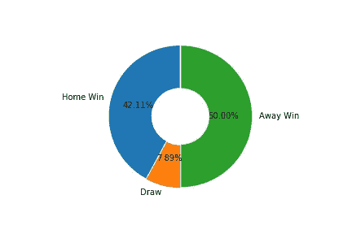

本赛季，到目前为止还没有主场优势的证据。在迄今为止的 38 场比赛中，19 场比赛客队获胜，3 场平局，主队只赢了 16 场比赛，约占总比赛数的 42%。

# 奇怪的主场劣势！

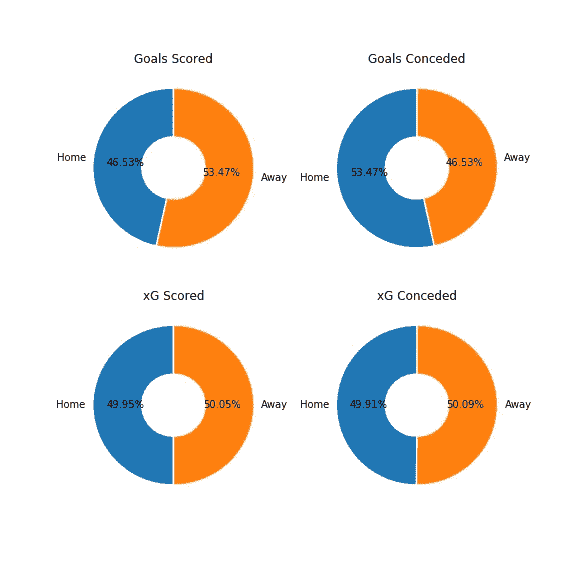

本赛季主队得分一直被客队超过。此外，主队在[【预期进球】](https://medium.com/@abhijithchandradas/xg-xplained-27b1dbafa943)和【预期失球】两项指标上都表现不佳。

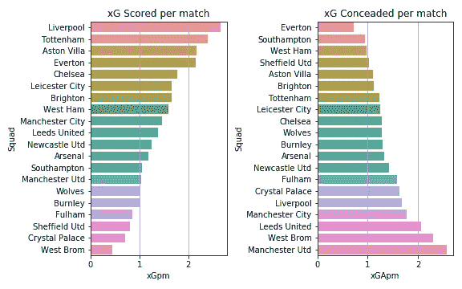

卫冕冠军利物浦在每场比赛的预期进球中领先，每场比赛约 2.5 xG，包括点球。热刺、阿斯顿维拉、埃弗顿也都管理过大于 2 的 xG。
西布朗是目前排名最低的球队，在很低的 xG 下努力创造机会。
xG 低的球队缺乏创造力，应该用有创造力的球员来补强球队。对于采用防守型打法的球队来说，xG 可能较低，这种打法依靠对手的反击或失误来得分。
埃弗顿、南安普顿、西汉姆似乎有着密不透风的防守，注册 xGA 低于 1。谢菲尔德，阿斯顿维拉和布莱顿也展示了坚实的防守。根据 xG 承认，上赛季前四名球队中的 3 支——利物浦、曼城和曼联——是防守最差的 5 支球队。曼联记录了最高的预期失球，平均每场比赛约 2.5 个球。利兹和西布朗也有 2 个以上的 xGA。xGA 高的球队应该立即解决他们在防守上的问题。

# 得分的净预期目标

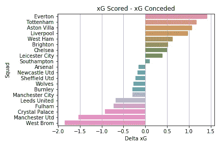

Delta xG 是预期进球和预期失球之间的差值，可以用来评估一支球队的状态。埃弗顿似乎统治着联盟，每场比赛的 delta xG 接近 1.5。热刺和阿斯顿维拉也有 delta xG 超过 1。尽管被阿斯顿维拉以 7-2 羞辱，红军仍然紧随其后排在第四位。另一端，曼联和西布朗的 delta xG 都在 1.5 以上。

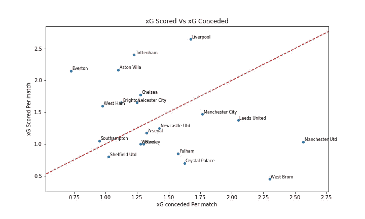

红线以上的队伍 xG 比 xGA 好。上赛季的最佳射手曼城队通常统治着联赛，但他们没能比对手创造更多的机会。他们的同城对手曼彻斯特联队经历了几十年来最糟糕的开局。

# 期望与现实

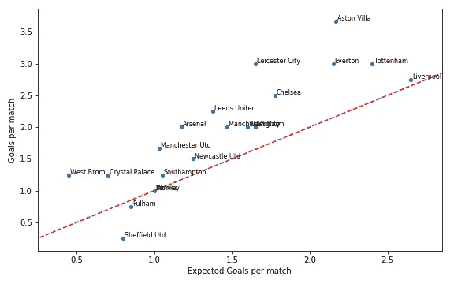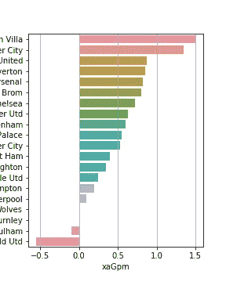

一支球队可以超越 xG，要么是因为球队拥有多产的前锋，他们可以转换一半的机会，要么是因为运气好，设法进了一些球。阿斯顿维拉每场比赛都比 xG 多进 1.5 个球，他们不太可能继续前进。
莱斯特城似乎也远远超过了 xG，这可以归功于瓦尔迪的 3 个点球。除非莱斯特每个周末都被判罚点球(即使有新的手球宽松政策，这也是极不可能的)，否则他们的差距就会缩小。
曼联的 5 个进球中有 2 个也来自点球，xG 来自空位的发挥对于红魔来说也要低得多。

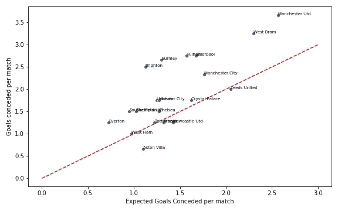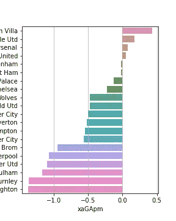

阿斯顿维拉、纽卡斯尔、阿森纳和利兹是 20 支球队中仅有的 4 支超过预期失球的球队。这个赛季进球似乎很容易。
利物浦、曼联、富勒姆、伯恩利和布莱顿都不走运，每场比赛失球比预期的多。

# 象限分析

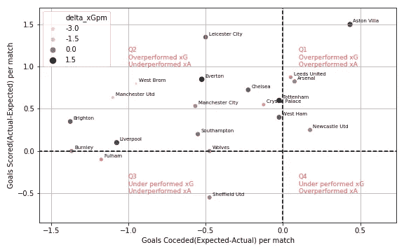

最好的情况是超过 xG 和 xGA 一个合理的幅度。
从长远来看，大幅超越 xG 通常是不可持续的。如果球队设法创造更多的机会，落后于 xG 不是一个大问题(xG)。
气泡的大小表示每场比赛的预期净胜球数(xG-xGA)。球队的首要目标应该是提高净胜球。
第一象限:超水平发挥的 xG 和超水平发挥的 xGA
Q1 队在超水平发挥预期目标方面做得很好，他们必须保持这种势头，像利兹和纽卡斯尔这样的球队应该努力提高净胜球数。
第二象限:表现出色的 xG 和表现不佳的 xGA
Q2 的球队应该努力向 Q1 靠拢，这是为了提高防守。
第三象限:表现不佳的 xG 和表现不佳的 xGA
第三季度的球队应提高防守和进攻。
第四象限:表现不佳的 xG 和表现良好的 xGA
第四季度没有团队。

# 预测结果

用于预测比赛分数的逻辑是基于前一时期每场比赛的 xG 和 xGA。

主队得分计算为主队 xG 和客场 xGA 的平均值。
*G _ home =(xG _ home+xGA _ away)/2*

客场队的分数计算为客场队的 xG 和主队的 xGA 的平均值。
*G _ away =(xG _ away+xGA _ home)/2*

净胜球(GD)的计算方法是主队得分与客队得分之差。
T4【GD = G _ home-G _ away

总进球数(GS)是主队得分和客队得分的总和。
*GD=G_home+G_away*

第五场比赛的预测结果如下。

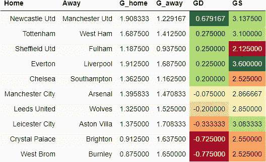

游戏周 5 结果预测

净胜球的绝对值越高，比赛就越一边倒，而净胜球的值越接近零，就意味着这场比赛有望势均力敌。
GD 的负值暗示客队有可能获胜，正值偏向主队获胜。
较高的进球数意味着我们可以期待一场进球盛宴，而较低的进球数则表明比赛得分较低。
根据模型，伯恩利在客场对阵西布朗的比赛中表现最佳，净胜球为 0.77，有利于红葡萄酒。
布莱顿对水晶宫的比赛也有望成为海鸥公园里的散步。曼联造访圣詹姆斯公园的比赛估计会让红魔再次心碎。
曼城 vs 阿森纳的比赛是比赛周中最势均力敌的一场比赛，xG 略微有利于枪手。切尔西对圣徒和利兹对狼也将是一场激烈的比赛。默西德比被认为是一场进球盛宴，东道主比卫冕冠军更胜一筹。

# 更新:预测与实际结果

最后，这是关键时刻，是时候将预测与第 5 周的实际比赛结果进行比较了。

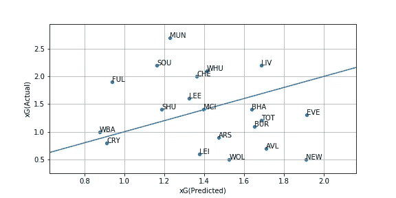

表现超出预测 xG 的团队在线上，而表现低于预测 xG 的团队在线下。
曼联远远超出了他们的预测。他们的 xG 预测很低，因为样本量只有他们打水晶宫(最好的防守方之一)、布莱顿和马刺(10 人)的 3 场比赛。随着赛季的进行，他们的 xG 会提高。

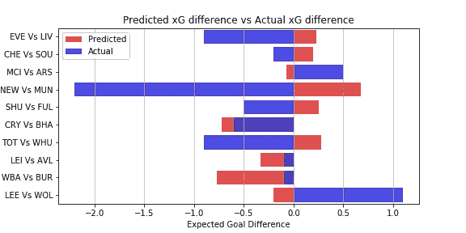

在总共 10 场比赛中，只有 3 场比赛的预测是正确的，这是预期的，因为样本量非常小，没有考虑其他因素，当然也是由于比赛固有的不确定性。水晶宫对布莱顿的比赛中预测最为准确。客队被预测会统治 xG，他们以 20 次射门击败水晶宫的 1 次射门。在纽卡斯尔对曼联、埃弗顿对利物浦、热刺对铁锤帮和利兹对狼队的比赛中，这些预测都是非常错误的。

## 资源和鸣谢

数据来源于[fbref.com](https://fbref.com)
所有相关的输入 csv 文件和 jupyter 笔记本(python 代码)都可以在我的 [GitHub Repo](https://github.com/abhijith-git/EPL-and-FPL/tree/main/GameWeek4) 中访问。

## 成为会员

我希望你喜欢这篇文章，我强烈推荐 [**注册*中级会员***](https://abhijithchandradas.medium.com/membership) 来阅读更多我写的文章或成千上万其他作者写的各种主题的故事。
[你的会员费直接支持我和你看的其他作家。你也可以在媒体上看到所有的故事。](https://abhijithchandradas.medium.com/membership)

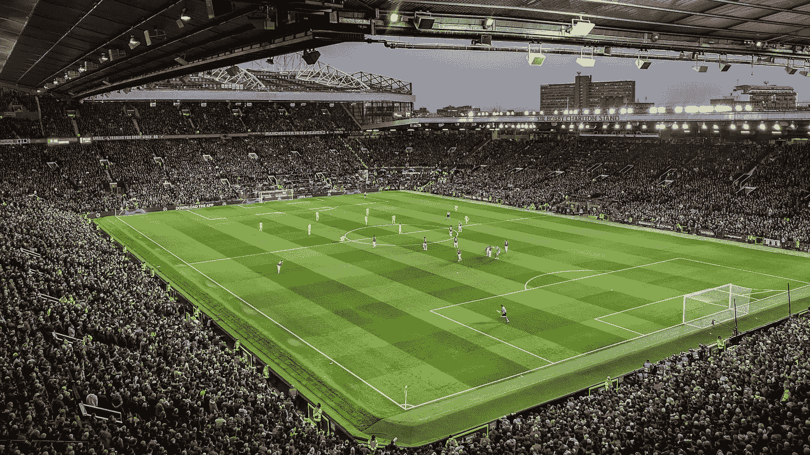

亚历克斯·莫托克在 [Unsplash](https://unsplash.com/s/photos/manchester-united?utm_source=unsplash&utm_medium=referral&utm_content=creditCopyText) 上拍摄的照片