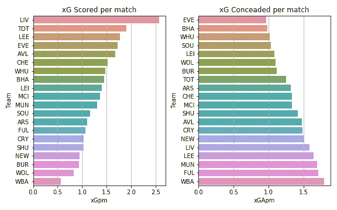
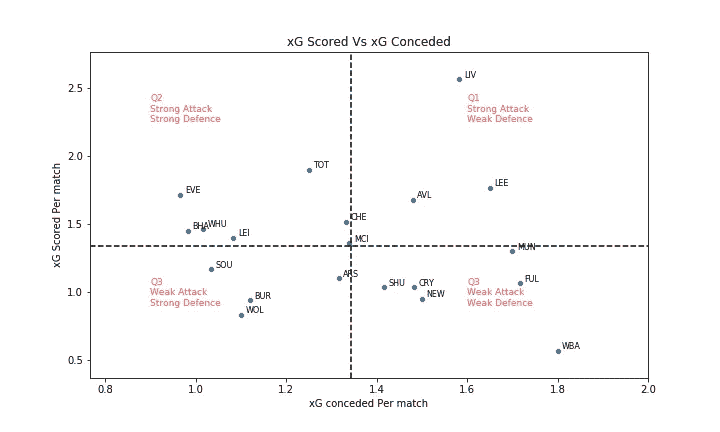
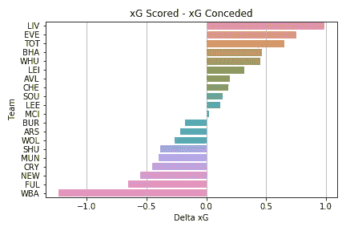
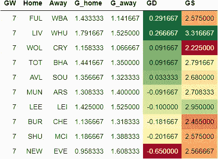
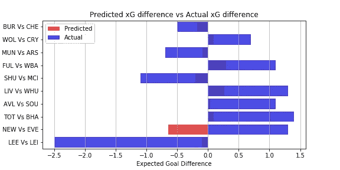

# EPL 分析和游戏周 7 预测

> 原文：<https://towardsdatascience.com/epl-analysis-and-gameweek-7-prediction-f22a2d8991cd?source=collection_archive---------52----------------------->

## 使用 xG 统计预测英超联赛结果的数据驱动尝试

这是我的 EPL 预测系列的一篇文章。你可以在这里查看上一周比赛的[预测和实际表现。](/epl-game-week-6-prediction-using-data-science-xg-model-40541b03523c)

[预期目标或 xG](https://medium.com/@abhijithchandradas/xg-xplained-27b1dbafa943) 是用于预测的参数。如果你对理解预测算法感兴趣，我推荐你去看看[这篇文章，里面有详细的解释](/epl-2020-21-season-analysis-and-prediction-5502e20dce26)。

# 截至第 6 周比赛的分析

在 6 个比赛周之后，前 15 名球队之间有 6 分的差距，到目前为止还没有明确的冠军争夺者。联赛竞争激烈，没有不败的球队。唯一在第五轮比赛前保持不败的球队，埃弗顿和阿斯顿维拉在第六轮比赛中尝到了他们的第一次失败。两个默西队都以 13 分高居积分榜首。由于净胜球，埃弗顿在积分榜上排名第一。

xG 每场比赛得分和失球(图片由作者提供)

卫冕冠军利物浦是最好的进攻球队，每场比赛创造超过 2.5 xG，没有其他球队能够每场比赛创造超过 2 xG。马刺、利兹、太妃糖、维拉场均 1.5 xG 以上。
另一方面，西布朗在每场 0.5 左右的 xG 下努力创造进球机会。更糟糕的是，西布朗的防守也是漏洞最多的。狼队和伯恩利队也在努力创造得分机会，但他们能够以良好的防守能力部分弥补这一点，正如低失球率所表明的那样。

埃弗顿、布莱顿、西汉姆和南安普顿拥有最好的防守，每场失球约 1 xG。尽管布莱顿队防守严密，但他们在比赛中运气不佳，至今丢了 12 个球，平均每场丢 2 个球。

作者图片

根据 xG 得分和 xG 失球，球队可以分为 4 个象限，如上图所示。水平虚线表示每场比赛的平均 xG 得分。水平虚线以上的球队是强攻方，下面的球队进攻弱。
垂直虚线显示每场比赛的平均 xG 失球，左边的球队防守强，右边的球队防守弱。

所有球队的目标都应该是 Q2，那里的进攻和防守都比平均水平要好。例如，伯恩利在联盟中是一个很好的低位防守方。在第六场比赛中，他们面对的是本赛季进球最多的马刺队。伯恩利的防守在遏制热刺进攻方面做得很好，他们在上半场将射门限制在零，比赛的唯一进球来自定位球。然而，伯恩利是创造机会最少的球队之一。除非他们采取积极的措施来提高他们的打击力，否则他们很难在联赛中晋级。

作者图片

一些团队能够用他们在另一个领域的优势来弥补他们在一个领域的弱点，从而产生正的 delta xG(xG 得分和 xG 失分之间的差异)。我们可以看看利兹和南安普顿。贝尔萨的球队在遏制对手进攻方面表现不佳，但他们能够创造进球机会来弥补前者。另一方面，圣徒队的防守几乎没有失误，但在为 Ings 和队友创造得分机会方面做得不好。但他们的防守能力可以弥补前场创造力的不足。

# 游戏第 7 周预测

在进行预测之前，让我澄清一下，这是一个非常简单的算法，只是基于过去的 xG，所以只能预期基线性能。样本量很小，而且很多其他重要因素也没有考虑。随着赛季的进行，这个算法将会在未来结合更多的因素。

下表提供了对第 7 周比赛的预测。
GD 的绝对值显示了比赛的竞争力。该值越高，预计匹配越偏向一侧，预测的准确性也越高。GD 值越低，这场比赛就越可能是任何人的游戏。GD 的正值表示主场胜，负值表示客场胜。

游戏第七周预测(图片由作者提供)

在即将到来的比赛中，我们可以期待许多竞争激烈的比赛。纽卡斯尔对埃弗顿是唯一一场可以观察到超过 0.5 倍差距的比赛。太妃糖极有可能带着 3 分离开圣詹姆斯公园。富勒姆有相当大的机会在本周对阵麻雀队的比赛中赢得本赛季的第一场胜利。卫冕冠军有望在主场赢得对复活的铁锤帮的比赛，铁锤帮已经让曼城和热刺丢分。冠军争夺者，德·布鲁恩和他的公司有望压倒刀锋队的防守。

利物浦 vs 西汉姆有望产生最多的进球数。另一方面，保卫战——狼队 vs 水晶宫预计是得分最低的比赛。

# 更新:实际与预测

预测的 xGD 与实际的 xGD(图片由作者提供)

该算法在预测游戏周的 10 场比赛中的 9 场比赛的方向方面做得非常好。这个预测只有在纽卡斯尔对埃弗顿的比赛中是错误的。我们的算法预测埃弗顿队会压倒纽卡斯尔队。然而，喜鹊击败了太妃糖，连续第二次击败了他们。由于詹姆斯·罗德里格兹、理查德森和迪格内三人组的缺席，太妃糖队肯定是弱队，这不能在 xG 模型中考虑。就震级而言，预测并不准确。在所有比赛中，占优势的球队能够创造比预期更多的进球机会。这种差异在阿斯顿维拉对南安普顿，托特纳姆对布莱顿，纽卡斯尔对埃弗顿和利兹对莱斯特的比赛中最为明显。这些比赛也有有利于获胜队的点球。

照片由[谁是德尼罗？](https://unsplash.com/@whoisdenilo?utm_source=medium&utm_medium=referral)号上[的 Unsplash](https://unsplash.com?utm_source=medium&utm_medium=referral)