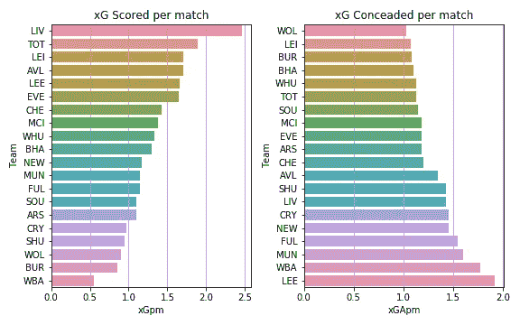
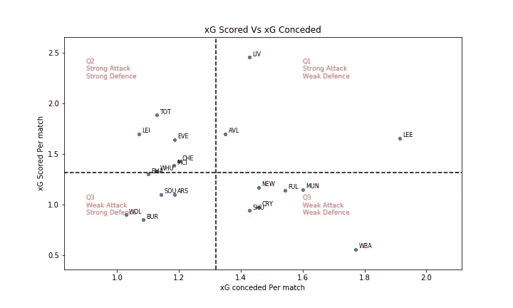
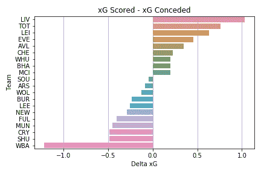
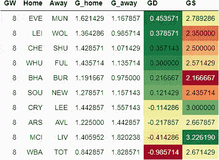
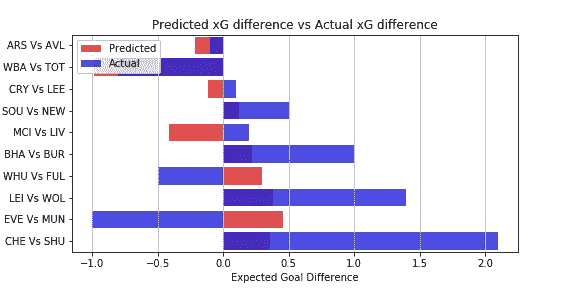

# EPL 分析和游戏周 8 预测

> 原文：<https://towardsdatascience.com/epl-analysis-and-gameweek-8-prediction-691fcc6bdfdd?source=collection_archive---------48----------------------->

## 使用 xG 统计预测英超联赛结果的数据驱动尝试

这是我的 EPL 预测系列的一篇文章。你可以在这里查看[对前一周比赛的预测以及它与实际表现的对比。](/epl-analysis-and-gameweek-7-prediction-f22a2d8991cd)

[预期目标或 xG](https://medium.com/@abhijithchandradas/xg-xplained-27b1dbafa943) 是用于预测的参数。如果你对理解预测算法感兴趣，我推荐你去看看[这篇文章，里面有详细的解释](/epl-2020-21-season-analysis-and-prediction-5502e20dce26)。

# 对第 7 周比赛的分析

在 7 个比赛周之后，前 13 名球队之间有 6 分的差距，到目前为止还没有明确的冠军争夺者。联赛竞争激烈，没有不败的球队。联盟的竞争力可以用下面这句特别的话来概括:

> 你赢了一场比赛，你是第二，第三或第四。你失去了 2 分你是第 7，第 8 或第 9。英超好美！
> ——穆里尼奥

每场比赛 xG 得分与 xG 失球(图片由作者提供)

在 7 个比赛周之后，卫冕冠军回到了榜首，看起来是最好的进攻方，场均 2.5 xG 左右。红军每场比赛比第二名的马刺多创造 0.5 xG 以上。莱斯特，阿斯顿维拉，利兹和埃弗顿是其他每场比赛创造超过 1.5 克的球队。

依靠防守型打法的水晶宫、谢联、狼队、伯恩利都在创造力上苦苦挣扎，甚至不能每场创造 1 个 xG。西布朗处于一个非常不稳定的位置，既要努力创造得分机会，又要遏制对手的进攻。

当谈到每场比赛的预期失球时，两支球队之间没有很大的差异。大多数球队每场比赛承认 1 到 1.5 xG。只有富勒姆、曼联、西布朗和利兹的场均失球超过 1.5 克。

xG 得分 vs xG 失球(图片由作者提供)

根据 xG 得分和 xG 失球，球队可以分为 4 个象限，如上图所示。水平虚线表示每场比赛的平均 xG 得分。水平虚线以上的球队是强攻方，下面的球队进攻弱。
垂直虚线显示每场比赛的平均 xG 失球，左边的球队防守强，右边的球队防守弱。

每场比赛的增量 xG(图片由作者提供)

尽管红军的防守没有上个赛季那么好，但由于萨拉赫和他的队友的进攻能力，他们成功地登上了德尔塔-xG 排行榜的榜首。

# 游戏第 8 周预测

在进行预测之前，让我澄清一下，这是一个非常简单的算法，只是基于过去的 xG，所以只能预期基线性能。样本量很小，而且很多其他重要因素也没有考虑。随着赛季的进行，这个算法将会在未来结合更多的因素。该算法也不能预测高得分游戏。

该方法的预测准确性在游戏周期间有所提高。[在上一个游戏周，算法能够正确预测 10 场比赛中 9 场比赛的方向。](/epl-analysis-and-gameweek-7-prediction-f22a2d8991cd)

下表提供了对第 8 周比赛的预测。
GD 的绝对值显示了比赛的竞争力。该值越高，预计匹配越偏向一侧，预测的准确性也越高。
GD 值越低，这场比赛就越有可能成为任何人的游戏。GD 的正值表示主场胜，负值表示客场胜。

(图片由作者提供)

本周比赛的重头戏是在伊蒂哈德球场进行的利物浦 vs 曼城的超级周日比赛。该算法即使不能计入克洛普和佩普战术方法的变化，也预测这将是一场高分比赛。然而，预期的净胜球表明利物浦将带着所有的 3 分离开伊蒂哈德。在即将到来的对维拉队的比赛中，枪手预计也会在主场失利。西布罗姆维奇对热刺的比赛预计将是最一边倒的比赛，凯恩和他的队友们预计将击败混乱的西布罗姆维奇防线。

在两连败后，太妃糖有望在主场对阵红魔的比赛中重回胜利之路。狐狸，蓝调，铁锤和海鸥也可以期待主场胜利。

圣徒对喜鹊，老鹰对孔雀被认为是任何人的比赛，拉尔夫·哈森胡特尔和马塞洛·贝尔萨的球队比他们的对手略胜一筹。

# 预测与实际

作者图片

在第八周的比赛中，我们的预测在 10 场比赛中有 6 场是正确的。然而，这些预测并不十分准确，只有 3 个预测的准确度在 0.5 倍以内。阿森纳对阿斯顿维拉的预测最为准确。对于切尔西对谢菲尔德的比赛，预测相差了将近 2 倍，切尔西被认为会创造更多的机会。然而，如此大的优势是没有估计到的。周末唯一真正令人失望的是埃弗顿对曼联的比赛，我们预测太妃糖会在主场轻松获胜，但曼联表现出色，全取 3 分，这要感谢布鲁诺的个人才华！
西汉姆对富勒姆的比赛，预测是铁锤帮主宰了比赛，结果也是 1-0，大卫·莫耶斯队获胜。然而，由于洛克曼错过了一个对他们有利的点球，富勒姆创造了更多的机会。
Pep vs Klopp 是一场高度不可预测的比赛，我们对巨人队之间超级周日冲突的预测稍微有利于德国队。经过一场势均力敌的比赛，这场比赛以平局告终。曼城创造了比冠军更多的 xG，这要归功于曼城获得的点球，KDB 的射门偏出了门柱！如果那个点球没有被判，我们的预测是非常准确的。

照片由 [Jaleel Akbash](https://unsplash.com/@jaleel_akbash?utm_source=medium&utm_medium=referral) 在 [Unsplash](https://unsplash.com?utm_source=medium&utm_medium=referral) 上拍摄