# EPL 幻想 GW1 回顾和 GW2 算法选择

> 原文：<https://towardsdatascience.com/epl-fantasy-gw1-recap-and-gw2-algo-picks-58165f17b77d?source=collection_archive---------41----------------------->

## 我们的金钱球方法到幻想的 EPL(队 _id: 2122122)

如果这是你第一次登陆我的幻想 EPL 博客，你可能会想看看我在上一季(GW1-GW9)开始时写的我的媒体档案中的一些原始 EPL 博客，以熟悉我们的整体方法和我们随着时间的推移所做的改进。

# 什么是新的？

自上周以来，我们增加了一些更新，以帮助保持了解重要的每周统计数据，可以帮助我们更明智地选择球员。

**定位球队员:**我们收集了各队角球和任意球时**定位球队员**和**空中威胁**的数据，并将这些数据作为系数添加到我们的优化算法中。请参考下表，看看哪些球员更有可能因为**参与更多的定位球进攻打法**而长期获得大量加分。

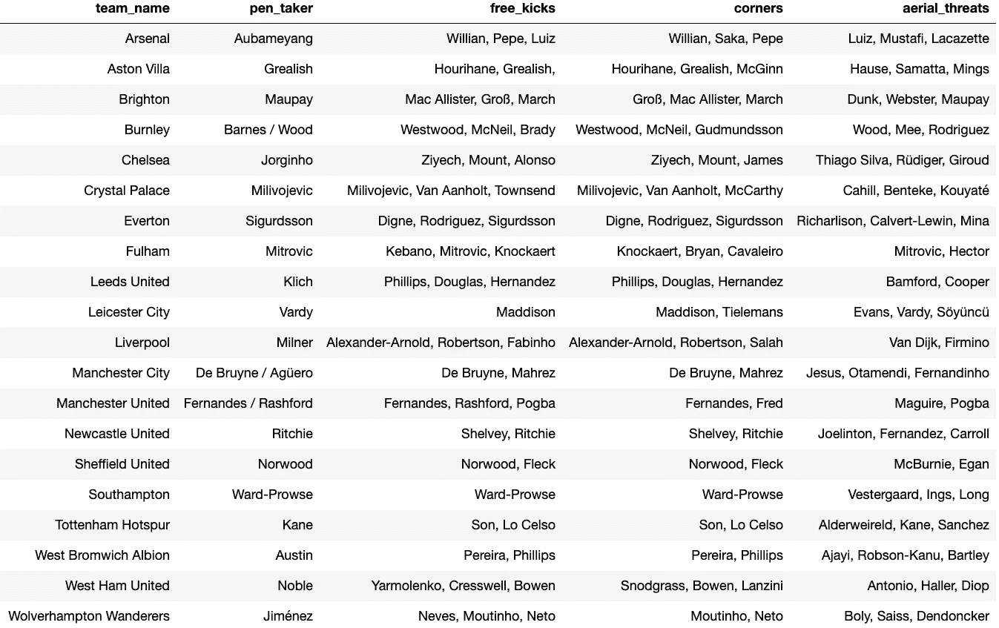

**预测首发阵容:**正如我们已经看到的，本赛季开始时有很多惊喜，所以我们找到了几个网站，考虑到周日的比赛，如杯赛和欧洲比赛，教练新闻发布会和最新的球队新闻，试图**预测每个比赛周的首发阵容**，包括可能有疑问的常规球员。这将有望拯救我们在 GW1 中所做的一些错误的选择，在那里**我们有三个完整的球员没有在我们的一个队中首发**……:(

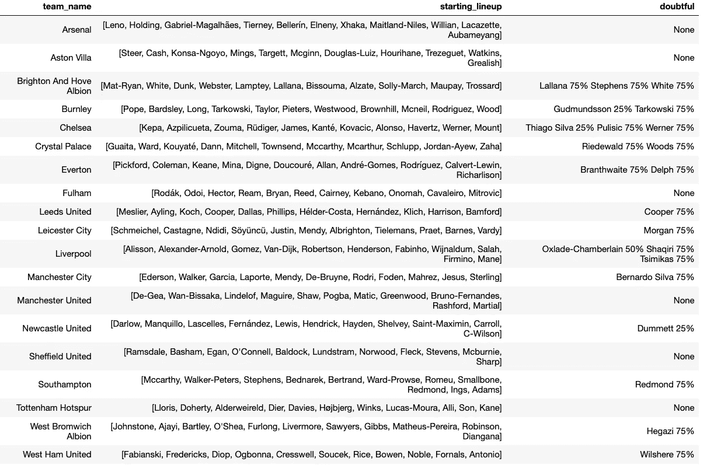

# GW1 排名前 100 的 FPL 团队统计数据

来自 GW1 的世界排名前 100 位的球员中，大多数都有萨拉赫担任三重队长，得分在 125 分+的范围内。让我们来看看他们球队中按位置选择最多的球员和最喜欢的球队阵型。

# 前 100 名最佳守门员

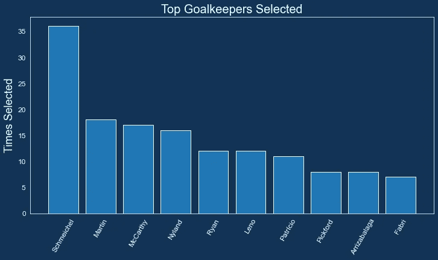

# 前 100 名中最受欢迎的捍卫者

# 前 100 名最佳中场球员

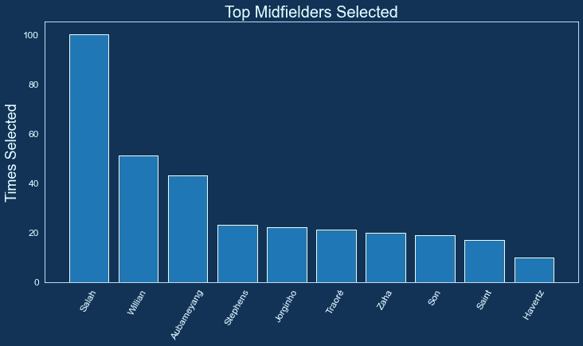

# 前 100 名中入选最多的前锋

我们使用这些数据和当前的球员价格来创建下面的球队，这是由前 100 名中最受欢迎的球员组成的:

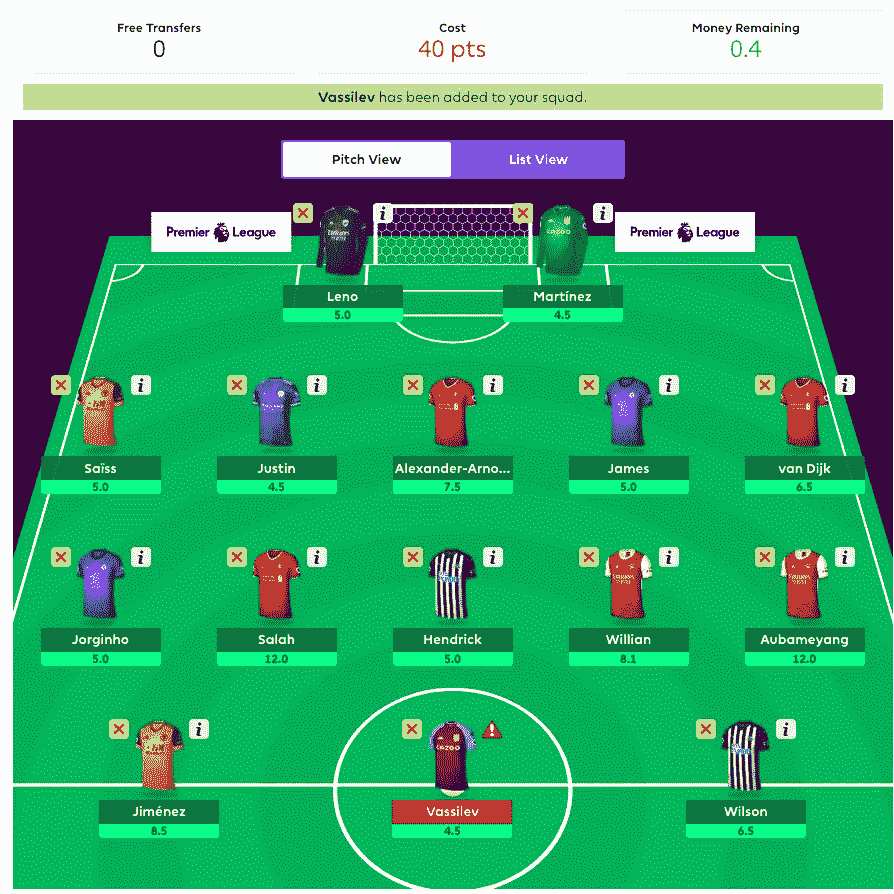

看起来不错的团队，在关键位置上有很多尝试不同选择的余地，同时仍然保持一个坚实的球员核心。

# 前 100 名 Fantasy 用户选择最多的团队

这些数据很有意义，因为大多数顶级球员都试图利用 4-4-2 或 3-4-3 阵型的进攻型中场和前锋。

# GW1 团队绩效总结和总体统计

我们有一个不错的开始，因为我们的一些团队得分在 **70+的范围内**。每周，我们都会发布前 2 名表演团队的照片。有趣的是，我们得分最高的球队有**80 分**，而**甚至没有萨拉赫当队长**。如果我们是萨拉赫的队长，我们会有接近 100 分的**！最重要的是，我们有 3 名 0 分未上场的球员，这是我们在第一个比赛周唯一的失望。**

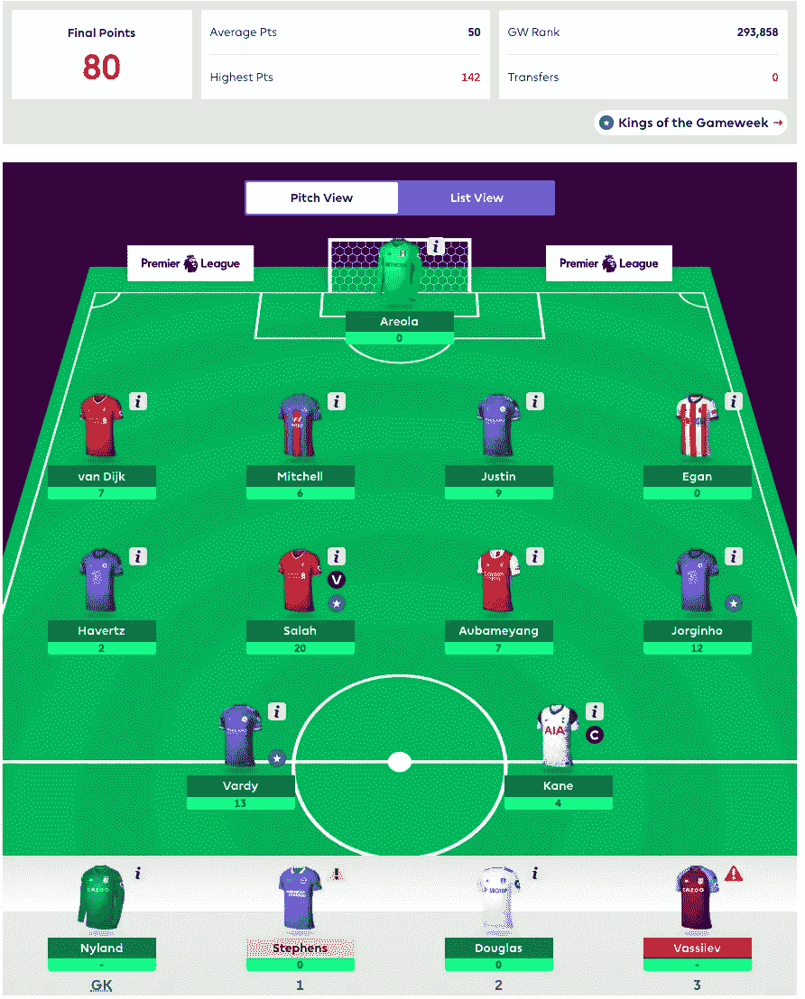

我们还参加了 FPL 的 FanTeam 版本，在那里我们也有两支起步非常强劲的车队。又一次，他们中的一个选错了队长。

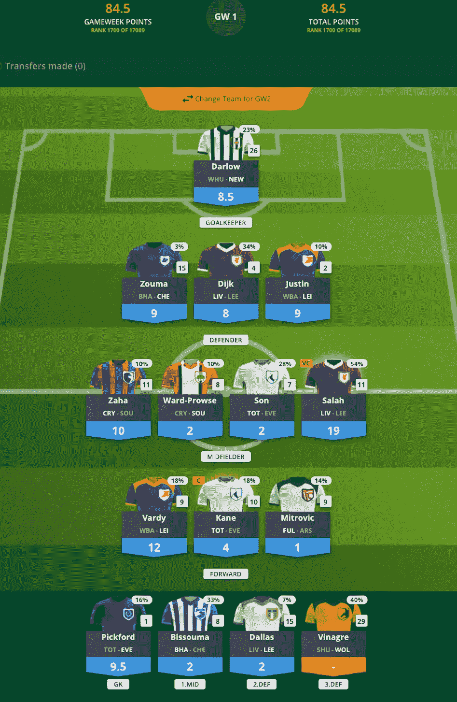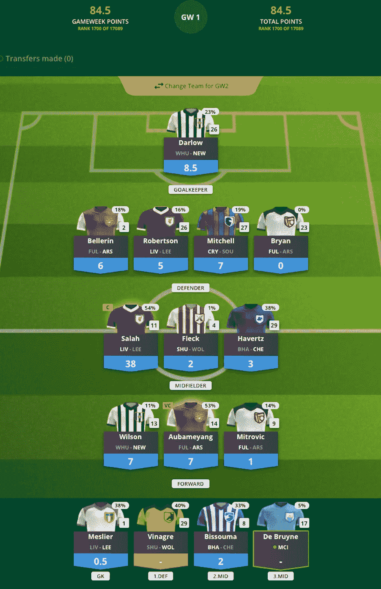

# 为我们的 GW2 选秀权提供有用的数据

由于我们今年在算法中加入了很多新的统计数据，随着时间的推移，这个博客将会有更多的统计数据和图表，更少的文本。让我们从下面三个比赛周的比赛难度等级(FDR)开始:

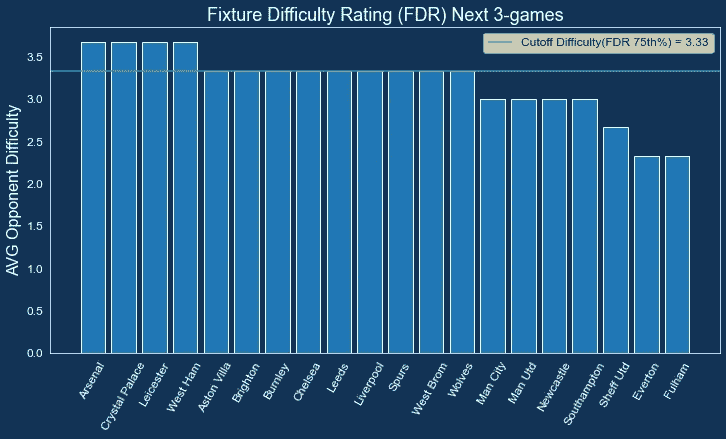

看起来**阿森纳、水晶宫、莱斯特、西汉姆和维拉**有一些艰难的比赛即将到来，所以我们的算法可能不会从这些球队中挑选球员。埃弗顿、曼联、曼城和谢菲尔德联队在接下来的三周里似乎有更轻松的赛程。

# 博彩赔率

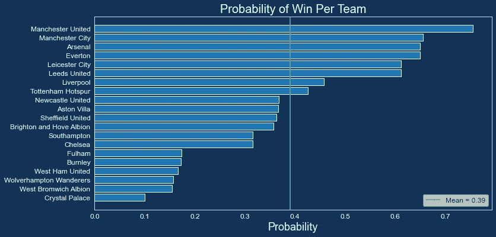

我们会尽量把 ***队伍中有超过 50 %胜算的*** 玩家，比如 ***MUN，MCI，ARS，EVE，雷和 LEE*** 。我们应该尽量不要有太多来自 CRY、WBA、WOL、WHA 或者 BUR 的防守球员。

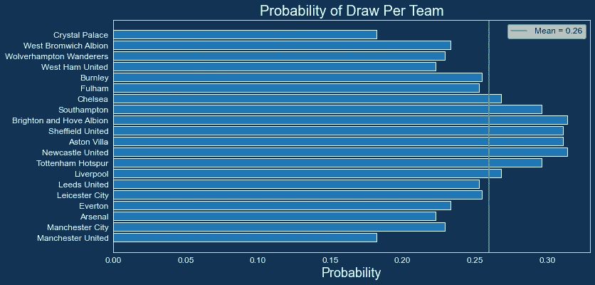

以 ***较高概率抽*** 的队伍，特别是当比赛是 ***结合高赔率为 2.5 以下的*** 时，可能会以 ***对选择防守球员*** 有利，因为如果比赛以 0:0 结束，那将会产生大量的加分。结合 下方的 ***下/上图，我们可以识别出以下 ***概率较高的至少一场不失球的比赛——新 vs***、 ***、*** 和***SOU vs TOT。很高兴看到我们上周的预测完全实现了，WOL、纽斯和科尔都没有失球，尽管没有一场比赛以平局告终！******

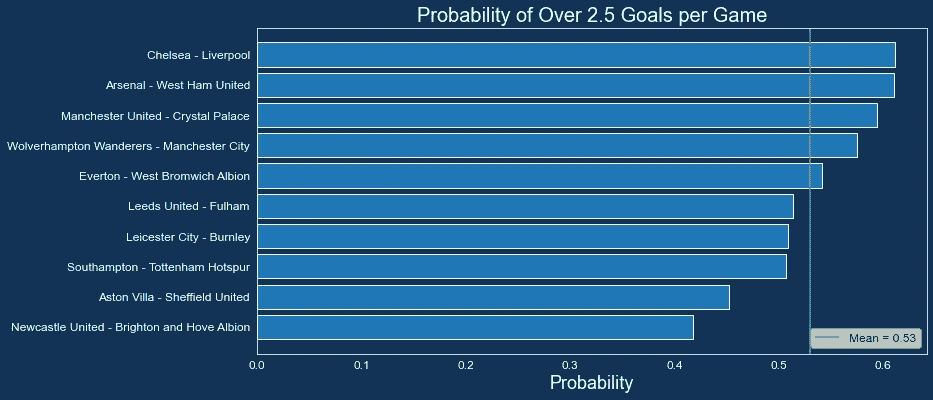

相反，我们可能希望从 ***赔率超过 2.5*** 的游戏中有更多的 ***攻击玩家*** ，例如**CHE*****vs LIV，ARS vs，MUN vs. CRY，WOL vs MCI，EVE vs. WBA。再一次，上周的赔率完美地发挥出来，因为所有的游戏都预测有超过 2.5 个目标！***

# 裁判统计

事实上，我们还发现了一个提取裁判分配的网站，所以现在你可以看到哪些比赛的裁判更有可能判点球或给很多牌。我们也有主场优势统计，这可能有点主观，但由于大多数裁判似乎不倾向于主队，少数实际上有积极得分的统计，可能会比其他人更倾向于主队。话虽如此，看起来安东尼·泰勒有最高的点球率和主场优势系数，所以从麦克·迪恩的数据来看，利兹联队有可能被罚，埃弗顿队也有可能被罚。看起来，像游戏**车-丽芙和-舒有裁判喜欢给很多卡**，所以预计会失去一些黄牌，但希望没有红色…

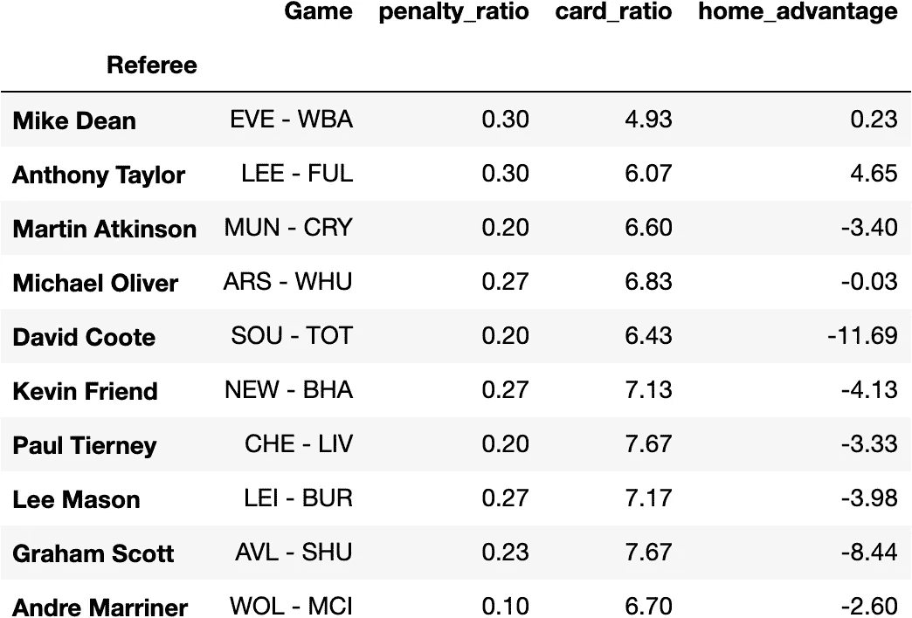

# 预测模型(球员统计)

现在是今年改进算法的皇冠上的宝石——预测球员统计数据的时候了。在为接下来的 n 个游戏周调整我们的团队优化器时，我们会考虑三个主要指标***—***预测总点数、期望值(ROI)和每场游戏奖励点数*** 。下面是每个指标的统计数据，也是按职位细分的。***

# 预计总积分—前 25 名玩家

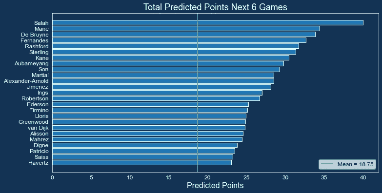

# 预计预期价值(ROI) —前 25 名参与者

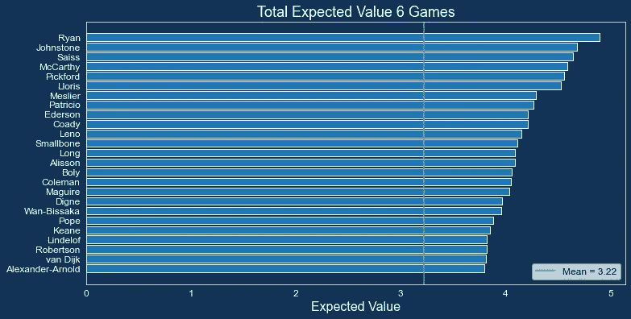

# 每场比赛奖金(上赛季)—前 25 名球员

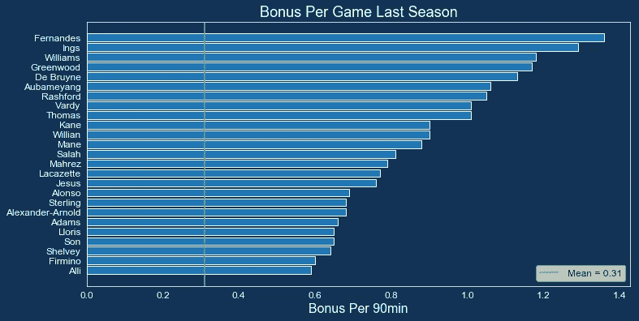

# 预测积分——顶级守门员

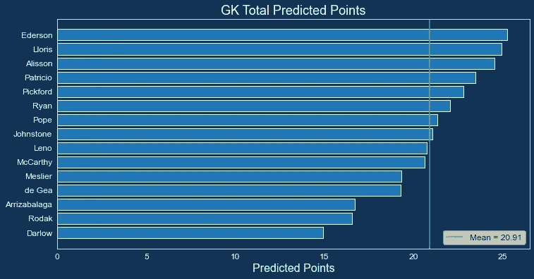

# 投射点数—顶级防守者

# 预测得分——顶级中场

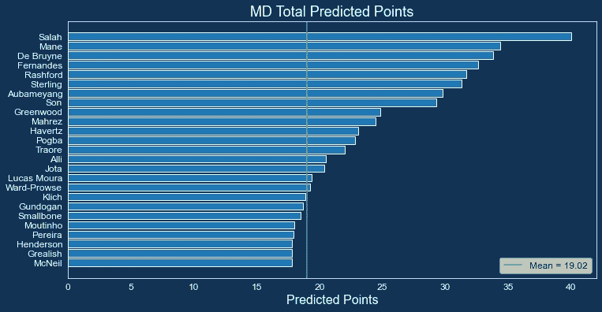

# 预测分数——顶级前锋

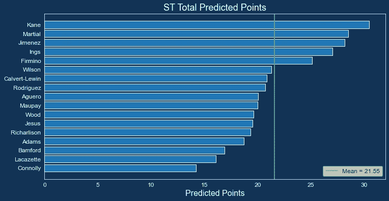

正如你所看到的，每个位置都有大量选项可供我们选择，因此我们将把上面的许多统计数据插入 Python 中的 ***优化函数，该函数将 ***输出具有最高预期总积分*** 的团队，给定我们的预算约束和进入我们决策过程的其他指标。在团队选择器代码生效之前应用的一些初步过滤器包括:***

1.  **排除受伤或停赛球员**
2.  **从 FDR 高的队伍中排除玩家**
3.  **在 GW1** 中排除没有固定比赛的队伍中的球员
4.  **同一团队不能有超过 3 名玩家**
5.  **总共必须有 15 名球员(GK=2，DF=5，MD=5，ST=3)**

下面是模型文本输出的两个例子——一个用于**一个*全队优化*T5，一个用于**一个*单人转会。*****

# 例 1:使用填充接头优化 3–5–2 地层的预算

正如你在下面看到的，模型首先查看参数，告诉它是否应该向 15 名球员的*全队优化，或者向拥有 ***11 名关键球员和 4 名廉价替补*** 的特定阵型优化。对于填充符，它首先查看 ***首选地层*** ，并使用那个 ***来决定每个位置*** 需要多少个填充符。然后，模型从我们的初始预算中减去花费在 4 个填充者上的总金额，并将剩余的预算花费在关键的 11 个参与者上， ***给出优化函数和模型约束*** 。*

*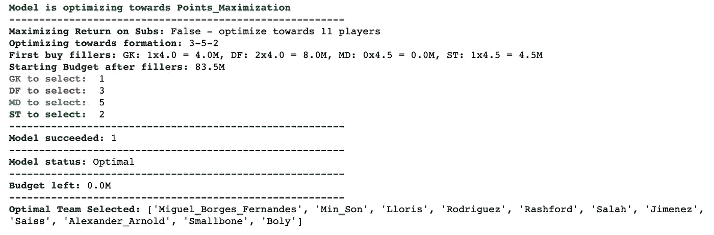*

# *例 2:优化有 15 名现役球员的 3–5–2 阵型的预算*

**

# *游戏周 1 最终选出的队伍*

*和去年一样，并不是我们所有的决策过程都可以完全自动化，这就是这个游戏如此有趣和令人兴奋的原因。也就是说，我们经常查看优化器算法的 ***多个输出，运行一些不同的约束和优化函数*** ，并将它们与本文前面描述的所有其他有用的统计数据结合起来，如 ***裁判统计数据、博彩赔率、FDR 分数、处罚统计数据、奖励积分统计数据*** 等。—向我们最终的团队选择 流程添加一个 ***人的因素。下面是一个平衡稳固的团队的例子:****

*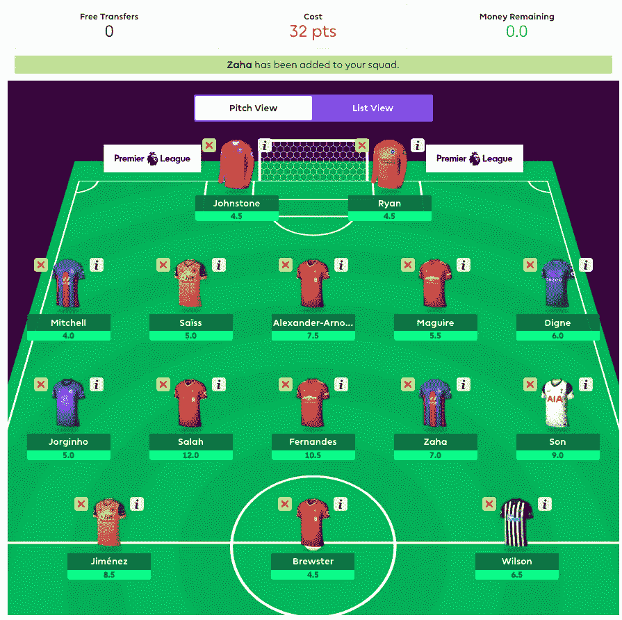*

*就我们自己的球队而言，我们**决定不打我们的外卡**，并试图在下周用两次免费转会来解决我们的门将问题。所以，我们这周的球队看起来和上周很相似，除了我们用威尔逊换走了安东尼奥。我们也希望下周用我们保留的 2 次自由转会得到 KDB。*

*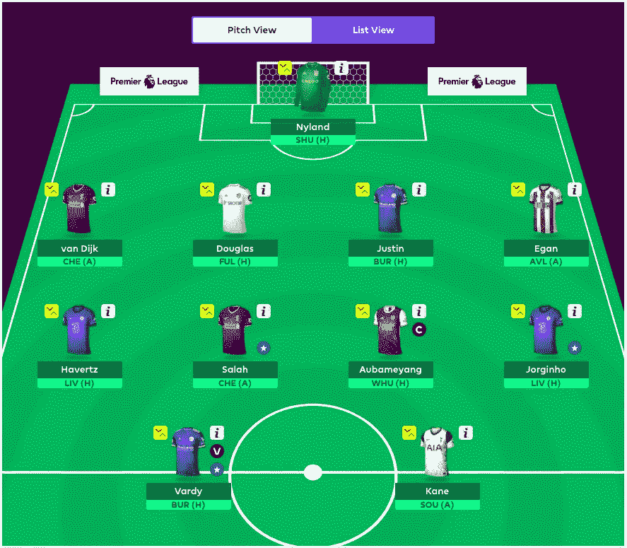**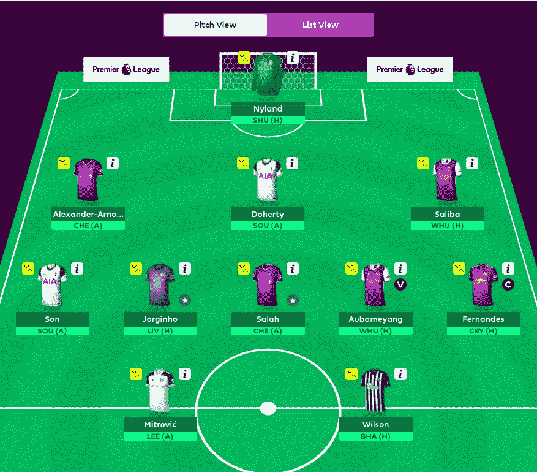*

# *结论*

*看起来很多球员在 GW1 之后使用了外卡，这是可以理解的，MCI 和 MUN 的空白周，以及随着转会窗口结束的临近，每天都出现的首发阵容和最近球员转会消息中的许多惊喜。如果你是那些 FPL 用户中的一员，我希望上面分享的统计数据能帮助你重新选择一个更加稳固和平衡的球队，充满了有望在未来首发阵容中的球员。享受这个周末的比赛，祝你好运，选出正确的队长，因为上周末埃及国王提醒了我们这是多么重要:)*