# EPL 幻想 GW2 回顾和 GW3 算法选择

> 原文：<https://towardsdatascience.com/epl-fantasy-gw2-recap-and-gw3-algo-picks-16573dd004bd?source=collection_archive---------36----------------------->

## 我们的金钱球方法到幻想的 EPL(队 _id: 2122122)

如果这是你第一次登陆我的幻想 EPL 博客，你可能会想看看我的媒体档案中的一些我们最初的 EPL 博客，以熟悉这个项目是如何开始的，以及随着时间的推移我们所做的改进。

# GW2 排名前 100 的 FPL 队数据

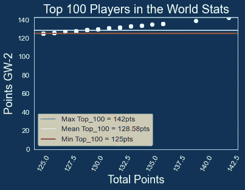

来自 GW2 的世界排名前 100 的选手，大部分得分都在 125 分以上。让我们来看看他们球队中按位置选择最多的球员和最喜欢的球队阵型。

# 前 100 名最佳守门员

# 前 100 名中最受欢迎的捍卫者

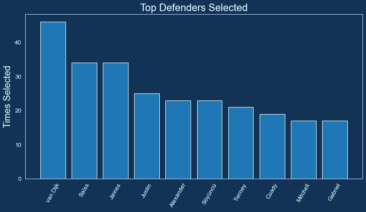

# 前 100 名最佳中场球员

# 前 100 名中入选最多的前锋

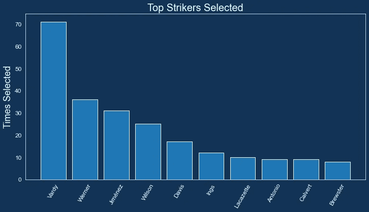

我们使用这些数据创建了下面的团队，它是由前 100 名中最受欢迎的球员组成的:

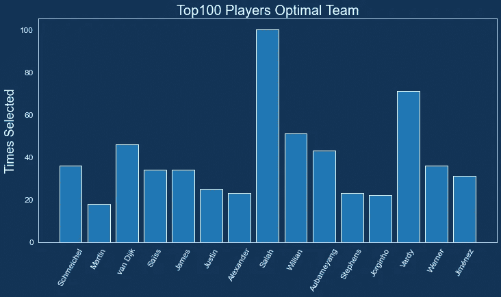

# 前 100 名 Fantasy 用户选择最多的团队

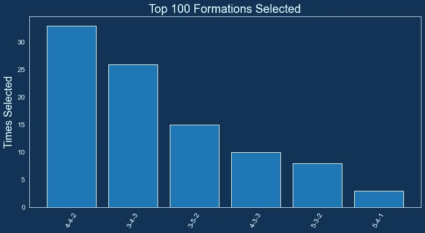

这些数据很有意义，因为大多数顶级球员都试图利用 4-4-2 或 3-4-3 阵型的中场和前锋。

# GW2 团队绩效总结和总体统计

我们所有团队的得分都高于平均水平，最高的团队得到了**66 分**。每周，我们都会发布前 2 名表演团队的照片。可惜我们没挑到好队长。我们选择了 Bruno Fernandez，因为我们**预计会有点球，因为这两支球队在过去的 5 个赛季中拥有最高的点球统计数据。嗯，我们对点球的判断是正确的，但不幸的是，对我们来说，那是因为哭泣，而不是因为门:)由于若日尼奥错过了对丽芙的点球，我们上周的点球运气非常糟糕。**

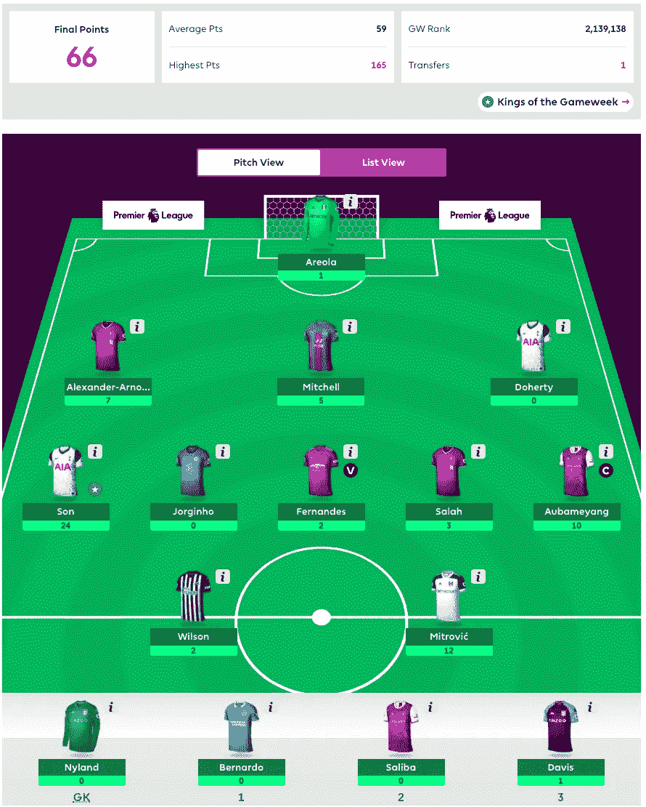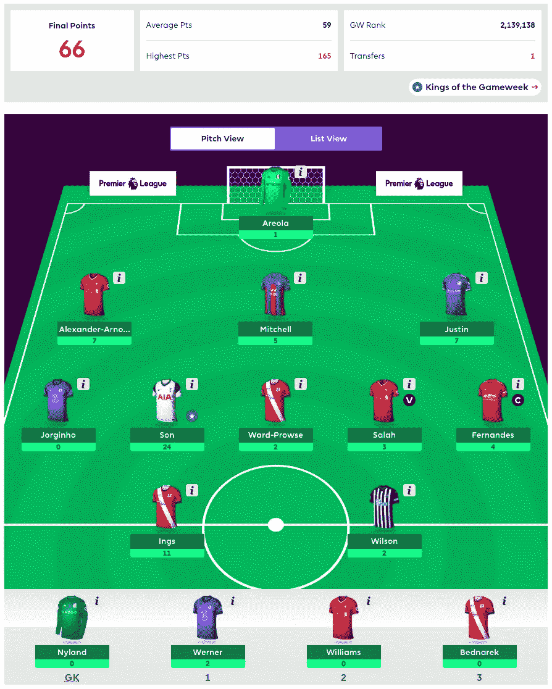

我们还参加了 FPL 的 FanTeam 版本，在那里我们有本周表现最好的团队。再一次，不是最佳的队长选择——莱斯特进了 4 个球，而瓦迪不知何故甚至没有参与其中的一个。所以，我要说**我们上周的运气很差**总体来说，但不知何故我们还是做得不错。

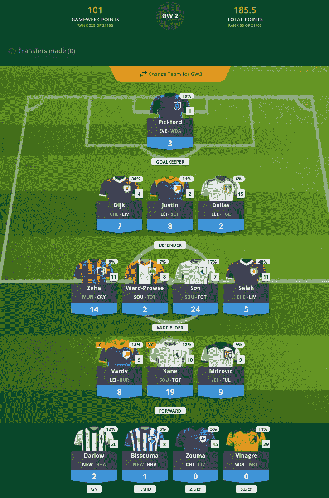

# 为我们的 GW3 选择提供有用的统计数据

由于我们今年在算法中加入了很多新的统计数据，随着时间的推移，这个博客将会有更多的统计数据和图表，更少的文本。让我们从下面三个比赛周的比赛难度等级(FDR)开始:

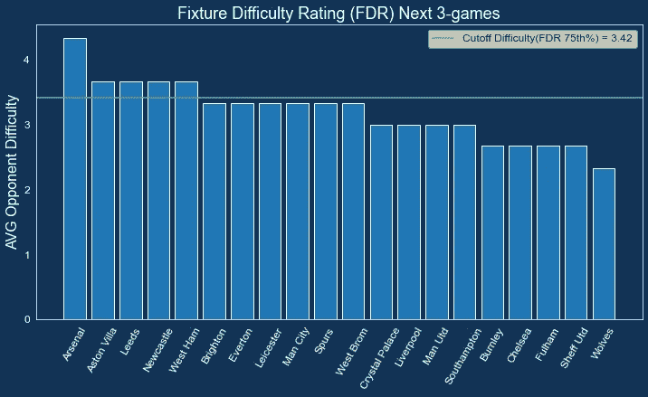

看起来阿森纳、维拉、利兹和纽卡斯尔将会有一些艰苦的比赛，所以我们的算法可能不会从这些球队中挑选球员。狼队、切尔西、富勒姆、曼联和谢菲尔德联队在接下来的三周似乎有更轻松的赛程。

# 博彩赔率

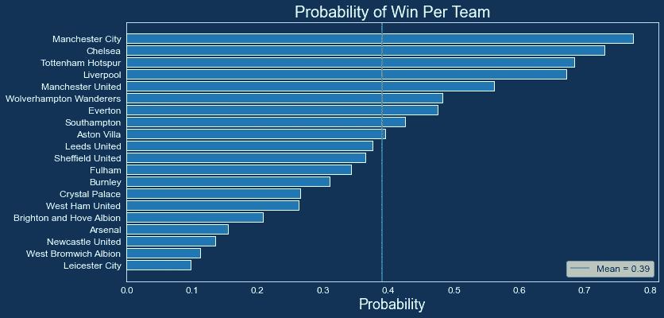

我们将尝试积累来自 ***队的有超过 50 %机会赢得*** 的玩家，例如 ***MUN、CHE、、LIV、TOT、MCI 和 EVE*** 。我们应该尽量不要有太多来自**雷、WBA、NEW、ARS、、CRY、WBA、、BUR 的防守球员。**

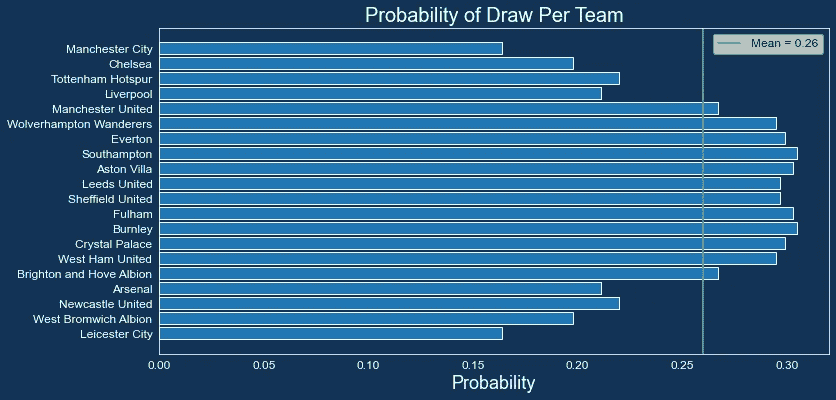

以 ***较高概率抽*** 的队伍，尤其是当比赛是 ***结合高赔率为 2.5 以下的*** 时，可能会对选择 ***防守队员*** 有利，因为如果比赛以 0:0 结束，那将会产生大量的加分。结合 下方的 ***下/上图，我们可以确定以下 ***至少一场不失球概率较高的比赛——WHU-WOL、布尔-苏、富尔-AVL、舒-李。******

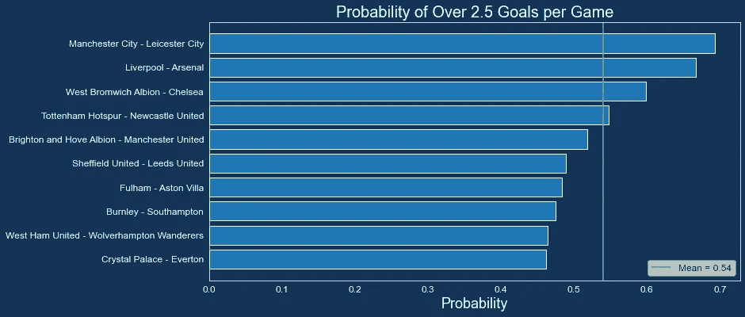

相反，我们可能希望从 ***赔率超过 2.5*** 的游戏中获得更多的 ***攻击玩家*** ，例如 **MCI vs. LEI *、LIV vs. ARS、WBA vs. CHE、TOT vs. NEW。同样，上周的赔率表现得相当好，因为大多数游戏预测有超过 2.5 个目标！***

# 裁判统计

从下面的统计数据来看，在比赛中出现点球的几率更高: **CRY-EVE，WBA-CHE，TOT-NEW，MCI-LEI 和 LIV-ARS** ，所以我们建议**为其中一些球队配备点球手**。看起来，像游戏 **CRY-EVE 和 SHU-LEE 有裁判喜欢给很多牌**，所以预计会因黄牌而失去一些分数，但希望没有红牌…

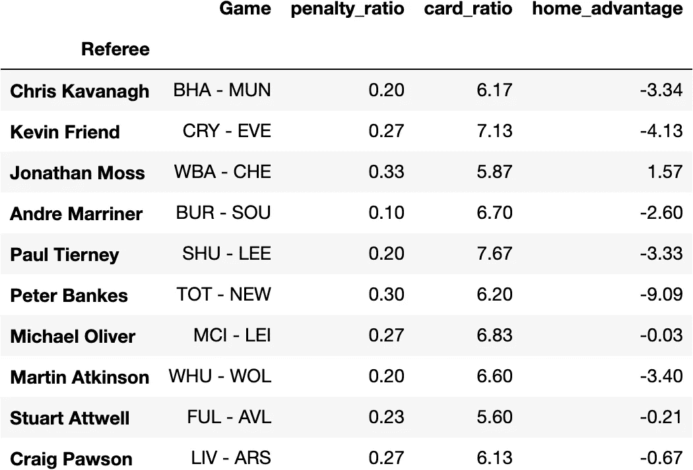

# 定位球运动员

为了帮助你选择定位球运动员，请看下面的列表，它或多或少是最新的，有几个可疑的预测:

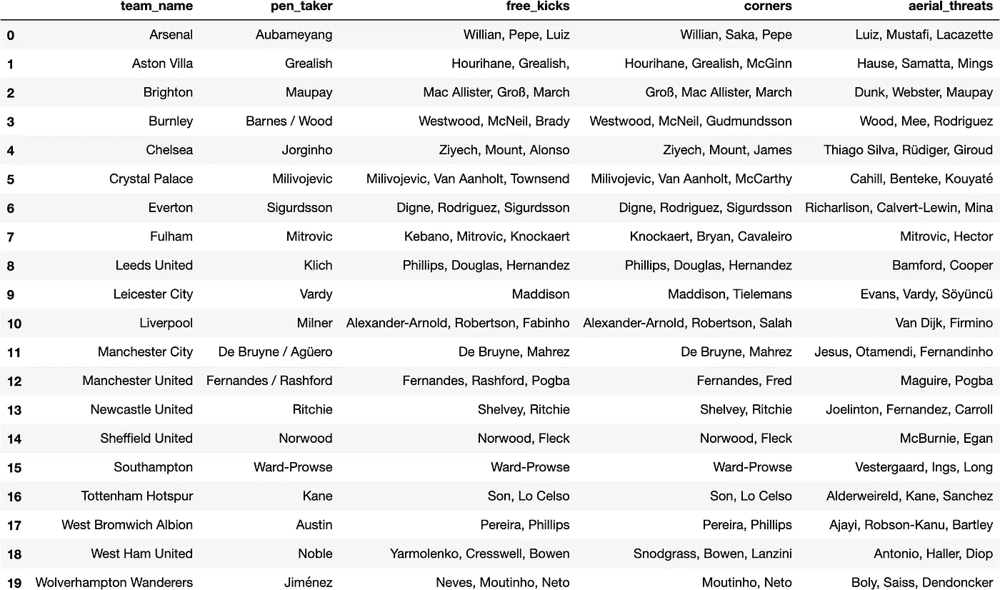

# 预计首发阵容

在我们运行最终的团队选择器之前，让我们考虑一下每个团队的预计首发 11 人。

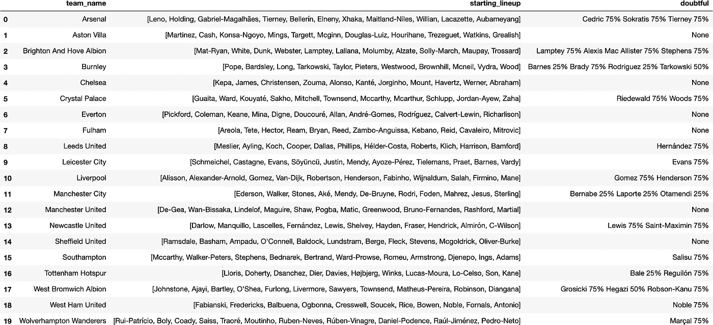

请注意右边可疑球员的名字，以及下面最新的伤病消息:

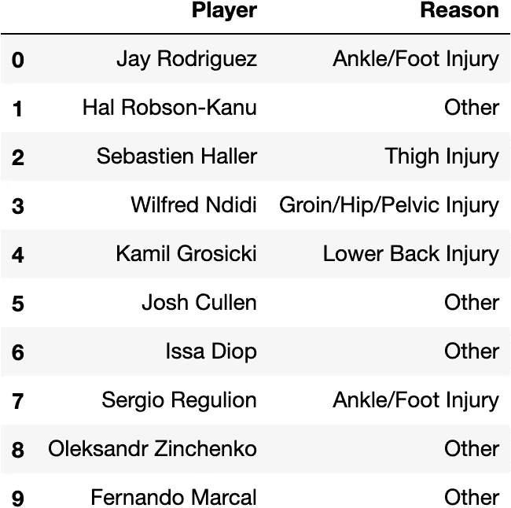

# 预测模型(球员统计)

现在是今年改进算法的皇冠上的宝石——预测球员统计数据的时候了。在我们将所有 FDR、赌注系数、ref 首发、预计阵容和伤病分层后，有两个主要指标*我们在为下一个 n-gameweeks 团队选择调整我们的团队优化器时会考虑到— ***预测总积分和期望值(ROI)。*** 下面是每个指标的统计数据，也按职位细分。*

# *预计总积分—前 25 名玩家*

*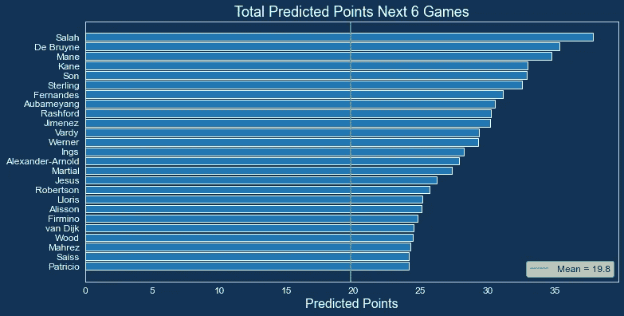*

# *预计预期价值(ROI) —前 25 名参与者*

*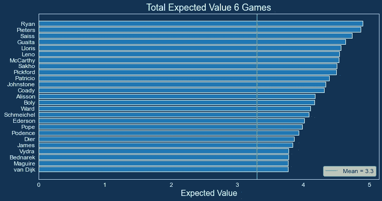*

# *预测积分——顶级守门员*

*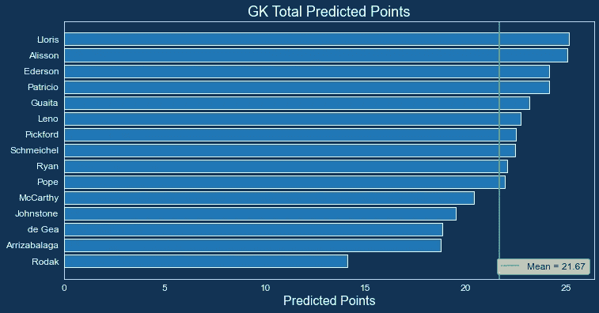*

# *投射点数—顶级防守者*

*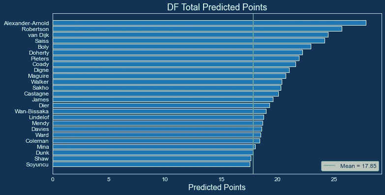*

# *预测得分——顶级中场*

*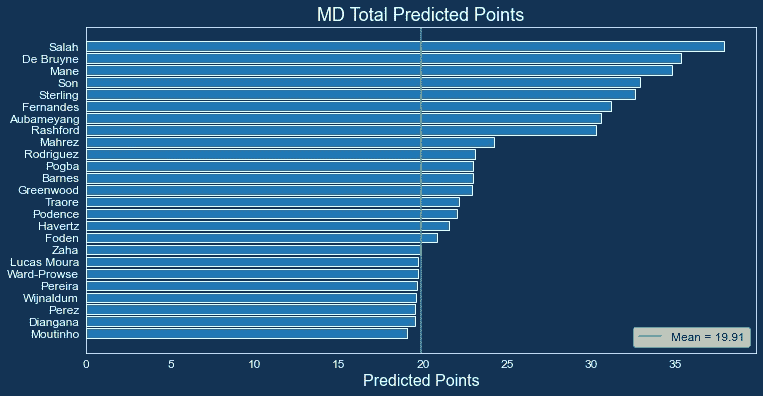*

# *预测分数——顶级前锋*

*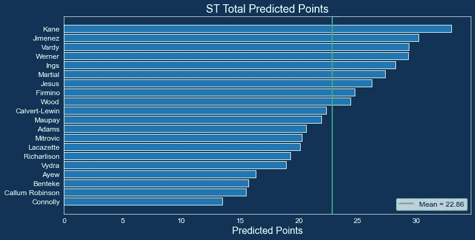*

*正如你所看到的，我们可以为每个位置选择大量选项，因此我们将把上面的许多统计数据插入 Python 中的 ***优化函数，该函数将 ***输出具有最高预期总积分*** 的团队，给定我们的预算约束和其他进入我们决策过程的指标。在团队选择器代码生效之前应用的一些初步过滤器包括:****

1.  ***排除受伤或停赛球员***
2.  ***将球员排除在 FDR 高的队伍之外***
3.  ***排除 GW1 中没有固定比赛的队伍中的球员***
4.  ***同一团队不能有超过 3 名玩家***
5.  ***总共必须有 15 名球员(GK=2，DF=5，MD=5，ST=3)***

# *《出埃及记》使用填充接头优化 3–5–2 地层的预算*

*正如你在下面看到的，模型首先查看参数，告诉它是否应该向 15 名球员的*全队优化，或者向有 ***11 名关键球员和 4 名廉价替补*** 的特定阵型优化。对于填充符，它首先查看 ***首选地层*** ，并使用该 ***来决定每个位置*** 需要多少个填充符。然后，该模型从我们的初始预算中减去花费在 4 个填充者上的总金额，并将剩余的预算花费在关键的 11 个参与者上， ***，给定优化函数和模型约束*** 。**

**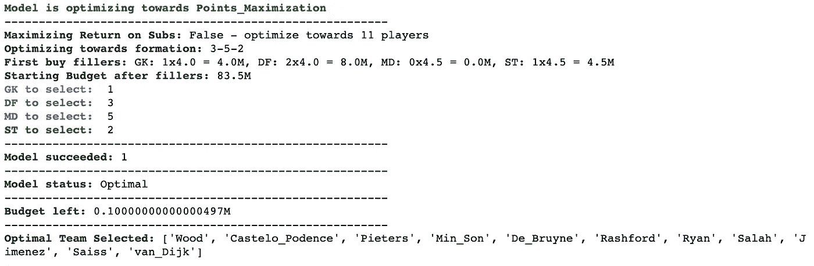**

**我们使用优化器算法的输出来构建以下团队:**

**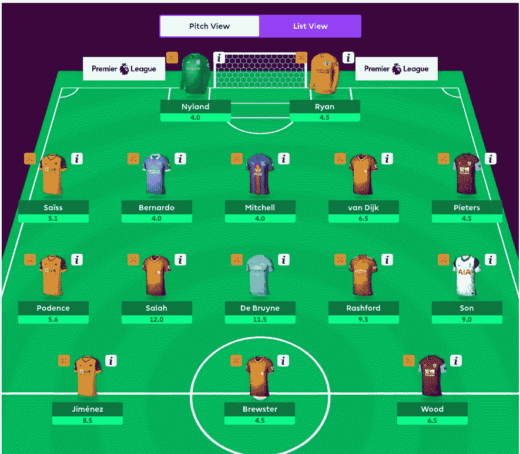**

**我们几乎只做了一个改变，那就是用 KDB 换来了奥巴。今年我们将试图从额外的转会中获得很少的-4 分，因为我们的算法意味着投资那些你至少可以保留 3-4 个游戏周的球员，所以我们不应该每周都做很多转会。选择队长很难，但考虑到儿子最近的状态和纽卡斯尔不稳定的防守，我们希望这会有所回报。但是我们也认为 KDB、萨拉赫和费尔南德斯也是不错的队长人选，因为在所有这些球队的比赛中，点球的机会都比较高。**

**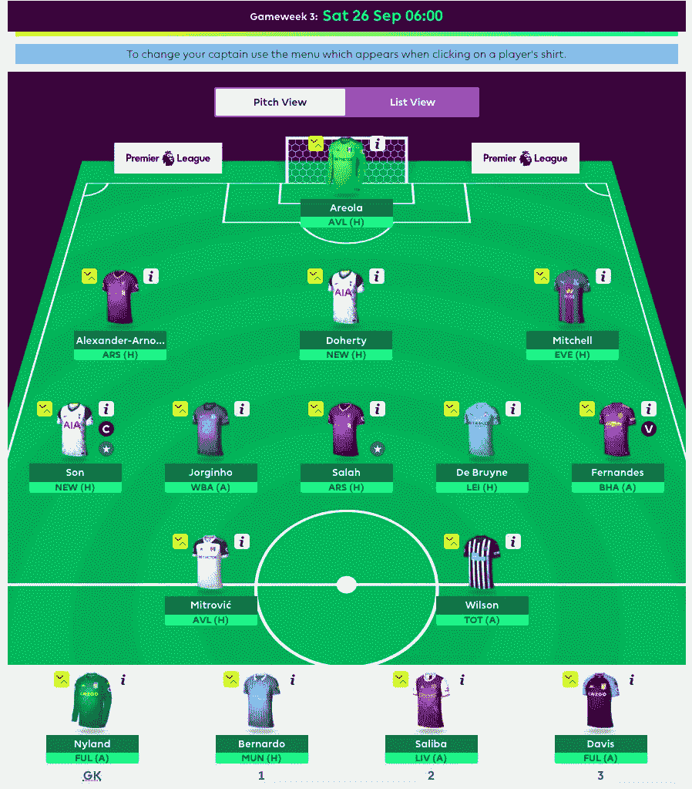**

# **结论**

**我们仍然有一些工作要做，以摆脱萨利巴，得到一个比阿雷奥拉更稳定的 GK，但这可能需要几个游戏周才能完成，所以，现在，我们**坚持我们对当前阵容的长期投资**，并给球员至少 3-4 周的时间来实现他们的预期潜力。他们中的一些人，如**的儿子、萨拉赫和 KDB，已经获得了可观的红利:)**享受这个周末观看比赛的乐趣，并祝你好运，选出正确的队长，因为我们都被儿子和凯恩在上周末提醒过这是多么重要:)**