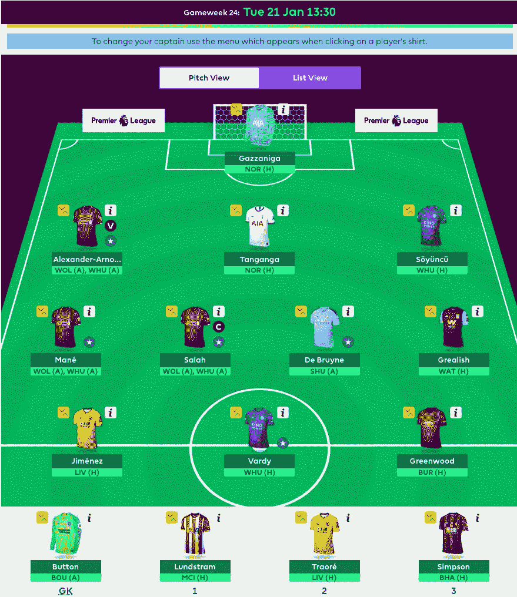

# EPL 幻想 GW23 重述和 GW24 算法选择

> 原文：<https://towardsdatascience.com/epl-fantasy-gw23-recap-and-gw24-algorithm-picks-74c9ddee628a?source=collection_archive---------29----------------------->

## EPL 幻想博客

## 我们的钱球方法的幻想 EPL(队 _id: 2057677)

如果这是你第一次登陆我的幻想 EPL 博客，你可能会想看看我在本赛季开始时写的一些原始 EPL 博客(GW1-GW9)，以熟悉我们的整体方法和我们随着时间的推移所做的改进。我在这个项目中的犯罪搭档是 Andrew Sproul，他和我一样对数据科学、人工智能和梦幻运动充满热情。

# GW23 世界排名前 100 的选手

对于世界上许多顶级玩家来说，这是**艰难的一周**，他们中的许多人得分在**30-40 分范围内！总的来说，他们仍然平均得到 58 分，相比之下，GW 的平均得分是 44 分。所以，如果你的得分在 50 分以上，你会对自己感觉很好:)**

# EPL 100 强球员最佳混合团队

当我们谈论世界前 100 名球员的话题时，让我们看看谁是他们球队中最受欢迎的球员，以及 GW23 最受欢迎的球队阵容。

# 前 100 名最佳守门员

# 前 100 名中最受欢迎的捍卫者

# 前 100 名最佳中场球员

# 前 100 名中入选最多的前锋

我们使用这些数据和当前的球员价格来创建下面的球队，这是由前 100 名中最受欢迎的球员组成的:

看起来不错的团队，在关键位置上有很多尝试不同选择的余地，同时仍然保持一个坚实的球员核心。

## 前 100 名 Fantasy 用户选择最多的团队

现在**瓦迪又回来了**，我们回到了更受欢迎的进攻阵型**3–4–3 作为首选**。

# GW23 团队绩效总结和总体统计

总的来说，这是一个非常好的一周，我们得到了 68 分，远远高于平均 44 分。我们在上周博客的“最终想法”部分对希门尼斯的**希望和梦想成真了**，我们的投资最终获得了丰厚的回报。我们还有点“幸运”，拉什福德没有上场，所以我们可以让格里利什作为我们的第一个替补，给 T21 10 分。我们的队长选择不是最好的，我们有点不走运，德·布鲁恩漂亮的任意球击中门柱，所以我们只从他那里得到了 **2x2 = 4pts** :(最后，我们还从加扎尼加**那里得到了一些不错的分数，自从洛里斯受伤后的第一天起，我们就一直在那里，所以，总的来说，我们很高兴！**

# GW23 整体统计数据为我们的 GW24 选秀权提供信息

下面让我们从调整后的未来三周的对手难度等级(FDR)开始:

看起来西汉姆，南安普顿，诺维奇，狼队和切尔西有一个相对困难的计划，所以我们的算法不会从这些球队中做出任何选择。赛程相对轻松的球队有**伯恩茅斯、皇宫、维拉、埃弗顿、纽卡、利物浦、沃特福德、布莱顿。**

# 美国东部时间 1 月 19 日晚 10 点最新伤情更新

以下数据来自一个独立网站，该网站更新最新受伤情况的频率比 Fantasy 网站高得多:

# 按投资回报率和 90 分钟出场次数统计的顶级球员

根据上周一位读者的要求，我现在将公布投资回报率最高和最低的 50 名玩家，这样我们的读者就可以看到更多高投资回报率的玩家，并远离价格过高和表现不佳的玩家。

## 投资回报率排名前 50 的玩家

## 按投资回报率排名的后 50 名玩家

## 投资回报率排名前十的守门员

**90 分钟 pts _ per _ 强门将**

**投资回报率排名前十的防守球员**

**pts _ per _ 90min 排名前 10 的防守队员**

**投资回报率排名前十的中场球员**

**90 分钟 pts _ per _ 强中场**

**投资回报率排名前十的前锋**

**90 分钟前 10 名射手**

# GW24 算法选择

我们的算法接受**每队阵型**的调整预算，并试图**最大化主要 11 名球员的每个位置**的支出，然后让你的**名具有良好 ROI 值的替补**来填补团队的其余成员。根据当前的投资回报率得分，**在接下来的三场比赛中过滤掉任何有 AVG 对手难度(FDR≥75%)的球队，并从可用选择列表中删除受伤球员**，我们的算法选择了以下球队作为花费全部 1 亿美元预算的最佳球队:

就我们自己的球队而言，我们已经节省了 2 次免费转会，所以我们可以在双赛周得到更多的利物浦球员。因此，我们最终进行了以下三次转移:

**威利安→萨拉赫，赛斯→坦甘加，拉什福德→格林伍德**

我们知道如果克洛普决定在中场做一些轮换是有风险的，但是由于利物浦的两场比赛都是客场，并且中间有 4 天的休息时间，我们希望他能在两场比赛中首发出场。我们选择让萨拉赫担任队长，因为在过去的几场比赛中，他似乎比马内状态更好。我们也考虑过 TAA，但是我们认为很多人会和他一起去，所以我们希望在积分落后的情况下有所区别。

# 团队统计

查看**最佳/最差防守和进攻**可以有几种不同的用法——例如，如果一个最佳进攻队与一个最差防守队比赛，你可能想让你的进攻中场或前锋担任队长。此外，当你查看这些位置的算法建议时，你可能想优先考虑防守最好的球队的 DF 和 GK。

# 最佳 7 项防御

**利物浦已经连续七场零失球了！**说够了……:)

# 最差的 7 种防御

# 最佳 7 项犯罪

# 最糟糕的 7 项罪行

# 累积团队投资回报统计

下面你可以看到球队，按累积玩家投资回报率排序。请注意，**活跃玩家是指任何至少玩了总可能游戏时间的 33.33%** 的玩家。因此，我们会把所有至少打了 **620 分钟**的球员算作该队现役球员。

随着价格合理的球员和表现更稳定的球员现在占据了前 5-8 名的位置，统计数据开始很好地趋同。一些拥有昂贵球员的球队正在努力追赶并提高他们的整体投资回报率，包括热刺、阿森纳、埃弗顿和西汉姆。

# 最终想法:

首先，不要忘记这款 **GW24 将于本周二上市！本周的主要赛事当然是利物浦的双人赛，很多人可能会玩他们的三重队长筹码。我们也在考虑对萨拉赫这样做，但是考虑到这两场比赛都是在 T21 进行的，而且狼队和西汉姆联都不在防守最差的 7 支球队之列，我们没有足够的信心能进足够多的球。我们仍然有可能在最后一分钟让萨拉赫成为三队长，但现在我们只进行常规比赛。除此之外**我们希望热刺对诺维奇**不失球，这样我们就可以在**加扎尼加和坦甘加**身上下些赌注。**

祝大家本周好运，一如既往——感谢您的阅读！