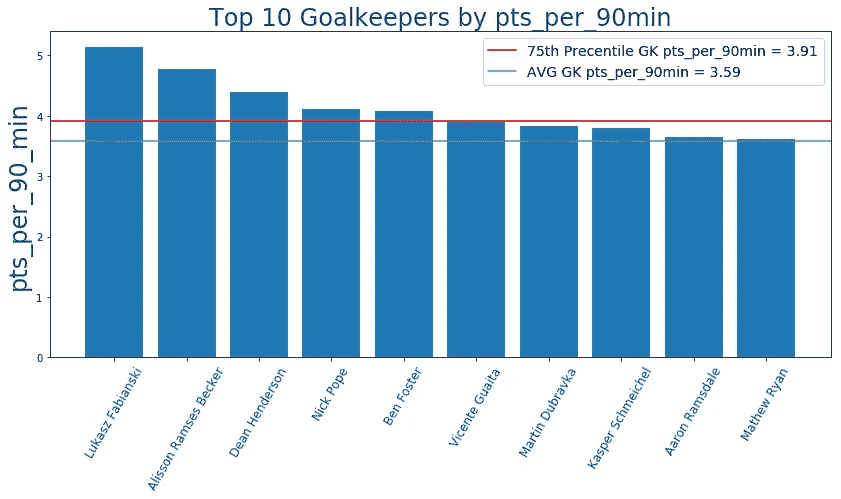

# EPL 幻想 GW24 重述和 GW25 算法选择

> 原文：<https://towardsdatascience.com/epl-fantasy-gw24-recap-and-gw25-algorithm-picks-b23d87b86d61?source=collection_archive---------33----------------------->

## EPL 幻想博客

## 我们的钱球方法的幻想 EPL(队 _id: 2057677)

如果这是你第一次登陆我的幻想 EPL 博客，你可能会想看看我在本赛季开始时写的一些原始 EPL 博客(GW1-GW9)，以熟悉我们的整体方法和我们随着时间的推移所做的改进。我在这个项目中的犯罪搭档是 Andrew Sproul，他和我一样对数据科学、人工智能和梦幻运动充满热情。

# GW24 世界排名前 100 的选手

自从我们开始追踪这个统计数据以来，这是我们见过的世界排名前 100 的玩家在**最强的一周**—**平均 87 分！**似乎这是**的一周——你要么选择萨拉赫担任队长或三重队长，要么就被甩在身后…** 正如你所看到的，前 100 名中没有选择萨拉赫担任队长的少数球员最终以 40-50 分的总分落后于其他人。

# EPL 100 强球员最佳混合团队

当我们谈论世界前 100 名球员的话题时，让我们看看谁是他们球队中最受欢迎的球员，以及 GW24 最受欢迎的球队阵容。

# 前 100 名最佳守门员

# 前 100 名中最受欢迎的捍卫者

# 前 100 名最佳中场球员

# 前 100 名中入选最多的前锋

我们使用这些数据和当前的球员价格来创建下面的球队，这是由前 100 名中最受欢迎的球员组成的:

看起来不错的团队，在关键位置上有很多尝试不同选择的余地，同时仍然保持一个坚实的球员核心。

## 前 100 名 Fantasy 用户选择最多的团队

这一统计数据正在回归正常，大多数顶级球员选择 3 名防守球员，并试图利用 3-4-3 或 3-5-2 阵型的进攻型中场和前锋。

# GW24 团队绩效总结和总体统计

我们对这一周有着复杂的感情，因为我们得到了 67 分，远远高于平均水平 53 分，所以乍一看我们应该感到高兴。但是当你在下面看我们的球队时，你会发现如果不是选择萨拉赫作为队长，救了我们，**我们对许多其他关键球员一无所知**，包括我们的两个守门员都没有上场，给了我们零分。我们所有的联赛都有绿箭，所以我想总的来说我们应该很开心。

# GW24 整体统计数据为我们的 GW25 选秀权提供信息

下面让我们从调整后的未来三周的对手难度等级(FDR)开始:

看起来西汉姆，莱斯特，诺维奇，热刺和切尔西有一个相对困难的计划，所以我们的算法不会从这些球队中做出任何选择。赛程相对轻松的球队有**伯恩茅斯、阿斯顿维拉、阿森纳、谢菲尔德联队、纽卡、利物浦、伯恩利和布莱顿。**

# 美国东部时间 1 月 31 日晚 11 点最新伤情更新

以下数据来自一个独立网站，该网站更新最新受伤情况的频率比 Fantasy 网站高得多:

# 按投资回报率和 90 分钟出场次数统计的顶级球员

根据上周一位读者的要求，我现在将公布投资回报率最高和最低的 50 名玩家，这样我们的读者就可以看到更多高投资回报率的玩家，并远离价格过高和表现不佳的玩家。

# 按投资回报率排名的后 50 名玩家

## 投资回报率排名前十的守门员

**90 分钟 pts _ per _ 强门将**

**投资回报率排名前十的防守球员**

**pts _ per _ 90min 排名前 10 的防守队员**

**投资回报率排名前十的中场球员**

**90 分钟 pts _ per _ 强中场**

**投资回报率排名前十的前锋**

**90 分钟前 10 名射手**

# GW25 算法选择

我们的算法接受**每队阵型**的调整预算，并试图**最大化主要 11 名球员的每个位置**的支出，然后让你的**名具有良好 ROI 值的替补**来填补团队的其余成员。根据当前的投资回报率得分，**在接下来的三场比赛中过滤掉任何有 AVG 对手难度(FDR≥75%)的球队，并从可用选择列表中删除受伤球员**，我们的算法选择了以下球队作为花费全部 1 亿美元预算的最佳球队:

就我们自己的车队而言，我们决定**使用我们的通配符**，因为 Hugo Lorris 现在回来了，所以我们剩下零个活跃的 GK，并且由于 Mane 的受伤和莱斯特即将到来的困难赛程，我们想要进行相当多的轮换，所以我们决定——为什么不使用我们的通配符！？我们真的很想去一个有奥巴、菲尔米诺和阿圭罗的**球队，但那太贵了，所以我们不得不牺牲他们中的一个，并决定用阿圭罗和菲尔米诺，因为**他们一直处于非常好的状态**，他们**面对较弱的对手**(历史上**阿圭罗总是在很大程度上惩罚马刺**)。我们几乎想让他成为队长，但是我们害怕莫里诺的极端防守风格，所以我们选择了菲尔米诺，因为利物浦主场作战，南安普顿的防守很弱。**

# 团队统计

查看**最佳/最差防守和进攻**可以有几种不同的用法——例如，如果一个最佳进攻队与一个最差防守队比赛，你可能想让你的进攻中场或前锋担任队长。此外，当你查看这些位置的算法建议时，你可能想优先考虑防守最好的球队的 DF 和 GK。

# 最佳 7 项防御

# 最差的 7 种防御

# 最佳 7 项犯罪

# 最糟糕的 7 项罪行

# 累积团队投资回报统计

下面你可以看到球队，按累积玩家投资回报率排序。请注意，**活跃玩家是任何已经玩了总可能游戏时间的至少 33.33%** 的玩家。所以，我们把所有至少打了 **650 分钟**的球员算作该队现役球员。

随着价格合理的球员中表现更稳定的球员现在占据了前 5-8 名的位置，统计数据开始很好地趋同。一些拥有昂贵球员的球队正在努力追赶并提高他们的整体投资回报率，包括阿森纳、西汉姆和埃弗顿。

# 最终想法:

在过去的几个赛季中，使用通配符对我们来说并不太好，所以我们希望这一次情况会有所不同，特别是因为**我们是被迫使用通配符的**。我们本周最大的希望是，在显而易见的选择——萨拉赫或阿奎罗——中，我们选择了正确的队长。这有点冒险和奢侈，比如选择娶一个红发女人，但有时这种疯狂的风险从长远来看会有丰厚的回报，所以让我们看看明天会带来什么:)

祝大家本周好运，一如既往——感谢您的阅读！