# EPL 幻想 GW29 重述和 GW30 算法选择

> 原文：<https://towardsdatascience.com/epl-fantasy-gw29-recap-and-gw30-algorithm-picks-3a94a695510d?source=collection_archive---------27----------------------->

我们的钱球方法的幻想 EPL(队 _id: 2057677)

如果这是你第一次登陆我的幻想 EPL 博客，你可能会想看看我在本赛季开始时写的一些原始 EPL 博客(GW1-GW9)，以熟悉我们的整体方法和我们随着时间的推移所做的改进。我在这个项目中的犯罪搭档是 Andrew Sproul，他和我一样对数据科学、人工智能和梦幻运动充满热情。

但是在进入统计和建议之前，**我们只想送上我们最温暖的祝福给世界各地的每一个人**鉴于最近新冠肺炎的更新。我们希望你们都平安无事，**我们积极的想法和祈祷会传达给所有的生命**为了身体健康和精神力量。在这个充满不确定性的困难时期，我们真的很感谢你，我们的读者，花宝贵的时间阅读我们的博客！

# GW29 世界排名前 100 的选手

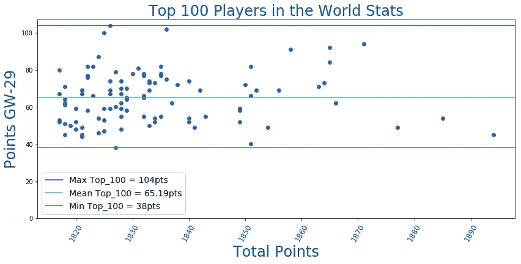

上周世界排名前 10 的选手表现相当不错，平均 65 分，一名选手以 104 分打破 100 分大关。但是，即使在顶尖高手中，我们也看到了相当数量的 40-50 岁玩家，他们的得分最低，只有 38 分。因此，如果你的得分高于 55-60 分，你会对自己感觉很好。

# EPL 100 强球员最佳混合团队

当我们谈论世界前 100 名球员的话题时，让我们看看谁是他们球队中最受欢迎的球员，以及 GW24 最受欢迎的球队阵容。

# 前 100 名最佳守门员

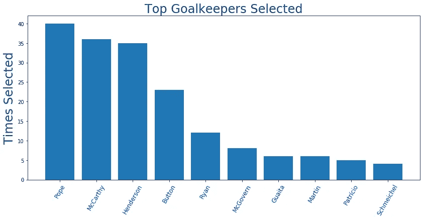

# 前 100 名中最受欢迎的捍卫者

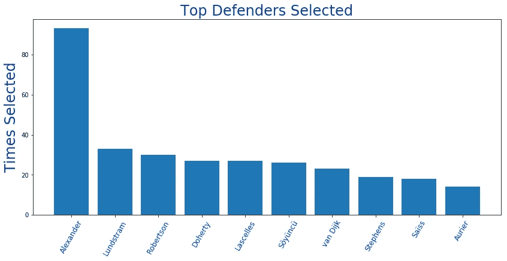

# 前 100 名最佳中场球员

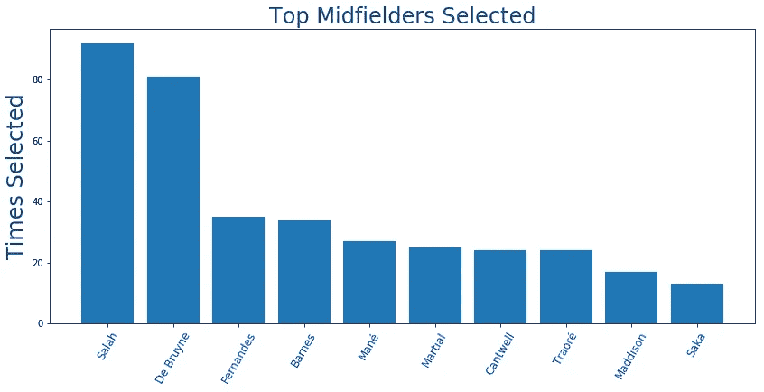

# 前 100 名中入选最多的前锋

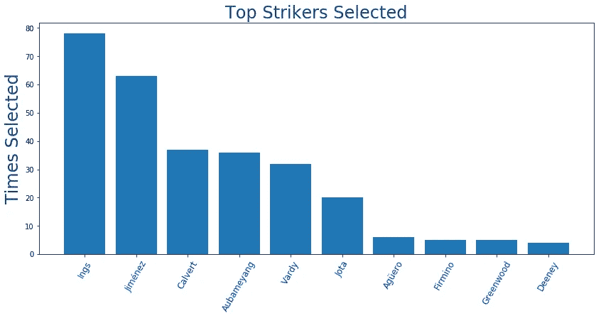

我们使用这些数据和当前的球员价格来创建下面的球队，这是由前 100 名中最受欢迎的球员组成的:

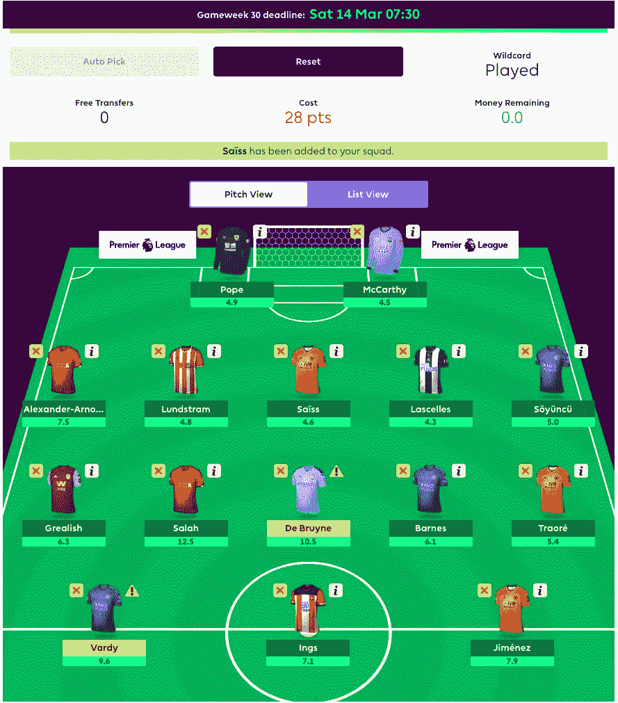

看起来不错的团队，在关键位置上有很多尝试不同选择的余地，同时仍然保持一个坚实的球员核心。

## 前 100 名 Fantasy 用户选择最多的团队

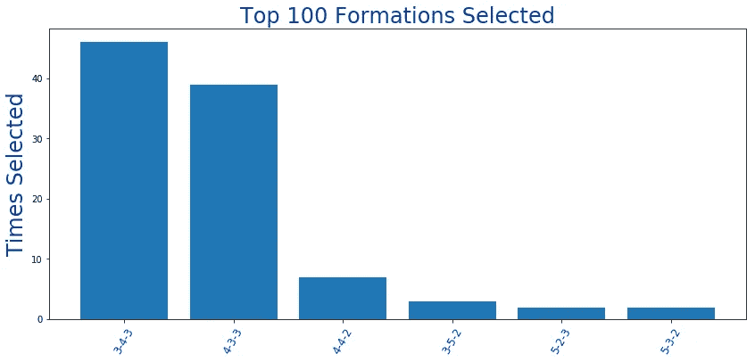

这一统计数据正在回归正常，大多数顶级球员都试图利用 3-4-3 或 4-3-3 阵型的进攻型中场和前锋。

# GW29 团队绩效总结和总体统计

这是我们第一周没有超过平均分数。我们接近了**49 分对游戏周平均 51 分**。老实说，在过去的几周里，我们错过了做出改变的机会，没能观看很多比赛，正如你所知，我们没有时间发布我们的定期博客更新。我们在挑选队长方面的**厄运还在继续**，因为我们选择了 TAA，期待不失球和进球/助攻，而不是萨拉赫或瓦迪这样显而易见的选择，我们因为试图变得花哨而受到了惩罚。否则，我们会超过本周的平均分。

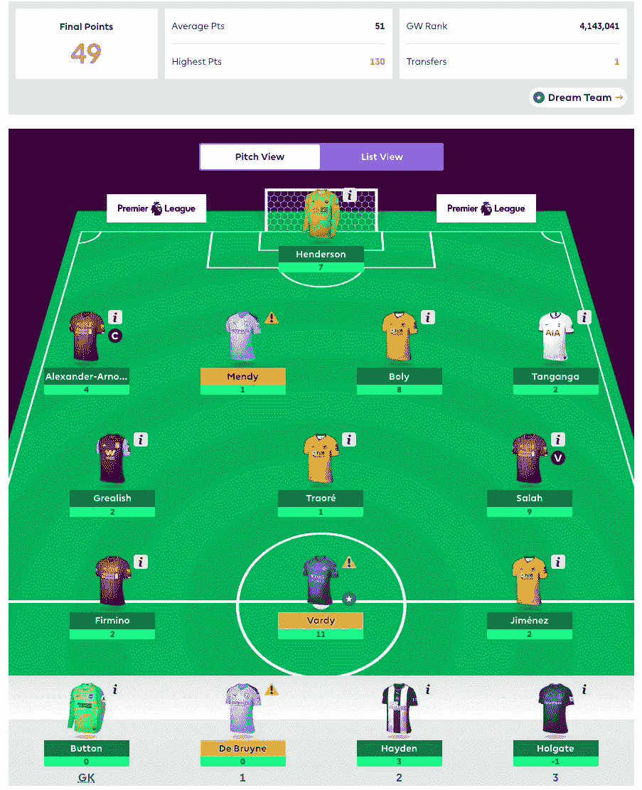

# GW229 整体统计数据为我们的 GW30 选秀权提供信息

下面让我们从调整后的未来三周的对手难度等级(FDR)开始:

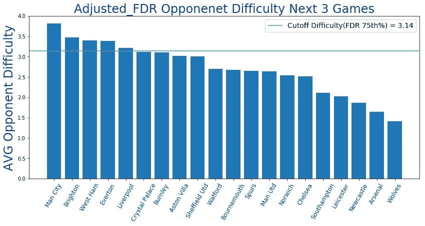

看起来曼城和利物浦都超过了 FDR 的分数，所以对于我们的算法建议来说，这将是一个奇怪的一周。其他赛程艰难的球队好像是**布莱顿、埃弗顿、西汉姆**。因此，我们的算法不会从这些团队中做出任何选择。赛程相对轻松的球队有**狼队、阿森纳、纽卡斯尔、莱斯特、南安普顿、切尔西和曼联。**

# 美国东部时间 1 月 31 日晚 11 点最新伤情更新

以下数据来自一个独立网站，该网站更新最新受伤情况的频率比 Fantasy 网站高得多:

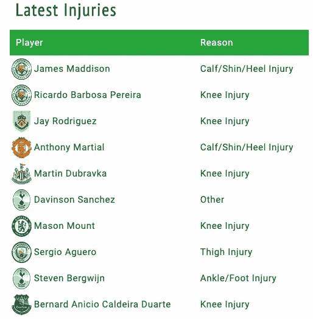

# 按投资回报率和 90 分钟出场次数统计的顶级球员

根据上周一位读者的要求，我现在将公布投资回报率最高和最低的 50 名玩家，这样我们的读者就可以看到更多高投资回报率的玩家，并远离价格过高和表现不佳的玩家。

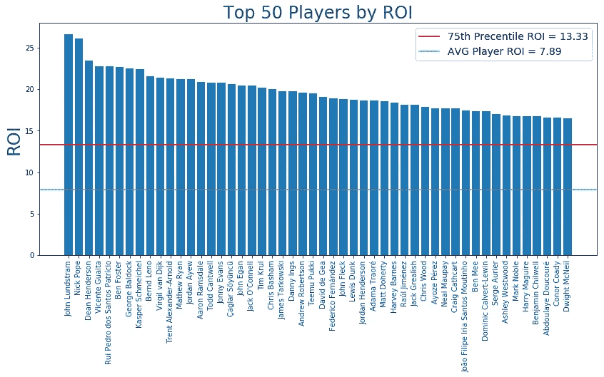

# 按投资回报率排名的后 50 名玩家

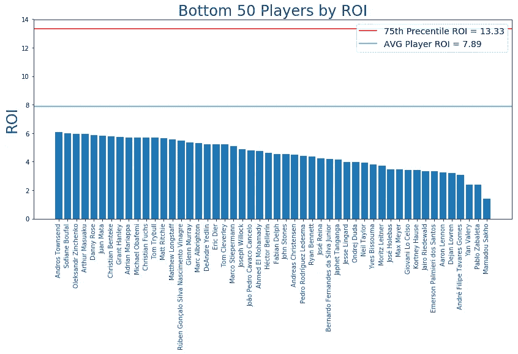

## 投资回报率排名前十的守门员

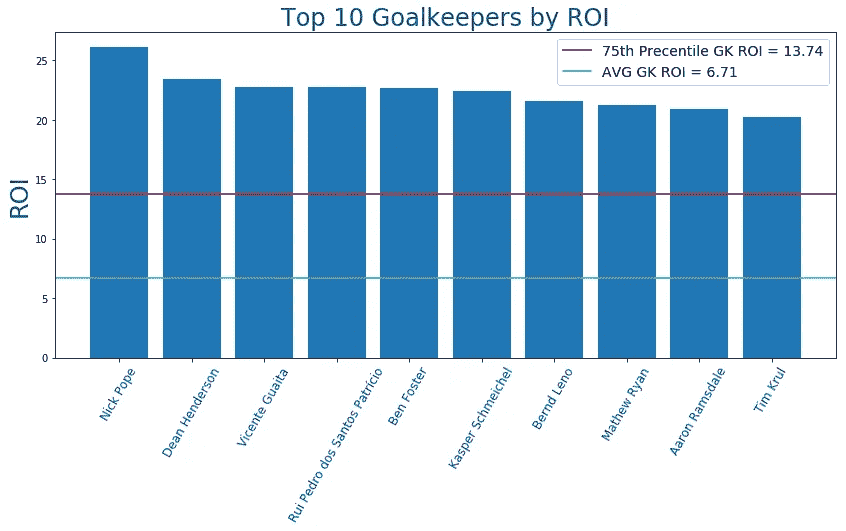

## 90 分钟内得分排名前 10 的守门员

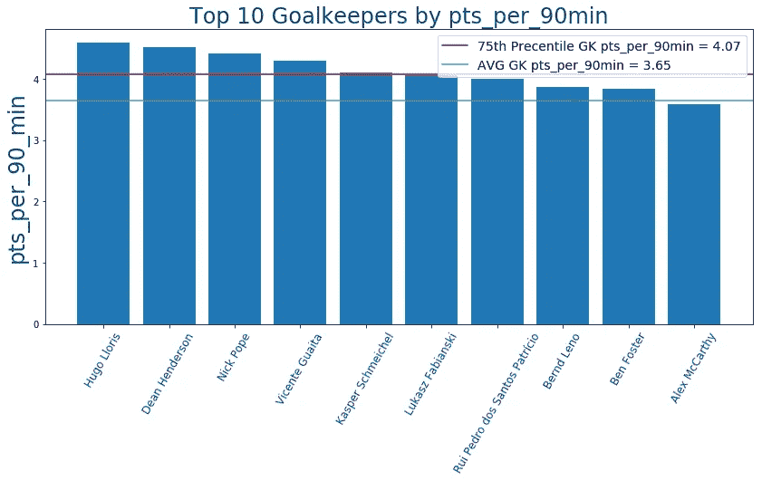

## 投资回报率排名前 10 的防御者

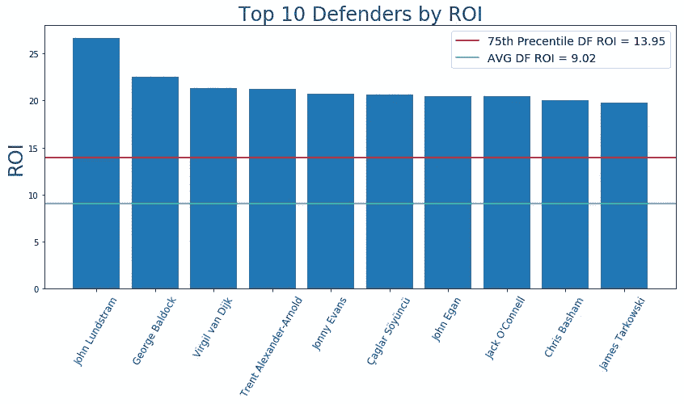

## 90 分钟内得分最高的 10 名防守队员

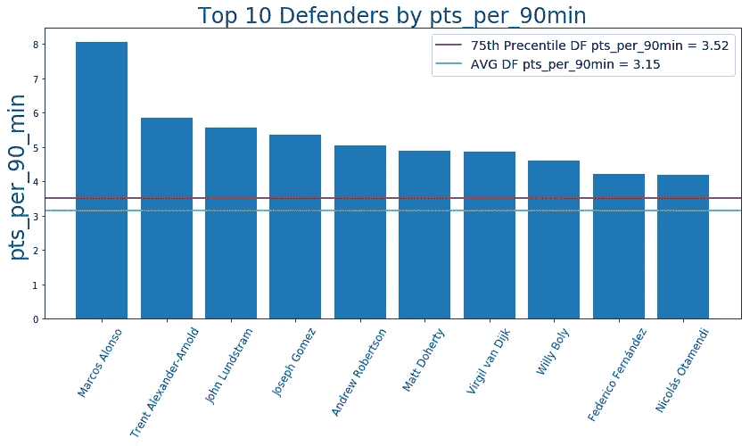

## **投资回报率排名前十的中场球员**

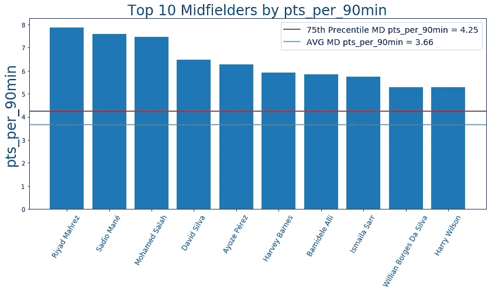

## **90 分钟 pts _ per _ 强中场**

## **投资回报率排名前十的前锋**

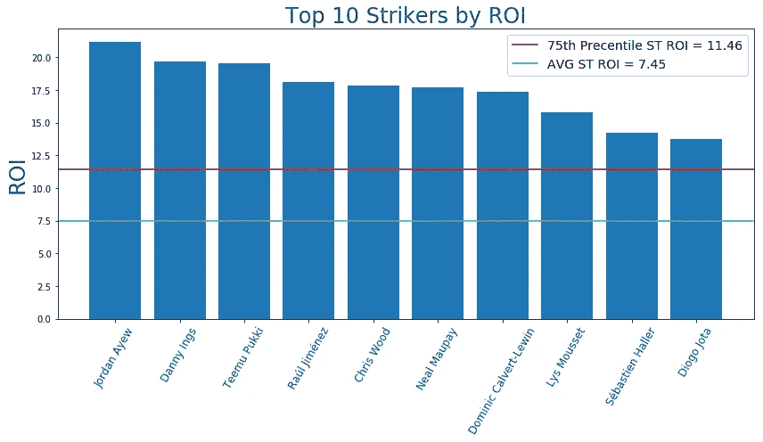

## **射手榜前 10 名由 pts_per_90min**

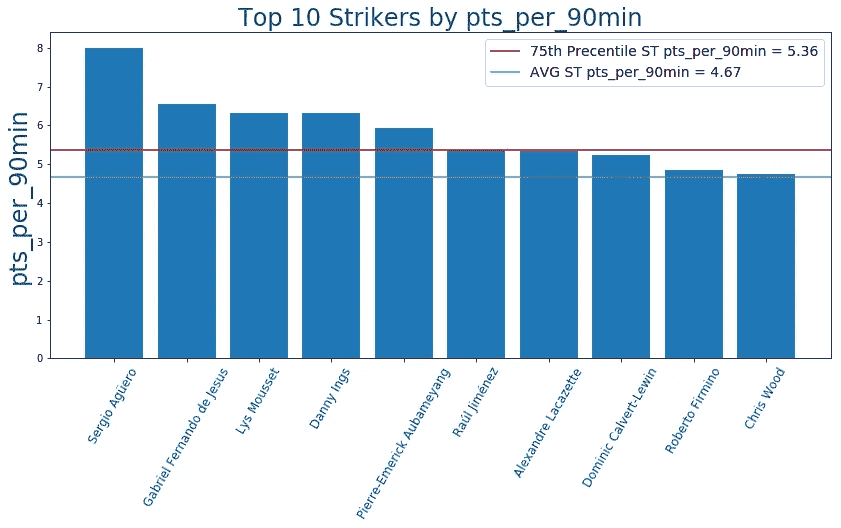

# GW29 算法选择

我们的算法接受**调整后的每队阵型**的预算，并试图**最大化主要 11 名球员的每个位置**的支出，然后让你的**个具有良好 ROI 值的替补**来填补团队的其余成员。根据当前的投资回报率得分，**在接下来的三场比赛中过滤掉任何有 AVG 对手难度(FDR≥75%)的球队，并从可用选择列表中删除受伤的球员**，我们的算法选择了以下球队作为花费全部 1 亿美元预算的最佳球队:

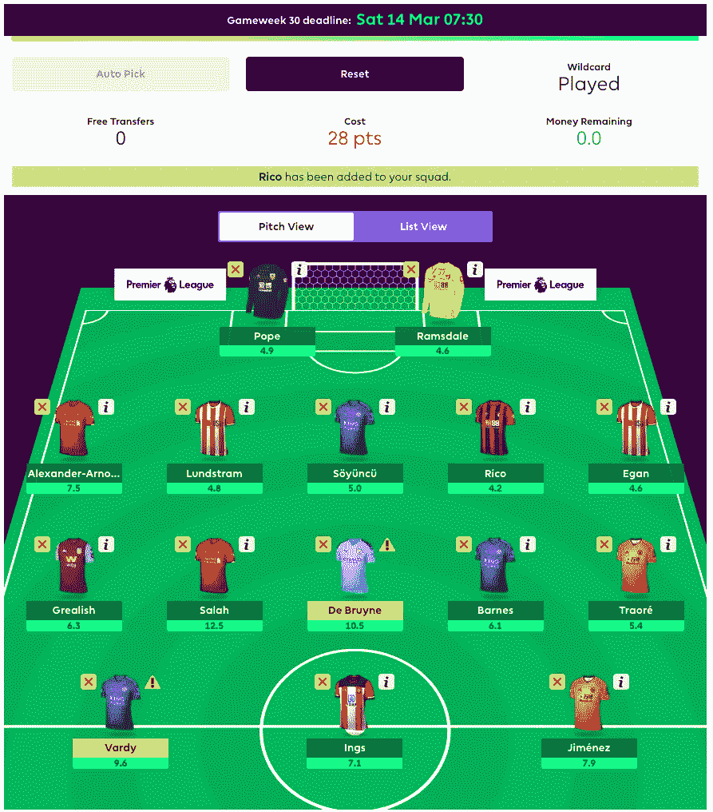

就我们自己的团队而言，我们决定**淘汰门迪**，因为我们几周前买下了他，而他**被证明是一笔糟糕的投资**，所以**我们以便宜的价格**从纽卡得到了拉塞尔斯，试图在接下来的几周为更多的轮换腾出预算，因为我们在等待被取消的比赛等的更新。我们的船长不再做实验，瓦迪·梅恩和萨拉赫将成为副船长。

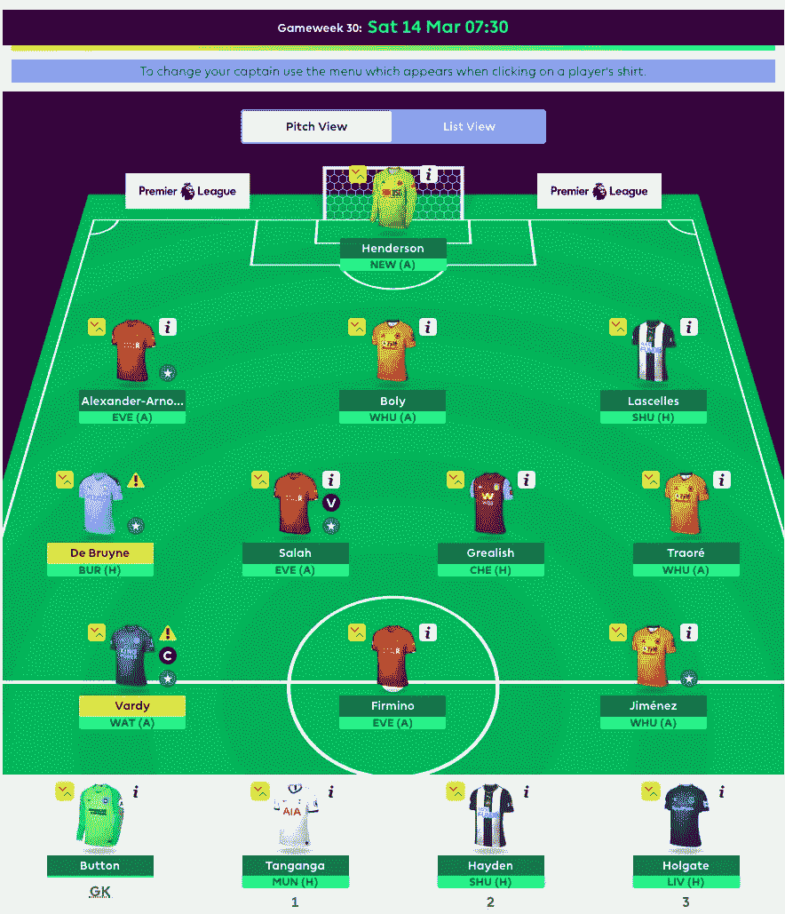

# 团队统计

查看**最佳/最差防守和进攻**可以有几种不同的用法——例如，如果一个最佳进攻队与一个最差防守队比赛，你可能想让你的进攻中场或前锋担任队长。此外，当你查看这些位置的算法建议时，你可能想优先考虑防守最好的球队的 DF 和 GK。

# 最佳 7 项防御

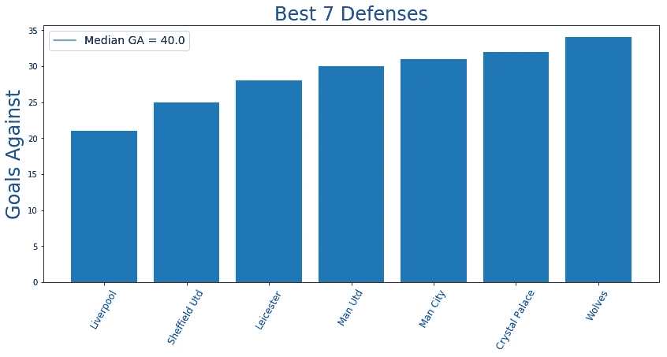

# 最差的 7 种防御

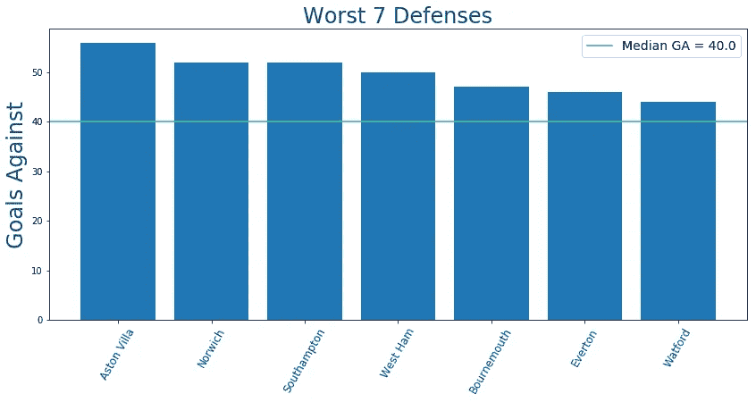

# 最佳 7 项犯罪

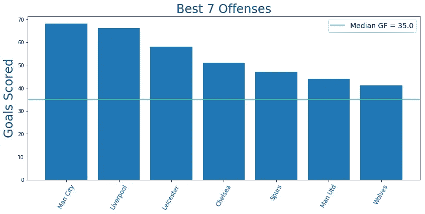

# 最糟糕的 7 项罪行

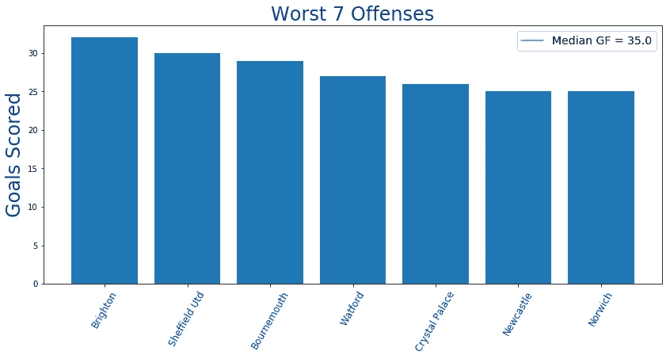

# 累积团队投资回报统计

下面你可以看到球队，按累积玩家投资回报率排序。请注意，**活跃玩家是指已经玩了总可能游戏时间的至少 33.33%** 的任何玩家。所以，我们把所有至少打了 **787 分钟**的球员都算作该队现役球员。

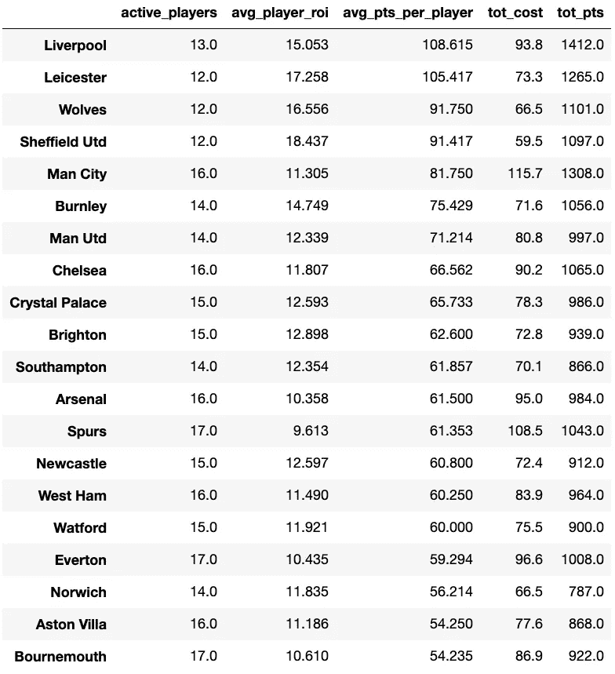

随着我们接近本赛季的最后阶段，球队的统计数据开始很好地趋同，因为价格合理的球员中表现更稳定的球员现在占据了前 5-8 名的位置。最后，曼联和切尔西也爬上了那里。一些拥有太多昂贵的表现不佳球员的球队正在努力追赶并提高他们的整体投资回报率，这些球队是阿森纳、热刺和埃弗顿。

# 最终想法:

老实说，面对所有新冠肺炎的新闻和担忧，我们只是希望和祈祷每个人都平安，包括教练、球员和医务人员。让我们希望情况很快开始好转，让我们希望赛季也能在正常情况下继续，我们可以继续享受一些令人兴奋的 EPL 行动。祝愿我们所有的读者和世界上的其他人保持强壮和健康！

祝大家本周好运，一如既往——感谢您的阅读！