# EPL 幻想 GW3 重述和 GW4 算法选择

> 原文：<https://towardsdatascience.com/epl-fantasy-gw3-recap-and-gw4-algo-picks-594a4882c22e?source=collection_archive---------54----------------------->

## 我们的金钱球方法到幻想的 EPL(队 _id: 2122122)

如果这是你第一次登陆我们的幻想 EPL 博客，你可能想看看我的媒体档案中的一些我们最初的 EPL 博客，以熟悉这个项目是如何开始的，以及随着时间的推移我们所做的改进。

# GW3 前 100 名 FPL 团队统计数据

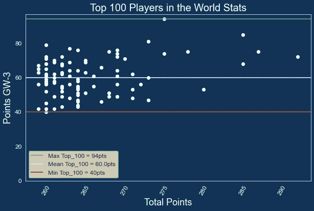

即使对于世界排名前 100 位的玩家来说，看起来也是一个艰难的 GW，AVG 只有 60 分，一些顶级玩家的得分低于平均水平，只有 40 分。

# 前 100 名最佳守门员

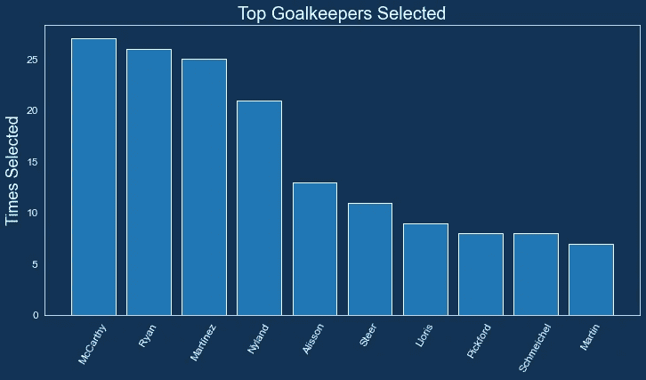

# 前 100 名中最受欢迎的捍卫者

# 前 100 名最佳中场球员

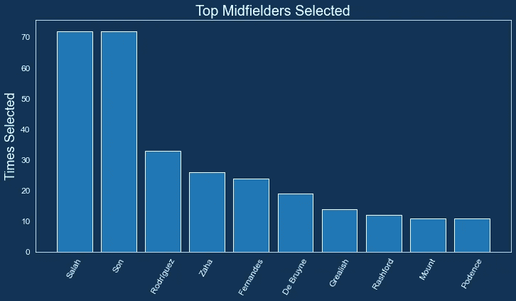

# 前 100 名中入选最多的前锋

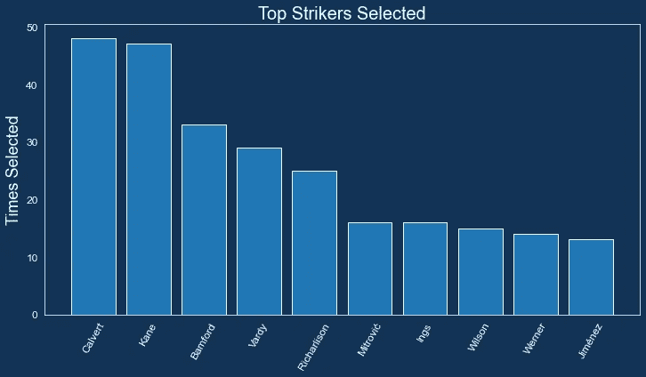

我们使用这些数据创建了下面的团队，它是由前 100 名中最受欢迎的球员组成的:

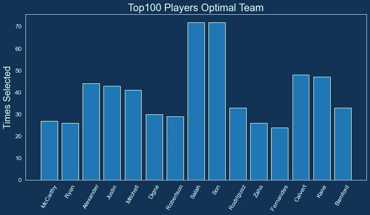

# 前 100 名 Fantasy 用户选择最多的团队

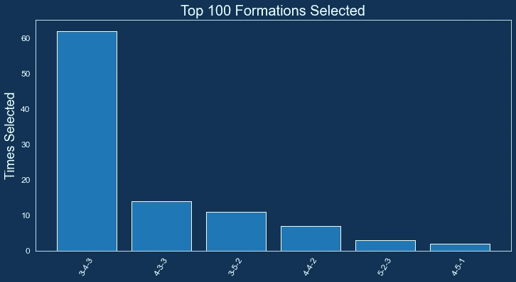

这些数据很有意义，因为大多数顶级球员都试图**利用 3-4-3 阵型的进攻型中场和前锋。**

# GW3 团队绩效总结和总体统计

我们所有团队的得分都略高于平均水平，得分最高的团队得到了**51 分**。每周，我们都会发布前 2 名表演团队的照片。不幸的是，我们没有再次选出最好的队长，这已经连续伤害了我们两周。如果 **Son 没有两次击中门柱**并且没有在中场休息时被替换，我们可以说完全相反，所以让我们不要忘记，不管一个人的算法可能有多好，**运气在一周接一周的表现中仍然具有巨大的重要性**。这毕竟是让游戏保持有趣和刺激的原因。

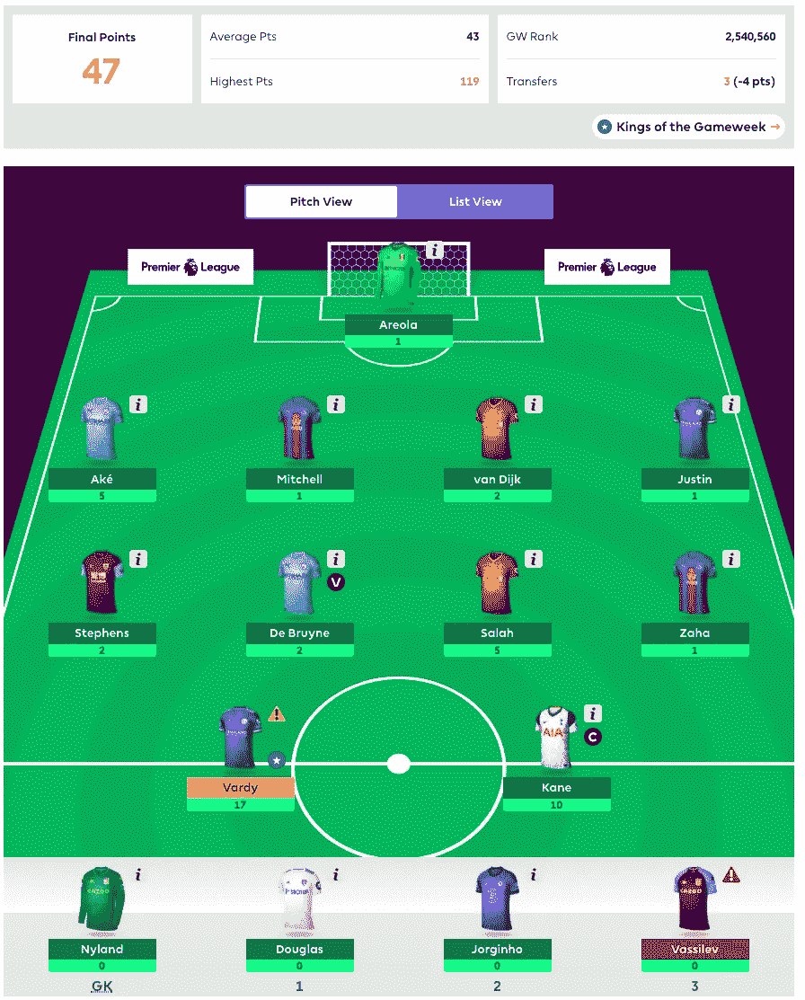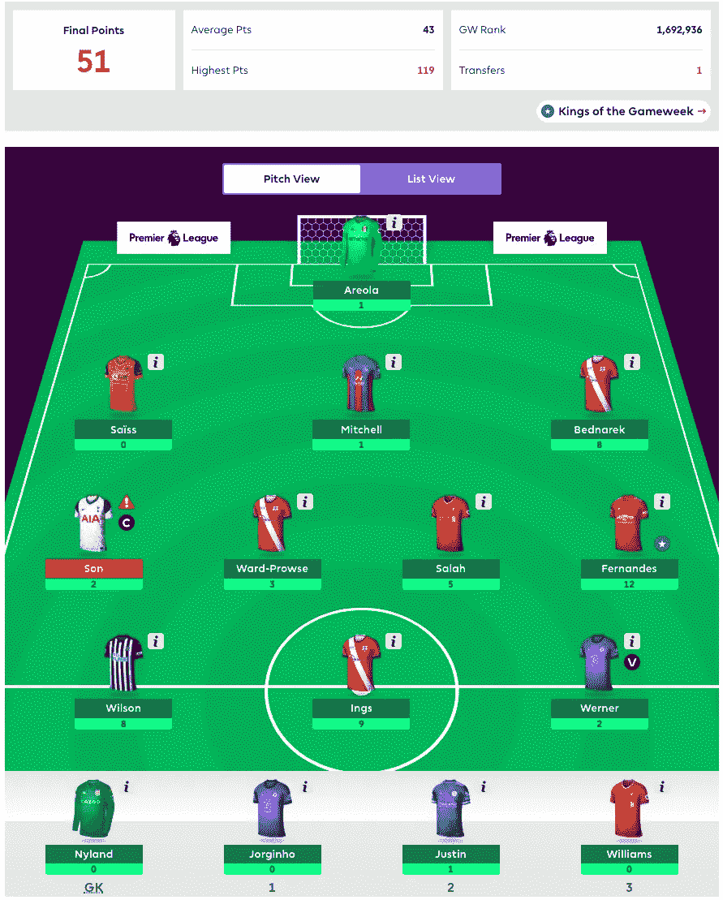

我们还参加了 FPL 的 FanTeam 版本，在那里我们有本周表现最好的团队。再说一次，这不是最好的队长选择，特别是考虑到在第一队**我们卖掉了瓦迪换来了 KDB** ，这最终让我们损失了一百万积分。所以，我要说我们上周的运气总体来说很差。

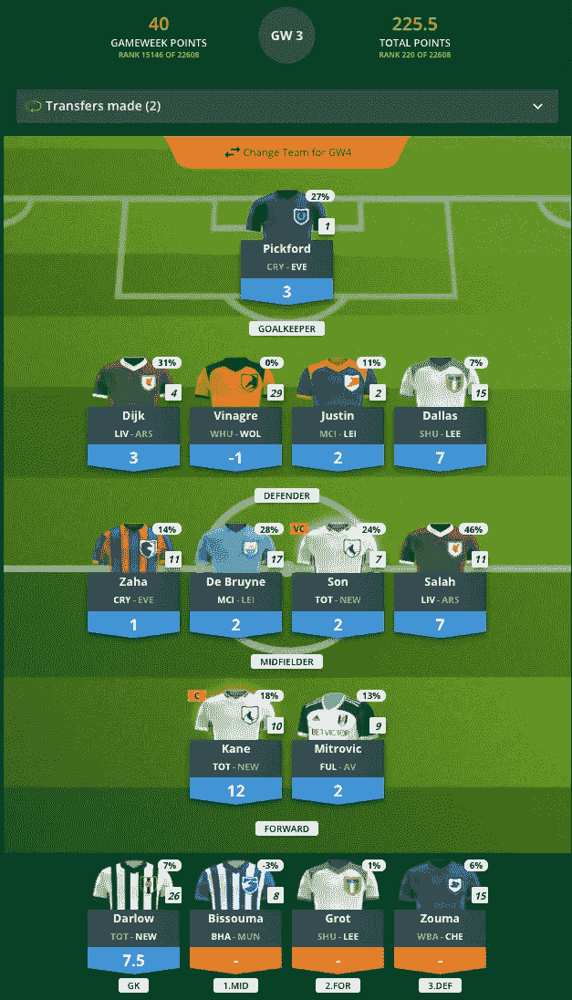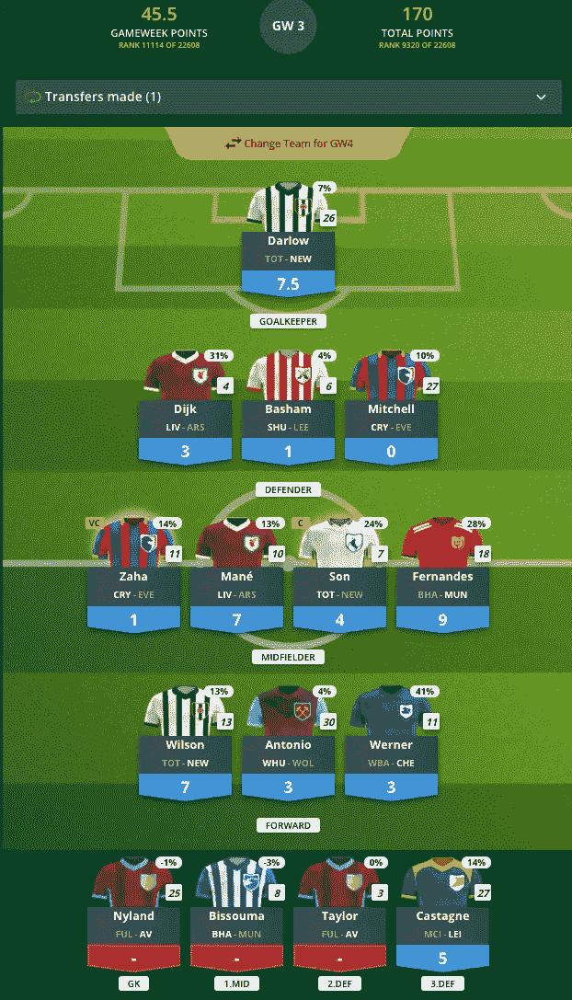

# 为我们的 GW4 选择提供有用的统计数据

由于我们今年在算法中加入了很多新的统计数据，随着时间的推移，这个博客将会有更多的统计数据和图表，更少的文字。让我们从下面三个比赛周的比赛难度等级(FDR)开始:

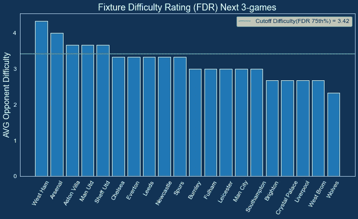

看起来西汉姆联队、阿森纳队、维拉队、曼联队和谢菲尔德联队【T21 队】即将迎来一些艰苦的比赛，所以我们的算法可能不会从这些球队中挑选球员。在接下来的三周里，、丽芙、CRY、MCI 和雷的日程安排似乎更加轻松。

# 博彩赔率

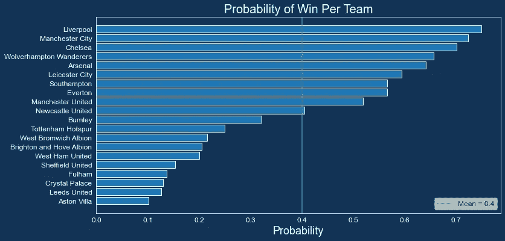

我们会尽量把 ***队中有超过 50 %胜算的*** 的玩家，比如***【WOL】、车、ARS、LIV、雷、MCI、EVE*** 。我们应该尽量不要有太多来自 **AVL、李、WHU、富尔、BHA、CRY、WBA 或者 BUR 的防守球员。**

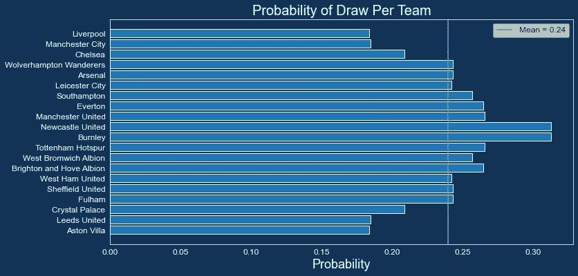

以 ***较高概率抽*** 的队伍，尤其是当比赛是 ***结合高赔率为 2.5 以下的*** 时，可能会对选择 ***防守队员*** 有利，因为如果比赛以 0:0 结束，那将会产生大量的加分。结合 下方的 ***下/上图，我们可以识别出以下 ***概率较高的游戏至少有一场不失球——NEW-BUR、WOL-FUL、ARS-SHU、SOU-WBA。******

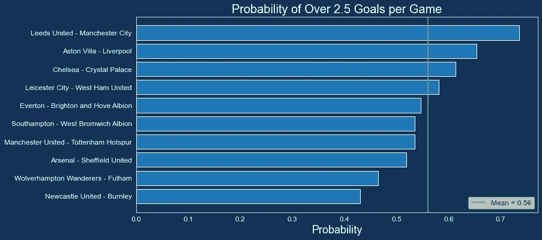

反过来，我们可能希望从 ***赔率超过 2.5*** 的游戏中有更多的 ***攻击玩家，如**李-MCI、-LIV、-CRY 和雷-WHU *。同样，上周的赔率表现得相当好，因为大多数游戏预测有超过 2.5 个目标！******

# 裁判统计

从下面的统计数据来看，在比赛中出现点球的几率更高:**伊夫-BHA，李-麦基，雷-WHU，门-托**，所以我们建议**为这些球队中的一些球队配备点球手**。看起来，像游戏 **EVE-BHA，雷-WHU，ARS-SHU 有裁判喜欢给很多卡**，所以预计会失去一些黄牌，但希望没有红色…

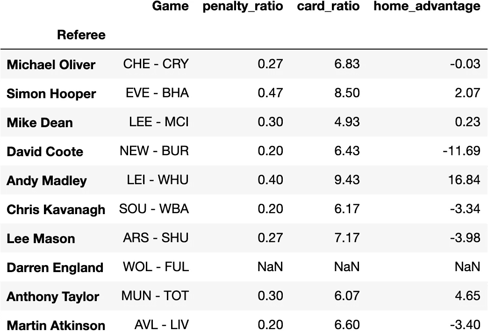

# 团队惩罚统计

除了裁判判罚的概率之外，让我们也看看在过去的 5 个赛季中哪些球队被判罚最多，看看我们在哪里得到了最高的综合概率。从下面的图表中我们可以得出结论，雷、王文杰、门和伊芙最有可能得到一个点球。

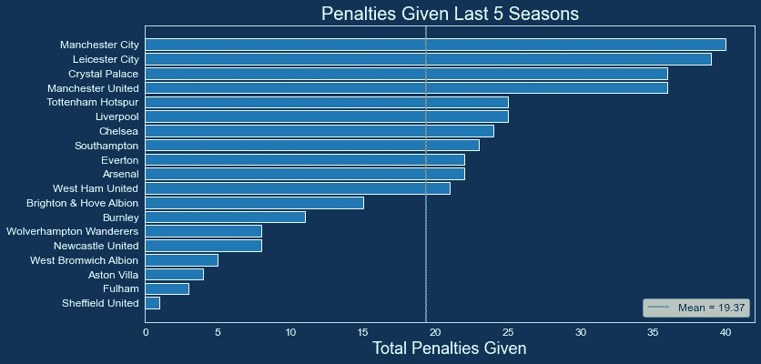

# 定位球运动员

为了帮助你选择定位球运动员，请看下面的列表，它或多或少是最新的，有几个可疑的预测:

# 预计首发阵容

在我们运行最终的团队选择器之前，让我们考虑一下每个团队的预计首发 11 人。

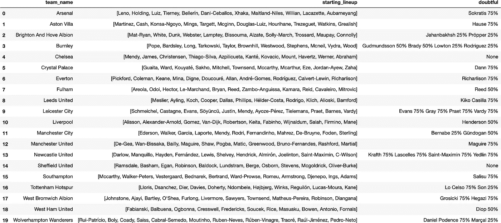

请注意右边可疑球员的名字，以及下面最新的伤病消息:

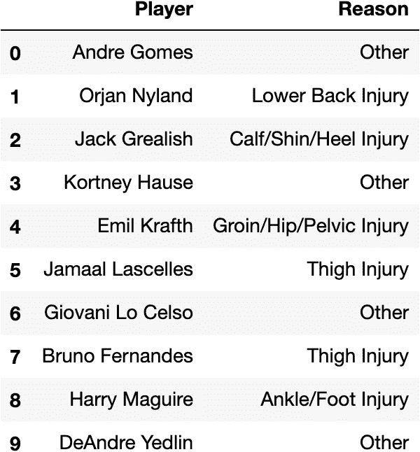

# 预测模型(球员统计)

现在是今年改进算法的皇冠上的宝石——预测球员统计数据的时候了。在我们将所有的 FDR、赌注系数、裁判首发、预计阵容和伤病分层后，有两个主要指标*我们在为接下来的 n 场比赛周团队选择调整我们的团队优化器时会考虑到— ***预测总积分和期望值(ROI)。*** 下面是每个指标的统计数据，也是按职位细分的。*

# *预计总积分—前 25 名玩家*

*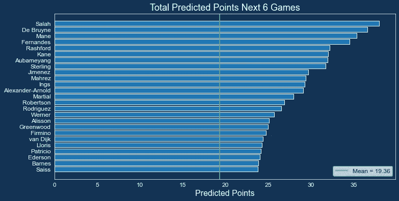*

# *预计预期价值(ROI) —前 25 名参与者*

*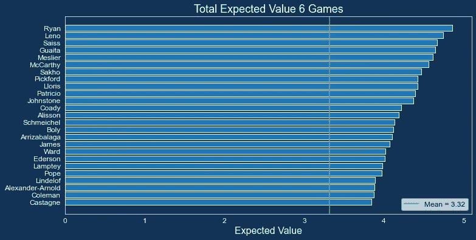*

# *预测积分——顶级守门员*

*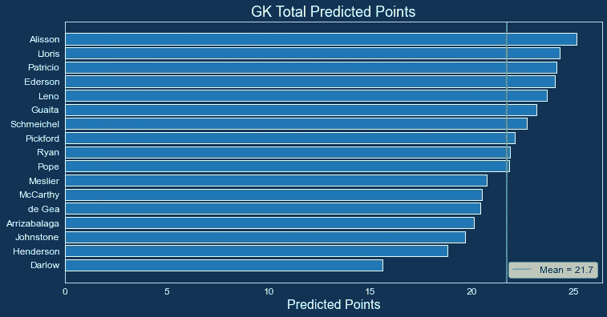*

# *投射点数—顶级防守者*

*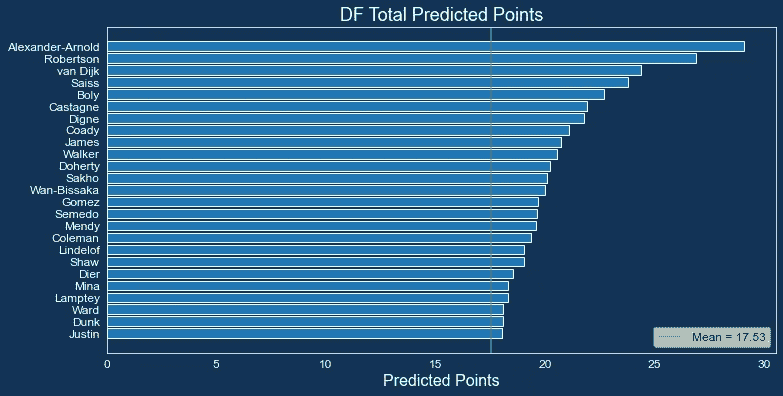*

# *预测得分——顶级中场*

*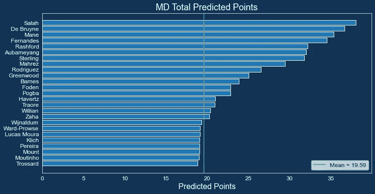*

# *预测分数——顶级前锋*

*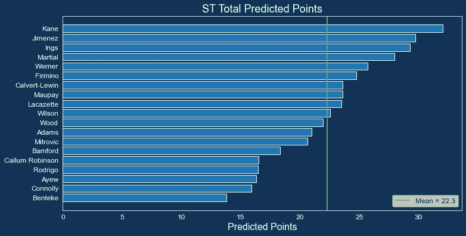*

*正如你所看到的，每个位置都有大量选项可供我们选择，因此我们将把上面的许多统计数据插入 Python 中的 ***优化函数，该函数将 ***输出具有最高预期总积分*** 的团队，给定我们的预算约束和进入我们决策过程的其他指标。在团队选择器代码生效之前应用的一些初步过滤器包括:****

1.  ***排除受伤或停赛球员***
2.  ***将球员排除在 FDR 高的队伍之外***
3.  *排除在 GW1 中没有固定比赛的队伍中的球员*
4.  ***同一团队不能有超过 3 名玩家***
5.  ***总共必须有 15 名球员(GK=2，DF=5，MD=5，ST=3)***

# *优化最常用信息的预算*

*上周前 100 名选手最常用的阵型是 3-4-3，所以我们将展示这种阵型的最佳阵容。正如你在下面看到的，模型首先查看参数，告诉它是否应该向 15 名球员的*全队优化，或者向有 ***11 名关键球员和 4 名廉价替补*** 的特定阵型优化。对于填充符，它首先查看*，并使用该 ***来决定每个位置*** 要获得多少个填充符。然后，该模型从我们的初始预算中减去花费在 4 个填充者上的总金额，并将剩余的预算花费在关键的 11 个玩家上， ***，给定优化函数和模型约束*** 。***

****示例 1:向最大期望点数优化****

**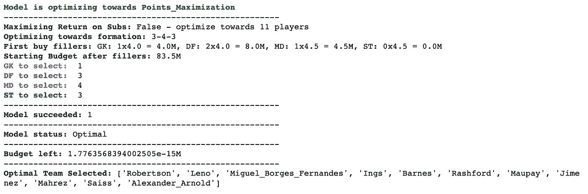**

****示例 2:向最大期望值(ROI)优化****

**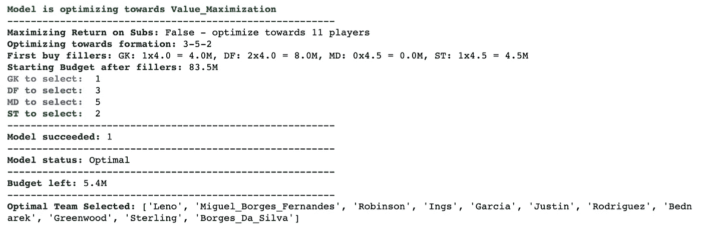**

**我们使用优化算法的输出和每个位置推荐的前 10 名球员中的一些人来形成以下混合团队:**

**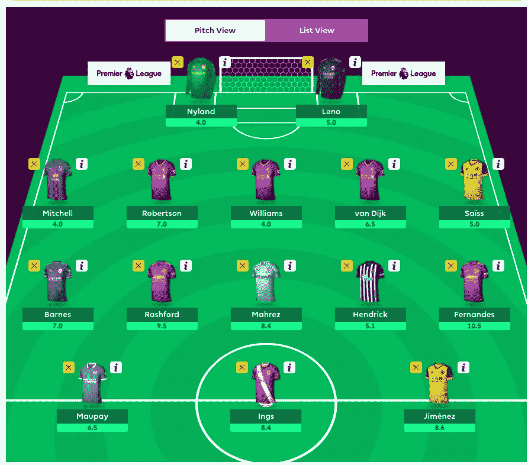**

# ****我们团队为 GW4****

**我们将一直使用上周的顶级得分团队，并尝试最多进行 1-2 次转会。所以，我们用儿子和沃德-普鲁斯换来了 KDB 和克里奇，因为我们想得到更多的主罚点球的球员。我们觉得萨拉赫很快就要爆发了，所以我们让他担任队长，希望最终打破可怜队长的诅咒。**

**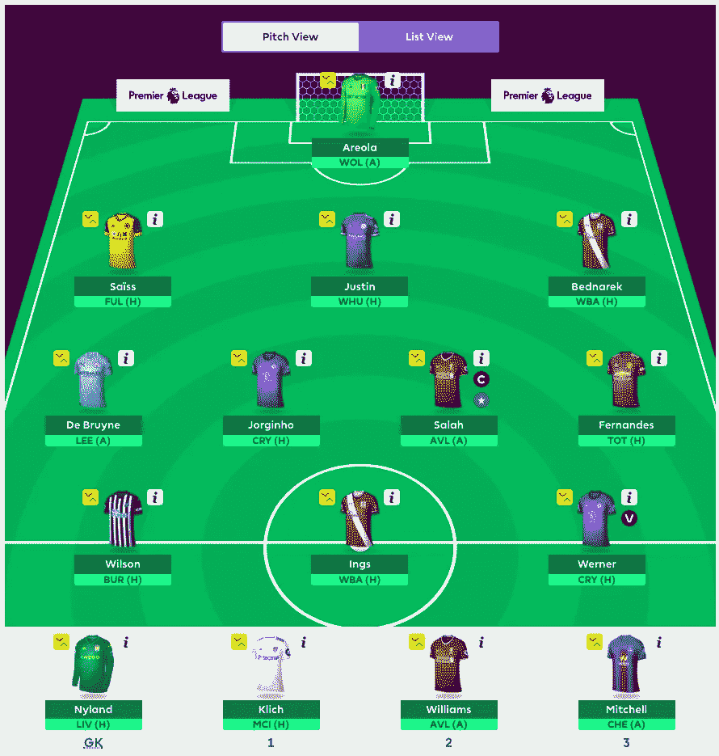**

# **结论**

**我们正努力保持纪律性，在国际比赛日之前不使用我们的通配符。我们球队的主要弱点是门将，因为富勒姆的防守太糟糕了，我们真的想摆脱阿雷奥拉，并得到另一个 4.5 米的门将，预计在赛季中会有更多的不失球。因此，在下一个 GW 之前，我们可能会在我们的几个队伍中使用通配符。感谢您一如既往的阅读，祝您本周好运！**