# EPL 幻想 GW4 回顾和 GW5 算法选择

> 原文：<https://towardsdatascience.com/epl-fantasy-gw4-recap-and-gw5-algo-picks-19801f3f6e63?source=collection_archive---------59----------------------->

## 我们的金钱球方法到幻想的 EPL(队 _id: 2122122)

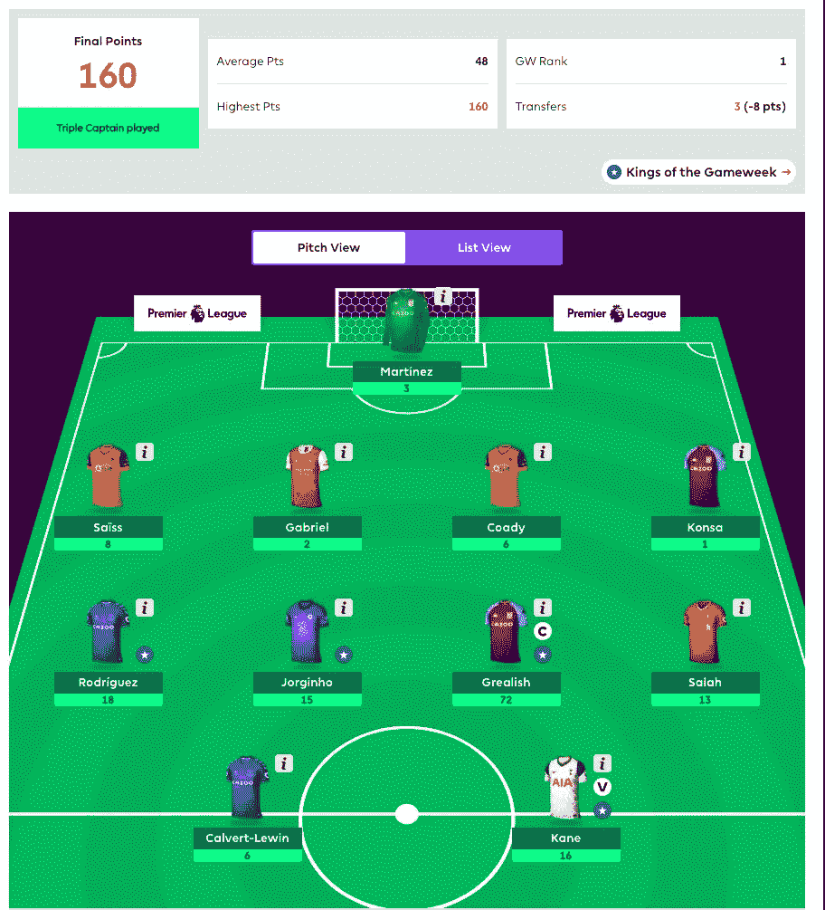

GW4 的顶级团队

如果这是你第一次登陆我们的幻想 EPL 博客，你可能想看看我的媒体档案中的一些我们最初的 EPL 博客，以熟悉这个项目是如何开始的，以及随着时间的推移我们所做的改进。

# 什么是新的？

我们利用空闲的周末，为我们的算法添加了另一个新功能— **队长推荐逻辑**。该方法采用了即将到来的比赛的预测得分，球员罚点球、角球或任意球的概率，球员在过去 4 个赛季中的空中威胁系数，他们的球队打进 2 个或更多进球的可能性，并以标准化的方式将所有这些融入到**最终队长选择系数**。然后，根据玩家的下一个**对手调整的 FDR** 和本赛季**防守强度的标准化得分**，该系数被**减去对手抗性得分**。熊猫 DF 看起来像下面的例子:

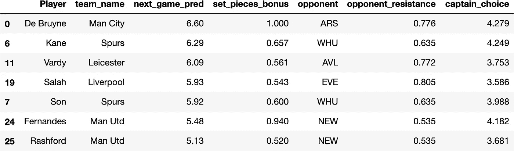

基于这个公式，这里列出了这个 GW 的 15 个推荐队长。那里有很多好的选择，所以无论如何都不是一个容易的选择。如果你想稳扎稳打，KDB、凯恩、费尔南德斯、桑恩、萨拉赫和瓦迪似乎是显而易见的选择，而克里斯·伍德有趣地成为第一选择，所以如果你有他，并且你觉得有足够的冒险精神让他成为队长，这可能是一个不错的差异化打法。

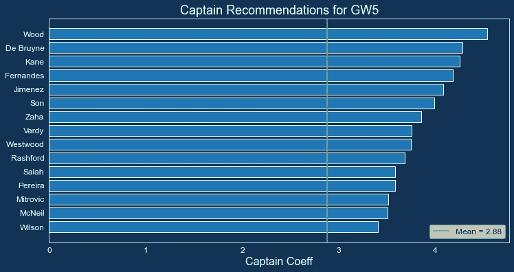

# GW3 前 100 名 FPL 团队统计数据

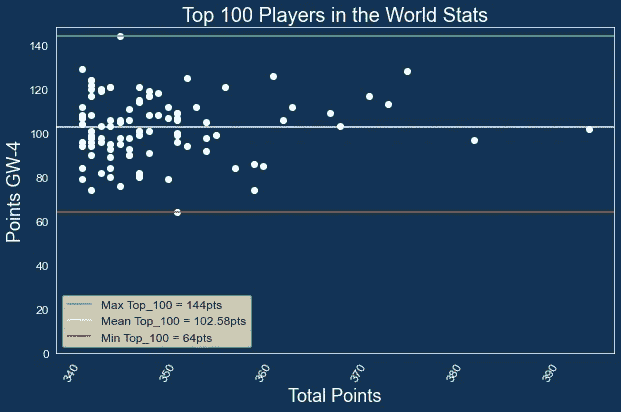

鉴于上周比赛的大量进球，世界排名前 100 位的球员度过了非常精彩的一周，**平均得分> 100，这在历史上很少发生**，排名第一的球员获得了**144 分！！！**

# 前 100 名最佳守门员

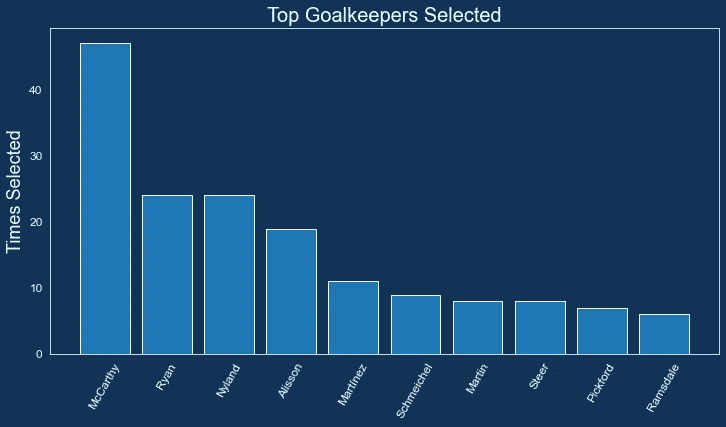

# 前 100 名中最受欢迎的捍卫者

# 前 100 名最佳中场球员

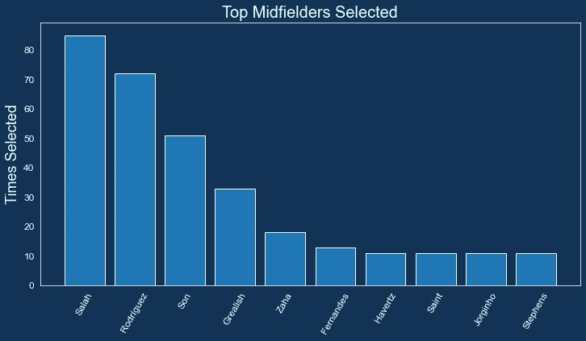

# 前 100 名中入选最多的前锋

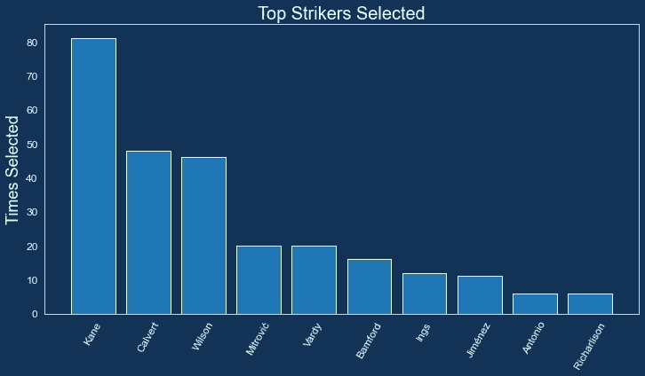

我们使用这些数据创建了下面的团队，它是由前 100 名中最受欢迎的球员组成的:

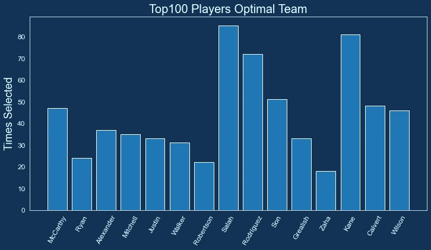

# 前 100 名 Fantasy 用户选择最多的团队

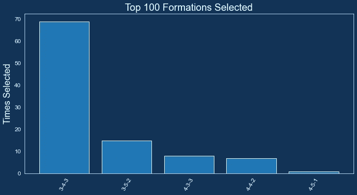

这些数据很有意义，因为大多数顶级球员都试图利用 3-4-3 阵型中的进攻型中场和前锋。

# GW4 团队绩效总结和总体统计

我们所有团队的得分都高于平均水平，得分最高的团队得到了 76 分。不幸的是，我们没有选出我们顶级球队的最佳队长，沃纳的表现低于预期。如果我们选择了显而易见的选择——Salah-**我们可能会得到 87 分**。

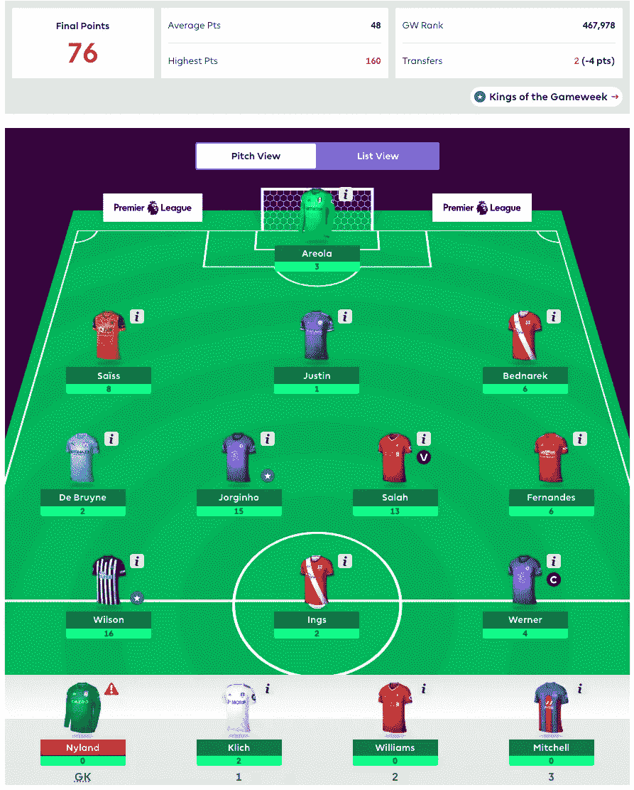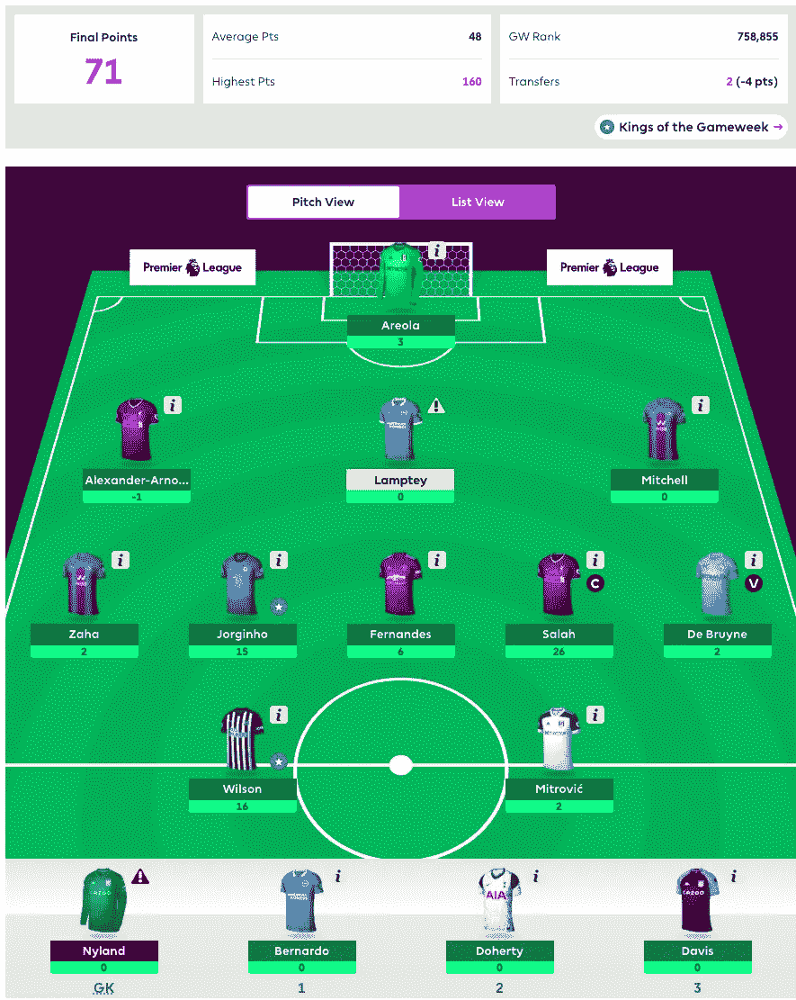

我们还参加了 FPL 的 FanTeam 版本，幸运的是，我们由 Salah 担任队长，这得到了回报，给了我们两个团队相当稳定的分数。

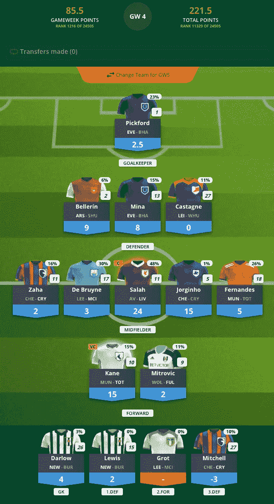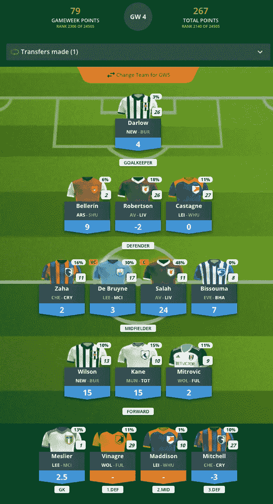

# 为我们的 GW5 选择提供有用的统计数据

由于我们今年在算法中加入了很多新的统计数据，随着时间的推移，这个博客将会有更多的统计数据和图表，更少的文本 。让我们从下面三个比赛周的比赛难度等级(FDR)开始:

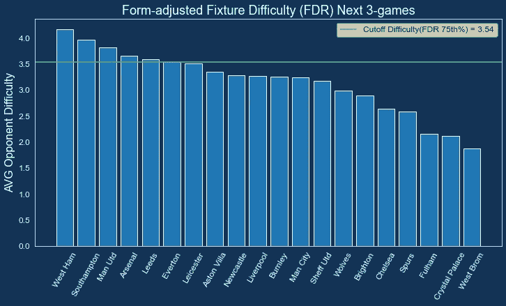

看起来**西汉姆**，**阿森纳，南安普顿，曼联和利兹**都有一些艰难的比赛即将到来，所以我们的算法可能不会从这些球队中挑选球员。在接下来的三周里，CHE，TOT，CRY，MCI 和 WOL 的日程似乎更轻松。

# 博彩赔率

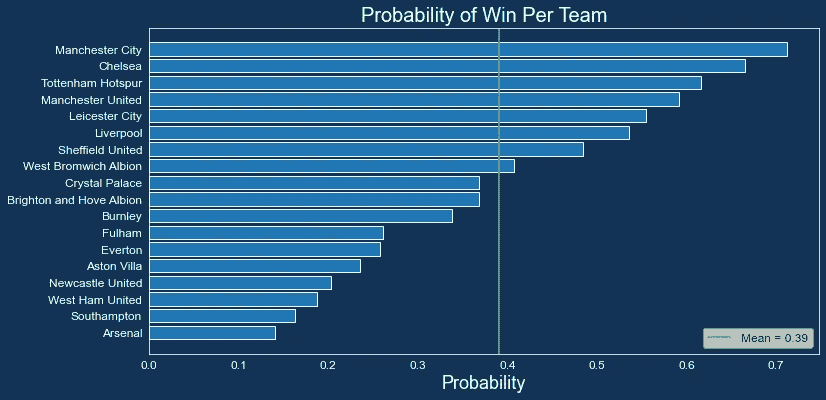

我们会尽量把 ***队伍中有超过 50 %胜率的*** 队员，比如 **TOT、** ***CHE、LIV、雷、MCI、MUN*** 。我们应该尽量不要有太多来自 ARS、SOU、WHU、FUL、NEW、EVE 或 AVL 的防守球员。

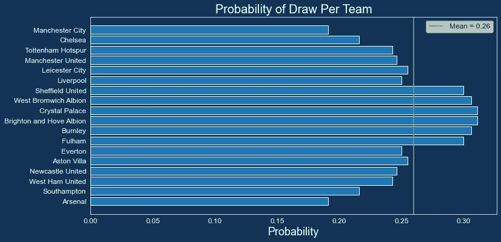

拥有 ***的队伍以更高的概率抽到了*** ，特别是当比赛是 ***结合高赔率为 2.5 以下的*** 时，可能会对选择*防守队员有利，因为如果比赛以 0:0 结束，那将会产生大量的加分。结合 下方的 ***下/上图，我们可以识别出以下 ***概率较高的游戏至少有一场不失球——WBA-BUR、CRY-BHA、SHU-FUL。*******

*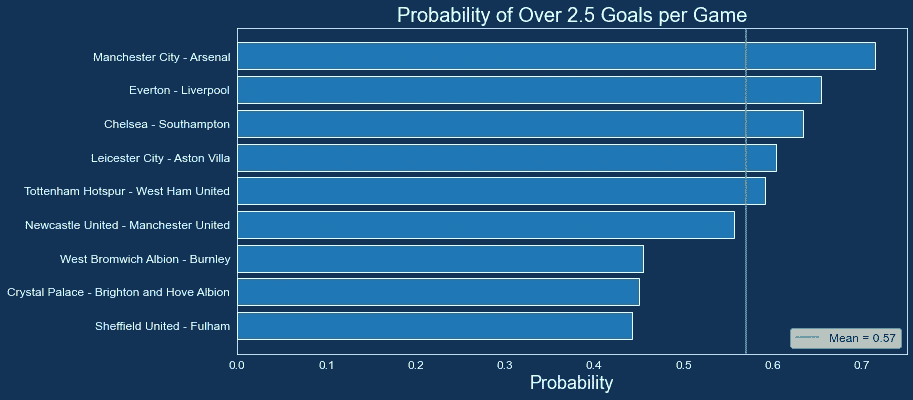*

*相反，我们可能希望从 ***赔率超过 2.5*** 的游戏中有更多的 ***攻击玩家*** ，比如 **MCI-ARS、EVE-LIV、CHE-SOU、雷-AVL 和 TOT-WHU *。同样，上周的赔率表现得相当好，因为大多数游戏预测有超过 2.5 个目标！****

# *裁判统计*

*这些将在本周晚些时候更新，因为裁判的分配还没有宣布。*

# *团队惩罚统计*

*除了裁判判罚的概率之外，让我们也看看在过去的 5 个赛季中哪些球队被判罚最多，看看我们在哪里得到了最高的综合概率。从下图我们可以得出结论，雷、CRY、MCI、MUN 和 TOT 最有可能获得点球。*

**

# *定位球运动员*

*为了帮助你选择定位球运动员，请看下面的列表，它或多或少是最新的，有几个可疑的预测:*

**

# *预计首发阵容*

*在我们运行最终的团队选择器之前，让我们考虑一下每个团队的预计首发 11 人。*

*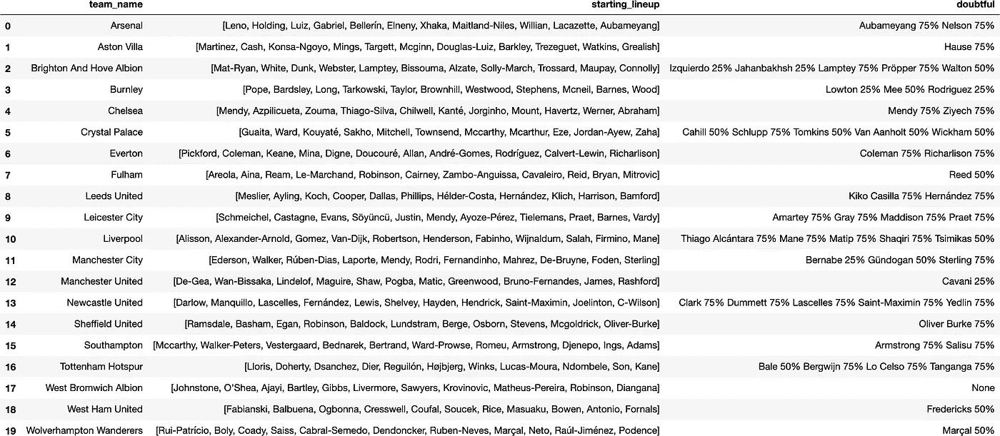*

*请注意右边可疑球员的名字，以及下面最新的伤病消息:*

*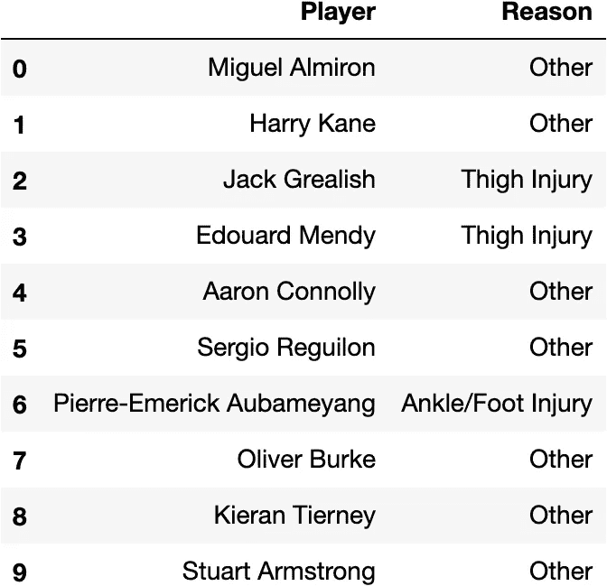*

# *预测模型(球员统计)*

*现在是今年改进算法的皇冠上的宝石——预测球员统计数据的时候了。在我们将所有的 FDR、赌注系数、裁判首发、预计阵容和伤病分层后，有两个主要指标*我们在为接下来的 n 场比赛周团队选择调整我们的团队优化器时会考虑到— ***预测总积分和期望值(ROI)。*** 下面是每个指标的统计数据，也是按职位细分的。**

# **预计总积分—前 25 名玩家**

**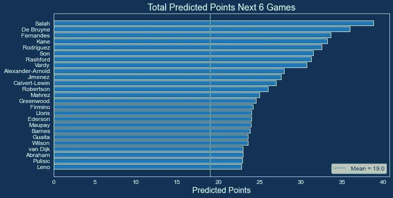**

# **预计预期价值(ROI) —前 25 名参与者**

**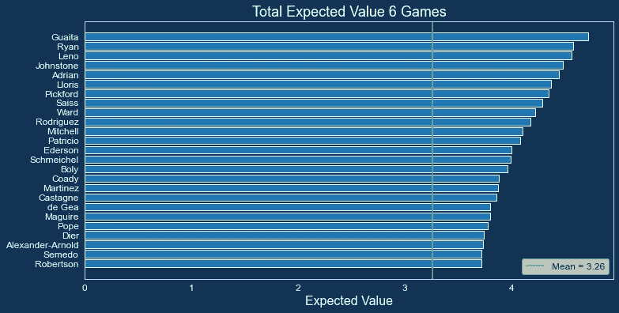**

# **预测积分——顶级守门员**

**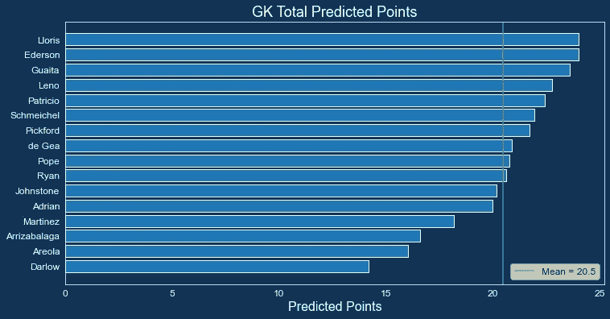**

# **投射点数—顶级防守者**

**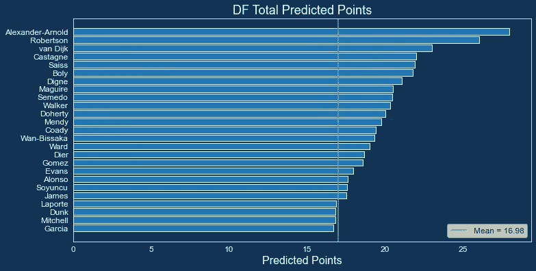**

# **预测得分——顶级中场**

**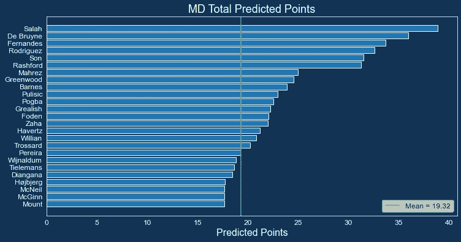**

# **预测分数——顶级前锋**

**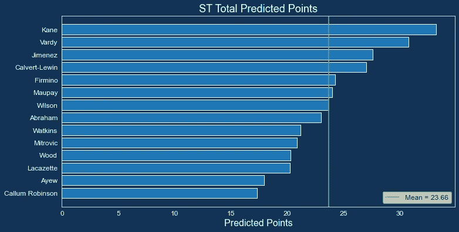**

**正如你所看到的，每个位置都有大量选项可供我们选择，因此我们将把上面的许多统计数据插入 Python 中的 ***优化函数，该函数将 ***输出具有最高预期总积分*** 的团队，给定我们的预算约束和进入我们决策过程的其他指标。在团队选择器代码生效之前应用的一些初步过滤器包括:*****

1.  ***排除受伤或停赛球员***
2.  ***将球员排除在 FDR 高的队伍之外***
3.  *排除在 GW1 中没有固定比赛的队伍中的球员*
4.  ***同一团队不能有超过 3 名玩家***
5.  ***总共必须有 15 名球员(GK=2，DF=5，MD=5，ST=3)***

# *优化最常用信息的预算*

*上周前 100 名选手最常用的阵型是 3-4-3，所以我们将展示这种阵型的最佳阵容。正如你在下面看到的，模型首先查看参数，告诉它是否应该向 15 名球员的*全队优化，或者向有 ***11 名关键球员和 4 名廉价替补*** 的特定阵型优化。对于填充符，它首先查看*，并使用该 ***来决定每个位置*** 要获得多少个填充符。然后，该模型从我们的初始预算中减去花费在 4 个填充者上的总金额，并将剩余的预算花费在关键的 11 个玩家上， ***，给定优化函数和模型约束*** 。***

****示例 1:向最大期望点数优化****

**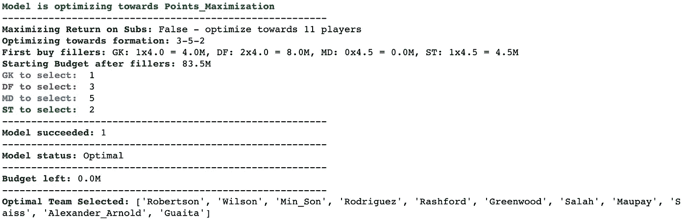****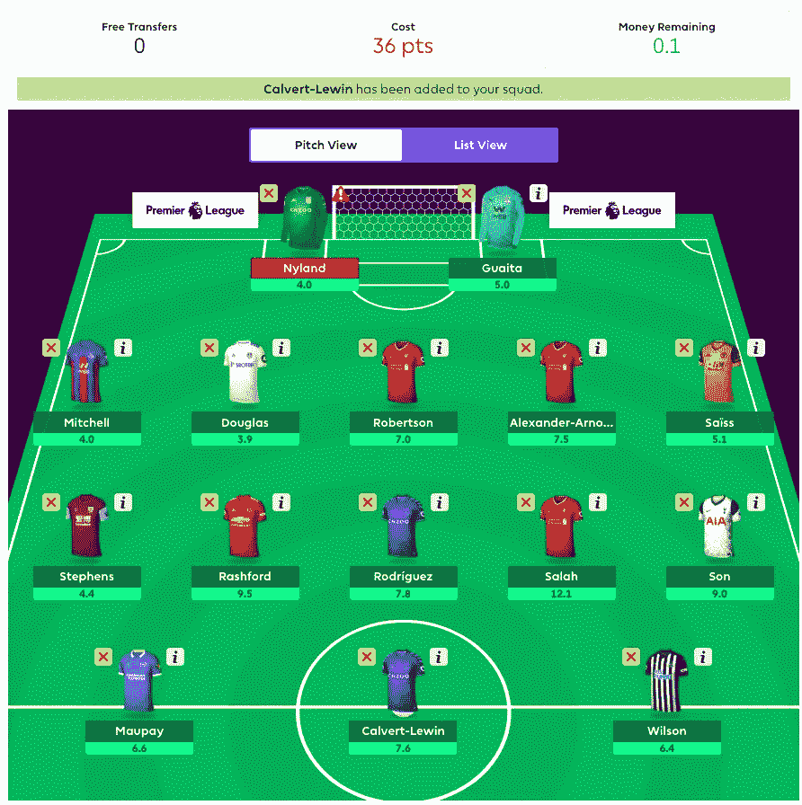**

****示例 2:向最大期望值(ROI)优化****

**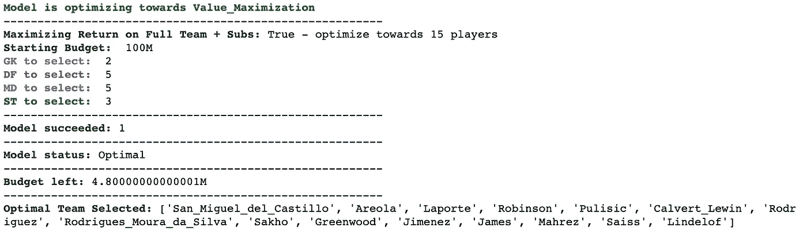****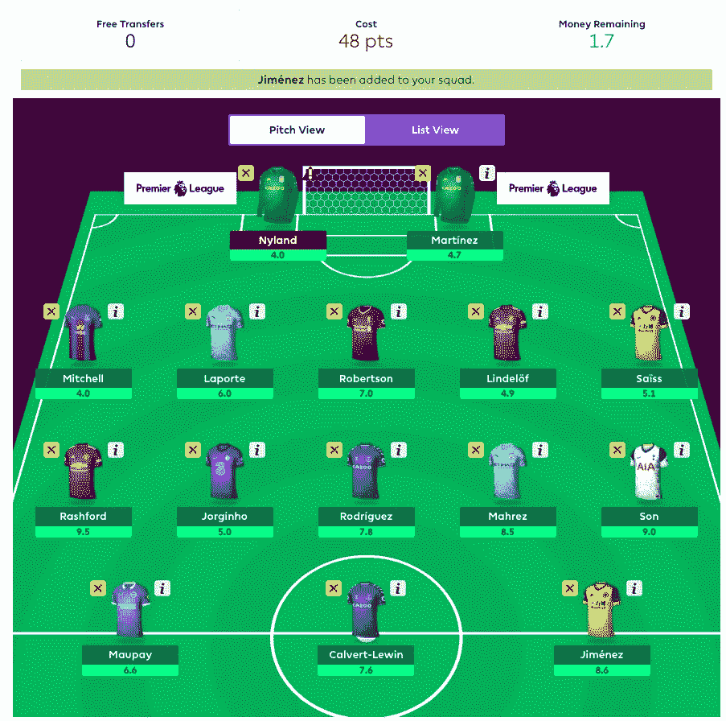**

# **我们的 GW5 团队**

**我们将一直使用上周的顶级得分团队，并尝试最多进行 1-2 次转会。然而，本周**我们决定使用我们的通配符**，因为国际比赛日以及许多球员受伤或随新冠肺炎回来的可能性。我们也想把预算从昂贵的防守球员身上转移到便宜的防守球员和 T4 昂贵的进攻球员身上，考虑到我们这个赛季看到的绝对雪崩式的进球和极少的零失球。这就是我们球队目前的情况，但我们会密切关注新闻，可能会根据周四 Fri 的伤病更新做出很多最后一分钟的轮换。**

**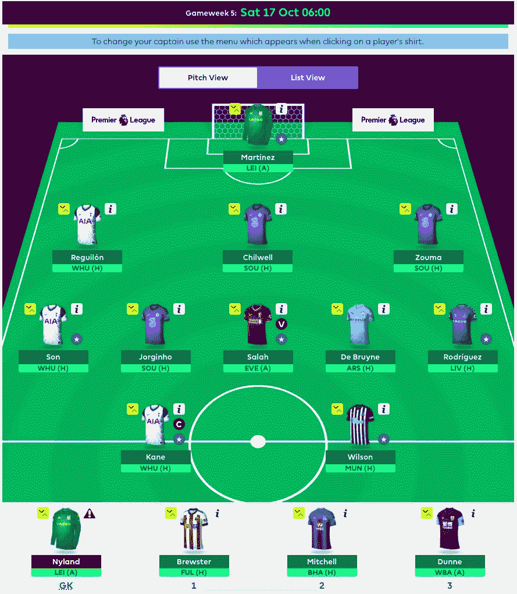**

# **结论**

**按照本赛季的发展方式，我们**建议放弃昂贵的防守球员，尝试只拥有三名中档防守球员，并且**在中场和进攻中积累大量筹码**，因为本赛季到目前为止一直有大量进球，并且没有迹象表明事情可能会很快放缓。感谢您一如既往的阅读，祝您本周好运！****