# EPL 幻想 GW5 重述和 GW6 算法选择

> 原文：<https://towardsdatascience.com/epl-fantasy-gw5-recap-and-gw6-algo-picks-53f0daca662b?source=collection_archive---------39----------------------->

## 我们的金钱球方法到幻想的 EPL(队 _id: 2122122)

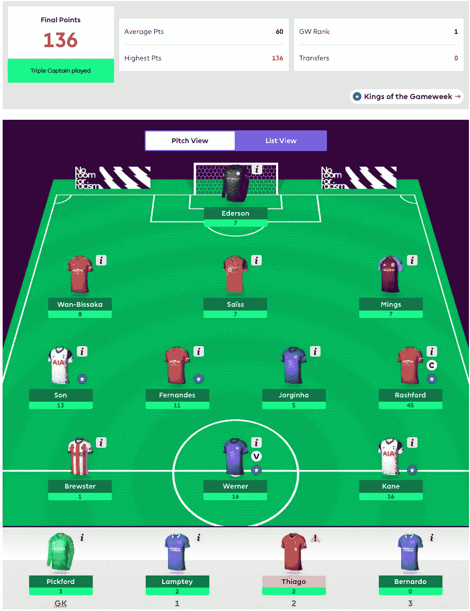

GW5 的顶级团队

如果这是你第一次登陆我们的幻想 EPL 博客，你可能想看看我的媒体档案中的一些我们最初的 EPL 博客，以熟悉这个项目是如何开始的，以及随着时间的推移我们所做的改进。

# GW5 前 100 名 FPL 团队统计数据

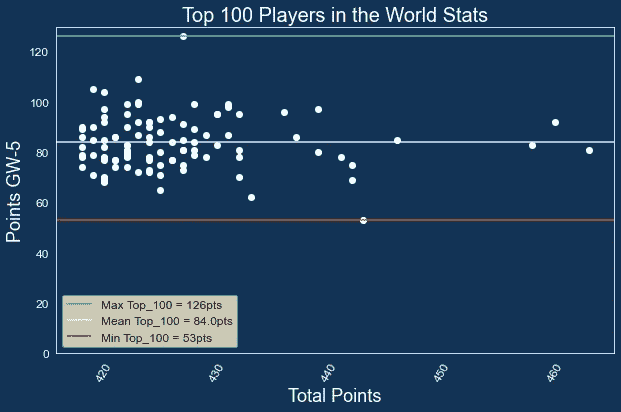

排名前 100 位的球员又度过了坚实的一周，**平均得分> 84，其中**，排名第一的球员得分**大败 136 分！！！**

# 前 100 名最佳守门员

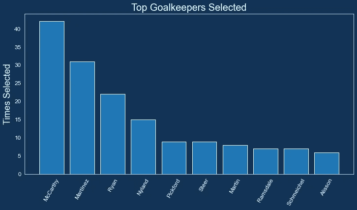

# 前 100 名中最受欢迎的捍卫者

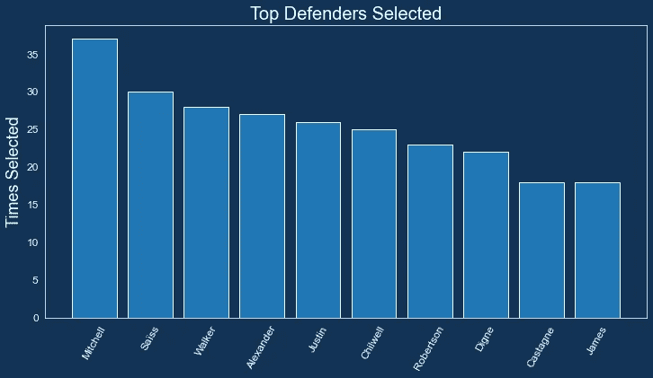

# 前 100 名最佳中场球员

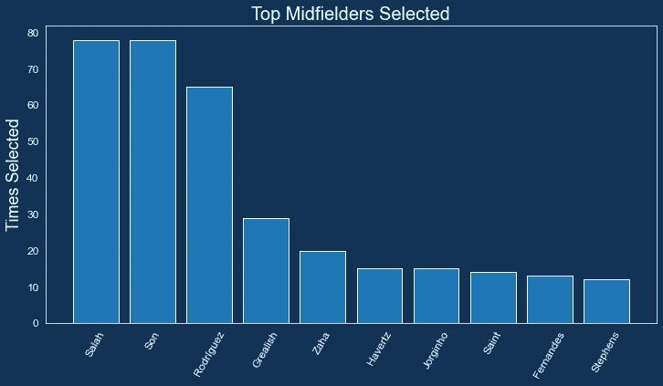

# 前 100 名中入选最多的前锋

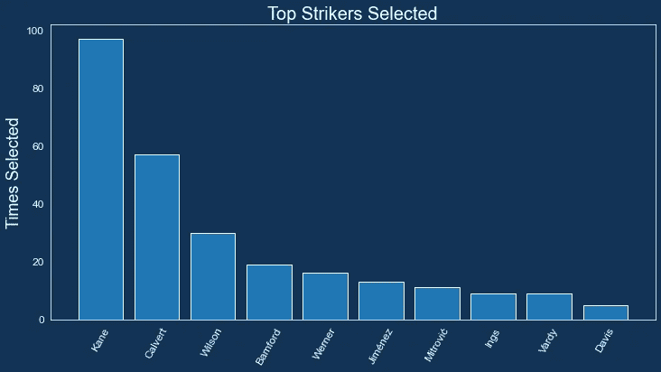

我们使用这些数据创建了下面的团队，它是由前 100 名中最受欢迎的球员组成的:

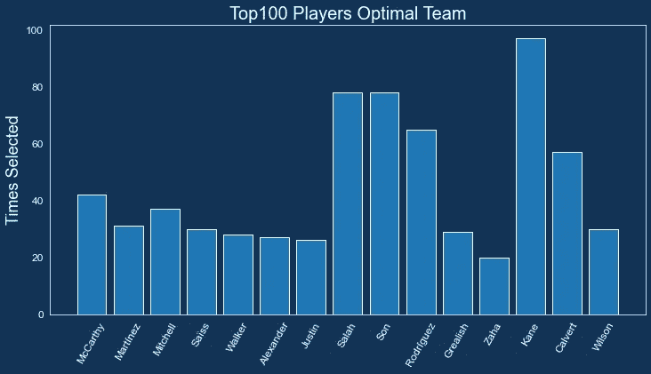

# 前 100 名 Fantasy 用户选择最多的团队

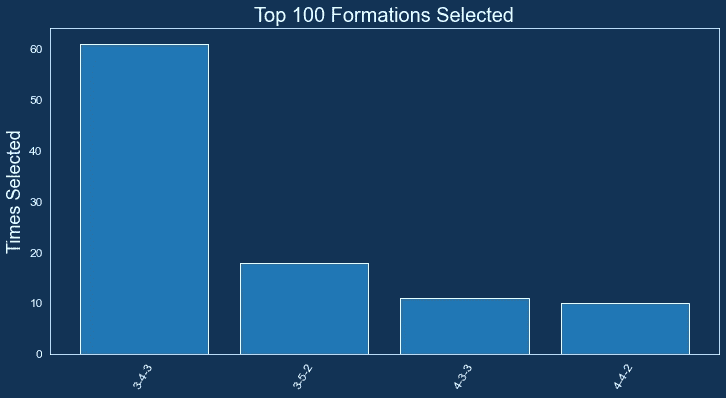

这些数据很有意义，因为大多数顶级球员都试图**利用 3–4–3 f**阵型的进攻型中场和前锋。

# GW5 团队绩效总结和总体统计

我们所有团队的得分都高于平均水平，得分最高的团队得分为 78 分。最后选对了队长，帮了大忙。唯一的负面消息是瓦迪受伤后坐在板凳上，但总体来说我们对自己的表现很满意。

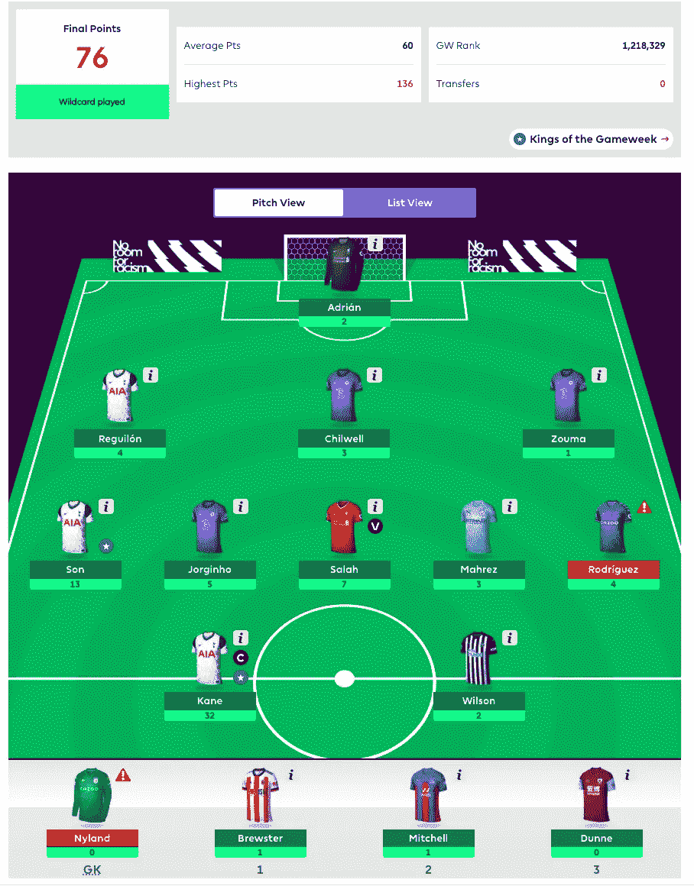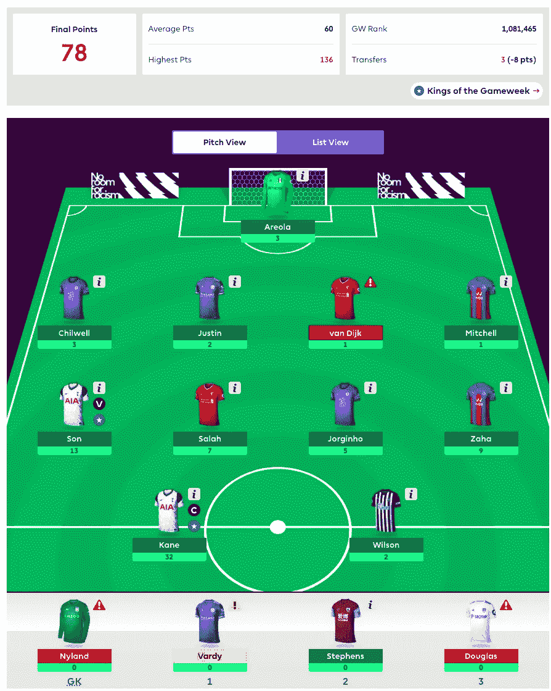

我们还参加了 FPL 的 FanTeam 版本，幸运的是，我们也遇到了优秀的队长，这得到了回报，让我们的两个团队获得了相当不错的分数。有了达洛和维斯特加德，我们在板凳上留下了很多分数，所以这么早让布鲁斯特上场可能是个错误。

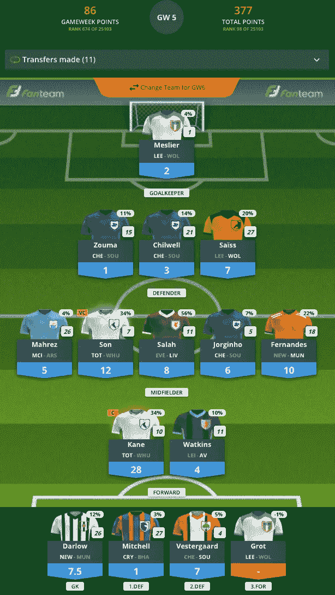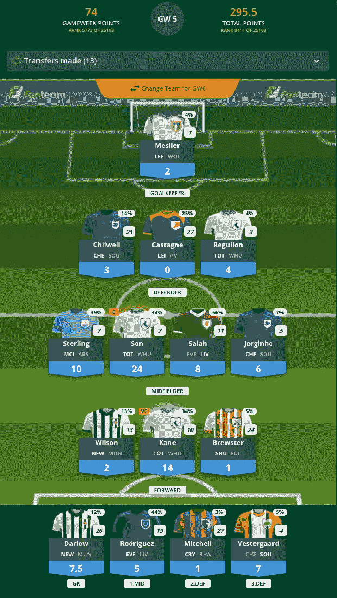

# 为我们的 GW6 选择提供有用的统计数据

由于我们今年在算法中加入了很多新的统计数据，随着时间的推移，这个博客将会有更多的统计数据和图表，更少的文本。让我们从下面三个比赛周的比赛难度等级(FDR)开始:

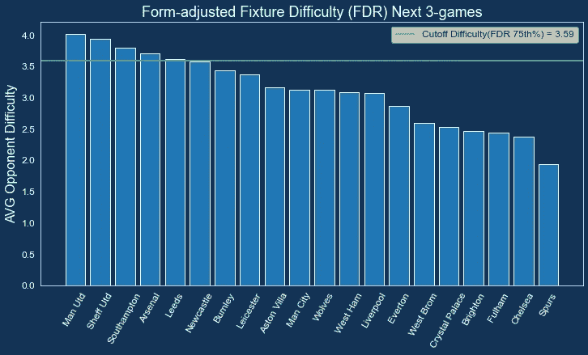

看起来 MUN， **SHU，SOU，ARS，LEE 和 NEW** 有一些艰难的比赛即将到来，所以我们的算法可能不会从这些球队中挑选球员。在接下来的三周里，CHE、TOT、CRY、BHA、WBA 和 EVE 的日程似乎更加轻松。

# 博彩赔率

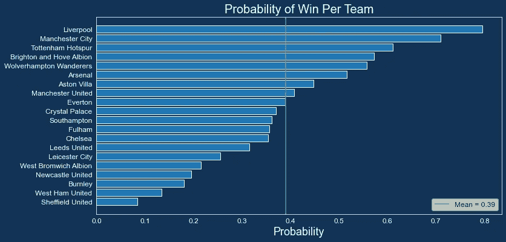

我们将尝试积累来自 ***队的玩家，他们有超过 50 %的机会赢得*** 比赛，例如 **TOT、** ***LIV、MCI、WOL、ARS 和 BHA*** 。我们应该尽量不要有太多的车、李、雷、WBA、、纽卡、布尔这样的防守球员。

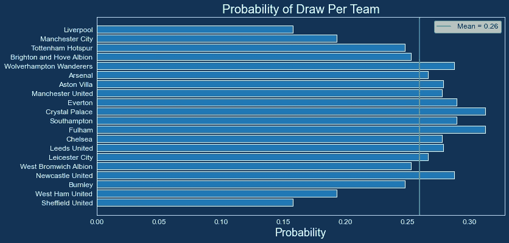

以 ***较高概率抽到*** 的队伍，特别是当比赛是 ***结合高赔率为 2.5 以下的*** 时，可能是 ***适合选择防守队员*** 因为如果比赛以 0:0 结束，那将会产生大量的加分。结合 下方的 ***Under/Over 图，我们可以识别出以下 ***至少一场不失球概率较高的游戏——FUL-CRY、BHA-WBA、WOL-NEW。******

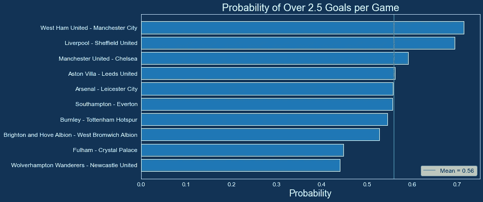

反过来，我们可能希望从 ***赔率超过 2.5*** 的游戏中有更多的 ***进攻型玩家*** ，比如**-**MCI、LIV-SHU、MUN-CHE、ARS-LEI、AVL-LEE *。同样，上周的赔率表现得相当好，因为大多数游戏预测有超过 2.5 个目标！*****

# **裁判统计**

**从下面的统计数据来看，在比赛中出现点球的几率更高:**WHU-麦克伊，布尔-托，苏-伊夫，和富尔-科尔**，所以我们建议**为这些球队中的一些球队配备点球手**。看起来，像游戏**AVL-李，MUN-CHE 和 BUR-TOT 有裁判喜欢给很多卡**，所以预计会失去一些黄牌，但希望没有红色…**

**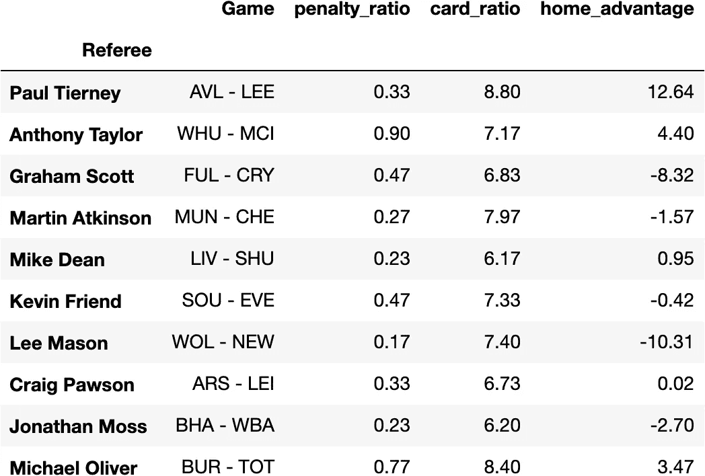**

# **团队惩罚统计**

**除了裁判判罚的概率之外，让我们也看看在过去的 5 个赛季中哪些球队被判罚最多，看看我们在哪里得到了最高的综合概率。从下面的图表中我们可以得出结论，雷、CRY、MCI、MUN 和 TOT 最有可能获得点球。**

**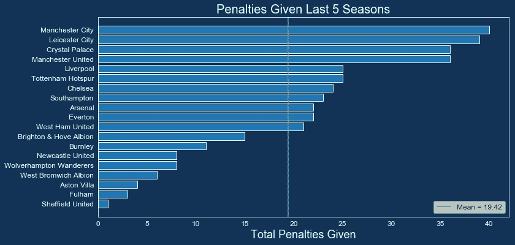**

# **预计首发阵容**

**在我们运行最终的团队选择器之前，让我们考虑一下每个团队的预计首发 11 人。**

**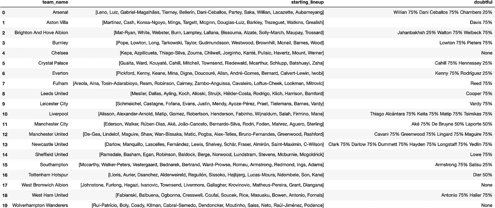**

**请注意右边可疑球员的名字，以及下面最新的伤病消息:**

**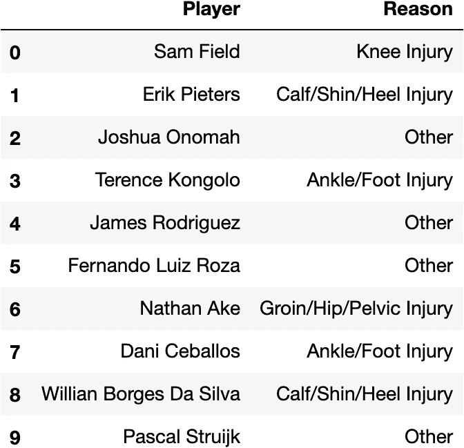**

# ****团队累计投资回报率统计****

**五个游戏周过去了，我们终于有了足够的统计数据，来看看哪些球队被认为是整体上的好投资，哪些球队有很多定价过高的表现不佳的球员。球队按平均每名球员得分排序，所以毫不奇怪，AVL、伊夫、WOL 和 WHU 在名单上名列前茅，因为他们的球员价格已经超出了他们的预期。一些价格更高，表现不佳的球员可以在 **FUL，BUR，SHU，MUN，MCI，NEW，**中找到，所以从这些球队中挑选球员是一个很好的主意。**

**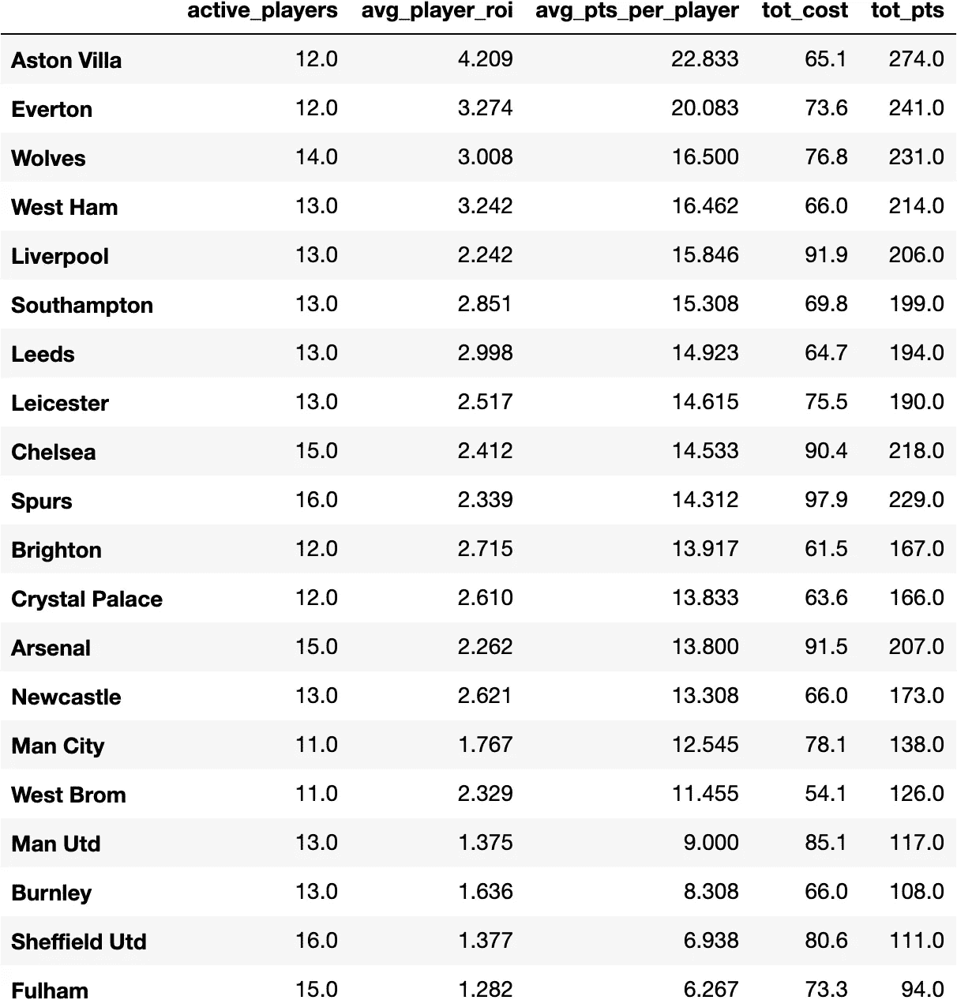**

# **推荐人队长**

**我们的方法采用了即将到来的比赛的预测得分，球员罚点球、角球或任意球的概率，球员在过去 4 个赛季中的空中威胁系数，他们的球队打进 2 个或更多进球的可能性，并以标准化的方式将所有这些混合成**最终队长选择系数**。然后，根据玩家的下一个**对手调整的 FDR** 和本赛季**防守强度的标准化得分**，该系数被**减去对手抗性得分**。熊猫 DF 看起来像下面的例子:**

**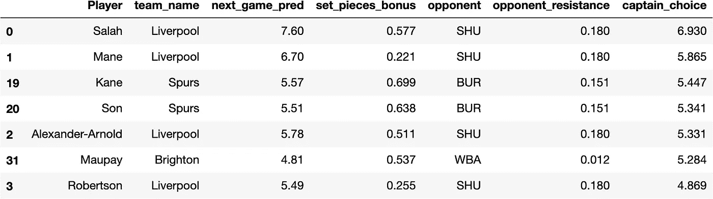**

**基于这个公式，这里列出了这个 GW 的 15 个推荐队长。那里有很多好的选择，所以无论如何都不是一个容易的选择。如果你想谨慎行事，萨拉赫、马内、凯恩和儿子应该是你的首选。**

**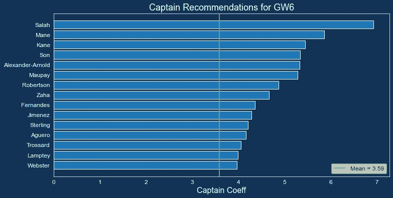**

# **预测模型(球员统计)**

**现在是今年改进算法的皇冠上的宝石——预测球员统计数据的时候了。在我们将所有的 FDR、赌注系数、ref 首发、预计阵容和伤病分层后，有两个主要指标*我们在为下一个 n-gameweeks 团队选择调整我们的团队优化器时会考虑到— ***预测总积分和期望值(ROI)。*** 下面是每个指标的统计数据，也按职位细分。***

# ***预计总积分—前 25 名玩家***

******

# ***预计预期价值(ROI) —前 25 名参与者***

***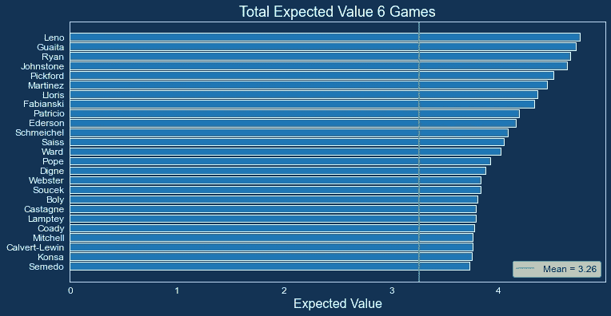***

# ***预测积分——顶级守门员***

***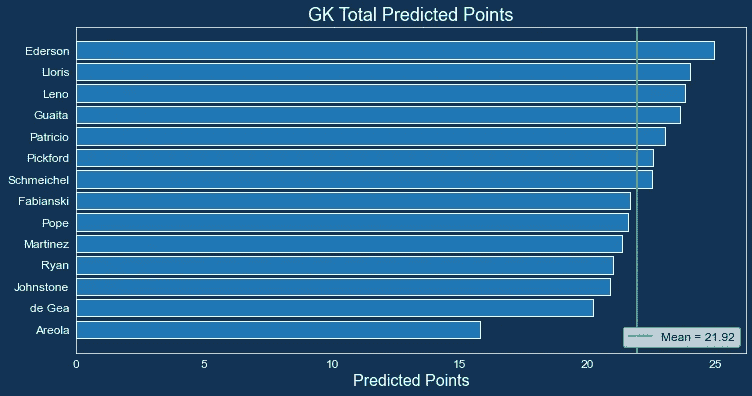***

# ***投射点数—顶级防守者***

***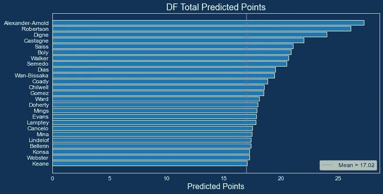***

# ***预测得分——顶级中场***

***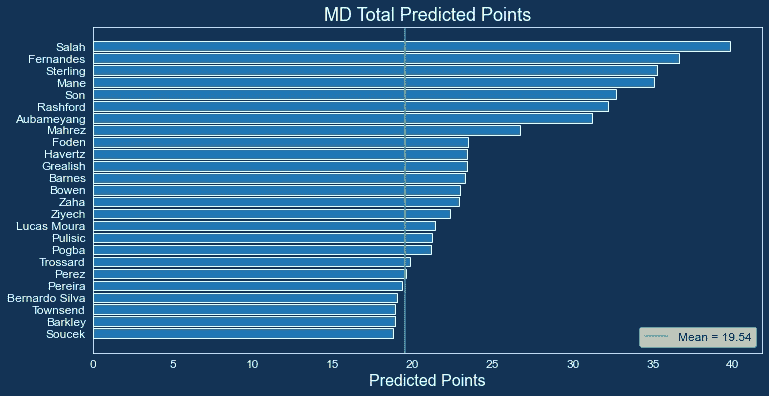***

# ***预测分数——顶级前锋***

***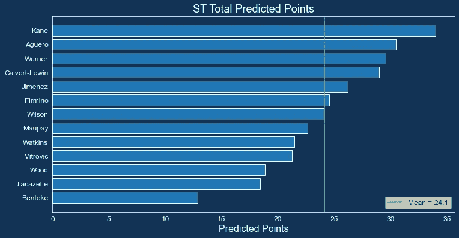***

***如你所见，每个位置都有大量选项可供我们选择，因此我们将把上面的许多统计数据插入 Python 中的 ***优化函数，该函数将 ***输出具有最高预期总积分*** 的团队，给定我们的预算约束和其他进入我们决策过程的指标。在团队选择器代码生效之前应用的一些初步过滤器包括:******

1.  *****排除受伤或停赛球员*****
2.  *****将球员排除在 FDR 高的队伍之外*****
3.  *****在 GW1** 中排除没有赛程的队伍中的球员***
4.  *****同一团队不能有超过 3 名玩家*****
5.  *****总共必须有 15 名球员(GK=2，DF=5，MD=5，ST=3)*****

# ***优化最常用信息的预算***

***上周前 100 名选手最常用的阵型是 3-4-3，所以我们将展示这种阵型的最佳阵容。正如你在下面看到的，模型首先查看参数，告诉它是否应该向 15 名球员的*全队优化，或者向有 ***11 名关键球员和 4 名廉价替补*** 的特定阵型优化。对于填充符，它首先查看*，并使用该 ***来决定每个位置*** 要获得多少个填充符。然后，模型从我们的初始预算中减去花费在 4 个填充者上的总金额，并将剩余的预算花费在关键的 11 个参与者上， ***给定优化函数和模型约束*** 。*****

******示例 1:向最大期望点数优化******

****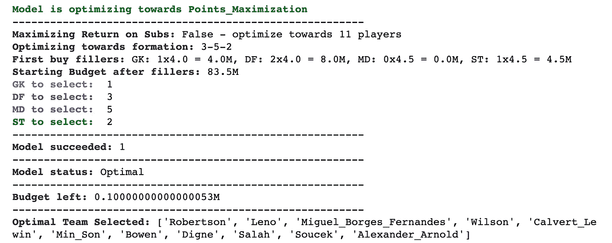********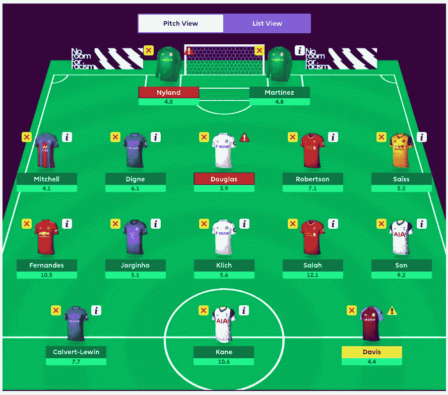****

******示例 2:向最大期望值(ROI)优化******

****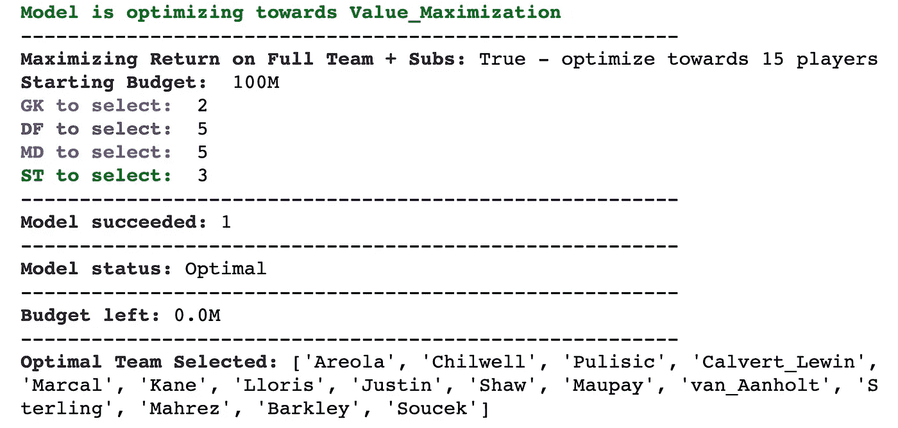********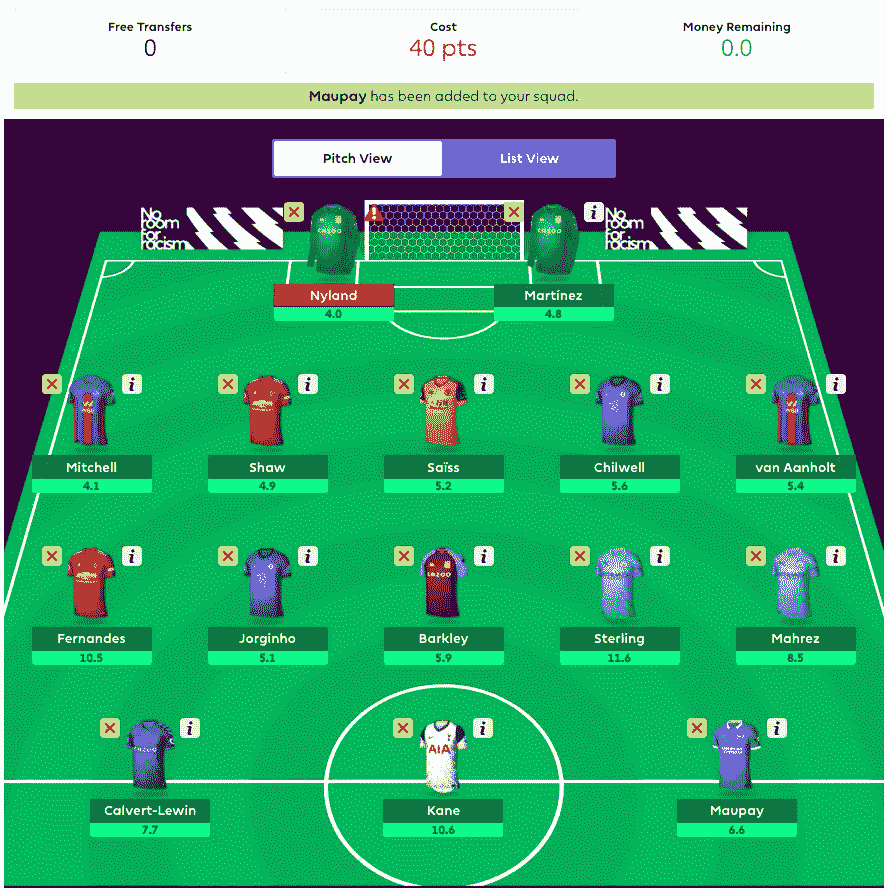****

****在这种情况下，价值团队看起来非常有吸引力和平衡，如果你担心大量的伤病和关键昂贵球员的轮换，那么这种方法可能是一种保护你自己的好方法。****

# ****我们的 GW6 团队****

****我们将一直使用上周的顶级得分团队，并尝试最多进行 1-2 次转会。因为我们上周打了外卡，所以我们不需要做任何重大改变，所以**我们只是得到了基尔曼**，他有希望成为长期的**主要价值，如果他定期得到 60 分钟以上的比赛**，即使他几周不打，在他的价格上涨 0.2 或更多之前得到他 400 万，使他成为一个很好的替代 DF，并为更昂贵的进攻球员腾出资金。对于队长，我们将选择最受推荐的球员——萨拉赫。****

****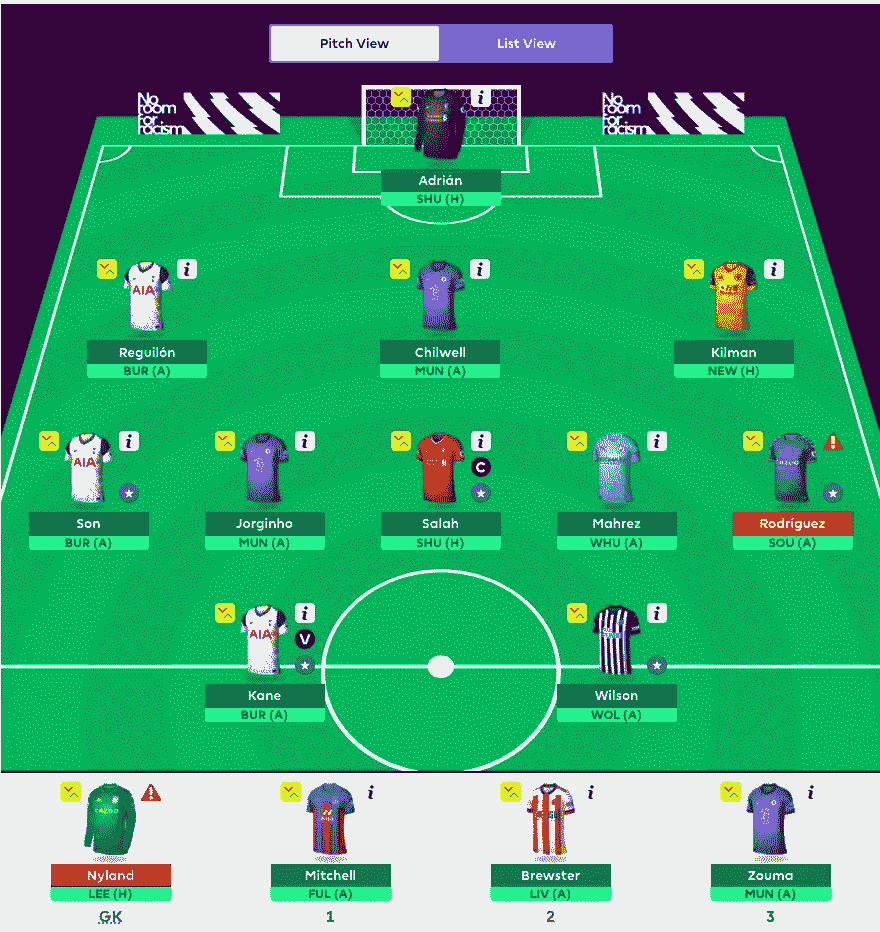****

# ****结论****

****按照本赛季的发展方式，我们**建议放弃昂贵的防守球员，尝试只拥有三名中档防守球员，并且**在中场和进攻中积累大量筹码**，因为本赛季到目前为止一直在进球，而且没有迹象表明事情可能会很快放缓。感谢您一如既往的阅读，祝您本周好运！******