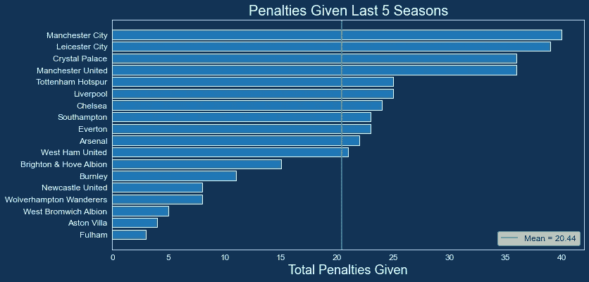

# EPL 幻想 GW6 回顾和 GW7 算法选择

> 原文：<https://towardsdatascience.com/epl-fantasy-gw6-recap-and-gw7-algo-picks-bf21e854f6e8?source=collection_archive---------41----------------------->

## 我们的金钱球方法到幻想的 EPL(队 _id: 2122122)

GW6 的顶级团队

如果这是你第一次登陆我们的幻想 EPL 博客，你可能想看看我的媒体档案中的一些我们最初的 EPL 博客，以熟悉这个项目是如何开始的，以及随着时间的推移我们所做的改进。

# GW6 前 100 名 FPL 团队统计数据

一段时间以来，世界排名前 100 位的球员第一次没有疯狂的总得分(T1 ),平均得分只有 65 分左右，一些顶级球员的得分在**40-50 分范围内(T3 ),这让我们对自己感觉稍微好一点，因为我们本周也没有做得那么好。**

# 前 100 名最佳守门员

# 前 100 名中最受欢迎的捍卫者

# 前 100 名最佳中场球员

# 前 100 名中入选最多的前锋

我们使用这些数据创建了下面的团队，它是由前 100 名中最受欢迎的球员组成的:

# 100 强中最受欢迎的团队

这些数据很有意义，因为大多数顶级球员都试图**利用 3–4–3 f**阵型的进攻型中场和前锋。

# GW6 团队绩效总结和总体统计

我们所有团队的得分都高于平均水平，但只是勉强达到。我们的一支球队在替补席上留下了 11 分，另一支球队从迪格内获得了 2 分，加上萨拉赫没有像预期的那样表现。此外，埃里森的早期恢复让我们的两个车队没有了 GK，所以对我们来说没有太多的积极因素。我猜让瓦迪、凯恩船长、儿子和扎哈在我们的一个团队中是一个很好的组合，至少对我们的一个团队来说，这是一个不错的组合。

我们还参加了 FPL 的 FanTeam 版本，幸运的是，我们的运气好得多，我们的大多数玩家都获得了大量积分

# 为我们的 GW7 选择提供有用的统计数据

由于我们今年在算法中加入了很多新的统计数据，随着时间的推移，这个博客将会有更多的统计数据和图表，更少的文本。让我们从下面三个比赛周的比赛难度等级(FDR)开始:

看起来**丽芙、舒、雷、李和新**有一些艰难的比赛即将到来，所以我们的算法可能不会从这些球队中挑选球员。在接下来的三周里，CHE、TOT、CRY、WHU、WBA 和 EVE 的日程似乎更加轻松。

# 博彩赔率

我们将尝试累积来自 ***队伍中有超过 50 %胜率的*** 玩家，例如 **TOT、** ***LIV、MCI、CHE、、EVE 和 MUN*** 。我们应该尽量不要有太多来自 WHU、BHA、科尔、纽卡和布尔的防守球员。

以 ***较高概率抽到*** 的队伍，特别是当比赛是 ***结合高赔率为 2.5 以下的*** 时，可能是 ***适合选择防守队员*** 因为如果比赛以 0:0 结束，那将会产生大量的加分。结合 下方的 ***下/上图，我们可以识别出以下 ***概率较高的至少一场不失球的游戏——FUL-WBA 和 WOL-CRY。******

相反，我们可能希望从 ***赔率超过 2.5*** 的游戏中有更多的 ***攻击玩家*** ，比如**丽芙-WHU、舒-MCI、布尔-切、AVL-苏、托特-BHA 和门-阿尔什*。***

# 裁判统计

从下面的统计数据来看，在比赛中出现点球的几率更高:**舒-麦基，布尔-切，李磊，丽芙-WHU** ，所以我们建议**为这些球队中的一些球队配备点球手**。看起来，像游戏 **FUL-WBA，TOT-BHA 和 SHU-MCI 有裁判喜欢给很多牌**，所以预计会从黄牌失去一些分数，但希望没有红色…

# 团队惩罚统计

除了裁判判罚的概率之外，让我们也看看在过去的 5 个赛季中哪些球队被判罚最多，看看我们在哪里得到了最高的综合概率。从下面的图表中我们可以得出结论，雷、CRY、MCI、MUN、TOT 和 LIV 最有可能获得点球。

# 预计首发阵容

在我们运行最终的团队选择器之前，让我们考虑一下每个团队的预计首发 11 人。

请注意右边可疑球员的名字，以及下面最新的伤病消息:

# 团队累积投资回报统计

这张表可以揭示哪些**球队总体上被认为是好的投资，哪些球队有很多定价过高、表现不佳的球员**。球队按**平均每名球员得分排序，**所以毫不奇怪 **AVL、伊夫、苏、李、WOL 和 WHU 是排名最靠前的球队，**因为他们的球员价格已经超出了他们的预期。一些价格更高，表现不佳的球员可以在 **FUL，BUR，SHU，MUN，MCI 和 NEW，**中找到，所以从这些球队中挑选球员是一个很好的主意。

# 防守与进攻团队统计

到目前为止，拥有 TOT、LIV、EVE、雷、车、和 LEE 的进攻球员似乎是一笔不错的投资。

虽然有太多来自 MCI 的进攻球员，CRY，，WBA FUL BUR 和 SHU T1 似乎是一个糟糕的投资，除非你有一个得分 70%的球员，如 WOL 的希门尼斯或 CRY T3 的扎哈。

拥有来自、ARS、、、MCI、TOT 和雷的防守球员似乎是一笔不错的投资。

虽然拥有来自 FUL，WBA，LIV，BHA，MUN 和 NEW T7 的防守球员，似乎是一个糟糕的投资。

# 推荐人队长

我们的方法采用了即将到来的比赛的预测分数、球员罚点球、角球或任意球的概率、球员在过去 4 个赛季中的空中威胁系数、他们的球队打进 2 个或更多球的可能性，并以标准化的方式将所有这些混合成一个**最终队长选择系数**。然后，根据球员的下一个**对手调整后的 FDR** 和本赛季防守强度的标准化得分**，将系数**减去对手阻力得分**。熊猫 DF 看起来像下面的例子:**

基于这个公式，这里列出了这个 GW 的 15 个推荐队长。那里有很多好的选择，所以无论如何都不是一个容易的选择。这是第一次萨拉赫不再是首选，推荐者认为你应该选择凯恩、儿子、米特洛维奇、KDB 或斯特林，然后是萨拉赫。

# 预测模型(球员统计)

现在是今年改进算法的皇冠上的宝石——预测球员统计数据的时候了。在我们将所有的 FDR、赌注系数、裁判首发、预计阵容和伤病分层后，有两个主要指标*，我们在为下一个 n-gameweeks 团队选择调整我们的团队优化器时会考虑这些指标— ***预测总积分和期望值(ROI)。*** 下面是每个指标的统计数据，也是按职位细分的。*

# *预计总积分—前 25 名玩家*

**

# *预测积分——顶级守门员*

**

# *投射点数—顶级防守者*

**

# *预测得分——顶级中场*

**

# *预测分数——顶级前锋*

**

*正如你所看到的，每个位置都有大量选项可供我们选择，因此我们将把上面的许多统计数据插入 Python 中的 ***优化函数，该函数将 ***输出具有最高预期总积分*** 的团队，给定我们的预算约束和进入我们决策过程的其他指标。在团队选择器代码生效之前应用的一些初步过滤器包括:****

1.  ***排除受伤或停赛球员***
2.  ***将球员排除在 FDR 高的队伍之外***
3.  ***排除 GW1** 中没有固定比赛的队伍中的球员*
4.  ***同一支队伍不能有超过 3 名玩家***
5.  ***总共必须有 15 名球员(GK=2，DF=5，MD=5，ST=3)***

# *优化最常用信息的预算*

*上周前 100 名选手最常用的阵型是 3-4-3，所以我们将展示这种阵型的最佳阵容。正如你在下面看到的，模型首先查看参数，告诉它是否应该向 15 名球员的*全队优化，或者向拥有 ***11 名关键球员和 4 名廉价替补*** 的特定阵型优化。对于填充符，它首先查看 ***首选地层*** ，并使用那个 ***来决定每个位置*** 需要多少个填充符。然后，该模型从我们的初始预算中减去花费在 4 个填充者上的总金额，并将剩余的预算花费在关键的 11 个参与者上， ***给出优化函数和模型约束*** 。**

****示例 1:向最大期望点数优化****

********

****示例 2:向最大期望值(ROI)优化****

********

**经过我们的一些修改——在这种情况下，价值团队看起来非常有吸引力和平衡，如果你担心大量的伤病和关键昂贵球员的轮换，那么这种方法可能是保护你自己免受这种影响的好方法。**

# **我们的 GW7 团队**

**我们将一直使用上周的顶级得分团队，并尝试最多进行 1-2 次转会。因为我们的球队上周没有 GK，我们只做了一次转会，就是用马丁内兹换阿德里安。对于我们的队长，我们将选择**最受推荐的球员——凯恩**。很难在格里利什和若日尼奥之间做出决定，但我们希望 AVL 在主场对阵苏时能有更多的进攻，然后若日尼奥会得到另一个点球或助攻，所以希望我们不会后悔。**

****

# **结论**

**按照本赛季的发展方式，我们**建议放弃昂贵的防守球员，尝试只拥有三名中档防守球员，并在中场和进攻中积累大量筹码**，因为本赛季迄今为止一直在进球，而且没有迹象表明事情可能会很快放缓。感谢您一如既往的阅读，祝您本周好运！******