# EPL 幻想 GW7 回顾和 GW8 算法选择

> 原文：<https://towardsdatascience.com/epl-fantasy-gw7-recap-and-gw8-algo-picks-855240acc9a2?source=collection_archive---------31----------------------->

## 我们的金钱球方法到幻想的 EPL(队 _id: 2122122)

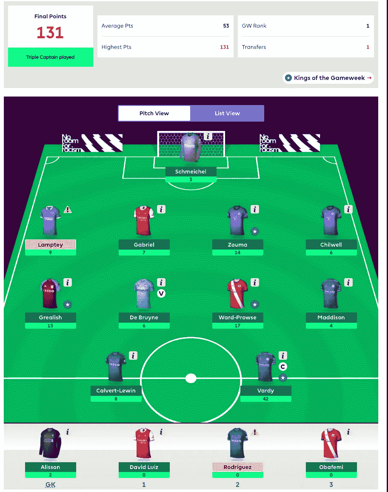

GW6 的顶级团队

如果这是你第一次登陆我们的幻想 EPL 博客，你可能想看看我的媒体档案中的一些我们最初的 EPL 博客，以熟悉这个项目是如何开始的，以及随着时间的推移我们所做的改进。

# GW7 前 100 名 FPL 团队统计数据

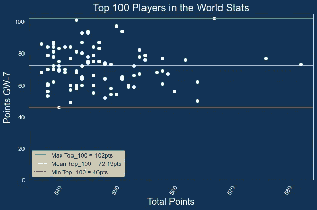

我们上周在榜首看到了更多的正常数字，前 100 名球员的平均得分约为 72 分，一些顶级球员的得分在**40-50 分范围内**，这使我们对自己感觉稍微好一点，因为我们的得分与前 100 名的平均得分 72 分持平。

# 前 100 名最佳守门员

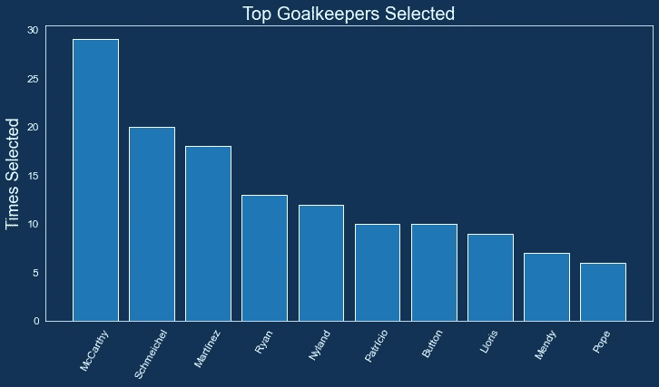

# 前 100 名中最受欢迎的捍卫者

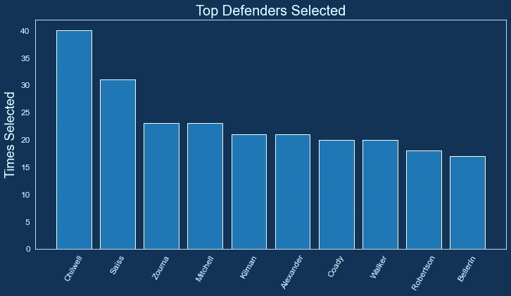

# 前 100 名最佳中场球员

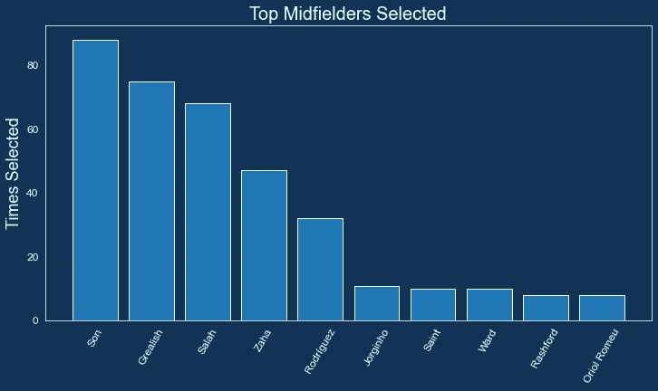

# 前 100 名中入选最多的前锋

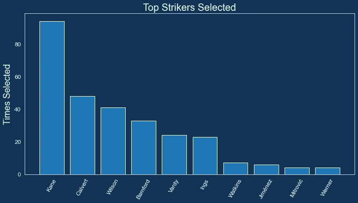

我们使用这些数据创建了下面的团队，它是由前 100 名中最受欢迎的球员组成的:

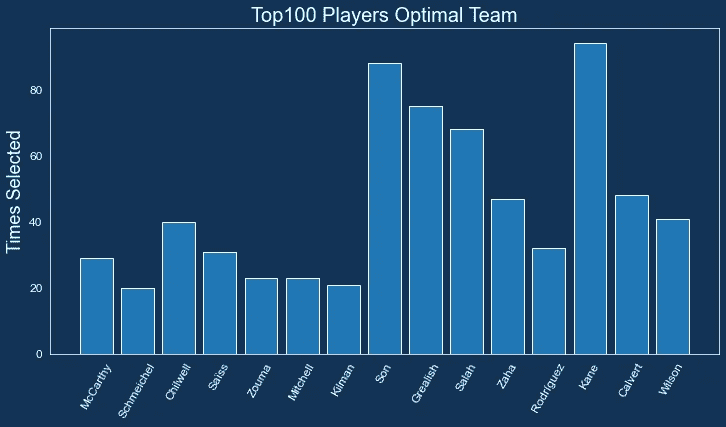

# 100 强中最受欢迎的团队

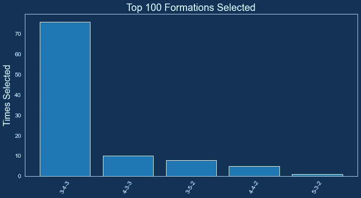

这些数据很有意义，因为大多数顶级球员都试图**利用 3-4-3 阵型的进攻型中场和前锋。**

# GW7 团队绩效总结和总体统计

我们所有球队的得分都高于平均水平，接近世界前 100 名球员的平均水平，所以总体来说我们这一周表现不错。我们不得不提到**绝对恶劣的裁判失误**，没有判兰普提的进球无效**，这让我们至少损失了-8 分**，因为规则是不失球+也在奖金名单上，直到兰普提得分，他们实际上把加分转移到了他身上。除此之外，我们赌了 algo 推荐的前两名队长，萨拉赫和凯恩都做得足够好。

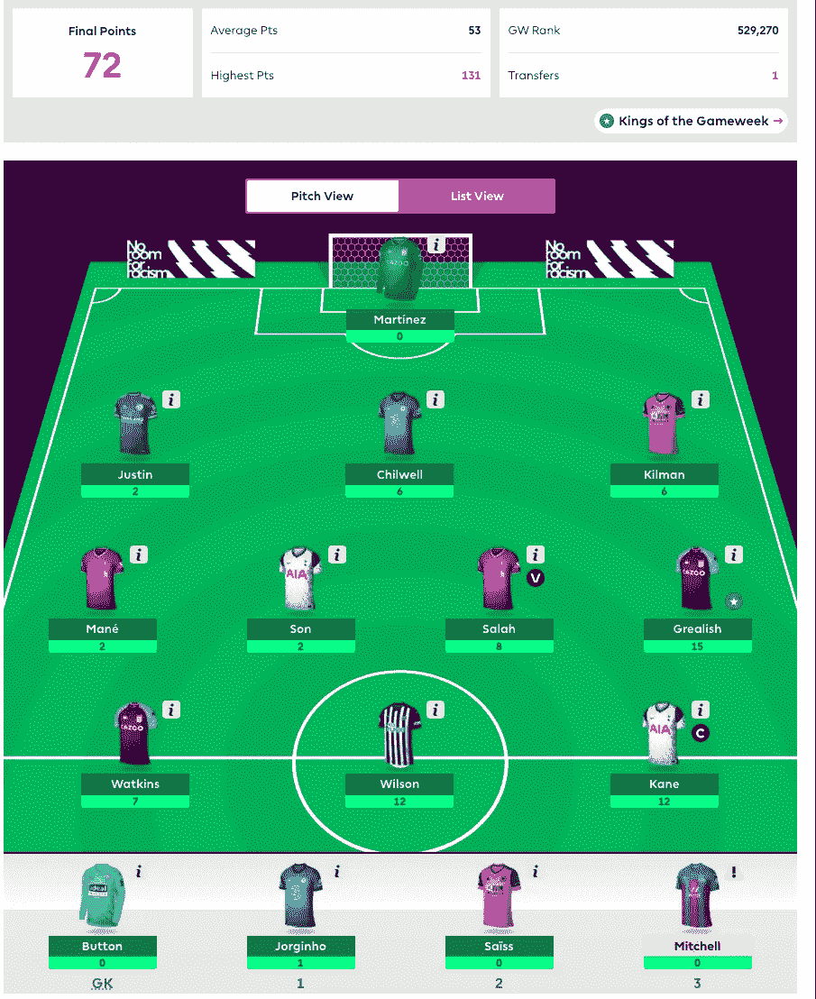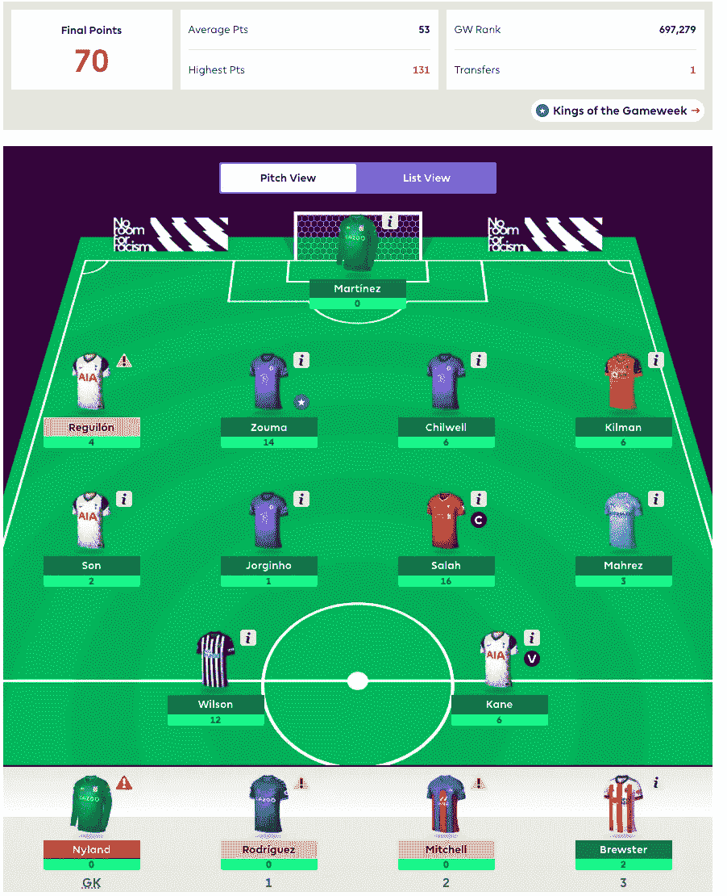

我们还参加了 FanTeam 版的 FPL，在那里我们的两支车队又经历了一个强劲的一周。

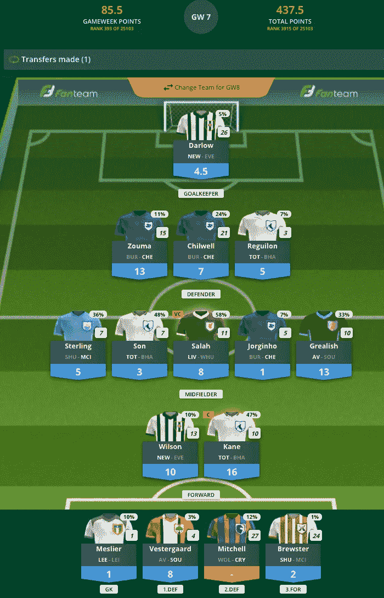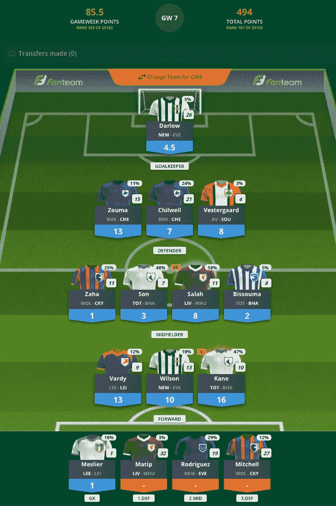

# 为我们的 GW7 选择提供有用的统计数据

由于我们今年在算法中加入了很多新的统计数据，随着时间的推移，这个博客将会有更多的统计数据和图表，更少的文本。让我们从下面三个比赛周的比赛难度等级(FDR)开始:

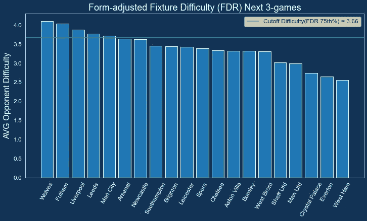

看起来 LIV，WOL，FUL，LEE 和 MCI 有一些艰难的比赛即将到来，所以我们的算法可能不会从这些球队中挑选很多球员。车、雷、托特、门、哭、夏娃和在接下来的三周里似乎有了更轻松的安排。

# 博彩赔率

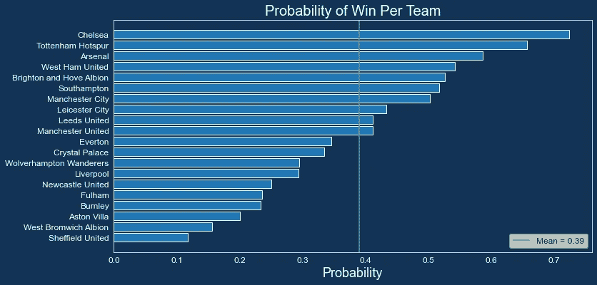

我们会尽量把 ***队伍中赢*** 的几率高于 50 %的玩家，比如 **TOT、** **CHE、ARS、、和 SOU** 。我们应该尽量不要有太多来自舒，WBA，，FUL，NEW，BUR 的防守球员。

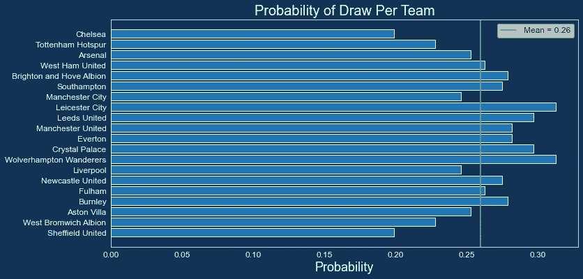

以 ***较高概率抽到*** 的队伍，特别是当比赛是 ***结合高赔率为 2.5 以下的*** 时，可能是 ***适合选择防守队员*** 因为如果比赛以 0:0 结束，那将会产生大量的加分。结合 下方的 ***下/上图，我们可以识别出以下 ***至少一场不失球概率较高的比赛——BHA-布尔、克雷-李、雷-WOL。******

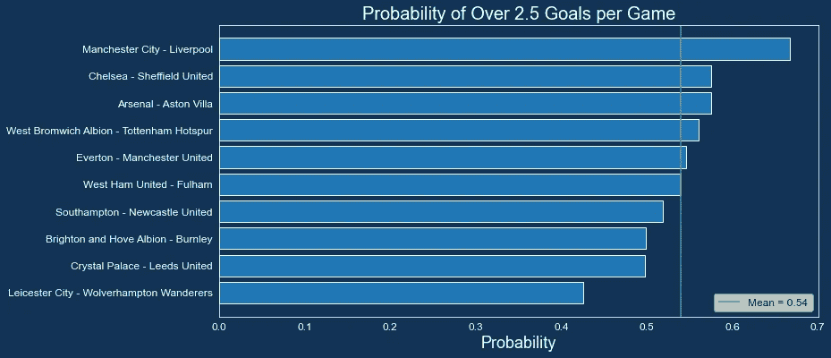

相反，我们可能希望从 ***赔率超过 2.5*** 的游戏中有更多的 ***攻击玩家*** ，例如 **MCI-LIV、CHE-SHU、ARS-AVL、WBA-TOT、EVE-MUN 和 WHA-FUL *。***

# 裁判统计

从下面的统计数据来看，在比赛中出现点球的几率更高:**雷-WOL，MCI-LIV，-BUR，和 CRY-LEE** ，所以我们建议**为这些球队中的一些球队配备点球手**。看起来，像 WBA-TOT，ARS-AVL 和 EVE-MUN 这些游戏都有喜欢给很多牌的裁判，所以预计会因为黄牌而失去一些分数，但希望没有红牌…

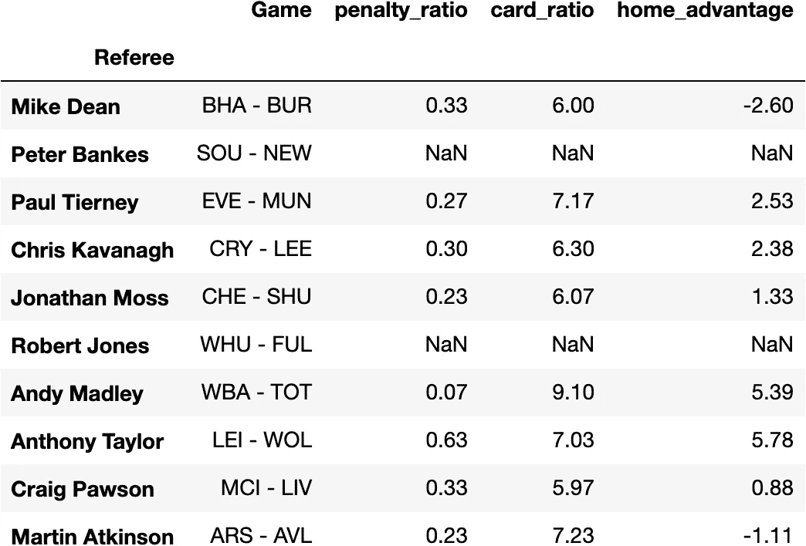

# 团队惩罚统计

除了裁判判罚的概率之外，让我们也看看在过去的 5 个赛季中哪些球队被判罚最多，看看我们在哪里得到了最高的综合概率。从下面的图表中我们可以得出结论，雷、CRY、MCI、MUN、TOT 和 LIV 最有可能获得点球。

# 预计首发阵容

在我们运行最终的团队选择器之前，让我们考虑一下每个团队的预计首发 11 人。

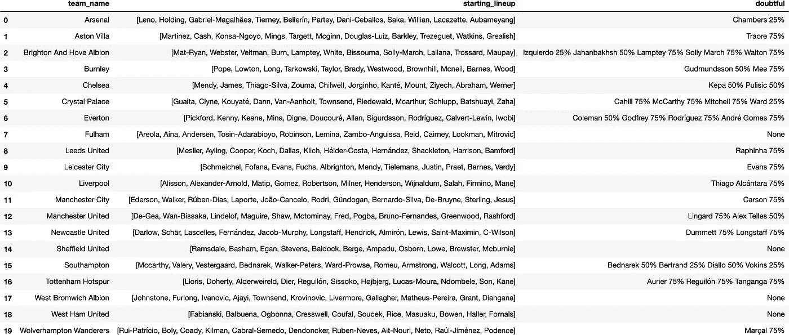

请注意右边可疑球员的名字，以及下面最新的伤病消息:

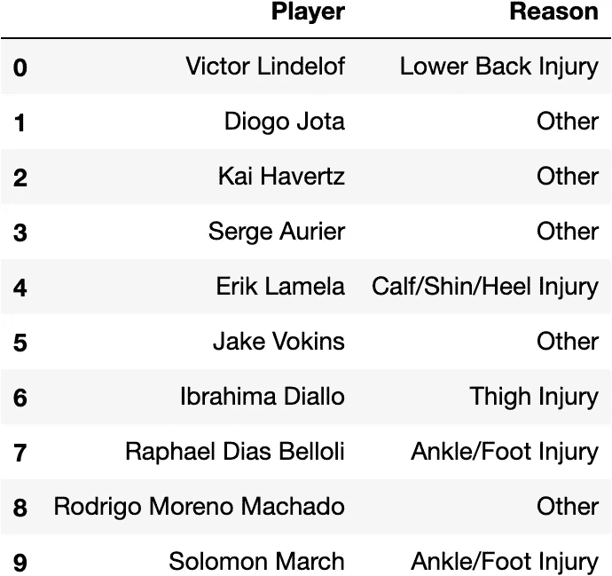

# 团队累积投资回报统计

这张表可以揭示哪些**球队总体上被认为是好的投资，哪些球队有很多定价过高、表现不佳的球员**。球队按照的平均每名球员得分排名，所以毫无疑问，、苏、、、和雷是排名最靠前的球队，因为他们的球员价格已经超出了他们的预期。一些价格更高、表现不佳的球员可以在 **FUL、BUR、SHU、WBA、MUN、MCI 和 CRY 中找到，**所以从这些球队中挑选球员是一个很好的主意。

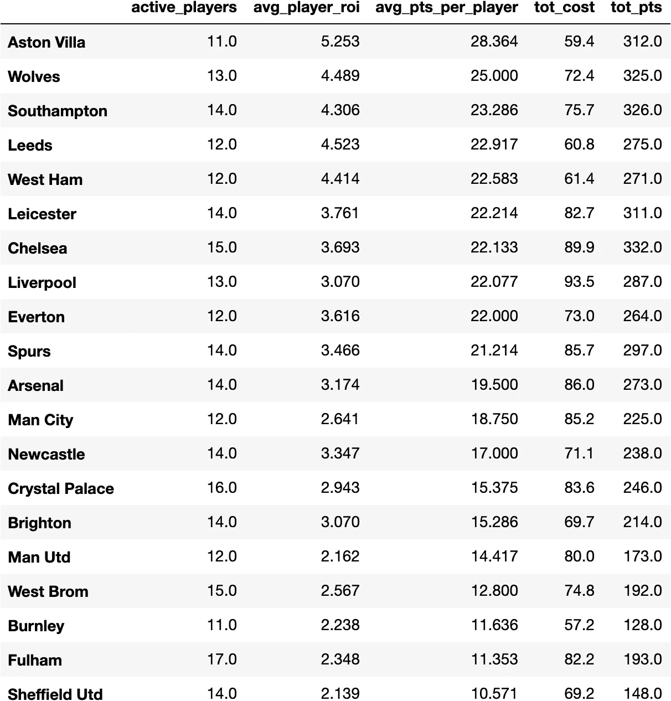

# 防守与进攻团队统计

到目前为止，从托特、丽芙、伊芙、雷、车、和苏那里得到进攻球员似乎是一笔不错的投资。

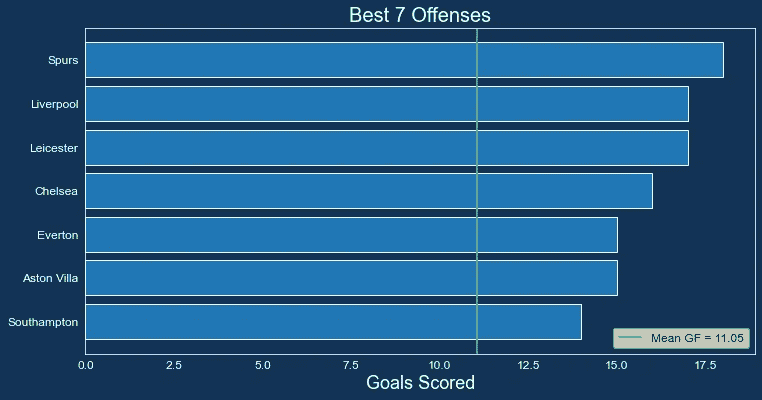

虽然有太多来自 BUR 的进攻球员，SHU，WBA，FUL，，MUN，和 CRY 似乎是一个糟糕的投资，除非你有一个进球 70%的**球员，如 CRY** 的扎哈。

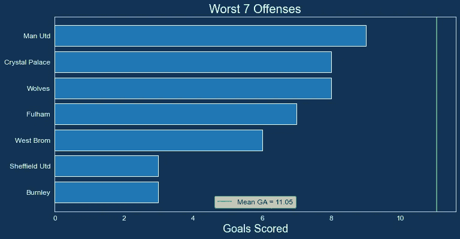

从、ARS、、MCI、TOT、CHE 和雷那里得到防守球员似乎是一笔不错的投资。

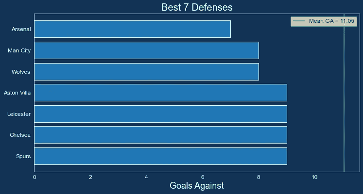

而拥有来自 FUL，WBA，LIV，BHA，MUN 和 LEE 的防守球员，似乎是一个糟糕的投资。

# 推荐人队长

我们的方法采用了即将到来的比赛的预测分数、球员罚点球、角球或任意球的概率、球员在过去 4 个赛季中的空中威胁系数、他们的球队打进 2 个或更多球的可能性，并以标准化的方式将所有这些混合成一个**最终队长选择系数**。然后，根据球员的下一个**对手调整后的 FDR** 和本赛季防守强度的标准化得分**，将系数**减去对手阻力得分**。熊猫 DF 看起来像下面的例子:**

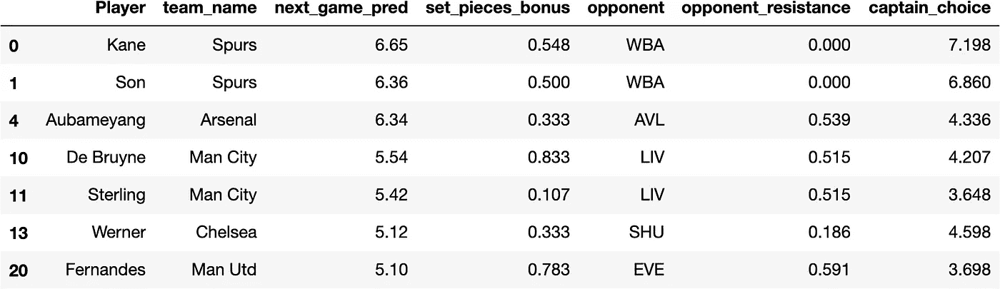

基于这个公式，这里列出了这个 GW 的 15 个推荐队长。那里有很多好的选择，所以无论如何都不是一个容易的选择。我们的推荐人认为你应该选择凯恩、森、鲍文、沃纳、奥巴、KDB 或多尔蒂。

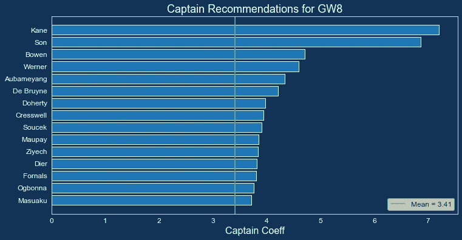

# 预测模型(球员统计)

现在是今年改进算法的皇冠上的宝石——预测球员统计数据的时候了。在我们将所有的 FDR、赌注系数、裁判首发、预计阵容和伤病分层后，有两个主要指标*，我们在为接下来的 n 场比赛周团队选择调整我们的团队优化器时会考虑到这两个指标— ***预测总积分和期望值(ROI)。*** 下面是每个指标的统计数据，也是按职位细分的。*

# *预计总积分—前 25 名玩家*

*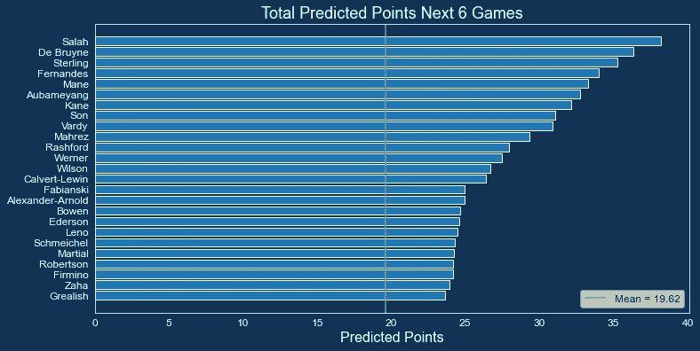*

# *预测积分——顶级守门员*

*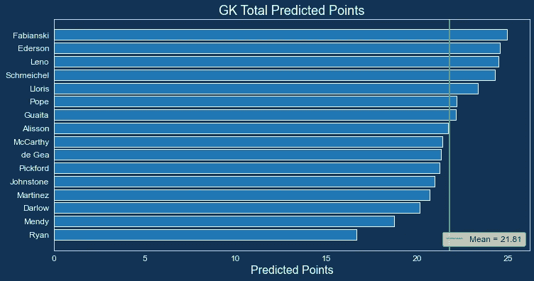*

# *投射点数—顶级防守者*

*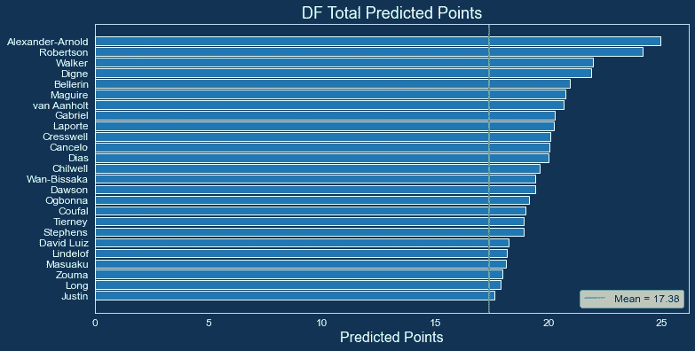*

# *预测得分——顶级中场*

*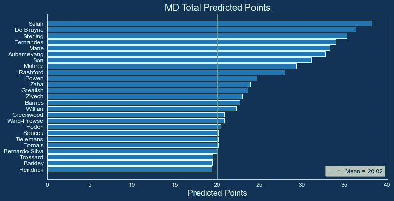*

# *预测分数——顶级前锋*

*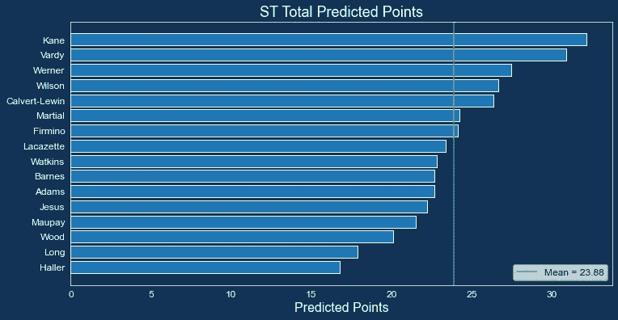*

*正如你所看到的，每个位置都有大量选项可供我们选择，因此我们将把上面的许多统计数据插入 Python 中的 ***优化函数，该函数将 ***输出具有最高预期总积分*** 的团队，给定我们的预算约束和进入我们决策过程的其他指标。在团队选择器代码生效之前应用的一些初步过滤器包括:****

1.  ***排除受伤或停赛球员***
2.  ***从 FDR 高的队伍中排除球员***
3.  ***排除 GW1 中没有固定比赛的队伍中的球员***
4.  ***同一团队不能有超过 3 名玩家***
5.  ***总共必须有 15 名球员(GK=2，DF=5，MD=5，ST=3)***

# *优化最常用信息的预算*

*上周前 100 名选手最常用的阵型是 3-4-3，所以我们将展示这种阵型的最佳阵容。正如你在下面看到的，模型首先查看参数，告诉它是否应该向 15 名球员的*全队优化，或者向有 ***11 名关键球员和 4 名廉价替补*** 的特定阵型优化。对于填充物，它首先查看 ***优选地层*** ，并使用该 ***来决定每个位置*** 需要多少填充物。然后，该模型从我们的初始预算中减去花费在 4 个填充者上的总金额，并将剩余的预算花费在关键的 11 个参与者上， ***给出了优化函数和模型约束*** 。**

****示例 1:向最大期望点数优化****

**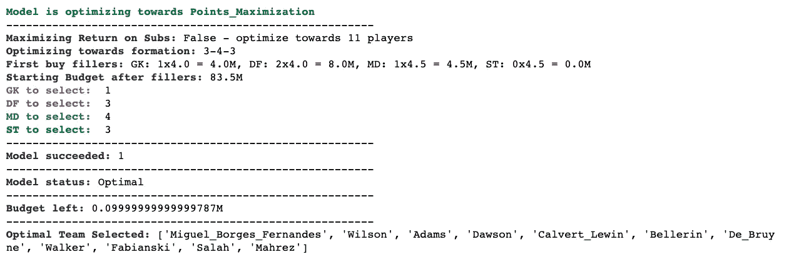****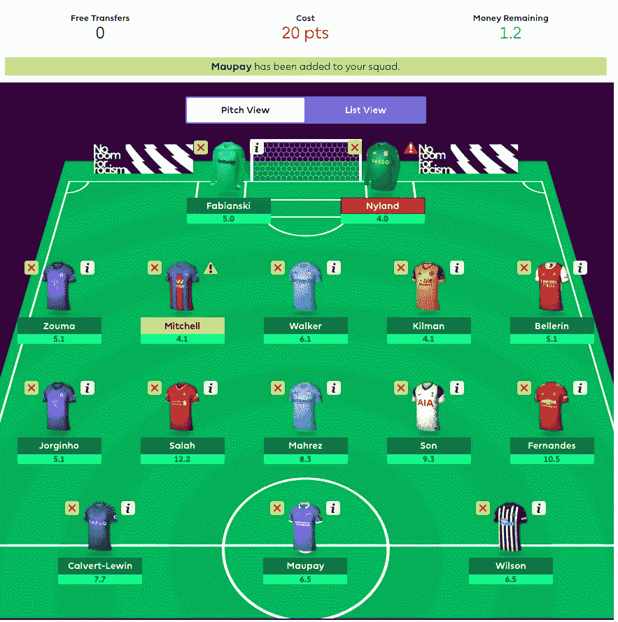**

# **我们的 GW8 团队**

**我们将一直使用上周的顶级得分团队，并尝试最多进行 1-2 次转会。因为我们在周三发布这个博客，而且明天还有欧洲比赛，我们会等到周五早上才进行转会，所以我们下面要换的球队可能会换一个球员。还不确定会有什么变化，但如果规则变成橙色或红色，我们可能会从一些即将到来的赛程更轻松的车队中寻找一个与 **DF** 的互换，比如 **WHU、门或哭泣。****

**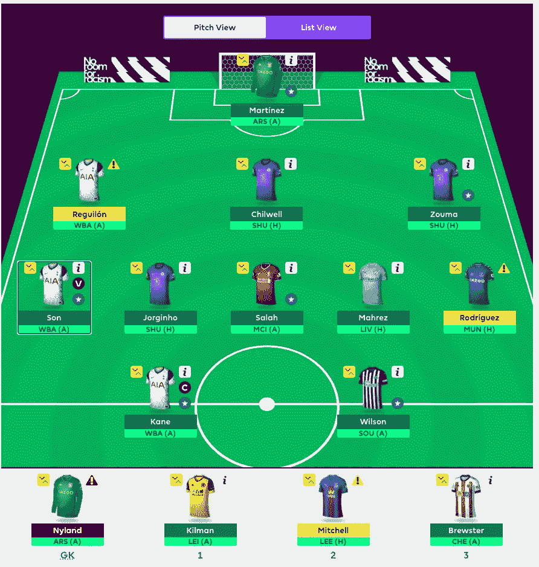**

# **结论**

**按照本赛季的发展方式，我们**建议放弃昂贵的防守球员，尝试只拥有三名中档防守球员，并且**在中场和进攻中积累大量筹码**，因为本赛季到目前为止一直在进球，而且没有迹象表明事情可能会很快放缓。感谢您一如既往的阅读，祝您本周好运！****