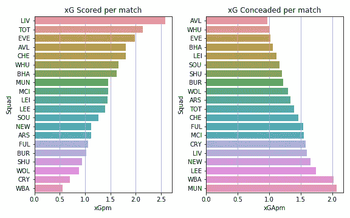
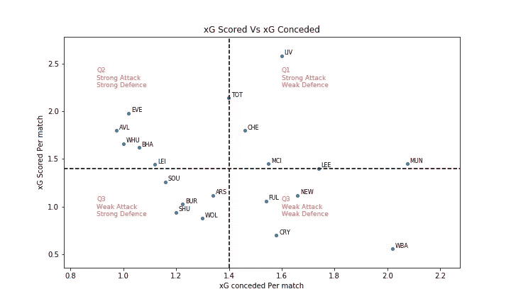
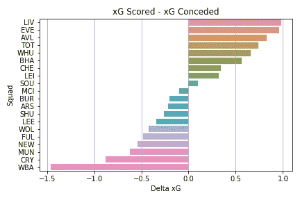
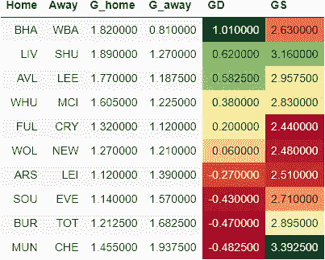
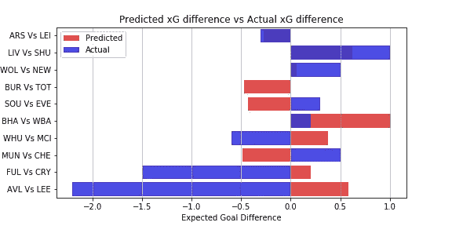

# EPL 游戏周 6 使用数据科学预测:xG 模型

> 原文：<https://towardsdatascience.com/epl-game-week-6-prediction-using-data-science-xg-model-40541b03523c?source=collection_archive---------25----------------------->

这是我的 EPL 预测系列的一篇文章。你可以在这里查看上一周比赛的[预测和实际表现。](/epl-2020-21-season-analysis-and-prediction-5502e20dce26)

[预期目标或 xG](https://medium.com/@abhijithchandradas/xg-xplained-27b1dbafa943) 是用于预测的参数。如果你对理解预测算法感兴趣，我推荐你去看看[这篇文章，里面有详细的解释](/epl-2020-21-season-analysis-and-prediction-5502e20dce26)。

# 对第 5 周比赛的分析

以上数字显示了每支球队每场比赛的 xG 得分和 xG 失球。我们可以观察到，卫冕冠军利物浦在创造力方面远远超过其他球队。热刺、埃弗顿和切尔西也是很好的进攻球队。名单中还包括目前为止在联赛中表现出色的维拉和铁锤帮。西布朗落后于预期的每场比赛 0.5 个进球！谢菲尔德、狼队、水晶宫也是场均预期进球不到一个。

阿斯顿维拉是联赛中唯一一支没有失分的球队，是防守最好的球队，失球率最低。锤子、太妃糖和海鸥似乎也有难以穿透的防御。另一方面，曼联和西布朗的防守漏洞最多。

根据 xG 得分和 xG 失球，球队可以分为 4 个象限，如上图所示。水平虚线表示每场比赛的平均 xG 得分。水平虚线以上的球队是强攻方，下面的球队进攻弱。
垂直虚线显示每场比赛的平均 xG 失球，左边的球队防守强，右边的球队防守弱。

所有球队的目标都应该是 Q2，那里的进攻和防守都比平均水平要好。例如，刀锋队是联盟中防守最好的球队之一。然而，他们在前期缺乏创造力。红军需要立即解决进攻中的问题。

联赛中进攻最好的球队在 Q1，因为他们的防守不是很强。然而，他们的进攻能力足以弥补防守上的弱点，如左图所示。

提醒一句:所有的分析都是基于一个非常小的样本量，每个队只有 4 或 5 场比赛，因此一场糟糕的比赛或一场好的比赛往往会扭曲结论。

# 对第六周比赛的预测

基于第五周的表现，第六周的预测如下。

GD 的绝对值显示了比赛的竞争力。该值越高，预计匹配越偏向一侧，预测的准确性也越高。GD 值越低，这场比赛就越可能是任何人的游戏。GD 的正值表示主场胜，负值表示客场胜。

布莱顿 Vs WBA 预计是最一边倒的比赛，海鸥有望获胜。利物浦和阿斯顿维拉也有很高的胜算。热刺、蓝军和太妃糖也有望在客场全取三分。梅切斯特城，最受欢迎的球队之一，预计将与铁锤帮进行一场艰苦的比赛，他们必须需要一些好运气才能在对阵复兴的莫耶斯的球队时不丢分。

狼队对新城堡队预计是任何人的游戏。主场对阵水晶宫的富勒姆和客场对阵阿森纳的莱斯特对他们的对手略有优势。

红魔主场迎战蓝军有望成为本周比赛中得分最高的比赛，蓝军有望获胜。尽管刀片队是联赛中防守最好的球队之一，但他们在安菲尔德的比赛预计将是一场进球盛宴。纸面上的富勒姆 vs 水晶宫，就进球而言，似乎是周末最无聊的一场比赛。

# 更新:实际与预测

预测的增量 xG 与实际的增量 xG(图片由作者提供)

对阿森纳对莱斯特比赛的预测是最准确的，然而，该算法在预测阿斯顿维拉对利兹的比赛中最不准确(埃尔洛克是马塞洛·贝尔萨的合适称号，他的战术太疯狂了！退一步说。该算法只是一个简单的基线模型，但我仍然希望预测会随着样本量的增加而改善。
目前，样本量非常小，预测受到异常值的巨大影响。
展望未来，我计划考虑比赛风格、主场优势、射门质量等因素。来改进模型。

请让我知道你对如何改进这个模型的建议。

托马斯·塞勒在 [Unsplash](https://unsplash.com?utm_source=medium&utm_medium=referral) 拍摄的照片