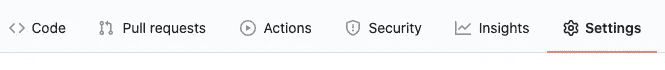
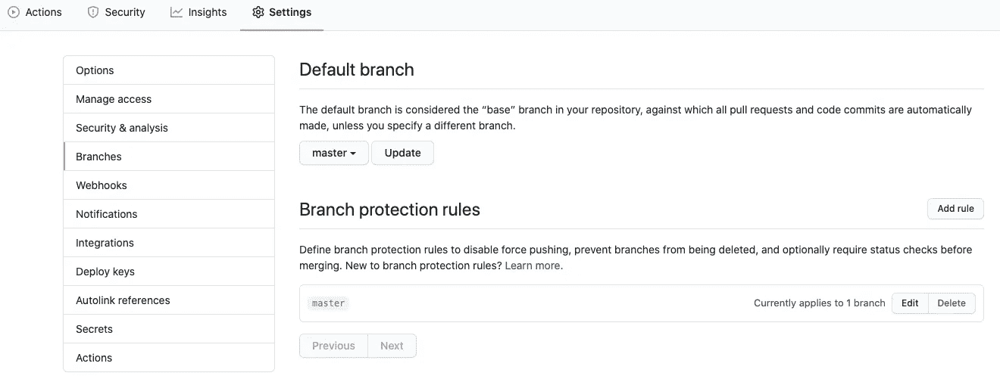
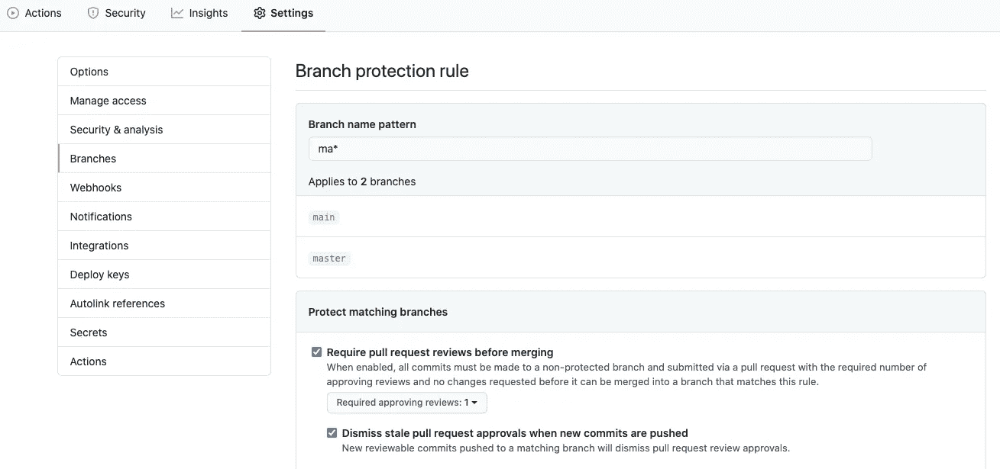
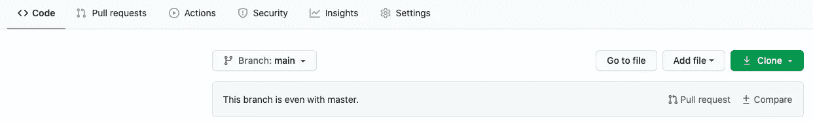
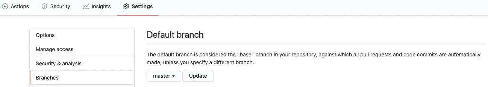
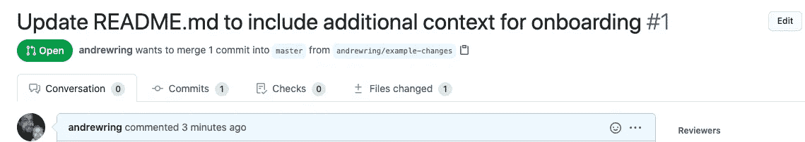
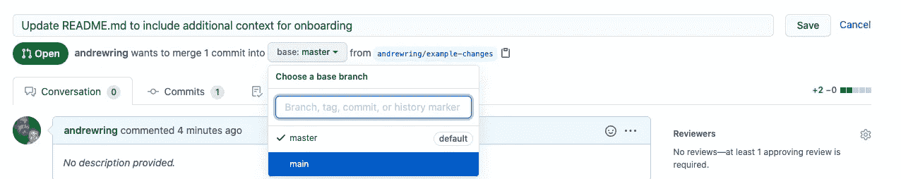

# 公平代码:GitHub 上退休的主人

> 原文：<https://towardsdatascience.com/equitable-code-retiring-master-on-github-beb21b791a18?source=collection_archive---------48----------------------->

## 负责任地更新活动存储库的分步指南。

# 介绍

在 Nines，我们在为我们的放射学实践构建工具时不断迭代。在本帖中，我们将讨论如何更新软件行业中常用的一些基础设施。

近年来，已经开始了一场从软件系统中去除术语“主”和“从”的运动。2018 年， [Python 在 3.8 版本移除了很多引用](https://www.theregister.com/2018/09/11/python_purges_master_and_slave_in_political_pogrom/)。最近， [GitHub 宣布](https://www.zdnet.com/article/github-to-replace-master-with-alternative-term-to-avoid-slavery-references/)他们将把默认分支从主分支改为主分支。

传统上，git 存储库中使用的规范分支被命名为 master。它是在新的存储库中创建的默认分支，并且通过要求代码变更的同行评审，以及[持续集成](https://en.wikipedia.org/wiki/Continuous_integration) (CI)测试，经常受到更强的保护。

在 Nines，我们已经做出了这样的改变。我想分享我对这个话题的一些想法，以及让这种转变对其他人来说尽可能容易的指南。

# 为什么删除对 master 的引用？

主人这个词可以引发人们对奴隶制、种族主义和系统性不公正的思考。许多人指出，在这种情况下，这种使用类似于唱片业中的主唱片，即权威版本。虽然可能是这样，但这不是重点。这些微妙但频繁的触发被称为[微侵袭](https://www.vox.com/2015/2/16/8031073/what-are-microaggressions)。它们很常见，通常用于[而没有伤害](https://www.bbc.com/worklife/article/20180406-the-tiny-ways-youre-offensive---and-you-dont-even-know-it)的意图。它们可能听起来很小，但是累积起来，它们会产生很大的影响。这种类型的问题非常普遍，以至于人工智能将影响表现得非常明显。造成的痛苦是实实在在的，我们很容易就能帮上忙。所需要的只是注意力和**行动**。

# 我加入了，现在怎么办？

太好了！在我们开始 Nines 的 9 步流程之前，请确保您对正在更新的 GitHub 库拥有管理员权限。您应该能够在存储库中看到 Settings 选项卡:



**1。传达即将到来的变化**

与使用您的存储库的任何开发人员交流这个过程是很重要的。如果可能的话，最好选择在存储库没有大量活动的时候进行转换，因为在错误的时间合并的拉请求可能会导致信息丢失。

示例:

*本着一种* [*更广泛的运动*](https://www.zdnet.com/article/github-to-replace-master-with-alternative-term-to-avoid-slavery-references/) *，我将<资源库中的默认分支从 master 重命名为 main。在<日期>上午 8 点到 9 点，将有一个不应该合并钻杆排放系统的计划停机时间。如果您对此流程有任何疑问，请告诉我。*

‍

**2。创建新分支**

在 git 中创建新分支非常简单。从存储库的本地克隆中，签出主分支，并确保您使用的是最新的 GitHub:

```
git checkout master
git pull
```

从更新后的基础创建新分支:

```
git checkout -b main
```

现在把新的分支推到 GitHub:

```
git push --set-upstream origin main
```

这里需要注意的是，所有以前的提交历史都保留在这个过程中。

‍

**3。更新分支保护**

通常，主要分支机构会受到各种分支机构保护规则的约束。这将出现在 GitHub 分支设置中，如下所示:



‍

在这个阶段，我们可以使用通配符来扩展规则，使其涵盖主分支和主要分支。单击规则上的编辑，并将分支名称模式更新为 ma*。值得注意的是，“应用于 n 个分支”框在保存更改之前不会更新。这应该看起来像这样:



‍

**4。更新代码和文档**

接下来，在您的存储库中搜索显式包含的 master。通常，这将包括 CI/CD 配置文件，可能还有其他脚本和工具。这需要非常小心，因为这个词可能有很多其他的用法，比如其他的存储库，或者不相关的代码。

您选择的 IDE 可能有一个很好的方法来搜索存储库中的所有文件。如果您没有类似的东西，这里有一个简单的脚本来打印所有事件:

```
git ls-files | xargs -I {} sh -c ‘echo “<<< {} >>>” && grep -ni master {}’
```

不要忘记检查 master 中可能需要合并到 main 中的任何新变化。您可以通过在 Code 选项卡中选择主分支，然后单击 compare 来检查这些内容。



‍

**5。更新默认分支**

现在我们将更新 GitHub，将 main 作为默认分支。这将导致拉请求默认使用 main 作为基础，将改变 Code 选项卡中默认显示的分支，等等。这可在“分支”下的“设置”选项卡中进行更改:



‍

**6。更新打开拉式请求**

删除主数据后，任何使用它作为基础数据的打开的提取请求都将自动关闭，并且不能重新打开。为了避免这种情况，任何打开的拉取请求都应该将其基础更新为 main。基数列在拉动式请求的顶部，如下所示:



点击右上角的“编辑”会将基础变为下拉列表。更新并保存。



‍

7 .**。更新分支保护，第 2 部分**

为了删除主服务器，我们首先需要删除仍然适用于它的分支保护。这很像前面的变化，但是现在用 main 替换 ma*。

‍

**8。从 GitHub 中删除 master**

移除分支保护后，从原点(GitHub)删除分支非常简单:

```
git push -d origin master
```

‍

**9。传达变更和本地清理**

现在是时候结束这个循环并与开发人员交流完成情况了。除了确认工作已经完成之外，还需要在每个开发人员的机器上做一些小的清理工作，删除被删除的主分支的副本。这可以通过在每个克隆中运行以下命令来实现:

```
git fetch
git checkout --track origin/main
git branch -d master
```

示例:

*在<仓库>中，从主数据库到主数据库的转换现在已经完成。所有未完成的拉取请求都已更新，以反映这一点。作为最后一步，请在您的本地副本<存储库>中运行以下命令来删除过时的元数据:*

```
git fetch && git checkout --track origin/main && git branch -d master
```

‍ **‍**

# 搞定了。

我希望这使得更新您的分支的过程变得简单和相对容易。感谢你们让我们的世界和工业变得更加友好。

*NB:本文原载于* [*Nines 博客*](https://www.nines.com/blog/equitable-code-retiring-master-on-github) *。*