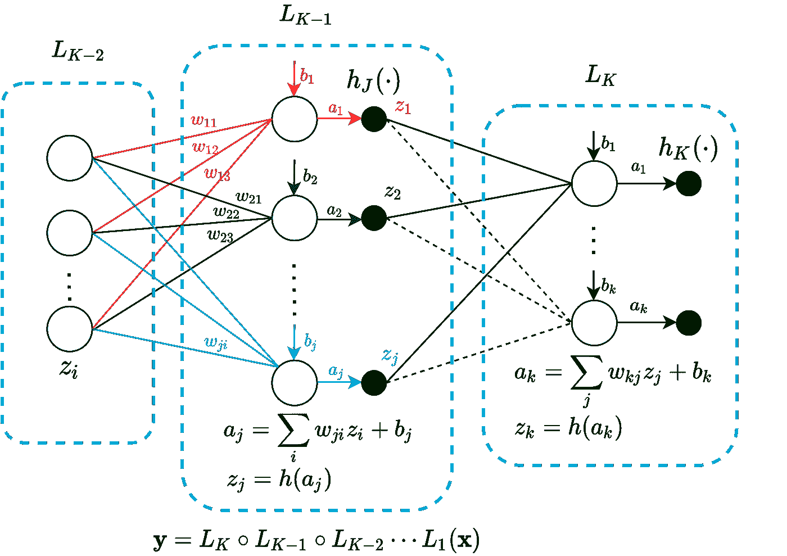
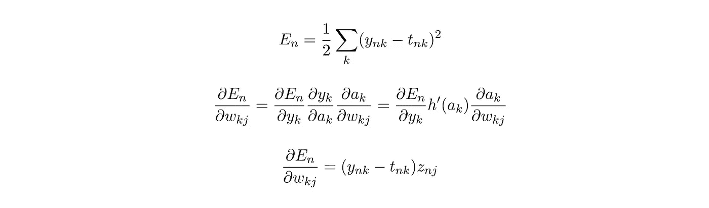
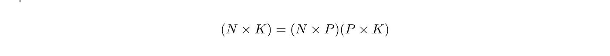
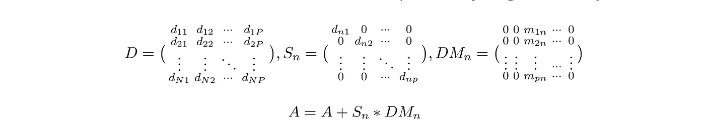
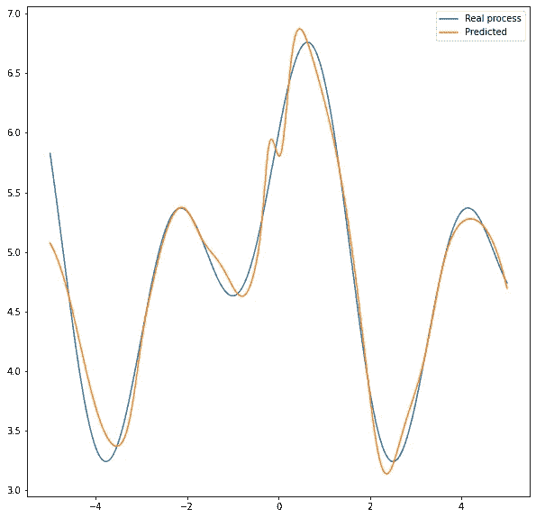

# 理解误差反向传播

> 原文：<https://towardsdatascience.com/error-backpropagation-5394d33ff49b?source=collection_archive---------17----------------------->

## 从零开始的神经网络解释误差反向传播

## 介绍

深度学习所基于的技术神经网络(NN)在机器学习中非常流行。我记得早在 2015 年，在阅读了由 [Andrew Trask](https://twitter.com/iamtrask) 撰写的文章[11 行 python 代码的神经网络](https://iamtrask.github.io/2015/07/12/basic-python-network/)后，我立即迷上了人工智能领域。但是尝试从零开始构建一个神经网络，我相信大多数人会同意我的观点，即**误差反向传播**或简单的反向传播(BP)将是完成这项任务的早期障碍之一，至少取决于你愿意钻研的深度。对于那些不熟悉的人来说，BP 是与优化算法(如梯度下降(GD ))一起使用的算法，用于学习 NN 模型的参数。BP 产生梯度，然后用于优化。在本文中，我将尝试解释这种算法是如何工作的，然后从头开始构建一个简单的神经网络，在我之前的[帖子](/linear-regression-from-math-to-code-9659132383ec)中使用的一个回归问题上测试这个网络。对于那些正在与这种算法作斗争的人来说，我希望这篇文章能作为一个直观的指南。

请注意，为了完全理解这个算法，很好地掌握矩阵代数和多元微积分是非常必要的

## 设置

为了对 BP 有一个全面的了解，我将从给出我们将要建立的神经网络的大图开始。由此你将有望对神经网络的设计决策以及 BP 中使用的矩阵运算有一个直观的理解。请注意，这只是我的设计，我觉得很直观，其他作者可能有其他设计。我将使用一个简单的前馈神经网络，它只是一个相互堆叠的函数/层的组合，如下图所示。

作者图片

## 该算法

神经网络的每次训练迭代有两个主要阶段

1.  *正向传递/传播*
2.  *BP*

BP 阶段有以下步骤

*   *评估每层的误差信号*
*   *使用误差信号计算误差梯度*
*   *使用带有优化算法(如 GD)的误差梯度更新层参数。*

这里的想法是，网络在正向传递期间估计目标值。然后，我们计算我们的估计与最后一层的实际目标有多远(误差信号 ***δ_k*** )。最后，我们递归地计算每个先前层的误差信号。

给定诸如均方根的误差函数，可以使用偏导数找到最后一层的误差梯度。

作者图片

请注意，***h’(a _ k)= 1***为线性激活，因为这个***【∂e_n/∂y_k】*****=*【∂e_n/∂a_k】***。为了保持等式的整洁，忽略了索引 n。最后一层的量 ***(y_nk - t_nk)*** 称为误差信号***【δ_ k】***。因此，链接特定误差信号和输入信号的参数的**梯度是输入信号和误差信号**的乘积。使用链式法则，可以使用当前层的误差信号来计算前一层的误差信号。从上图来看，

作者图片

注意，如何通过对来自当前层节点的所有误差信号进行加权求和来获得前一层中的节点的误差信号，前一层节点向当前层节点发送其信号，即在索引 *k* 上求和。这就是为什么它被称为误差反向传播。同样，为了了解 k 上的这个和在数学上来自哪里，请注意*∂e_n/∂a_k 是雅可比向量，而 ***∂a_k/∂a_j*** 是雅可比矩阵。*

*如前所述，一般而言，链接一层中特定误差信号和输入信号的参数的梯度是该层的输入信号和误差信号的乘积。在前一种情况下，*

**

*作者图片*

*类似地，对于偏置参数，*

**

*作者图片*

*注意，这是递归的，来自当前层的误差信号用于评估前一层中的误差信号。这是拼图中非常重要的一块，因此让我们看看我们如何向量化，然后在代码中实现它。我们将假设批量训练，但是通过将批量大小设置为 1，相同的设计可以用于在线训练。*

*对于一个输出 ***K*** 和输入 ***P*** 的层，层权重会初始化为 ***(PxK)*** 。因此，对于尺寸为 ***N*** 输入和尺寸为 ***P*** 的输入，我们得到尺寸为*N***K***的输出。如图所示，这是层向前传播步骤。偏置初始化为 ***(K，)*** ，此处未显示，因为它通过 ***N*** 广播，不会影响输出尺寸。**

****

**作者图片**

**误差信号，***【δ_ k】***，因此有形状 ***(NxK)*** 。出于一个我们很快就会看到的原因，我将这个误差信号转置并作为 ***(KxN)*** 馈入反向传播函数。现在，将层参数与层误差信号相乘，对所有的*图案在 k 上执行加权求和，因此是误差信号首先被转置的原因。我们把这一步得到的矩阵叫做 ***DM*** 。***

****

**作者图片**

**现在是棘手的部分，要完成前一层反向传播误差信号的计算，每个节点加权和，必须乘以***【h’(a _ j)***，其维数为 ***(NxP)*** 。我就把这个导数矩阵 ***D*** 。在矩阵代数中，这是通过将特定的输入模式作为对角矩阵，然后将该矩阵乘以相应的 **DM** 列来实现的。我就把这个对角矩阵叫做， ***S_n*** 。我将对一个大小为***【PxN】***的矩阵*进行零初始化，以迭代累加前一层信号***

******

***作者图片***

***如何构建矩阵 ***S_n*** 和 ***DM_n*** 由你决定。您将在代码部分看到实现这一点的一种方法。也许有更有效的不涉及循环的方法，如果你知道的话请告诉我:)。***

**现在这些误差信号被传递到上一层， ***L_k-1，*** 来更新它的参数。当前层 ***L_k*** 的参数由误差信号更新，该误差信号通过其“反向传播”功能传递到该层。**

**需要注意的一点是，在更新层 ***L_k*** 参数之前，计算 ***层 L_k-1*** 误差信号。**

**如前所述，为了计算层参数梯度，我们将误差信号乘以该层的输入信号。我将称之为 ***G_w*** 权重渐变和 ***G_b*** 偏移渐变。对于层 **K** ，矩阵 A 为 ***(KxN)*** ，输入信号 ***I*** 为 ***(恩智浦)*****

****

**作者图片**

**注意，上面的操作对 ***N*** 求和，其效果是累加一批大小为 ***N*** 的梯度。**

**好了，说够了，让我们编码吧！**

## **密码**

**首先，导入所有需要的东西**

**接下来，我将创建一个图层类。当调用该层时，它使用 __call__ 执行正向传播。通过将前一层实例传递到当前层的实例中，可以将多个层堆叠在一起。正向传播从最早的层进行到最新的层。并且只有在前一层的输出大小/尺寸与当前层的输入尺寸匹配时，两层才能被附着。**

**接下来，模特班。这个类处理神经网络的训练过程和预测。**

**最后是一个生成器类，用于在训练时向网络提供数据**

## **测试**

**首先，让我们生成一些数据**

**接下来，让我们创建我们的网络并开始训练。在本例中，我将创建一个 4 层网络。**

**最后，测试和绘图**

**图表**

****

**作者图片**

## **结论**

**在这篇文章中，我试图涵盖反向传播的具体细节，并在此过程中展示了如何从头开始创建一个神经网络。测试结果表明，该神经网络比我以前文章中的线性回归模型更加强大和灵活。这篇文章的笔记本可以在我的 [Github](https://github.com/hollan86/neural_network/blob/main/NN.ipynb) 上找到。对于感兴趣的读者，我鼓励你尝试修改网络来测试它的分类任务。**

**谢谢你看我的文章，下次再见！与此同时，在这段艰难的时期要小心！**

## **参考**

**[1]:主教，C. M. (2006 年)。*模式识别与机器学习*。斯普林格。**