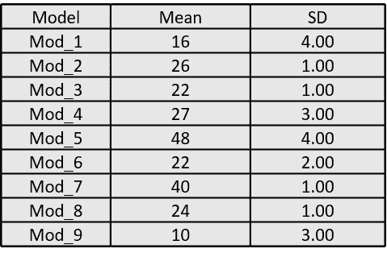
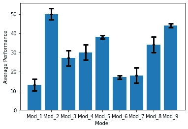

# 使用 Python 中的 Matplotlib 从数据框绘制误差线

> 原文：<https://towardsdatascience.com/error-bar-plots-from-a-data-frame-using-matplotlib-53026fe95491?source=collection_archive---------27----------------------->

## ***Python 中误差条形图的简单代码！***


照片由[艾萨克·史密斯](https://unsplash.com/@isaacmsmith?utm_source=unsplash&utm_medium=referral&utm_content=creditCopyText)在 [Unsplash](https://unsplash.com/s/photos/graph?utm_source=unsplash&utm_medium=referral&utm_content=creditCopyText) 拍摄

最近，我不得不为一份报告比较几种方法/算法的性能，我选择了误差线来总结结果。如果你手头有一个类似的任务，用这篇文章为自己节省一些时间。

## ***什么是误差条形图，什么时候应该使用？***

误差条形图是表示数据可变性的好方法。简而言之，它们给出了数据可能与报告值(或大多数情况下的平均值)相差多少的直观想法。

这通常可以通过以下方式实现:

*   标准偏差
*   置信区间(最好是 95)

如果你的报告需要对显示结果的*精度*(或再现性)做出评论，误差条形图在我个人看来是必须的。我也看到一些报告用它来表示适当情况下的公差。

但是，当然，要确保你有合适的观众，可以解释你的幻想形象。

## **执行:**

为了简单起见，我使用 Excel 上的随机数生成器创建了一个样本数据。您可以使用 [mean()](https://pandas.pydata.org/pandas-docs/stable/reference/api/pandas.DataFrame.mean.html) 和 [std()](https://pandas.pydata.org/pandas-docs/stable/reference/api/pandas.DataFrame.std.html) 函数快速计算数据的平均值和标准差。



作者图片

导入 Matplotlib 并使用 Matplotlib 中的 [errorbar()](https://matplotlib.org/3.1.1/api/_as_gen/matplotlib.pyplot.errorbar.html) 函数。它为剧情提供了相当不错的定制水平。

```
import pandas as pd ## for handling the dataframe
import matplotlib.pyplot as plt ## for visualizationdf = pd.read_excel("Sample_error_charts.xlsx")## read the Dataframe##Plotplt.errorbar( df['Model'], df['Mean'], yerr=df['SD'], fmt='o', color='Black', elinewidth=3,capthick=3,errorevery=1, alpha=1, ms=4, capsize = 5)
plt.bar(df['Model'], df['Mean'],tick_label = df['Model'])##Bar plot
plt.xlabel('Model') ## Label on X axis
plt.ylabel('Average Performance') ##Label on Y axis
```

确保调整倾覆和厚度，以适应你的图表。



作者图片

我在这个例子中选择了标准差，但是你也可以使用*置信区间或者*标准误差，这取决于什么适合你的整体叙述。让你自己完全熟悉基本的描述性统计，这将会让你立即意识到应该选择什么。

快乐阅读！

卡莉安·基萨拉